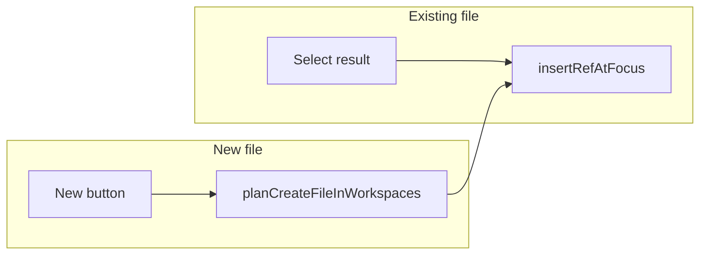

# Add File command and file search dialog

## Progress

| Area | Status |
|---|---|
| Shared: path resolve, file search, graph ops | **Done** |
| Shared: RefExpr `@:` → `WorkspaceRoot` | **Done** |
| Shared tests | **Done** |
| ViewModel `FileSearchDialog` mode | **Done** |
| Client: `FileSearchDialog.fs` (state ops) | **Done** |
| Client: `UpdateFileSearch.fs` (apply wrappers) | **Done** |
| Mode guards (`UpdateMove`, `View`, `Controller`, …) | **Done** |
| HTML overlay (`gambol.template.html`) | **Not started** |
| `FileSearchDialogView.fs` | **Not started** |
| `App.fs` render wiring | **Not started** |
| `CommandEntry` + `Commands.fs` (`AddFile`, key `f`) | **Not started** |

**Next slice:** HTML + `FileSearchDialogView.fs` + `App.fs`, then command registration.

## Behavior summary

| User action | Result |
|---|---|
| Pick existing File from results (**Enter** or click) | Insert `{ ref = Ref; id = fileNodeId }` at `sel.range.endd` under focus parent |
| Click **New** only (enabled for concrete unresolved paths) | Create missing Workspace/Directory/File nodes under `Graph.workspacesId`, then same ref insert at focus |
| **Enter** with no result / empty list | No-op (same as node search dialog) |
| Ambiguous query (wildcards, multiple paths, invalid name) | **New** disabled; user must pick a result or refine query |

Both paths share one outcome at focus: **always a Ref**, never re-home the owner node. Owner placement lives only in the workspaces tree.



## Path resolution rules (Shared, tested)

Module [[src/Shared/FilePathResolve.fs]]:

```fsharp
type ConcreteFileTarget = {
    parentId: NodeId      // Workspace or Directory owner
    fileName: string      // Filename.Ok
    missingSegments: (SpecialKind * string) list  // ws/dirs to create, in order
}
```

**Normalize query → RefExpr** (in order):

1. **RefExpr path** — parse whole query; if `Ok`, use as-is.
2. **Bare filename** — if `Filename.create` → `Ok name` and no glob chars (`*?`), treat as `Path(WorkspaceRoot, [ NameStep name ])` (same as `/name` and `@:/name`).
3. Otherwise not a creatable target.

**Concrete path criteria** (enables **New**):

- Expression is `Path(base, steps)` with **non-empty** steps.
- **Last step** is `NameStep pattern` with no `*`/`?` in pattern; `Filename.create pattern` → `Ok`.
- All **prior** steps are `NameStep` directory segments (no wildcards, no `#tags`).
- **Parent resolution**: evaluate `Path(base, steps.[0..n-2])` via [[src/Shared/RefExpr.fs]] `RefExpr.match_`; result must be exactly **one** `Workspace` or `Directory` node (or zero nodes if creatable from `missingSegments`).
- **No existing file**: full-path `RefExpr.match_` filtered to `Special File` is empty.

**Workspace context**:

- `/notes.md` and `@:/notes.md` target the **current workspace root** (`RefContext.workspaceRoot`
  from focus via `RefExpr.refContext`). When focus has no named workspace in its owner chain,
  this falls back to **ROOT** (implicit nameless workspace, `@:`).
- `@:` parses as **`WorkspaceRoot`** (not `NamedWorkspace`).
- `@bobby:notes.md` remains an explicit named workspace; intermediate missing `bobby` / dirs are created on **New**.

**Existing-file search** (separate from create resolution):

[[src/Shared/ViewModelFileSearch.fs]]:

- Multi-word intersection (same pattern as [[src/Shared/ViewModelSearch.fs]]).
- Restrict hits to `kind = Special File`.
- Plain text matches `Filename.tryValue` on File nodes only (not outline `text`).
- Display via [[src/Shared/NodeDesktopPath.fs]] `pathForNodeId` (fallback to name).

## Graph mutations (Shared, tested)

[[src/Shared/FileNodeOps.fs]]:

```fsharp
planInsertFileRefAtFocus : FocusInsertPoint -> fileNodeId -> graph -> Op list
planCreateFileInWorkspaces : graph -> ConcreteFileTarget -> Result<(NodeId * Op list), string>
planAddFileAtFocus : graph -> FocusInsertPoint -> ConcreteFileTarget -> Result<(NodeId * Op list), string>
```

`FocusInsertPoint` is `{ parentId; index }` — client maps `sel.range.parent.nodeId` and `sel.range.endd` at apply time.

**`planInsertFileRefAtFocus`**: `Op.Replace` at index; idempotent no-op if ref already at that index.

## Client logic (done)

**ViewModel** ([[src/Shared/ViewModel.fs]]):

```fsharp
| FileSearchDialog of FileSearchDialogState

and FileSearchDialogState = {
    query: string
    selectedIndex: int
    returnTo: Mode
}
```

`newEnabled` is **not** stored — derived at render via `FilePathResolve.isNewEnabled` (see `FileSearchDialog.isNewEnabled`).

**[[src/Client/FileSearchDialog.fs]]** — open/close, query, ↑↓, `currentFileSearchResults`, `isNewEnabled`, `lastFileSearchQuery`.

**[[src/Client/UpdateFileSearch.fs]]** — apply wrappers (see table below).

| Function | Role |
|---|---|
| `openFileSearchDialogOp` | Opens dialog (requires selection; no-op otherwise) |
| `fileSearchPickExisting` | `planInsertFileRefAtFocus` → `applyAndPost` → `withSiteMap` |
| `fileSearchPickNew` | `tryResolveConcreteTarget` → `planAddFileAtFocus` → apply |
| `runFileSearchSelectionOp` | Close dialog, pick highlighted result (Enter / click path) |
| `runFileSearchNewOp` | Close dialog, create from query (**New** button path) |

All in [[src/Client/UpdateFileSearch.fs]].

**Mode guards** updated in `ViewModelOps`, `UpdateMove`, `UpdateImport`/`Export`/`Paste`, `Commands`, `Controller`, `View` — same pattern as `SearchDialog` / `CssClassPrompt`.

## UI (remaining)

**[[src/Client/FileSearchDialogView.fs]]** — mirror [[src/Client/SearchDialogView.fs]]:

- Overlay render, keyboard (↑↓, **Enter** = accept selection only, Esc)
- **New** button click → `runFileSearchNewOp` (never Enter)
- Result row: `pathLabel` preferred; optional `text` suffix

**HTML** ([[src/Server/wwwroot/gambol.template.html]]):

```html
<div id="file-search-dialog" class="amb-palette">
  <div id="file-search-dialog-context" class="amb-palette-context"></div>
  <input id="file-search-dialog-input" class="amb-palette-input" type="text"
    placeholder="File path or name (@ws:dir/file, /file, *.fs)..." autocomplete="off">
  <ul id="file-search-dialog-results" class="amb-palette-results"></ul>
  <button id="file-search-dialog-new" type="button" disabled>New</button>
</div>
```

Wire `renderFileSearchDialog` in [[src/Client/App.fs]] (alongside `renderSearchDialog`).

## Command registration (remaining)

[[src/Shared/CommandEntry.fs]]:

- `CommandId.AddFile` — display name **Add File**, key **`f`**, `SelectionOrEditing`

[[src/Client/Commands.fs]]:

- `cmd AddFile (keyAlways openFileSearchDialogOp)` — requires selection like DuplicateLink

## Tests (Shared)

| File | Status |
|---|---|
| [[tests/Shared.Tests/RefExprTests.fs]] | Done — `@:` / `@:/a` |
| [[tests/Shared.Tests/FilePathResolveTests.fs]] | Done |
| [[tests/Shared.Tests/ViewModelFileSearchTests.fs]] | Done |
| [[tests/Shared.Tests/FileNodeOpsTests.fs]] | Done |
| [[tests/Shared.Tests/FileSearchDialogModeTests.fs]] | Done — mode shape |

Fixture: [[tests/Shared.Tests/RefExprTestTree.fs]].

## Implementation notes

### Proximity ordering (differs from generic `ViewModelSearch`)

`ViewModelFileSearch` BFS-walks the **owner tree** from anchors via `RefExpr.refContext`:

1. `fileDir` — same directory as focus
2. `workspaceRoot` — rest of current workspace
3. `workspacesId` — other workspaces

### Deviations from original sketch

- **`planInsertFileRefAtFocus`** — takes `FocusInsertPoint`, not `focusSel`.
- **File search text match** — filename only, not node `text`.
- **`Graph.replace`** — `Special File` / `Special Directory` owner-placement applies only when `child.ref = Owner`; **Ref** links may sit under any parent.
- **Path labels** — `NodeDesktopPath` emits `@ws:/dir/file`.

## Confirmed decisions

- **Enter never triggers New** — selection only; **New** is button-only.
- Creating a **new named workspace** on **New** is allowed (`@newws:...` when `newws` is missing).
- Focus required (no selection → no-op), consistent with DuplicateLink.
- Command key **`f`** (`SelectionOrEditing`).

## Key existing code to reuse

- Search dialog pattern: [[src/Client/SearchDialog.fs]], [[src/Client/SearchDialogView.fs]]
- Ref insert pattern: [[src/Client/UpdateOps.fs]] `duplicateSelectionOp`
- Path display: [[src/Shared/NodeDesktopPath.fs]]
- Special node creation: [[src/Shared/History.fs]] `Op.NewSpecialNode`
