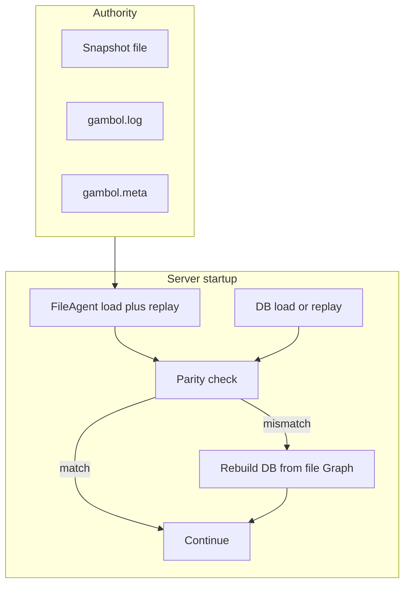

# Relational DB mirror: file authority, parity at startup, rebuild on drift

## Decisions (from iteration)

- **No blobs**: do not persist the outline as a monolithic snapshot `TEXT` (remove or stop using `snapshots.content`-style storage as the graph source of truth in PostgreSQL).
- **Normalized graph**: relational schema that mirrors [`Model.fs`](src/Shared/Model.fs) **record fields** (tables such as document/graph root metadata + `nodes` with parent, ordering, labels, classes, etc. — exact columns follow types in code).
- **File snapshot syntax is not a DB concern**: the on-disk snapshot uses **line-oriented outline syntax** ([`Snapshot.read`](src/Shared) / [`Snapshot.write`](src/Shared)) as a file encoding only. The database does **not** need to store or replay that syntax; columns and types align with the **domain model**, not with outline text layout.
- **Parity is domain-level**: “DB matches file” means the **`Graph` rebuilt from files** equals the **`Graph` assembled from relational rows** (or from replay), not a string compare of snapshot file text to any SQL blob.
- **Files remain authority**: on-disk snapshot file + `.log` + `.meta` define canonical state; the database is a **projection** for parity checks and future use, not the source of truth.
- **DB not live**: breaking schema changes are acceptable; no migration burden for existing production DB rows.
- **Startup flow**:
  1. Load canonical state from **files** (same replay path as [`FileAgent`](src/Server/FileAgent.fs)).
  2. Load or derive state from **DB** (replay from `changes` and/or read normalized tables — see below).
  3. **Validate parity** (defined comparison — likely structural equality of `Graph` or stable canonical serialization).
  4. **On failure**: report clearly (log + structured detail for operators), **reconstruct** PostgreSQL from file-derived canonical state (truncate relevant tables, re-insert changes log from file if kept in sync, rewrite normalized rows from canonical `Graph`), then **continue** serving using file-backed agent as today until you intentionally switch primary handle to DB.

## Architecture sketch

## Schema direction

- **`changes`**: keep append-only rows **aligned with** [`gambol.log`](data/gambol) (one row per persisted change, payload format unchanged unless you normalize further). This gives **log parity** without storing the whole graph as one blob.
- **Graph projection tables**: mirror **`Model.fs` fields** (UUID keys, text labels, child order, maps, etc. — whatever the `Graph` / `Node` types actually carry). Do **not** design columns around outline indentation or line grammar; that grammar exists only in the file snapshot layer.
- **Remove blob snapshot table usage** for graph truth: drop `snapshots.content`-style outline storage; rebuild normalized rows from the in-memory `Graph` produced by file load + replay.
- **Indexes / FKs** as appropriate for parent-child and ordering queries.

Exact DDL should be driven by `Graph`, `Node`, `NodeId`, and related fields in shared code; add a short doc section in [`doc/persistence-vs-domain-model.md`](doc/persistence-vs-domain-model.md) describing **model field → column** mapping (and explicitly that outline syntax is file-only).

## `DbAgent` / startup integration

- When `DB_CONNECTION_STRING` is set: after (or before) normal startup, run **parity + optional rebuild** so the DB never silently diverges from files.
- **Dual instantiation** pattern: always derive canonical state from `FileAgent` (or shared pure load-from-disk function) for the parity gate; avoid two divergent replay implementations drifting.
- **Reconstruct** must be transactional where possible: truncate projection + `changes` (if reloading from file log) + bulk insert in one transaction, or documented order that leaves no torn state.

## Testing (TDD)

- Pure functions: compare two `Graph` values; “rebuild rows from `Graph`” round-trip tests in Shared or Server.Tests.
- Integration (with `TEST_DB_CONNECTION_STRING`): empty DB + seed from fixture file state → parity true; corrupt DB row → parity false → after rebuild → parity true.

## Documentation

- [`doc/persistence-vs-domain-model.md`](doc/persistence-vs-domain-model.md) is canonical for aims and target DDL.
- [`doc/postgres-migration.md`](doc/postgres-migration.md) is a short pointer plus “current code is legacy” note (phased validate / snapshot-table plan removed).
- Removed [`doc/db-change-doc-mode.md`](doc/db-change-doc-mode.md) (blob-first Postgres advice, out of scope).

## Out of scope unless you say otherwise

- Switching **live** traffic to DB as primary writer before you trust parity (files can stay the only writer for a long time).
- Client-visible behavior changes.

---

## Code cleanup (planned)

Legacy pieces today (interim “log + outline blob in SQL”) should be removed or rewritten as the
normalized projection and parity work lands. Order is suggestive: schema and `Database.fs` first,
then `DbAgent`, then server wiring and tests.

### [`src/Server/Database.fs`](src/Server/Database.fs)

- Drop **`snapshots`** table creation and all helpers (`insertSnapshot`, `getLatestSnapshot`,
  `SnapshotRow`).
- Extend **`initSchema`** with target tables from [`doc/persistence-vs-domain-model.md`](doc/persistence-vs-domain-model.md): `graph` (singleton), `nodes`, `node_children` (plus
  FKs/indexes as decided).
- Keep **`changes`** / **`appendChange`**; rename or re-document **`getChangesAfterSnapshotRevision`**
  to use **checkpoint revision** from the singleton `graph.revision` row (not from a blob snapshot).
- Replace module comment that mentions **“Graph text via Snapshot.write”** with normalized projection
  wording.
- Optional: `DROP TABLE IF EXISTS snapshots` in bootstrap for dev DBs that still have the old table
  (only if you accept one-time destructive cleanup on upgrade).

### [`src/Server/DbAgent.fs`](src/Server/DbAgent.fs)

- **Startup:** stop loading **`Snapshot.read` on SQL `content`**. Build initial state from **`graph` +
  `nodes` + `node_children`** (assemble `Graph` per doc), then replay **`changes`** with
  `server_revision_after > graph.revision` (same ordering rules as today).
- **After successful change:** besides **`appendChange`**, **upsert** normalized rows from the new
  in-memory `Graph` (full replace or diff — pick one strategy and test it). Drop **`startSnapshot`**
  that calls **`Snapshot.write`** / **`Database.insertSnapshot`**; if you still want async work,
  make it “flush projection” only, not outline text.
- Reuse or share logic with **`FileAgent`** only where it is truly identical (avoid duplicating replay
  math); file-specific outline I/O stays in `FileAgent`.

### [`src/Server/Server.fs`](src/Server/Server.fs)

- Remove dev-only **`GET /ambit/validate`** once **startup parity + rebuild** exists (or replace it
  with a thin wrapper around the same parity function for manual debugging — avoid two different
  comparison paths).
- **`getOrCreateDbAgent` / `getHandle`:** no structural change required unless startup parity needs
  **`FileAgent`** created whenever DB is configured (same process, file authority). Plan that wiring
  when implementing parity.

### [`src/Server/Api.fs`](src/Server/Api.fs)

- Likely **unchanged** (`AgentHandle` stays); only comments if `DbAgent` semantics shift.

### Tests — [`tests/Server.Tests/DbAgentTests.fs`](tests/Server.Tests/DbAgentTests.fs)

- **`resetTestDatabase`:** truncate or recreate new tables; stop assuming **`snapshots`** exists.
- **`DbAgent new process loads state from snapshot after change`:** rewrite to assert reload via
  **`changes` + normalized projection** (or replay-only if checkpoint row is updated without
  storing outline text).
- Add tests for **parity / rebuild** when those modules exist (per TDD section above).

### What **not** to strip

- **`FileAgent`**, **`ChangeLog`**, on-disk snapshot + `.log` + `.meta` — still the authority.
- **`Snapshot.fs`** — still the **file** encoding; only remove SQL callers that treated outline text
  as the DB checkpoint.

---

## Todos

- [x] Shared: `Graph` equality / rebuild-from-rows pure functions + tests
- [x] `Database.fs`: drop `snapshots`; add `graph` / `nodes` / `node_children` DDL + CRUD; keep `changes`
- [x] `DbAgent.fs`: load from relational rows + replay tail; persist projection on change; no `Snapshot.write` to SQL
- [x] `Server.fs`: startup parity + rebuild from file; remove or replace `/ambit/validate`
- [x] `DbAgentTests.fs` + integration tests for reload and parity/rebuild
- [x] Docs: persistence-vs-domain-model + postgres stub; removed db-change-doc-mode