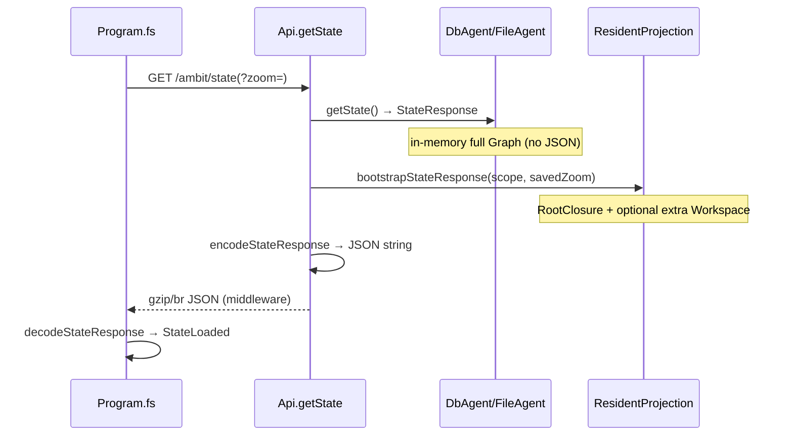

# Can we do much better on `/ambit/state`?

Date: 2026-08-27  
Branch: `w/relaxed-concurrency` (commit 9942ce7)  
Parent: [[.scratch/client-start-time/research.md]], [[.scratch/client-start-time/reports/localhost-timing-after-optimizations.md]]

## Executive answer

**Maybe — but not to &lt;300 ms on production data without new architecture.** Deploy of 9942ce7 (scope-before-encode + gzip) should cut the measured **3.50 s TTFB** materially — likely into the **~0.8–1.5 s** range on the same workspace — because the pre-fix pipeline wasted most of its time on a **full-graph JSON encode → decode → re-encode** round trip while the wire body was already scoped (~**3.7M characters**). Further wins on the state request itself are **diminishing** until bootstrap carries fewer nodes or the server stops holding/serializing the full graph. The user **~1.19 s** screenshot is consistent with partial relief; sub-300 ms on a **3.7M-char** bootstrap is **not realistic** without shrinking payload or caching at revision.

**Magnitude after deploy:** expect **~50–70%** reduction in state TTFB vs pre-fix production baseline (3.5 s → ~1–1.5 s plausible). **Not** a path to &lt;300 ms unless ROOT closure shrinks or server residency lands.

---

## Current state path (brief)

| Step | File | Notes |
| --- | --- | --- |
| URL | [[src/Client/Program.fs]]:67–71 | `?zoom=` when session storage has saved zoom id |
| Route | [[src/Server/RouteRegistration.fs]]:279–285 | `MapGet("/ambit/state", …)` |
| Agent read | [[src/Server/DbAgent.fs]]:63–66, 351–352 | Returns `{ graph; revision; isReady }` from memory |
| Scope | [[src/Server/Api.fs]]:204–218, [[src/Shared/ResidentProjection.fs]]:295–315 | `RootClosure` default; `?scope=full` for tests |
| Encode | [[src/Shared/ApiResponseSerialization.fs]]:9–13 | Thoth `Encode.toString 0` — full string before first byte |
| Compression | [[src/Server/Server.fs]] | `UseResponseCompression` (gzip + Brotli) |

Default bootstrap scope ([[.scratch/selective-client-loading/spec.md]]): **complete ROOT Workspace closure** (nested named Workspaces as Unloaded headers only; Ref headers without children), plus **at most one extra complete Workspace** when `?zoom=` targets a node outside ROOT.

---

## Already optimized (9942ce7)

| Change | Effect | Artifact |
| --- | --- | --- |
| **Scope-before-encode** | Agents return `StateResponse`; Api scopes then encodes **once**. Eliminates full-graph JSON encode in agent + full-graph decode in Api. | [[.scratch/client-start-time/reports/scope-before-encode.md]] |
| **Response compression** | gzip/Brotli on JSON; localhost **88.9 kB** transferred vs **400,000** decoded chars. Does **not** reduce TTFB (body built before compress). | [[.scratch/client-start-time/reports/server-state-compression.md]] |
| **Client compression guard** | Detects misconfigured proxy (`looksCompressed` without `Content-Encoding`). | [[.scratch/client-start-time/reports/client-state-compression.md]] |

Localhost smoke test (small DB, not production magnitude): **199 ms**, **400,000** decoded chars, **88.9 kB** transferred — [[.scratch/client-start-time/reports/localhost-timing-after-optimizations.md]].

---

## Where remaining time goes (production, post-deploy estimate)

Pre-fix production ([[.scratch/client-start-time/research.md]]): **`GET /ambit/state?zoom=…`** **3.50 s** total, green segment = **server TTFB**, body **~3.7M characters** JSON.

Important: the **3.7M-char body was already scoped** (old Api decoded, scoped, re-encoded). Scope-before-encode attacks **CPU/allocation**, not wire size vs pre-fix.

| Segment | Pre-fix (~3.5 s) | Post-9942ce7 (estimate, same data) | Dominant factor |
| --- | --- | --- | --- |
| **Server compute (TTFB)** | ~3.0–3.4 s | ~0.7–1.3 s | Eliminated double JSON on **full** in-memory graph; remaining: `projectWorkspaceNodes` walk + single encode of ~3.7M scoped JSON |
| **Proxy RTT** | ~50–150 ms | ~50–150 ms | cPanel → Azure ([[doc/reference/cpanel-transparent-proxy.md]]) |
| **Download (post-TTFB)** | ~0.2–1.5 s | ~0.05–0.3 s | gzip ~3.7M → ~300–500 KB |
| **Client decode** | (blue segment, not state row) | ~200–800 ms est. | Scales with ~3.7M chars; separate from Network "state" duration |

**Fraction summary:** pre-fix TTFB was **~85–95% server compute** (mostly redundant JSON work), **~5% proxy**, **~5–15% download**. Post-fix, TTFB becomes **~70–85% single encode + projection**, **~10–20% proxy**, download drops to **minor**.

---

## Zoom param — does it limit payload?

**No. It widens, not shrinks.**

| Case | Behavior | Test |
| --- | --- | --- |
| No `?zoom=` | ROOT closure only; nested Workspaces Unloaded | [[tests/Server.Tests/ApiGetStateTests.fs]] `getState without zoom keeps nested Workspace Unloaded` |
| `?zoom=` inside ROOT | Same node set as ROOT-only (no duplicate package) | [[tests/Shared.Tests/BootstrapScopeTests.fs]] `bootstrapGraph with zoom inside ROOT does not duplicate residency` |
| `?zoom=` outside ROOT | Adds **one complete owning Workspace** via `mergePackageNodes` | [[tests/Server.Tests/ApiGetStateTests.fs]] `getState zoom outside ROOT adds owning Workspace` |
| Invalid/missing zoom id | Falls back to ROOT only | [[tests/Shared.Tests/BootstrapScopeTests.fs]] `bootstrapGraph with missing zoom falls back to ROOT only` |

Client sends `?zoom=` from [[src/Client/SessionState.fs]] `tryReadSavedZoomId` ([[src/Client/Program.fs]]:67–71). Saved **fold** state does **not** widen `/state` ([[.scratch/selective-client-loading/spec.md]] line 77).

Production baseline already used `?zoom=d28e665d…` at **3.50 s** — zoom did not prevent a large payload.

---

## Remaining levers (ranked by impact / effort)

### 1. Server on-demand graph residency — HIGH impact, HIGH effort

Authority: [[doc/roadmap/on-demand-graph-residency.md]]. Server today holds the **full graph** in memory ([[src/Server/DbAgent.fs]]); bootstrap still projects from that graph. Target: startup and `/state` cost **independent of total node count**; client receives ROOT document + navigation needs only.

This is the only lever that breaks the **~3.7M-char ROOT floor** when most user content lives under ROOT.

### 2. Revision-keyed encoded bootstrap cache — MEDIUM impact, LOW effort

On each graph change, invalidate. On `GetState` when revision unchanged, return cached scoped JSON bytes for `(revision, scope, zoom)` instead of re-projecting + re-encoding.

Helps **repeat F5** within same revision; first load after change unchanged. No API change.

### 3. Incremental bootstrap (revision + changes since session) — HIGH impact, HIGH effort

Replace full graph bootstrap with poll-style delta when client holds prior revision (needs IndexedDB or session revision — explicitly deferred in [[doc/roadmap/on-demand-graph-residency.md]]).

### 4. Shorter wire format (field aliases, MessagePack, etc.) — MEDIUM impact, MEDIUM effort

[[src/Shared/Serialization.fs]] uses verbose keys per node (`id`, `text`, `name`, `children`, `childrenStatus`, …). Could shrink decoded size **~20–40%**; breaks clients unless versioned.

### 5. Streaming / chunked JSON encode — LOW impact on TTFB, MEDIUM effort

Thoth + `Results.Content(json)` builds the **entire string** before first byte ([[src/Server/Api.fs]]:216–219). Streaming helps download overlap, not the measured green wait.

### 6. Narrow bootstrap scope within ROOT — LOW–MEDIUM impact, HIGH product cost

Spec requires **complete ROOT Workspace** ([[.scratch/selective-client-loading/spec.md]] user story 7). Trimming ROOT owned content would violate delivered selective-loading contract unless spec changes.

### 7. Bypass / tune cPanel proxy for API — LOW impact

Adds tens–low hundreds of ms; not the multi-second pre-fix gap.

---

## Production estimate: after deploy vs further work

| Scenario | State TTFB + transfer (est.) | Decoded JSON | Notes |
| --- | --- | --- | --- |
| **Pre-fix production** (measured) | **3.50 s** | **~3.7M chars** | Full-graph encode/decode/re-encode |
| **After 9942ce7 deploy** (same data, HITL pending) | **~0.8–1.5 s** | **~3.7M chars** (similar) | CPU win; gzip shrinks transfer |
| **User screenshot ~1.19 s** | ~1.19 s | unknown | Consistent with post scope-before-encode or warm partial fix |
| **+ revision cache (warm F5)** | **~0.1–0.4 s** | same | Skip re-encode when revision stable |
| **+ on-demand server residency** | **&lt;300 ms** possible | **≪3.7M** | ROOT-only document from DB, not full graph serialize |
| **Localhost small DB** (mechanism only) | **199 ms** | **400k chars** | Not comparable magnitude |

**&lt;300 ms on current production ROOT size:** **unlikely** without payload reduction. Linear extrapolation from localhost (199 ms @ 400k → ~1.8 s @ 3.7M encode alone) plus Azure/proxy puts a **~1 s+** floor on single-shot full bootstrap.

---

## Recommendation (state specifically)

1. **Deploy 9942ce7 and run production HITL** ([[WORK.md]] Pending) — confirm `Content-Encoding`, TTFB, transferred size on the **same workspace** that measured 3.5 s / 3.7M chars. This is the only apples-to-apples validation.

2. **Treat state endpoint as largely done for this phase** if HITL shows **~1 s or less** TTFB. The big win was removing redundant full-graph JSON work; gzip handles wire size.

3. **If post-deploy TTFB still &gt;1.5 s**, try **revision-keyed bootstrap cache** first (small, surgical, no API change) before larger work.

4. **Do not expect zoom tuning or compression alone** to reach &lt;300 ms on a multi-MB ROOT closure.

5. **For sub-second bootstrap at scale**, plan **on-demand server graph residency** ([[doc/roadmap/on-demand-graph-residency.md]]) — that is the architectural ceiling-breaker, not more `/state` micro-optimization.

6. **Separate track:** bucket 3 post-state work ([[.scratch/client-start-time/reports/bucket-3-post-state-work.md]]) — defer `applyFoldSession`, async ledger — improves **perceived** boot after state returns; **not** state fetch TTFB.

---

## Key file references

| Concern | Path |
| --- | --- |
| State handler | [[src/Server/Api.fs]] `getState` |
| Bootstrap projection | [[src/Shared/ResidentProjection.fs]] `bootstrapGraph`, `bootstrapStateResponse` |
| Client fetch | [[src/Client/Program.fs]] |
| Scope types | [[src/Shared/ApiResponses.fs]] `BootstrapScope`, `StateResponse` |
| JSON encode | [[src/Shared/ApiResponseSerialization.fs]], [[src/Shared/Serialization.fs]] |
| Tests for zoom/scope | [[tests/Server.Tests/ApiGetStateTests.fs]], [[tests/Shared.Tests/BootstrapScopeTests.fs]] |

## Status

Investigation complete. No `src/` changes. Production HITL remains the gating measurement.
