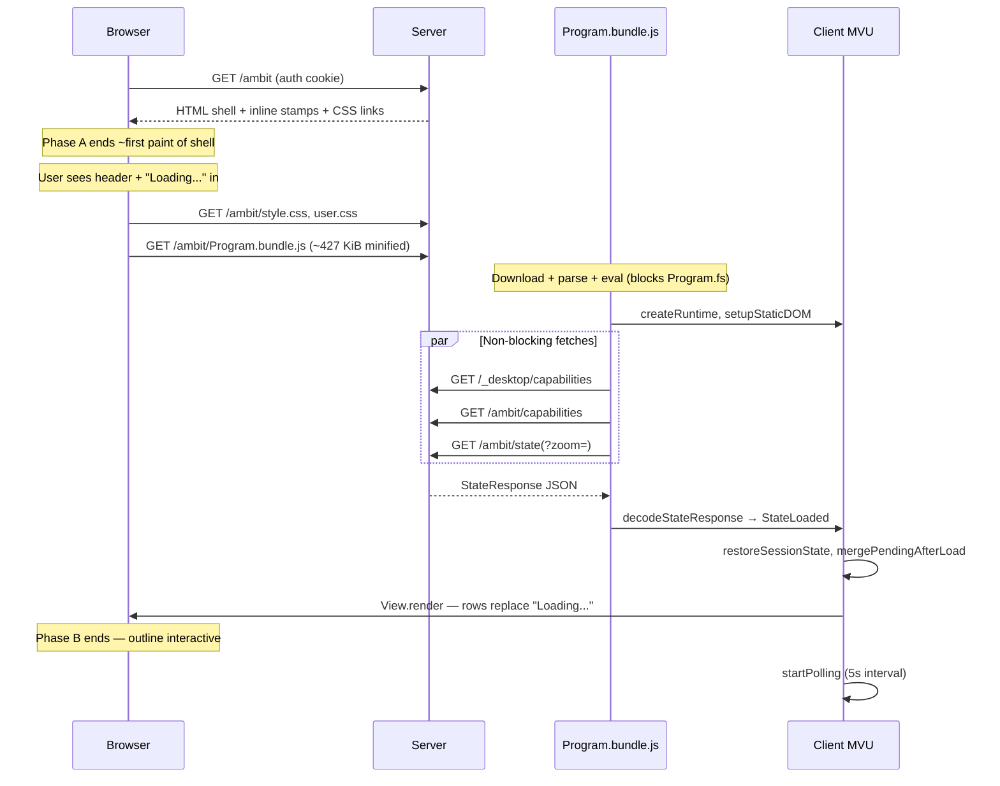

# Client start time research

Date: 2026-08-27  
Branch: `w/relaxed-concurrency`  
See also: [[.scratch/selective-client-loading/spec.md]], [[doc/reference/dev-debug-workflow.md]], [[doc/arch.md]]

## Problem statement (user-scoped)

Observed on **production** (desktop browser refresh; not localhost, not a mobile/3G SLA):

| Phase | Symptom | User target |
| --- | --- | --- |
| **A — before first UI** | Blank screen / delay before anything appears | Shorten pre-shell wait |
| **B — placeholder → outline** | Static **"Loading..."** visible in the document pane; **≥3 seconds** until the outline view is actually loaded | Main pain point |

Do **not** optimize against a fabricated "2s under 3G" budget. Measure and fix these two desktop phases.

## What "Loading..." is (code source)

The visible **"Loading..."** (three ASCII dots) is **not** the sync-status bar text and **not** the Load-command `SyncState.Loading` indicator.

**Source:** static HTML placeholder in [[src/Server/wwwroot/gambol.template.html]] line 24, inside `#amb-document`:

```html
<main id="amb-document" class="amb-document">
    Loading...
    <input id="hidden-input" ...>
</main>
```

Server serves this shell from `GET /ambit` via [[src/Server/RouteRegistration.fs]] `renderGambolHtml` / `serveAmbitApp`. It sits **below** the sticky header (`#amb-sticky-header` with sync/db/cmd status) and **above** the footer command dock.

**Removal:** first successful bootstrap render in [[src/Client/View.fs]] `render` (called only on `SysMsg (StateLoaded _)`). `render` deletes every `#amb-document` child before `#hidden-input`, which removes the text node `"Loading..."`, then inserts one DOM row per visible SiteMap entry.

**Related but different strings:**

| Text | Where | When |
| --- | --- | --- |
| `Loading...` (ASCII) | `#amb-document` HTML | From first HTML paint until `StateLoaded` → `render` |
| `Starting up…` | `#sync-status` | [[src/Client/StatusView.fs]] while `not model.syncInfo.isServerReady` |
| `Loading…` (Unicode ellipsis) | `#sync-status` | [[src/Client/StatusView.fs]] when `syncState = Loading` (explicit Load command) |

User report matches the **HTML placeholder** (phase B), not header sync text.

## Boot timeline (page load → placeholder → view ready)



### Phase A — blank before anything appears

Work before the HTML shell paints:

1. **Navigation / auth** — `GET /ambit` requires auth ([[src/Server/RouteRegistration.fs]]); unauthenticated users redirect to `/ambit/login`. Refresh with valid cookie skips login.
2. **HTML generation** — server reads template, inlines command-dock sprite, injects build/db stamps, rewrites asset URLs with cache-bust query (`?v=pageEpoch`).
3. **First paint** — browser parses HTML; CSS is two small files (~12 KiB + user.css). JS is **deferred** (`<script type="module">` at end of `<body>`), so shell can paint before bundle runs.

Phase A is dominated by **network + server HTML response** (and on production, [[doc/reference/cpanel-transparent-proxy.md]] hop to Azure). No client MVU runs yet.

### Phase B — "Loading..." → outline loaded (≥3s pain)

Once the shell is visible, the placeholder remains until `StateLoaded` → `render`. Work in this window:

#### 1. JavaScript bundle (gate, not the bottleneck)

- Default entry: **`Program.bundle.js`** (~**437 KiB** minified ESM; [[package.json]] `esbuild … --bundle --minify`).
- Selected in [[src/Server/RouteRegistration.fs]] unless `?debug=1` (then unbundled `Program.js` + ~37 modules — slower, dev-only per [[doc/reference/dev-debug-workflow.md]]).
- **Nothing in [[src/Client/Program.fs]] runs until the module evaluates** — including the `/ambit/state` fetch. Prior research over-weighted parse/eval cost; **measured desktop refresh: ~153ms** (see Measured baseline).

Tooling: Fable **5.0.0-rc.6** ([[.config/dotnet-tools.json]]), Fable.Core **4.5.0** ([[src/Client/Gambol.Client.fsproj]]), esbuild **0.28.1** ([[package.json]]).

#### 2. MVU init (sync, cheap relative to bundle + state)

[[src/Client/Program.fs]]:

- `initialModel` with empty graph
- `createRuntime` / `setupStaticDOM` (keyboard, paste, viewport listeners)
- Starts three parallel fetches (do **not** block each other):
  - `/_desktop/capabilities`
  - `/ambit/capabilities`
  - `GET /ambit/state` or `/ambit/state?zoom={saved}` when session storage has bootstrap widen id ([[src/Client/SessionState.fs]] `tryReadSavedZoomId`)

**Not used:** SignalR, WebAssembly, service workers.

Sync model: HTTP poll every 5s after first successful state load ([[src/Client/App.fs]] `startPolling`).

#### 3. Server `/ambit/state` (measured bottleneck — 3.50s TTFB)

[[src/Server/Api.fs]] `getState`:

1. `handle.getState()` — DbAgent/FileAgent returns **full graph JSON** ([[src/Server/DbAgent.fs]] `encodeStateJson`).
2. Server **decodes** full `StateResponse` from that JSON.
3. `ResidentProjection.bootstrapStateResponse` scopes to **RootClosure** by default ([[src/Shared/ResidentProjection.fs]] — ROOT workspace + optional extra workspace for saved zoom outside ROOT).
4. Server **re-encodes** scoped response.
5. Client **decodes** again ([[src/Client/UpdateCodec.fs]] `decodeStateResponse`).

So selective bootstrap reduces **wire size** but the server still **materializes, encodes, decodes, and re-encodes the full graph** on every refresh unless `?scope=full`. This is unnecessary work on both CPU and allocations.

**Source lines (encode → decode → scope → re-encode):**

- Full-graph encode in agent: [[src/Server/DbAgent.fs]] `encodeStateJson` (lines 63–68), `GetState` reply (353–354); [[src/Server/FileAgent.fs]] same pattern (90–95, 298–299).
- Decode, scope, re-encode in [[src/Server/Api.fs]] `getState` (213–238): `handle.getState()` → `Decode.fromString` → `ResidentProjection.bootstrapStateResponse` → `encodeStateResponse` → `jsonResult`.
- Scoping logic: [[src/Shared/ResidentProjection.fs]] `bootstrapStateResponse` (309–315), `bootstrapGraph` (295–307).

#### 4. Client post-decode work (can be large with expanded session)

On `StateLoaded` ([[src/Client/App.fs]] dispatch):

1. `update` — `buildSiteMapFrom` at `firstGraphChild` zoom root ([[src/Client/Update.fs]])
2. `restoreSessionState` — may change zoom and **expand saved folds** (`applyFoldSession`) before first render
3. `mergePendingAfterLoad` — replays `localStorage` pending change queue if present
4. `View.render` — **full DOM rebuild**: one `.amb-row` per visible SiteMap entry, no virtualization ([[.scratch/large-node-cursor-perf/investigation.md]])

If session restore expands many nodes, first render creates hundreds/thousands of DOM nodes synchronously on the main thread.

#### 5. Caching headers (repeat-visit note)

JS/CSS under `/ambit/` get **no-cache** headers ([[src/Server/Server.fs]] `applyNoCacheHeaders`). HTML shell is also no-cache. Repeat desktop refresh still re-downloads/re-parses the bundle unless browser heuristics override — relevant to refresh scenario.

## Baseline metrics (repo snapshot)

| Asset | Size | Source |
| --- | --- | --- |
| `Program.bundle.js` | ~437 KiB | `wc -c src/Server/wwwroot/Program.bundle.js` |
| `style.css` | ~12 KiB | same |
| Fable cold compile | ~21 s | `dotnet fable src/Client --noCache` (dev/build, not user refresh) |

## Measured baseline (production desktop refresh, Network tab)

**Environment:** **production** — custom domain via cPanel transparent proxy to Azure ([[doc/reference/cpanel-transparent-proxy.md]]). Not localhost. API routes including `/ambit/state` traverse browser → cPanel Apache → `proxy.php` (curl) → Azure Web App; JS/CSS load directly from Azure (`PublicAssetBase`).

User measurements on desktop refresh (2026-08-27). Waterfall colors: **green** = waiting/TTFB; **blue** = client-side work after last network request completes until final render.

| Request | Duration | Initiator | Notes |
| --- | --- | --- | --- |
| `GET /ambit?bust=…` (HTML shell) | ~438 ms | navigation | Phase A — shell paint |
| `GET /ambit/Program.bundle.js` | **153 ms** | HTML | **Not the bottleneck** — prior research over-weighted bundle parse/eval |
| `GET /_desktop/capabilities` (1st) | 75 ms | [[src/Client/Program.fs]]:40 | Failed/red (non-blocking) |
| `GET /ambit/capabilities` (2nd) | 472 ms | [[src/Client/Program.fs]]:51 | Non-blocking |
| **`GET /ambit/state?zoom=d28e665d…`** | **3.50 s** | [[src/Client/Program.fs]]:69 | **Primary target** — green segment dominated by server TTFB |
| `GET …/file-status` | 426 ms | [[src/Client/App.fs]]:580 | After state; polling-related |

**Phase B breakdown (approximate):** bundle ~153 ms + state TTFB ~3.50 s + post-state client render (blue segment after `file-status` completes) + ancillary fetches. The ≥3 s `"Loading..."` gap is **not** bundle-size limited; it is dominated by **`/ambit/state` server response time** and then client post-network work (decode, SiteMap build, session restore, synchronous `View.render`).

**Measured payload size:** `/ambit/state` response body is **~3.7M characters** (~3.7 MB UTF-8 JSON). Sample node shape repeats keys (`id`, `text`, `name`, `children`, `childrenStatus`, `cssClasses`, `kind`, `documentState`, `updateTime`) — highly compressible structure, but size confirms full-graph wire payload on the measured refresh.

**Optimization target:** reduce `/ambit/state` response time — scope graph before server JSON encode per [[src/Server/Api.fs]] analysis below. Boot instrumentation remains useful for validation but is no longer the first action.

## Would compression help?

**Verdict: No — not for the ≥3 s gap on production.** HTTP compression (gzip/brotli) is a **worthwhile secondary win** after TTFB is fixed, but it does **not** address the measured bottleneck. Scope-before-encode remains **#1**.

### Is compression enabled today?

**No.** [[src/Server/Server.fs]] builds the app with static files, auth, and route registration only. There is no `AddResponseCompression`, no `UseResponseCompression`, and no compression package in [[src/Server/Gambol.Server.fsproj]]. `/ambit/state` returns uncompressed JSON via `Results.Content` in [[src/Server/Api.fs]]. Production cPanel proxy ([[proxy.php]], [[doc/reference/cpanel-transparent-proxy.md]]) forwards `Accept-Encoding` to Azure and passes `Content-Encoding` back if the backend sends it, but the backend does not compress.

### What TTFB includes on production (why compression misses the target)

Network tab **green = waiting (TTFB)** — time until the first response byte. For `/ambit/state` on production that window covers:

1. **Proxy hop** — browser → cPanel `proxy.php` (curl) → Azure ([[doc/reference/cpanel-transparent-proxy.md]]); adds RTT but is a small fraction of 3.5 s
2. Agent **full-graph JSON encode** ([[src/Server/DbAgent.fs]] / [[src/Server/FileAgent.fs]] `encodeStateJson`)
3. Server **decode** full `StateResponse`
4. `ResidentProjection.bootstrapStateResponse` (RootClosure scope)
5. Server **re-encode** scoped response
6. Response travels proxy → browser (first byte)

ASP.NET Core [response compression](https://learn.microsoft.com/en-us/aspnet/core/performance/response-compression) runs as **middleware after the handler produces the body**. It shrinks bytes on the wire; it does **not** skip graph serialization, decode, or re-encode. With a buffered `Results.Content(json)` payload, the handler finishes building the entire JSON string before compression starts — so compression **does not reduce TTFB** and adds compression CPU on top of encode/decode/re-encode.

The measured **3.50 s** request with **green dominated** means most of that time is **server-side waiting**, not downloading 3.7 MB over the internet. Compression only affects the post-TTFB download segment.

### Transfer math on production (3.7 MB vs compressed)

Repetitive JSON often compresses **~85–95%** (keys and structure repeat per node). ~3.7 MB → **~300–500 KB** gzip/brotli is realistic.

| Segment | Uncompressed ~3.7 MB | Compressed ~300–500 KB | Notes |
| --- | --- | --- | --- |
| **TTFB (green)** | ~3.5 s measured | ~3.5 s (unchanged) | Server must build full JSON first; proxy hop unchanged |
| **Download after first byte** | ~0.5–2 s on typical home/office links | ~0.05–0.3 s | Savings **~0.2–1.5 s** depending on bandwidth — but only **after** TTFB |
| **Proxy body relay** | Full 3.7 MB buffered through PHP curl | Smaller body through curl | Minor extra win; still post-TTFB |

On a **10 Mbps** link, downloading 3.7 MB after TTFB takes ~3 s; compressed ~400 KB takes ~0.3 s — compression could save **~2.5 s of download**, but the user still waits **~3.5 s green** before any byte arrives. Total request time might drop from ~6 s to ~4 s (compression-only), still far above target and still dominated by server work.

If TTFB were already fast (~200 ms), compression on production would matter more for the total `/ambit/state` duration. **Measured data says TTFB is not fast** — that is why compression alone does not fix the `"Loading..."` gap.

### Compression-only vs scope-before-encode

| Approach | TTFB (server work) | Wire size | Client decode |
| --- | --- | --- | --- |
| **Enable gzip/brotli only** | Same full encode → decode → scope → re-encode; +compression CPU | Smaller on wire | Same scoped JSON after decompress |
| **Scope graph before encode** | Encode **scoped** graph once; drop decode/re-encode round-trip | Smaller JSON at source | Less JSON to parse |

Scope-before-encode attacks steps 2–5 directly and shrinks both TTFB and download. Compression is a **bandwidth polish** that leaves the ~3.5 s server wait intact.

### Recommended fix order (unchanged)

1. **Scope graph before server JSON encode** — primary fix for measured 3.50 s TTFB ([[src/Server/Api.fs]]).
2. **Enable response compression** — more valuable on production than localhost (saves hundreds of ms on download **after** TTFB is fixed); still **not** a substitute for (1).
3. **Client deferrals** (fold expansion, capability fetch ordering) — address post-TTFB blue segment after server path is fixed.

## Recommendations (re-prioritized for phases A and B)

### Phase B — "Loading..." → outline (highest impact)

1. **Scope graph before server encode** — Change [[src/Server/Api.fs]] `getState` to call `ResidentProjection.bootstrapGraph` on the in-memory `Graph` inside DbAgent/FileAgent **before** JSON encoding, eliminating full-graph decode→re-encode on every refresh unless `?scope=full`. **Measured 3.50 s TTFB on `/ambit/state` makes this the clear #1 fix.** Aligns with delivered selective-loading intent ([[.scratch/selective-client-loading/spec.md]]).

2. **Defer first-render work after paint** — Split bootstrap: render a **minimal** visible tree (ROOT + default zoom, no session fold expansion), then `requestAnimationFrame` / `setTimeout(0)` apply `restoreSessionState` fold expansion. Addresses the **blue segment** (post-network client work) after state returns. *Files:* [[src/Client/App.fs]], [[src/Client/SessionState.fs]].

3. **Instrument the boot path (validation)** — Add `performance.mark` / `console.time` (or Performance tab recording) at: HTML loaded, `Program.fs` entry, `/ambit/state` fetch start/response, `StateLoaded`, end of `View.render`. Confirms improvement after (1) and quantifies remaining blue-segment cost. *Files:* [[src/Client/Program.fs]], [[src/Client/View.fs]], optionally server middleware on `/ambit/state`.

4. **Defer non-critical capability fetches** — Move `/_desktop/capabilities` and `/ambit/capabilities` to **after** first `render` so they do not compete with `/ambit/state` on connection or main thread. *File:* [[src/Client/Program.fs]]. Lower impact than (1) given measured timings.

5. **Reduce main-thread block before state fetch** — Audit bundle for deferrable modules (workspace sync/load, search dialogs, paste/import codecs). esbuild `--splitting` requires `format=esm` (already used) but Fable would need dynamic `import()` call sites ([esbuild splitting docs](https://esbuild.github.io/api/#splitting)). **Deprioritized:** bundle is ~153 ms measured; not the ≥3 s gap.

### Phase A — blank before shell

6. **Preload bootstrap script** — Add `<link rel="modulepreload" href="…/Program.bundle.js?v=…">` in served HTML ([[src/Server/RouteRegistration.fs]] `renderGambolHtml`) so download starts while CSS parses.

7. **Measure server + proxy TTFB** — For production refresh, log time to first byte on `GET /ambit` through cPanel proxy ([[doc/reference/cpanel-transparent-proxy.md]]). Phase A is pure server/network if bundle has not started.

8. **Inline critical shell CSS (optional)** — `style.css` is small; if first paint waits on CSS RTT, inline header/document layout rules in template. May matter on production custom domain over proxy.

### Explicitly lower priority for this report

- Mobile/3G budgets, Lighthouse score chasing
- Service workers / offline caching (not present; JS is no-cache)
- SSR/hydration (not this stack)
- SignalR (not used)
- Fable dev compile time (phase A/B user path uses prebuilt wwwroot)

## Open questions (only if needed)

1. **Graph size** — Approximate node count in ROOT workspace and how many folds session restore expands on refresh? Dominates `/ambit/state` and `View.render` cost.
2. **Phase A severity** — Is the pre-shell blank **>1s** or minor compared to the Loading placeholder? Determines whether preload/CSS items precede client deferrals.

Network tab measurements confirm `/ambit/state` TTFB as the dominant cost; **recommendation (1) scope-before-encode** should run first. Instrumentation (3) validates after server fix.

## Primary sources cited

| Claim | Source |
| --- | --- |
| HTML placeholder text | [[src/Server/wwwroot/gambol.template.html]] |
| Bundle vs debug entry | [[src/Server/RouteRegistration.fs]], [[doc/reference/dev-debug-workflow.md]] |
| Boot fetch sequence | [[src/Client/Program.fs]] |
| StateLoaded → render | [[src/Client/App.fs]], [[src/Client/View.fs]] |
| Server full-graph decode/rescope | [[src/Server/Api.fs]], [[src/Shared/ResidentProjection.fs]] |
| No response compression middleware | [[src/Server/Server.fs]], [[src/Server/Gambol.Server.fsproj]] |
| Production proxy path for API | [[doc/reference/cpanel-transparent-proxy.md]], [[proxy.php]] |
| ASP.NET compression does not reduce handler time | [Response compression in ASP.NET Core](https://learn.microsoft.com/en-us/aspnet/core/performance/response-compression) |
| Selective bootstrap scope | [[.scratch/selective-client-loading/spec.md]] |
| Poll not SignalR | [[src/Client/App.fs]], [[doc/arch.md]] |
| esbuild splitting | [esbuild API — Splitting](https://esbuild.github.io/api/#splitting) |
| No mobile SLA | User clarification |
| Measured on production (not localhost) | User clarification |
