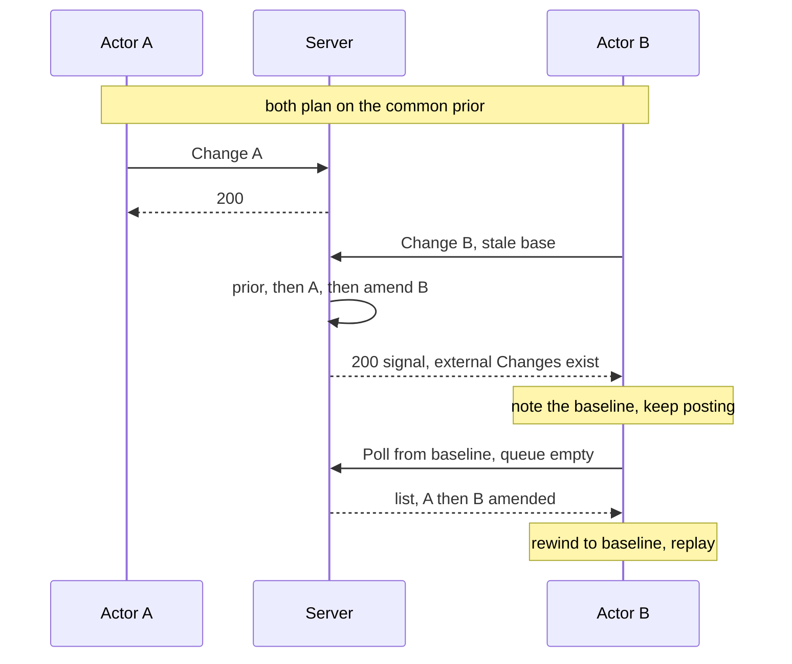

# Event-sourced ops — architecture

The conceptual protocol. It says who does what, and in which order. It does not name endpoints, types, or modules; the exact wire is still **proposed** ([[details/messaging.md]]). Objective and means: [[overview.md]]. Terms: [[details/vocabulary.md]].

## Roles

**Actor.** Anything that produces a Change. A person editing in the Browser, the Parse File job, a later shell command or agent. An Actor may be synchronous or asynchronous, and may hold little or no Local Graph. All Actors are the same kind.

**Server.** The only sequencer and the only amender. It holds the full Graph, gives Changes their global order, amends the newest Change, completes a Change that an Actor could not write in full, and keeps the log that Clients read. The Server is also an Actor when it completes a Change ([[details/completing-ops.md]]).

**Client.** A process that holds a Local Graph and consumes the Server's sequence. A Client is usually also an Actor, but not always: a Browser that posted nothing still consumes.

Every process holds a **Local Graph** — its own graph state, which may be incomplete. There is no second graph type.

## The life of a Change

1. **Plan.** An Actor reads its Local Graph and builds a Change — a set of Ops. That graph state is the **common prior** for this Change.
2. **Submit.** The Actor gives the Change to the Server. A Browser posts it. A Server-side job hands it to the same inner apply, without a request to itself ([[details/actors-and-jobs.md]]).
3. **Sequence.** Arrival at the Server sets the order. Changes that already applied are the **other accepted Changes**. This one is the **newest**.
4. **Amend.** The Server rewrites the newest Change so that it fits the common prior plus those other accepted Changes, and so that no critical information is lost ([[details/merge-invariant.md]]).
5. **Complete.** If the Actor's view was too small to name a required Op, the Server adds the missing Ops **to that same Change** ([[details/completing-ops.md]]).
6. **Apply and log.** The amended, completed Change applies to the Server Graph and joins the log.
7. **Convey.** Clients read the sequence.
8. **Consume.** An optimistic Client rewinds to its baseline and replays the sequence ([[details/client-consume.md]]).

Steps 3 to 6 are **produce**. Step 8 is **consume**. They are different jobs and must not be confused with each other.

## Amendment order (accepted)

The Server must produce this sequence, in this order:

1. The **common prior** Local Graph — the base.
2. The **other Actors' accepted Changes**, in full. Every Op, not only the Ops that touch the same Nodes.
3. The **newest Actor's Change**, amended against that combined state.

A rewrite that is true only of the Nodes in question, and that omits the other Actors' Ops, is **invalid**. This is the rule that makes the whole framework more than a field-level patch. With more than two concurrent Changes, each next Change is newest in relation to those already accepted.

## Two channels (accepted)

The Client uses two different paths. They are not the same path, and an earlier note that made Poll a POST with an empty body is **superseded**.

**Post.** The Actor sends a Change. Many posts may be in flight; the Client does not wait for one at a time, and the Server does not track Clients. The acknowledgement is a **signal**: it tells the Client that external Changes exist. The Client notes the **baseline** — the point to catch up from. The acknowledgement does not carry or apply the sequence.

**Poll.** When the posting queue is empty, the Client polls from that baseline. The response is the Change list. The Client rewinds to the baseline, then applies the list.

Neither channel clears the Client's History. Both carry only the last revision the Client **received from the Server**, never a locally advanced number.

## Outcomes

**Merge success.** A stale base, a stale field value, or a stale child span is not a failure. The Server amends and answers with success. This includes the same-text and same-name cases, which become an `amb-conflict` child instead of a refusal.

**Reject.** Only request failures remain: authentication, a malformed request, and the like. Concurrency is not a Reject.

This replaces the older plan in which a recoverable collision was refused and the Client replanned. See [[details/relation-to-relaxed-concurrency.md]].

## Long-running Actors

A long job must not hold the Server's apply queue. It plans off that queue, on its own task, and then sends a message so the queue applies the result. When it concludes, its Change is simply the newest Change, and every rule above applies to it. Other Browsers learn of it by polling; there is no completion push. The job may soft-lock its subtree as advice, which changes nothing about merge. Details, and the parts that do not exist yet — job identity, launch, cancel — are in [[details/actors-and-jobs.md]] and [[details/soft-lock.md]].

## Boundaries

The architecture deliberately stops before these:

- **No per-Op transform tables.** The child-list approximation algorithm is later work.
- **No wire types.** Response shape and acknowledgement payload stay **proposed** ([[details/messaging.md]]).
- **No residency model.** Load packages stay a Graph transfer and stay **parked** ([[details/as-implemented-facts.md]]).
- **No undo protocol across Actors.** Undo stays thoughts, and one question is retained **open** ([[details/undo.md]]).
