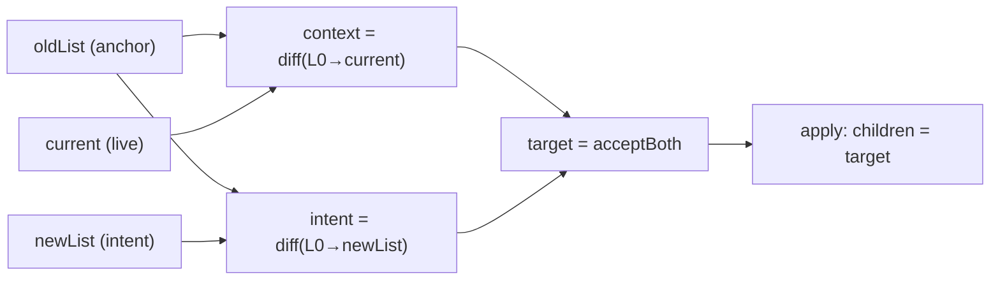

# Replace amendment — full-list shape and Accept Both

The Actor contract, three-way resolve, and deterministic acceptBoth algorithm for same-parent child lists. Kind 3 resolution lives in [[conflict-resolution.md]]; amendment order in [[merge-invariant.md]]. Issue 05 implements this; issue 10 polishes interleaving only.

Status: **accepted** for shape, three-way resolve, acceptBoth order invariants and construction, Server amend, producer rule, undo, and hard Reject guards. Issue 10 may refine interleaving among valid orderings; it does not relax invariants.

## 1. Replace shape (Actor contract)

The Actor posts a **full-list Replace**, parallel to `SetClasses(nodeId, prior, newClasses)`:

```fsharp
Replace(parentId, oldList, newList)
```

| Field | Meaning |
| --- | --- |
| `parentId` | The parent whose Children list is edited. |
| `oldList` | The full `ChildNode` list for `parentId` at the Actor's **common prior** (planning anchor). |
| `newList` | The full list the Actor intends after **only** their edit, relative to the same anchor. |

Each occurrence is a full `ChildNode { ref; id }`, not a `NodeId` alone. Ref and Owner matter; two occurrences with the same id but different `ref` are distinct slots.

### Wire contract (full-list only)

On the wire, **only** full-list Replace is valid: `parentId` plus the parent's **complete** `oldList` and `newList`. Partial span Replace — including zero-width insert at `index > 0`, remove-at-index, or `index = 0` with `oldChildren` / `newChildren` that are not the full parent list — is **not** part of the wire contract and must not be emitted by producers.

The internal `Op.Replace(parentId, index, oldChildren, newChildren)` type may still carry span semantics during migration. That is implementation debt, not wire permission. See §6 and issue 13.

Until §10 drops the field, wire JSON keeps `"index"`, `"oldChildren"`, and `"newChildren"`. Full-list posts use **`index = 0`** with `oldChildren` / `newChildren` equal to the full parent lists. Target shape after §10: `oldList` / `newList` fields with no `index` (open in [[open-questions.md]]).

The span form `Replace(parentId, index, oldChildren, newChildren)` remains **behavior to beat** for apply and for legacy logs read at replay. It is **superseded** as the Actor posting and wire contract. See [[as-implemented-facts.md]].

## 2. Three-way resolve (core apply rule)

At apply time for one posted Replace:

```text
current  = live parent.children
intent   = diff(oldList → newList)
context  = diff(oldList → current)
target   = acceptBoth(oldList, context, intent)
```

`diff` is defined in §3. `acceptBoth` is defined in §4.

### Fast path

When `current = oldList`, set `parent.children` to `newList`. No merge math.

### Concurrent path

When `current ≠ oldList`, set `parent.children` to `target`. Apply **succeeds** even when `target ≠ newList`. `newList` is this Actor's intent under concurrency, not the mandatory outcome.

### externalChanges

Set `externalChanges = true` when `target ≠ newList`, or when other Actors' accepted Changes touched this parent or any Node in the Replace window since the common prior. Same signal family as field amendment in ticket 03.



## 3. diff extraction (occurrence bag)

Walk **full lists** left to right. Match occurrences by **value equality** on `ChildNode` (`ref` and `id`).

For `diff(anchor → observed)`:

| Output | Rule |
| --- | --- |
| **remove bag** | Occurrences consumed from `anchor` when walking `observed`, in anchor order, that have no matching occurrence left in `observed`. |
| **add list** | Occurrences in `observed` not consumed as matches from `anchor`, in `observed` order. |

This is multiset semantics on occurrences, not on `NodeId`. Adding another `X` and removing `X` do **not** cancel unless the **same occurrence** (same `ref` and `id`) appears on both sides. See Kind 3 in [[conflict-resolution.md]].

## 4. acceptBoth algorithm (deterministic — issue 10 polishes interleaving)

Inputs: anchor `oldList`, live `current`, `context` and `intent` as diff bags from §3, and intent's full `newList`. All are relative to the same anchor.

The merge is **deterministic**. It does **not** randomize any aspect of `current` (context) or `intent`. Issue 10 may choose a clearer interleaving when several orderings satisfy the invariants below; it does not introduce randomness.

### Order invariants (locked in issue 05)

1. **Context order preserved.** For any two occurrences `p` and `q` that appear in `current` and both survive in `target`, their relative order in `target` equals their relative order in `current`.
2. **Intent order preserved.** For any two occurrences in `intent`'s **add list** that both appear in `target`, their relative order in `target` equals their relative order in `intent`'s add list.
3. **Intent removes honored.** Every occurrence in `intent`'s remove bag is absent from `target`.
4. **Context removes honored.** Every occurrence in `context`'s remove bag is absent from `target` (another Actor removed it).
5. **No id cancellation.** Occurrences are matched by full `ChildNode` value (`ref` and `id`). Adding `X` and removing `X` do **not** cancel unless the **same occurrence** appears in both bags (§3).

### Construction (deterministic)

**Step 1 — union removes**

`R*` = union of remove-occurrences from `context` and `intent`. The same occurrence in both bags counts once.

**Step 2 — spine from current**

1. Start from `current` (the live list) as the **spine**. Every occurrence already in `current` keeps its relative order among survivors.
2. Drop from the spine every occurrence in `R*`. An occurrence in `current` is dropped only when it matches a remove from the anchor walk (full `ChildNode` equality). Context-only adds in `current` that are not removed stay at their spine positions.

**Step 3 — insert intent adds (anchor-relative, in intent add-list order)**

For each occurrence `a` in `intent`'s add list, left to right:

1. Let `P(a)` = the set of occurrences that appear **before** `a` in `newList` and also appear in `oldList` (anchor-matched predecessors of `a` in the Actor's intended list).
2. Among occurrences currently in the spine that are members of `P(a)`, find the **last** one in spine order.
3. Insert `a` **immediately after** that occurrence. If `P(a)` is empty or none of its members are in the spine yet, insert `a` at the **front** of the spine.

Repeat for each intent add without reordering context-only occurrences already placed by the spine.

**Step 4 — result**

`target` = the spine after Step 2 and Step 3. Do **not** cancel intent adds against context adds by `NodeId`.

### Why spine-from-current

Building from `oldList` and concatenating context adds before intent adds can **shuffle** context adds — e.g. prefix inserts `x`, `y` in `current` relocate when an intent add inserts `n` before `f`. Starting from `current` and inserting only `intent.add` occurrences satisfies invariant 1.

### Issue 10 scope

When context-only and intent-only adds admit **multiple** interleavings that all satisfy invariants 1–5, issue 05 picks the rule above. Issue 10 may pick a **clearer** interleaving that still satisfies those invariants. It is **not** randomization and does not change remove bags or which occurrences survive.

## 5. Server amend (newest Change)

After other accepted Changes are applied onto the common prior, rewrite the newest posted Replace before persist and replay:

```text
Replace(parentId, oldList, newList)   -- posted
Replace(parentId, current, target)    -- amended
```

`current` is the live list at amend time (after other Actors' Ops). `target` is from §2–§4. This mirrors `ChangeAmendment` for fields (ticket 03): the amended Op is what the log stores and Clients replay.

Amendment order is fixed in [[merge-invariant.md]]: common prior → other accepted Changes in full → amend newest Change. Never amend from isolated node fields or without conveying other Changes.

## 6. Producer rule

Planners send **full lists** for `oldList` and `newList` on the wire. Prefer **one Replace per parent per Change**; compose multiple edits on one parent at plan time.

Any producer that still builds span or partial Replace ops (non-zero `index`, or lists shorter than the parent's full children) is **migration debt** — tracked in [[../issues/13-migrate-producers-full-list-replace-wire.md]]. Catalogue of current span emitters: [[.scratch/relaxed-concurrency/replace-span-cas-feasibility.md]], [[../reports/wire-full-list-replace-contract.md]]. Implementation of that migration is **not** issue 05.

## 7. Undo

Undo inverts the applied Replace:

```fsharp
Replace(parentId, newList, oldList)
```

When the Server amended to `Replace(parentId, current, target)`, undo uses the **applied** pair: `Replace(parentId, target, current)` on the graph state after apply. The Client History records the amended Change from the Server.

## 8. Hard Reject (unchanged guards)

These failures are **not** recoverable via merge or Accept Both:

| Guard | Examples |
| --- | --- |
| Placement | Invalid parent, index out of range for span legacy paths during transition. |
| Ownership | Apply ownership validation after the fold ([[as-implemented-facts.md]]). |
| Missing nodes | `NewNode` or child id not in graph when required. |
| Auth / malformed | Request failures, not concurrency ([[messaging.md]]). |

A stale full list under Accept Both is **not** a Hard Reject; it triggers §2–§4.

## 9. Worked examples

Notation: `O(x)` = `ChildNode.owner x`, `R(x)` = `ChildNode.reference x`. Lists are Children order.

### a) Index staleness (prefix insert vs insert before tail)

Anchor `L0 = [O(a), O(b), O(c), O(d), O(e), O(f)]`.

Actor posts `oldList = L0`, `newList = [O(a), O(b), O(c), O(d), O(e), O(n), O(f)]` (insert `n` before `f`).

Concurrent prefix insert: `current = [O(x), O(y), O(a), O(b), O(c), O(d), O(e), O(f)]`.

| Bag | Removes | Adds |
| --- | --- | --- |
| `intent` | none | `[O(n)]` |
| `context` | none | `[O(x), O(y)]` |

`R* = {}`. Spine after Step 2 = `current` (no drops).

Insert `O(n)`: `P(n)` in `newList` = `{O(a), O(b), O(c), O(d), O(e)}`; last in spine = `O(e)`. Insert after `O(e)`.

`target = [O(x), O(y), O(a), O(b), O(c), O(d), O(e), O(n), O(f)]`.

Context prefix `x`, `y` keeps its order (invariant 1). `n` lands before `f` per intent's `newList` (invariant 2). `target ≠ newList` (prefix `x`, `y` missing from Actor intent) → `externalChanges = true`. Apply succeeds.

### b) Same-slot collision (StateEndpointTests pattern)

Anchor `L0 = [O(c0)]`. Two Actors each replace `c0` with a new child.

| Actor | `newList` |
| --- | --- |
| A | `[O(cA)]` |
| B | `[O(cB)]` |

Each `intent`: removes `[O(c0)]`, adds one new child. After A applies, `current = [O(cA)]`. B's `context`: removes `[O(c0)]`, adds `[O(cA)]`. B's `intent`: removes `[O(c0)]`, adds `[O(cB)]`.

`R* = [O(c0)]` (already absent from spine). Spine after Step 2 = `[O(cA)]`.

Insert `O(cB)`: `P(cB)` in B's `newList` = `{}` (no anchor-matched predecessors). Insert at front.

`target = [O(cB), O(cA)]`. Both children survive; intent remove honored. Invariant 1 does not constrain `cB` vs `cA` because `cB` was not in `current`. Today span CAS Rejects B ([[../../tests/Server.Tests/StateEndpointTests.fs]]); under this spec both children survive. Issue 10 may prefer `[O(cA), O(cB)]` if a clearer interleaving still satisfies invariants 1–5.

### c) Disjoint concurrent append

Anchor `L0 = [O(a), O(b)]`. Actor A appends `newA`; Actor B appends `newB`.

| Actor | `newList` |
| --- | --- |
| A | `[O(a), O(b), O(newA)]` |
| B | `[O(a), O(b), O(newB)]` |

Each `intent`: no removes, one add. With A first, B merges against `current = [O(a), O(b), O(newA)]`. B's `context` adds `[O(newA)]`; B's `intent` adds `[O(newB)]`.

`R* = {}`. Spine after Step 2 = `[O(a), O(b), O(newA)]`.

Insert `O(newB)`: `P(newB)` = `{O(a), O(b)}`; last in spine = `O(b)`. Insert after `O(b)`.

`target = [O(a), O(b), O(newB), O(newA)]`. Context tail `newA` keeps its spine position relative to `a`, `b` (invariant 1). `newB` is anchored after `b` per B's `newList` (invariant 2). Critical edges from both Actors are kept. Order is deterministic from spine + anchor insert, not Server arrival order.

## 10. Migration note (open decision)

Two migrations are in flight:

1. **Producer migration (issue 13):** Client and Shared planners must stop emitting span/partial Replaces and post only full-list shape (`index = 0`, complete `oldChildren` / `newChildren`). Until then, span posts on the wire are invalid contract usage, not an alternate supported mode.
2. **Wire field rename (open):** Full-list Replace may later rename JSON fields to `oldList` / `newList` and drop `index`. Legacy span Replaces already in change logs need either a compat shim that upgrades span to full-list at read time, or a one-time log migration.

**Not decided here** for (2). Do not implement field rename without an explicit choice recorded in [[open-questions.md]].

## Non-goals

| Topic | Where |
| --- | --- |
| Order polish beyond locked invariants | Issue 10 ([[../issues/10-child-list-approximation-polish.md]]) — interleaving only |
| Kind 4 delete against edit | [[conflict-resolution.md]] |
| Id-anchored Replace (ids without `ref`) | Rejected — occurrence bag requires full `ChildNode` |
| `amb-conflict` children for child-list collisions | Kind 3 uses Accept Both, not amb-conflict ([[conflict-resolution.md]]) |

## See also

[[conflict-resolution.md]], [[merge-invariant.md]], [[../issues/05-child-list-accept-both.md]], [[../issues/10-child-list-approximation-polish.md]], [[../issues/13-migrate-producers-full-list-replace-wire.md]], [[as-implemented-facts.md]], [[.scratch/relaxed-concurrency/replace-span-cas-feasibility.md]]
