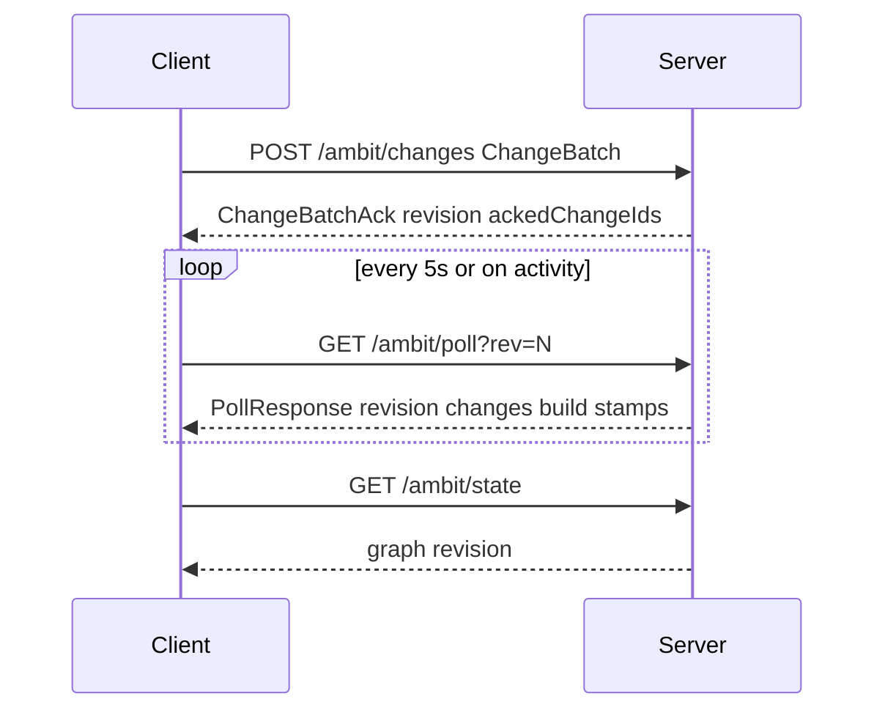

# HTTP API

## Status

| Section | Scope |
|---------|-------|
| **Implemented** | `/{pathname}/*` routes (production app at `/ambit`; see below) |
| **Target** | `/documents/{docId}` multi-document API (future design) |

For sync semantics and client behavior, see [[doc/sync-mvp.md]] and [[doc/arch.md]].

---

## Implemented API

The live server exposes JSON under a URL prefix derived from the app pathname (e.g. `/ambit/state` when the app is served at `/ambit`). The client builds paths as `/{pathname}/…` from `window.location.pathname` ([[src/Client/UpdateHelpers.fs]]). The server currently maps these routes to a single on-disk document name (`gambol`) via persistence agents.

### Sync model



- **`POST /changes`** returns an ack only (revision + `ackedChangeIds`), not the full graph.
- **`GET /state`** returns the full graph for initial load or resync.
- **`GET /poll`** returns revision, deploy/page build stamps, and a change tail when the client is behind.

There is **no** `POST /submit` (full graph in response) and **no** `POST /save` route. Persistence runs automatically after each accepted change (snapshot + append-only log on disk and/or PostgreSQL `changes` table). See [[doc/current/persistence-model.md]].

### Revision tracking

- **Revision**: monotonically increasing integer (`Revision`); server is authoritative.
- Each accepted change increments revision by one.
- **`Change.id`** is the **base revision** the change was built against; it must equal the server revision at apply time or the batch is rejected (`400`).
- **`Change.changeId`**: client-generated `Guid` per network submission; used for idempotent dedup (resubmitting the same `changeId` returns success without re-applying).

### Transaction log

The in-process `History` inside server state mirrors applied changes for undo/redo on the client. **Durable** history is separate:

| Mode | Authority | Durable log | Snapshot |
|------|-----------|-------------|----------|
| `file` | `data/{doc}.log` + snapshot | Append-only `.log` | Tab-indented outline + `.meta` revision |
| `db` | PostgreSQL | `changes` table | Optional file backup/export |

Configured via `Persistence:Mode` (`db` default, `file` rollback). See [[doc/arch.md]].

On startup, the server replays the log (and/or DB) from the last snapshot checkpoint.

### Authentication

When `Auth:Username` and `Auth:Password` are both non-empty in configuration:

| Method | Path | Purpose |
|--------|------|---------|
| `GET` | `/ambit/login` | Login page (`login.html`) |
| `POST` | `/ambit/login` | Form fields `username`, `password`; sets cookie, redirects to `/ambit` |
| `GET` | `/ambit/logout` | Clears cookie, redirects to `/ambit/login` |

Cookie name: `gambol_auth` (HttpOnly, SameSite=Strict). Value is HMAC-SHA256 of username keyed by password ([[src/Server/AuthToken.fs]]).

Protected routes (`GET /ambit`, `GET /ambit/state`, `GET /ambit/poll`, `POST /ambit/changes`) return **401 Unauthorized** when auth is enabled and the cookie is missing or invalid.

When both auth fields are empty, auth is disabled and all routes are open.

### Endpoints

| Method | Path | Purpose |
|--------|------|---------|
| `GET` | `/ambit` | HTML shell (`gambol.template.html`); redirects to `/ambit/login` if unauthenticated |
| `GET` | `/ambit/state` | Full graph + revision |
| `GET` | `/ambit/poll?rev={n}` | Revision, build stamps, change tail since `rev` |
| `POST` | `/ambit/changes` | Submit `ChangeBatch` |
| `GET` | `/ambit/user.css` | User stylesheet (`data/user.css` or default) |
| `GET` | `/ambit/*` (static) | Fable client assets (`Program.js`, CSS, etc.) |

**Deferred** (not implemented on server): `POST /undo`, `POST /redo`, `GET /ops?since={revision}`.

---

#### `GET /ambit/state`

**Response** (`200`, `application/json`):

```json
{
  "revision": 0,
  "graph": { "root": "…", "nodes": [ … ] }
}
```

- `graph.root`: canonical root node id.
- `graph.nodes`: array of `Node` objects (not a map).

---

#### `GET /ambit/poll`

**Query**: `rev` — client revision (default `0` if missing or invalid).

**Response** (`200`): compact keys from [[src/Shared/Serialization.fs]]:

```json
{
  "r": 2,
  "b": 1715788800,
  "p": 1715788800,
  "c": [ … ]
}
```

| Field | Meaning |
|-------|---------|
| `r` | Current server revision |
| `b` | Server/deploy build epoch (seconds, Unix) |
| `p` | Page/client artifact build epoch (seconds, Unix) |
| `c` | Changes after client `rev` (empty when up to date); omitted on older servers → treated as `[]` |

Client uses `b` / `p` to detect redeploy or stale bundles ([[doc/sync-mvp.md]]).

---

#### `POST /ambit/changes`

**Request** (`application/json`): `ChangeBatch`

```json
{
  "changes": [
    {
      "id": 0,
      "changeId": "550e8400-e29b-41d4-a716-446655440000",
      "ops": [ … ]
    }
  ]
}
```

- `changes` must be non-empty.
- Multiple changes in one batch are applied in order; all must succeed or none are applied (`400` on failure leaves state unchanged).

**Response** (`200`): `ChangeBatchAck`

```json
{
  "revision": 1,
  "ackedChangeIds": [ "550e8400-e29b-41d4-a716-446655440000" ]
}
```

- Does **not** include `graph`.
- Resubmitting the same `changeId` is idempotent: same revision and `ackedChangeIds`, no double-apply.

**Error** (`400`):

```json
{ "error": "Revision mismatch: server is at revision 1, but this change targets base revision 5." }
```

Other failures: invalid JSON, empty batch, invalid op, log write error.

---

## JSON encoding (implemented)

Types and codecs: [[src/Shared/Serialization.fs]]. Tests: [[tests/Server.Tests/StateEndpointTests.fs]].

### NodeId

GUID string (lowercase, no braces).

### ChildNode

```json
{ "ref": "owner", "id": "550e8400-e29b-41d4-a716-446655440000" }
```

`ref` is `"owner"` or `"ref"` ([[src/Shared/Serialization.fs]]).

### Node

```json
{
  "id": "550e8400-e29b-41d4-a716-446655440000",
  "text": "node text",
  "name": null,
  "children": [ { "ref": "owner", "id": "…" } ],
  "cssClasses": [],
  "kind": "normal"
}
```

- `kind`: `"normal"` or `{ "type": "special", "kind": "trash" }`.
- `cssClasses`: string list (optional; defaults to `[]`).

### Graph

```json
{
  "root": "550e8400-e29b-41d4-a716-446655440000",
  "nodes": [ { "id": "…", "text": "ROOT", … }, … ]
}
```

Canonical root node must exist with expected shape (see `decodeGraph` in Serialization).

### Op

| `type` | Fields |
|--------|--------|
| `NewNode` | `nodeId`, `text` |
| `SetText` | `nodeId`, `oldText`, `newText` |
| `SetClasses` | `nodeId`, `oldClasses`, `newClasses` (string arrays) |
| `Replace` | `parentId`, `index`, `oldChildren`, `newChildren` (`ChildNode` arrays) |

Example `Replace`:

```json
{
  "type": "Replace",
  "parentId": "550e8400-e29b-41d4-a716-446655440000",
  "index": 0,
  "oldChildren": [],
  "newChildren": [ { "ref": "owner", "id": "…" } ]
}
```

### Change

```json
{
  "id": 0,
  "changeId": "550e8400-e29b-41d4-a716-446655440000",
  "ops": [ … ]
}
```

- `id`: base revision (see Revision tracking).
- `changeId`: stable id for dedup across retries.

---

## Multi-client sync (implemented)

### Assumptions

- Small number of concurrent clients on one document.
- Server is authoritative; clients apply optimistically then sync.

### Client flow

1. **Initial load**: `GET /{pathname}/state` → graph + revision.
2. **Local edit**: build `Change` with `id` = current revision; apply locally; queue for POST.
3. **Submit**: `POST /{pathname}/changes` with `ChangeBatch`; on success update revision from ack (no graph in response).
4. **Poll**: `GET /{pathname}/poll?rev=N` on interval and after activity; apply `c` tail when behind.
5. **Resync**: if needed, `GET /{pathname}/state` for full graph.

Conflict handling: last-write-wins by server apply order; revision mismatch returns `400` (client must catch up via poll or state).

Undo/redo: client-local via inverted ops in batches; server undo/redo endpoints not wired.

---

## Error codes (implemented)

| Code | When |
|------|------|
| `200` | Success |
| `400` | Invalid batch, revision mismatch, invalid op, JSON decode error |
| `401` | Auth required and cookie missing/invalid |
| `500` | Startup/config failure (e.g. missing production config) |

---

## Notes

- GUIDs: lowercase strings without braces.
- Revision starts at `0` for a fresh document.
- Empty arrays are `[]`, not omitted, in requests.
- `POST /save` existed in early MVP docs only; `FileAgent` persists accepted changes synchronously, while `DbAgent` also maintains an asynchronous backup snapshot. Neither uses an HTTP save call.

---

## Target API (future)

Design for multi-document hosting and sequence-based concurrency. **Not implemented**; routes below do not exist on the current server.

### Data model

```
Node {
  id: NodeId (UUID)
  text: string
  name: string | null
  children: ChildHolder[]
}

ChildHolder = Owned(NodeId) | Ref(NodeId)

Graph {
  rootId: NodeId
  nodes: Map<NodeId, Node>
}
```

**Constraints:**
- Every node has exactly one Owned holder
- A node can have multiple Ref holders
- When an Owned holder is removed, an arbitrary Ref is promoted to Owned
- If no Refs exist, node is orphaned (moved to holding area)

---

### Concurrency model

- Server maintains a linear operation log
- Each changeset has a sequence number
- Client submits with `baseSequence`
- Server accepts if `baseSequence == currentSequence`, else rejects (409)
- On rejection, client rewinds, replays missed changesets, re-applies its change, retries

---

### Operations (target)

| Operation | Payload |
|-----------|---------|
| `CreateNodes` | `parentId`, `position`, `nodes[]` (recursive, with client-generated UUIDs) |
| `CreateReference` | `parentId`, `position`, `nodeId` |
| `RemoveNodes` | `parentId`, `range [m, n)` |
| `MoveNodes` | `sourceParentId`, `sourceRange [m, n)`, `destParentId`, `destPosition` |
| `EditNode` | `nodeId`, `text`, `name` |
| `SetMetadata` | `nodeId`, `key`, `value` |

---

### HTTP endpoints (target)

| Method | Path | Purpose |
|--------|------|---------|
| `GET` | `/documents/{docId}` | Full document state + current sequence |
| `GET` | `/documents/{docId}/operations?from={seq}&to={seq}` | Fetch operation range |
| `POST` | `/documents/{docId}/operations` | Submit changeset |

#### POST request

```json
{
  "changesetId": "uuid",
  "baseSequence": 42,
  "clientId": "uuid",
  "operations": [ … ]
}
```

#### POST response (200)

```json
{
  "sequence": 43
}
```

#### POST response (409)

```json
{
  "currentSequence": 47
}
```

#### GET `/documents/{docId}` response

```json
{
  "sequence": 47,
  "rootId": "uuid",
  "nodes": {
    "uuid": {
      "id": "uuid",
      "text": "…",
      "name": null,
      "children": [
        { "type": "Owned", "nodeId": "…" },
        { "type": "Ref", "nodeId": "…" }
      ]
    }
  }
}
```

---

### WebSocket (target)

**Connect:** `/documents/{docId}/ws?clientId={uuid}&fromSequence={seq}`

**Server pushes:**

```json
{
  "sequence": 44,
  "changesetId": "uuid",
  "clientId": "uuid",
  "operations": [ … ]
}
```

---

### Target deferred

- Undo/redo mechanism (server-side)
- Rebase logic after conflict
- MoveNodes validation (cycles, ownership)
- Orphan holding area structure
- Ref promotion selection logic
