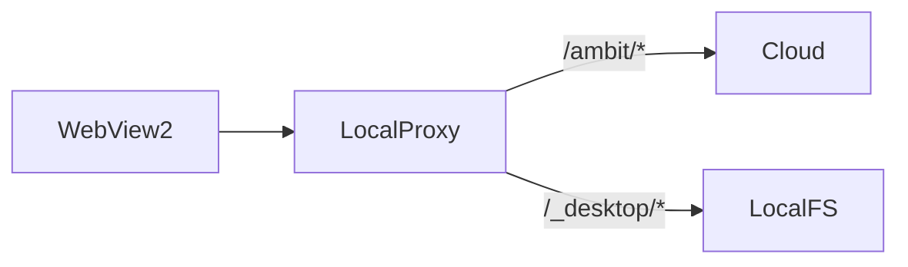

# Desktop local files

Category: Desktop
See also: [[doc/current/workspace-local-mapping.md]], [[doc/current/workspace-graph.md]], [[doc/arch.md]]

Implemented baseline for the Gambol desktop host: WPF WebView2 + local HTTP proxy in front of the
cloud API. The cloud server remains authoritative for the graph; the desktop adds loopback-only
filesystem access.

## Architecture



- **UI:** `Gambol.Desktop` (`src/Desktop/Desktop.fs`) — WebView2 loads the local proxy URL.
- **Proxy:** `src/Desktop/LocalProxy.fs` — forwards `/ambit/*` and static assets to the configured
  cloud base URL; handles `/_desktop/*` locally.
- **Auth:** `AuthStore.fs` stores cloud session cookie so the proxied app is authenticated.

Target URL resolution: `--local`, `--cloud`, `--target <url>`, or `GAMBOL_TARGET_URL`.

## Capabilities

`GET /_desktop/capabilities` returns JSON decoded by
[[src/Shared/DesktopCapabilities.fs]].

Desktop host enabled shape:

```json
{"file":{"open":false,"import":true,"export":true,"status":true,"workspacePaths":true}}
```

| Key | Meaning |
|-----|---------|
| `open` | Launch file with default application (not implemented) |
| `import` | Read local file into graph via import command |
| `export` | Write owned children to local file |
| `status` | Query path status for file-reference indicator |
| `workspacePaths` | Resolve `@label:relative` paths via local workspace mapping |

Web client (no desktop host): capabilities request fails; all flags treated as disabled.

## Endpoints

| Method | Path | Role |
|--------|------|------|
| `GET` | `/_desktop/capabilities` | Capability discovery |
| `POST` | `/_desktop/file-status` | Path status for active-row indicator |
| `GET` | `/_desktop/file?path=...` | Read local file or directory listing (import) |
| `POST` | `/_desktop/file` | Write content to local file (export) |

Legacy `/_desktop/import` and `/_desktop/export` are removed; clients use `/_desktop/file`.

### File status

`POST /_desktop/file-status` with `{ "path": "..." }`.

Response: `{ "path": "...", "status": "invalid" | "create" | "file" | "folder" }`.

Optional `sourceModifiedUtc` may be present when the path exists on disk.

The client requests status when the active row has a valid `[[path]]` or workspace path reference
and `status` capability is enabled. Indicator text: `...`, `invalid`, `create`, `file`, `folder`.

### File read (import)

`GET /_desktop/file?path=<url-encoded-path>`

- **File:** returns `DesktopImportPackage` JSON for the client to apply via normal cloud sync.
- **Directory:** returns a synthetic listing (one `[[name]]` line per entry) as import package
  with `isDirectory: true`.

### File write (export)

`POST /_desktop/file` with `{ "path": "...", "content": "..." }`.

Writes tab-indented child text to a local file. Rejects directories. Response:
`{ "path": "..." }`.

## Path forms

Resolved by `LocalProxy` using process current directory and workspace mapping
(see [[doc/current/workspace-local-mapping.md]]):

| Form | Example |
|------|---------|
| Wikilink relative | `note.txt` from `[[note.txt]]` |
| Absolute | `D:\projects\doc.md` |
| Workspace-relative | `@home:src/lib.fs` |

## Client commands

Registered in `src/Client/Controller.fs`:

- **Import** — reads local file at the focus row's first file reference; replaces that node's
  children (via `UpdateImport.fs`, `GET /_desktop/file`).
- **Export** — serializes owned children of the focus row to the local file at its file reference
  (via `UpdateExport.fs`, `POST /_desktop/file`).

Both require matching desktop capabilities (`import` / `export`) and are blocked during command
palette, search dialog, and CSS-class prompt modes.

## Config

Workspace label → local root mappings: `%LocalAppData%/Gambol/config.json`.
Loaded at proxy startup. See [[doc/current/workspace-local-mapping.md]].

WebView2 user data: `%LocalAppData%/Gambol/WebView2`.

## Not implemented

- Open file or workspace root in system explorer.
- Startup workspace registration (sync local config labels to cloud graph).
- Full workspace filesystem API (`GET workspaces`, dir/file CRUD with `modifiedUtc` conflicts) —
  see [[doc/roadmap/workspace-stage-plan.md]] §4.
- `open` capability (launch file with default application).
