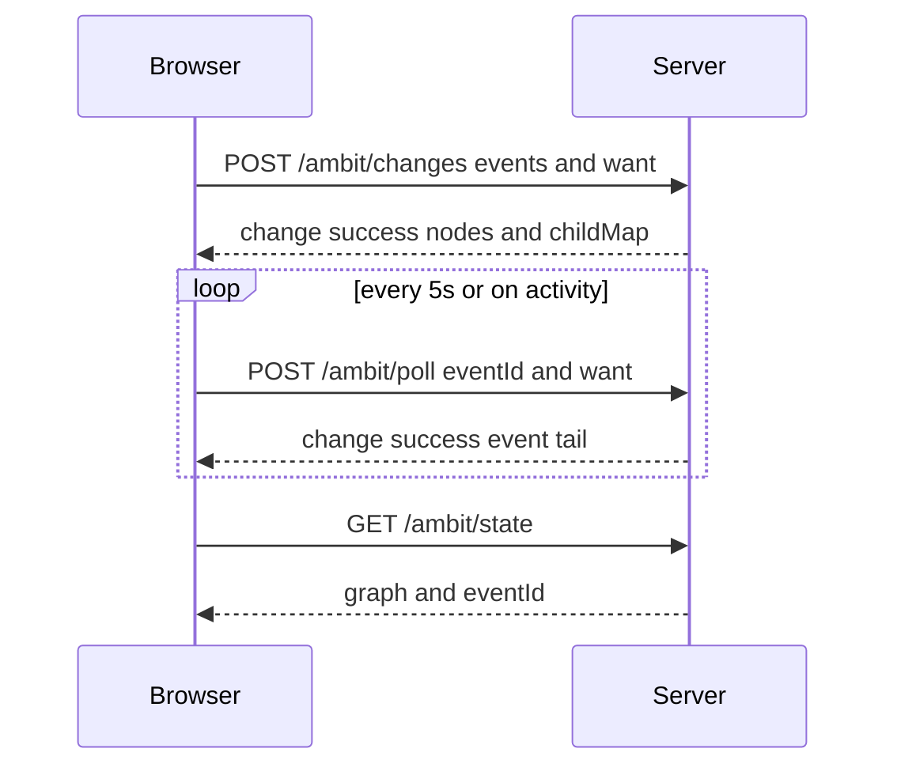

# HTTP contract

Category: Contract
See Also: [Multi-client sync](sync-mvp.md), [Browser](browser.md), [Persistence model](persistence-model.md)

The HTTP contract is the JSON contract between the Browser and the Server under the app pathname.

API expansion. Contract rule: expand, then migrate, then contract. Expand ships the new Event body on the events door beside the old route. Migrate moves the caller while both exist. Connected Events stay in one ordered stream. No new side-channel route is added. Contract removes the old route only after no caller uses it. A new capability is a new EventBody case on `POST /ambit/changes` (alias `POST /ambit/events`). It is not a new POST route. A posted list is applied in order, as one unit; lists from different clients do not interleave. The only rejection is the credential check. That check refuses the whole list before anything applies. Otherwise every posted list applies whole. Home: [API expansion](api.md#api-expansion).

1. [x] Events door — `POST /ambit/changes` and `POST /ambit/events` are the same handler. Run and Cancel are events on that door. `POST /ambit/command` and `POST /ambit/cancel` are removed.

## Sources

[API responses](../../src/Shared/ApiResponses.fs)
[API response serialization](../../src/Shared/ApiResponseSerialization.fs)
[Serialization](../../src/Shared/Serialization.fs)
[Event JSON](../../src/Shared/EventJson.fs)
[Route registration](../../src/Server/RouteRegistration.fs)

## 1. Parties

### 1.1 Browser

1. [x] **Browser.** The Browser is the client party. It loads state, submits events, and polls.
2. [x] **Path builder.** The Browser builds paths as `/{pathname}/…` from `window.location.pathname`. The code is [Update helpers](../../src/Client/UpdateHelpers.fs).

### 1.2 Server

1. [x] **Server.** The Server is the authority party. It registers JSON routes under `/ambit`.
2. [x] **Prefix example.** When the app is served at `/ambit`, state is `GET /ambit/state`.

## 2. Operations

1. [x] **Implemented scope.** Implemented routes in this contract are `/ambit/…`.
2. [ ] **Target scope.** The multi-document API is `/documents/{docId}`. Concurrency is sequence-based.

### 2.1 Sync model



1. [x] **Poll loop.** The Browser calls poll on a 5 second interval. Window focus and a return to a visible page also call poll. Pointer, key, wheel, touch, and scroll wake a poll when polling is inactive.
2. [x] **Post changes.** `POST /ambit/changes` returns the change-success envelope. The Browser reconciles that response on the post path.
3. [x] **Get state.** `GET /ambit/state` returns the graph for the initial load or a resync.
4. [x] **Post poll.** `POST /ambit/poll` returns the same success envelope with the event tail after the client event id.
5. [x] **Post load.** `POST /ambit/load` returns the load envelope for selected targets.
6. [x] **Automatic persistence.** The database keeps graph and event info. See [Persistence model](persistence-model.md).

### 2.2 Event id

1. [x] **Event id.** `eventId` is an integer. The Server assigns a positive id when it stores an event.
2. [x] **Draft id.** A posted event sends `eventId` `0`. Any other posted `eventId` is `400`.
3. [x] **submissionId.** `submissionId` is a client `Guid`. The same `submissionId` returns the stored event and does not append a second event. The response field `r` stays the current snapshot event id.
4. [x] **Cursor.** Poll and load send the client event id. The success field `r` is the server event id.
5. [ ] **Accept rule.** The Server accepts the changeset when `baseSequence` equals `currentSequence`. Otherwise it rejects the changeset with `409`.
6. [ ] **Operation log.** The Server keeps a linear operation log.
7. [ ] **Sequence number.** Each changeset has a sequence number.
8. [ ] **baseSequence.** The client submits `baseSequence`.
9. [ ] **Client retry.** On rejection, the client rewinds, replays the missed changesets, applies its change again, and retries.

### 2.3 Transaction log

1. [x] **In-process history.** The in-process `History` in server state mirrors applied changes for undo and redo on the client.
2. [x] **Durable history.** Durable history is separate from that in-process history.
3. [x] **Database.** The database keeps graph and event info. The durable log is the `changes` table. See [Persistence model](persistence-model.md).
4. [x] **Startup.** The program can start with the database offline. It reads file data and recreates a partial graph. That partial graph is not used for editing.

### 2.4 Authentication

1. [x] **Auth switch.** Auth is on when `Auth:Username` and `Auth:Password` are both non-empty.
2. [x] **Login page.** `GET /ambit/login` returns `200` and `text/html` (`login.html`).
3. [x] **Login post.** `POST /ambit/login` reads form fields `username` (string) and `password` (string).
4. [x] **Login success.** A match redirects `302` to `/ambit` and sets the cookie.
5. [x] **Login failure.** A mismatch redirects `302` to `/ambit/login?error=1`.
6. [x] **Logout.** `GET /ambit/logout` clears the cookie and redirects `302` to `/ambit/login`.
7. [x] **Cookie.** The cookie name is `gambol_auth`. The cookie is HttpOnly, SameSite=Lax, and Secure. The value is HMAC-SHA256 of the username, keyed by the password. The code is [Auth token](../../src/Shared/dotnet/AuthToken.fs).
8. [x] **Protected routes.** When the cookie is missing, or the mailbox does not admit the caller, `GET /ambit/state`, `POST /ambit/poll`, `POST /ambit/load`, `POST /ambit/changes`, `POST /ambit/events`, and `POST /ambit/search` return `401` with an empty body.
9. [x] **Empty auth settings.** When both auth fields are empty, `GET /ambit` admits a session and sets `gambol_auth`. The protected routes in item 8 still return `401` when that cookie is missing.

### 2.5 Endpoints

1. [x] **HTML shell.** `GET /ambit` returns the HTML shell (`gambol.template.html`). It redirects to `/ambit/login` when the caller is not authenticated.
2. [x] **State.** `GET /ambit/state` returns the graph and the event id.
3. [x] **Poll.** `POST /ambit/poll` reads `eventId` and `want` from the JSON body.
4. [x] **Changes.** `POST /ambit/changes` submits events and a want list.
5. [x] **Events alias.** `POST /ambit/events` uses the same handler as `POST /ambit/changes`.
6. [x] **Load.** `POST /ambit/load` submits an event id and load targets.
7. [x] **Git save.** `POST /ambit/save` commits a git save. The request has no JSON body.
8. [x] **User CSS.** `GET /ambit/user.css` returns `200` and `text/css` from `{dataDir}/SYSTEM/user.css` when that file exists, otherwise from wwwroot `user.css`. When neither file exists the status is `204`.
9. [x] **Static files.** `GET /ambit/*` returns Fable client assets (`Program.js`, CSS, and the other static files).
10. [x] **Absent sync routes.** `POST /submit`, `POST /undo`, `POST /redo`, and `GET /ops?since={revision}` are absent.
11. [x] **Deliver.** Inbound agent text is [AI agent protocol](ai-agent-protocol.md).
12. [x] **Document routes absent.** The `/documents/{docId}` routes below do not exist on the current server.
13. [ ] **Get document.** `GET /documents/{docId}` returns the full document state and the current sequence.
14. [ ] **Get operations.** `GET /documents/{docId}/operations?from={seq}&to={seq}` returns that operation range.
15. [ ] **Post operations.** `POST /documents/{docId}/operations` submits a changeset.
16. [ ] **Post operations body.** The request body is `changesetId`, `baseSequence`, `clientId`, and `operations`.

```json
{
  "changesetId": "uuid",
  "baseSequence": 42,
  "clientId": "uuid",
  "operations": [ … ]
}
```

17. [ ] **Post operations success.** A `200` response body is the new sequence.

```json
{
  "sequence": 43
}
```

18. [ ] **Post operations conflict.** A `409` response body is the current sequence.

```json
{
  "currentSequence": 47
}
```

19. [ ] **Get document body.** `GET /documents/{docId}` returns `sequence`, `rootId`, and a `nodes` map. Each child is `{ "type": "Owned", "nodeId" }` or `{ "type": "Ref", "nodeId" }`.

```json
{
  "sequence": 47,
  "rootId": "uuid",
  "nodes": {
    "uuid": {
      "id": "uuid",
      "text": "…",
      "name": null,
      "children": [
        { "type": "Owned", "nodeId": "…" },
        { "type": "Ref", "nodeId": "…" }
      ]
    }
  }
}
```

### 2.6 GET /ambit

1. [x] **Method and path.** `GET /ambit`.
2. [x] **Auth on.** A missing or invalid session redirects `302` to `/ambit/login`.
3. [x] **Auth off.** Empty auth settings admit a session, set `gambol_auth`, and return the shell. When that login returns an error, the response is `302` to `/ambit/login`.
4. [x] **Query debug.** `debug` is an optional string. The value `1` selects `Program.js`. Any other value, or a missing `debug`, selects `Program.bundle.js`.
5. [x] **Success.** `200` and `text/html`. The body is `gambol.template.html` with the build script injected. Cache-Control is `no-cache, no-store, must-revalidate`.

### 2.7 GET /ambit/state

1. [x] **Method and path.** `GET /ambit/state`.
2. [x] **Cookie.** `gambol_auth` is required. A missing cookie is `401` with an empty body.
3. [x] **Query scope.** `scope` is an optional string. The value `full` returns the full graph. Any other value, or a missing `scope`, returns the root closure.
4. [x] **Query zoom.** `zoom` is an optional GUID string. A value that does not parse is ignored.
5. [x] **Success.** `200` and `application/json`.

```json
{
  "eventId": 0,
  "graph": {
    "root": "00000000-0000-0000-0000-000000000000",
    "nodes": [
      {
        "id": "00000000-0000-0000-0000-000000000000",
        "text": "ROOT",
        "name": null,
        "cssClasses": [],
        "kind": "normal",
        "documentState": "current",
        "parseState": "parsed",
        "persistState": "persisted",
        "updateTime": 0
      }
    ],
    "childMap": []
  },
  "ready": true,
  "liveFocusIds": []
}
```

6. [x] **eventId.** `eventId` is an integer.
7. [x] **graph.** `graph` is a Graph object.
8. [x] **ready.** `ready` is a boolean.
9. [x] **liveFocusIds.** `liveFocusIds` is an array of Node id strings. The field may be empty.
10. [x] **Failure.** A handler error whose text starts with `Internal server error` is `500` and `text/plain`. Other handler errors are `400` and `{ "error": "<text>" }`.

### 2.8 POST /ambit/poll

1. [x] **Method and path.** `POST /ambit/poll`.
2. [x] **Cookie.** `gambol_auth` is required. A missing cookie is `401` with an empty body.
3. [x] **Content type.** The request body is `application/json`.
4. [x] **Poll request.** The body is a Poll request.

```json
{
  "eventId": 0,
  "want": [ "550e8400-e29b-41d4-a716-446655440000" ]
}
```

5. [x] **eventId.** `eventId` is an integer. It is the client cursor.
6. [x] **want.** `want` is an array of Node id strings. The array is required. It may be empty.
7. [x] **Success.** `200` and `application/json`. The body is the change-success envelope.

```json
{
  "r": 2,
  "b": 1715788800,
  "p": 1715788800,
  "v": 13,
  "ready": true,
  "externalChanges": false,
  "c": [],
  "nodes": [],
  "childMap": []
}
```

8. [x] **Field r.** `r` is the server event id, an integer.
9. [x] **Field b.** `b` is the process start time, in Unix seconds.
10. [x] **Field p.** `p` is the latest write time of the page artifacts in wwwroot, in Unix seconds. When those files are missing, `p` is the server assembly write time.
11. [x] **Field v.** `v` is the API version integer.
12. [x] **Field ready.** `ready` is a boolean.
13. [x] **Field externalChanges.** On poll, `externalChanges` is `true` when `c` has one or more events.
14. [x] **Field c.** `c` is the events after the client `eventId`. The field is required. It may be empty. Each item is an Event object.
15. [x] **Field nodes.** `nodes` is the want-answer Node array. The field is required. It may be empty.
16. [x] **Field childMap.** `childMap` is the want-answer edge array. The field is required. It may be empty.
17. [x] **Field message.** `message` is an optional string. Poll omits it.
18. [x] **Field bootstrapHash.** `bootstrapHash` is an optional string. Poll omits it.
19. [x] **Decode failure.** An invalid body is `400`.

```json
{ "error": "Invalid poll request: …" }
```

20. [x] **Other failure.** A handler error is `400` and `{ "error": "<text>" }`, or `401` when the text is an auth refusal, or `500` `text/plain` when the text starts with `Internal server error`.

### 2.9 POST /ambit/changes

1. [x] **Method and path.** `POST /ambit/changes`. `POST /ambit/events` is the same handler.
2. [x] **Cookie.** `gambol_auth` is required. A missing cookie is `401` with an empty body.
3. [x] **Header.** `X-Gambol-Client` is an optional string. The server trims it and keeps at most 120 characters.
4. [x] **Content type.** The request body is `application/json`.
5. [x] **Changes request.** The body is events plus want.

```json
{
  "events": [
    {
      "eventId": 0,
      "submissionId": "550e8400-e29b-41d4-a716-446655440000",
      "authority": "Browser",
      "commandName": "Run command",
      "body": {
        "kind": "change",
        "ops": [
          {
            "type": "SetText",
            "nodeId": "550e8400-e29b-41d4-a716-446655440001",
            "oldText": "a",
            "newText": "b"
          }
        ]
      }
    }
  ],
  "want": []
}
```

6. [x] **events.** `events` is an array of Event objects. Each posted `eventId` is `0`. An empty `events` array is `400`.

```json
{ "error": "events must not be empty" }
```

7. [x] **Apply order.** The posted list is one mailbox message. The server applies it in order. A credential refusal applies nothing. A client ActorStop applies nothing. A launch bookkeeping error returns that error; earlier events in the list stay stored.
8. [x] **want.** `want` is an array of Node id strings. The array is required. It may be empty.
9. [x] **Success.** `200` and `application/json`. The body uses the same change-success codec as poll.

```json
{
  "r": 1,
  "b": 1715788800,
  "p": 1715788800,
  "v": 13,
  "ready": true,
  "externalChanges": false,
  "c": [
    {
      "eventId": 1,
      "submissionId": "550e8400-e29b-41d4-a716-446655440000",
      "authority": "Browser",
      "commandName": "Run command",
      "body": {
        "kind": "change",
        "ops": [
          {
            "type": "SetText",
            "nodeId": "550e8400-e29b-41d4-a716-446655440001",
            "oldText": "a",
            "newText": "b"
          }
        ]
      }
    }
  ],
  "nodes": [],
  "childMap": []
}
```

10. [x] **Field c.** `c` contains the stored events for this post, then any later events through the snapshot.
11. [x] **Field externalChanges.** `externalChanges` is a boolean from the accept result, or `true` when later events exist.
12. [x] **Field message.** `message` is present only when artifact persistence returns a status string.
13. [x] **Want answer.** `nodes` and `childMap` are the want answer. The body has no `graph` field.
14. [x] **Idempotent submissionId.** The same `submissionId` returns the stored event and does not append again. `r` is the current snapshot event id.
15. [x] **Draft event id.** A posted `eventId` other than `0` is `400`.

```json
{ "error": "posted EventId must be zero" }
```

16. [x] **Invalid JSON.** A body that fails decode is `400`.

```json
{ "error": "Invalid JSON: …" }
```

### 2.10 POST /ambit/load

1. [x] **Method and path.** `POST /ambit/load`.
2. [x] **Cookie.** `gambol_auth` is required. A missing cookie is `401` with an empty body.
3. [x] **Content type.** The request body is `application/json`.
4. [x] **Load request.** The body is an event id and targets.

```json
{
  "eventId": 0,
  "targets": [
    {
      "targetId": "550e8400-e29b-41d4-a716-446655440000",
      "includeWorkspace": true
    }
  ]
}
```

5. [x] **eventId.** `eventId` is an integer.
6. [x] **targets.** `targets` is an array. Each item has `targetId` (Node id string) and `includeWorkspace` (boolean).
7. [x] **Success.** `200` and `application/json`.

```json
{
  "r": 2,
  "b": 1715788800,
  "p": 1715788800,
  "v": 13,
  "ready": true,
  "c": [],
  "nodes": [],
  "childMap": []
}
```

8. [x] **Load fields.** `r`, `b`, `p`, `v`, and `ready` match the change-success stamps. `c` is the event tail. `nodes` and `childMap` are the target answer.
9. [x] **Decode failure.** An invalid body is `400`.

```json
{ "error": "Invalid load request: …" }
```

10. [x] **One workspace.** Targets that span more than one Workspace are `400`.

```json
{ "error": "Load requires all selected targets in one Workspace" }
```

### 2.11 POST /ambit/save

1. [x] **Method and path.** `POST /ambit/save`.
2. [x] **Cookie.** `gambol_auth` is required. A missing or unadmitted cookie is `401` with an empty body.
3. [x] **Header.** `X-Gambol-Client` is an optional string. The commit message can include it.
4. [x] **Body.** The handler does not read a JSON body.
5. [x] **Disabled.** When the data directory is not a git repo, the status is `200` and `application/json`.

```json
{ "ok": false, "detail": "", "error": "Git save is not enabled." }
```

6. [x] **Success.** A commit returns `200` and `application/json`. `ok` is `true`. `detail` is a string. `error` is omitted.
7. [x] **Commit failure.** A prepare or commit error is `400`. The body is `ok` `false`, `detail` `""`, and `error` as a string.

### 2.12 JSON encoding

1. [x] **Codecs.** Change-success, poll, changes, and load codecs are [API responses](../../src/Shared/ApiResponses.fs) and [API response serialization](../../src/Shared/ApiResponseSerialization.fs). Domain codecs are [Serialization](../../src/Shared/Serialization.fs). Event codecs are [Event JSON](../../src/Shared/EventJson.fs).

#### 2.12.1 NodeId

1. [x] **NodeId.** A `NodeId` is a GUID string. The string is lowercase and has no braces.

#### 2.12.2 ChildNode

1. [x] **ChildNode.** A child is `ref` plus `id`.

```json
{ "ref": "owner", "id": "550e8400-e29b-41d4-a716-446655440000" }
```

2. [x] **ref values.** `ref` is `"owner"` or `"ref"`.
3. [ ] **ChildHolder.** A child is a `ChildHolder`: `Owned(NodeId)` or `Ref(NodeId)`.

#### 2.12.3 Node

1. [x] **Node.** A node has `id`, `text`, `name`, `cssClasses`, `kind`, `documentState`, `parseState`, `persistState`, and `updateTime`.

```json
{
  "id": "550e8400-e29b-41d4-a716-446655440000",
  "text": "node text",
  "name": null,
  "cssClasses": [],
  "kind": "normal",
  "documentState": "current",
  "parseState": "parsed",
  "persistState": "persisted",
  "updateTime": 0
}
```

2. [x] **name.** `name` is a string or `null`.
3. [x] **cssClasses.** `cssClasses` is a string array. On decode it is optional and the default is `[]`.
4. [x] **kind.** `kind` is `"normal"` or `{ "type": "special", "kind": "<special>" }`.
5. [x] **special kind.** `<special>` is `"workspaces"`, `"workspace"`, `"directory"`, or `"file"`.
6. [x] **documentState.** `documentState` is `"current"`, `"unparsed"`, or `"noServerFile"`.
7. [x] **parseState.** `parseState` is `"parsed"` or `"unparsed"`.
8. [x] **persistState.** `persistState` is `"persisted"` or `"unpersisted"`.
9. [x] **updateTime.** `updateTime` is an integer tick count.
10. [ ] **Target node.** A node has `id` (`NodeId`, UUID), `text` (string), `name` (string or null), and `children` (`ChildHolder` array).

#### 2.12.4 Graph

1. [x] **Canonical root.** `root` is the canonical root id `00000000-0000-0000-0000-000000000000`. The root node text is `ROOT`. See `decodeGraph` in [Serialization](../../src/Shared/Serialization.fs).
2. [x] **Graph.** A graph has `root`, a `nodes` array, and a `childMap` array.

```json
{
  "root": "00000000-0000-0000-0000-000000000000",
  "nodes": [],
  "childMap": [
    {
      "parent": "00000000-0000-0000-0000-000000000000",
      "children": [
        { "ref": "owner", "id": "550e8400-e29b-41d4-a716-446655440000" }
      ]
    }
  ]
}
```

3. [x] **childMap item.** `parent` is a Node id string. `children` is a ChildNode array. An empty `children` array is a loaded leaf.
4. [ ] **Target graph.** A graph has `rootId` (`NodeId`) and `nodes` (`Map<NodeId, Node>`).

```
Node {
  id: NodeId (UUID)
  text: string
  name: string | null
  children: ChildHolder[]
}

ChildHolder = Owned(NodeId) | Ref(NodeId)

Graph {
  rootId: NodeId
  nodes: Map<NodeId, Node>
}
```

5. [ ] **One owner.** Every node has exactly one Owned holder.
6. [ ] **Many refs.** A node can have more than one Ref holder.
7. [ ] **Ref promotion.** When an Owned holder is removed, an arbitrary Ref is promoted to Owned.
8. [ ] **Orphan.** When no Ref exists, the node is orphaned and moves to a holding area.

#### 2.12.5 Event

1. [x] **Event.** An event has `eventId`, `submissionId`, `authority`, `commandName`, and `body`.

```json
{
  "eventId": 1,
  "submissionId": "550e8400-e29b-41d4-a716-446655440000",
  "authority": "Browser",
  "commandName": "Run command",
  "body": { "kind": "change", "ops": [] }
}
```

2. [x] **eventId.** `eventId` is an integer.
3. [x] **submissionId.** `submissionId` is a GUID string.
4. [x] **authority.** `authority` is a string.
5. [x] **commandName.** `commandName` is a string.
6. [x] **Change body.** `body.kind` `"change"` has `ops`, an Op array.
7. [x] **Undo body.** `body.kind` `"undo"` has `target` (integer event id) and `ops`.
8. [x] **Redo body.** `body.kind` `"redo"` has `target` (integer event id) and `ops`.

#### 2.12.6 Op

1. [x] **NewNode.** `NewNode` has `nodeId` and `text`.
2. [x] **SetText.** `SetText` has `nodeId`, `oldText`, and `newText`.
3. [x] **SetClasses.** `SetClasses` has `nodeId`, `oldClasses`, and `newClasses`. The class fields are string arrays.
4. [x] **Replace.** `Replace` has `parentId`, `oldChildren`, and `newChildren`. The child fields are `ChildNode` arrays.

```json
{
  "type": "Replace",
  "parentId": "550e8400-e29b-41d4-a716-446655440000",
  "oldChildren": [],
  "newChildren": [ { "ref": "owner", "id": "550e8400-e29b-41d4-a716-446655440001" } ]
}
```

5. [x] **NewSpecialNode.** `NewSpecialNode` has `nodeId`, `kind`, and `name`. `kind` is a special-kind string.
6. [x] **SetName.** `SetName` has `nodeId`, `oldName`, and `newName`.
7. [x] **SetDocumentState.** `SetDocumentState` has `nodeId`, `oldState`, and `newState`.
8. [x] **SetUpdateTime.** `SetUpdateTime` has `nodeId`, `oldTime`, and `newTime`. The time fields are integer ticks.
9. [ ] **CreateNodes.** `CreateNodes` has `parentId`, `position`, and `nodes[]`. The nodes are recursive and use client-generated UUIDs.
10. [ ] **CreateReference.** `CreateReference` has `parentId`, `position`, and `nodeId`.
11. [ ] **RemoveNodes.** `RemoveNodes` has `parentId` and `range [m, n)`.
12. [ ] **MoveNodes.** `MoveNodes` has `sourceParentId`, `sourceRange [m, n)`, `destParentId`, and `destPosition`.
13. [ ] **EditNode.** `EditNode` has `nodeId`, `text`, and `name`.
14. [ ] **SetMetadata.** `SetMetadata` has `nodeId`, `key`, and `value`.

### 2.13 Multi-client sync

#### 2.13.1 Assumptions

1. [x] **Few clients.** A small number of clients use one document at the same time.
2. [x] **Optimistic clients.** The Server is authoritative. Clients apply locally, then sync.

#### 2.13.2 Client flow

1. [x] **Initial load.** `GET /ambit/state` returns the graph and the event id.
2. [x] **Local edit.** The client builds an event whose `eventId` is `0` and whose `submissionId` is new.
3. [x] **Submit.** `POST /ambit/changes` sends `events` and `want`. On success the client reads `r`, `c`, `nodes`, and `childMap`.
4. [x] **Poll.** `POST /ambit/poll` sends `eventId` and `want` on the poll loop. The client applies the `c` tail when it is behind.
5. [x] **Resync.** When a resync is needed, `GET /ambit/state` returns the graph.
6. [x] **Conflicts.** Conflict handling is last-write-wins, in server apply order. Detail: [Multi-client sync](sync-mvp.md).
7. [x] **Undo.** Undo and redo are client-local. The client posts undo and redo events. Server undo and redo endpoints are absent.

### 2.14 Error codes

1. [x] **200.** `200` means success for state, poll, changes, events, load, and a git-save result body.
2. [x] **302.** `302` means login, logout, or the shell auth redirect.
3. [x] **400.** `400` means a JSON decode error, a posted `eventId` other than `0`, a load that spans workspaces, or another handler error string.
4. [x] **401.** `401` means the cookie is missing, the mailbox does not admit the caller, or the handler error text is `Unauthorized`. The body is empty.
5. [x] **500.** A handler error whose text starts with `Internal server error` is `500` and `text/plain`. A startup failure or a missing production config is `500` and `text/html`.

### 2.15 Notes

1. [x] **GUID text.** GUID strings are lowercase and have no braces.
2. [x] **Fresh event id.** The event id is `0` before the first stored event.
3. [x] **Empty arrays.** In requests, an empty array is `[]`. The client sends the key.

### 2.16 WebSocket

1. [x] **WebSocket absent.** `/documents/{docId}/ws` is not on the current server.
2. [ ] **Connect.** The client connects to `/documents/{docId}/ws?clientId={uuid}&fromSequence={seq}`.
3. [ ] **Server push.** The Server pushes `sequence`, `changesetId`, `clientId`, and `operations`.

```json
{
  "sequence": 44,
  "changesetId": "uuid",
  "clientId": "uuid",
  "operations": [ … ]
}
```

### 2.17 Target deferred

1. [x] **Server undo.** The contract does not specify a server-side undo and redo mechanism.
2. [x] **Rebase.** The contract does not specify rebase logic after a conflict.
3. [x] **MoveNodes validation.** The contract does not specify `MoveNodes` validation for cycles and ownership.
4. [x] **Orphan holding area.** The contract does not specify the orphan holding-area structure.
5. [x] **Ref promotion selection.** The contract does not specify the ref-promotion selection logic.

### 2.18 POST /ambit/search

1. [x] **Method and path.** `POST /ambit/search`.
2. [x] **Cookie.** `gambol_auth` is required. A missing or unadmitted cookie is `401` with an empty body.
3. [x] **Body.** JSON `text` (string) and `startId` (Node id). Optional `generation` (number) is the reply match when it is present. Detail: [Search Actor](search-actor.md).
4. [x] **Success.** `200` and `application/json`. The body has `ids` (at most 200 Node ids) and either `text` or `generation`.
5. [x] **One reply.** The handler reads the server graph, runs the client search algorithm once, and returns that reply. There is no continuation cursor.
