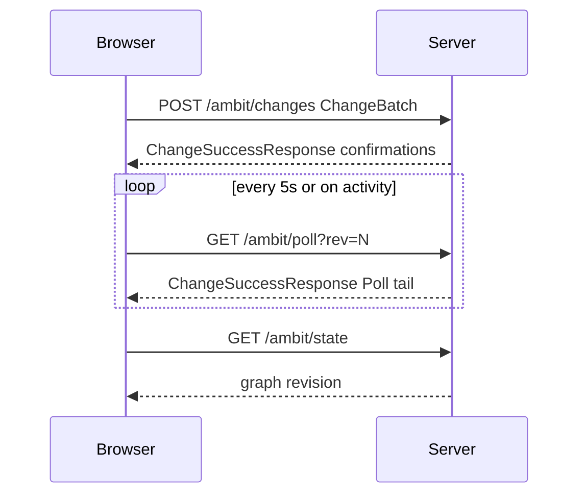

# HTTP contract

Category: Contract
See Also: [Multi-client sync](sync-mvp.md), [Browser](browser.md), [Persistence model](persistence-model.md)

The HTTP contract is the JSON contract between the Browser and the Server under the app pathname.

## 1. Parties

### 1.1 Browser

1. [x] **Browser.** The Browser is the client party. It loads state, submits changes, and polls.
2. [x] **Path builder.** The Browser builds paths as `/{pathname}/…` from `window.location.pathname`. The code is [Update helpers](../../src/Client/UpdateHelpers.fs).

### 1.2 Server

1. [x] **Server.** The Server is the authority party. It exposes JSON under a URL prefix taken from the app pathname.
2. [x] **Prefix example.** When the app is served at `/ambit`, state is `/ambit/state`.

## 2. Operations

1. [x] **Implemented scope.** Implemented routes are `/{pathname}/*`. The production app is at `/ambit`.
2. [ ] **Target scope.** The multi-document API is `/documents/{docId}`. Concurrency is sequence-based.

### 2.1 Sync model



1. [x] **Poll loop.** The Browser polls every 5 seconds or on activity.
2. [x] **Post changes.** `POST /changes` returns the complete Change success envelope. The envelope has confirmation Changes and `externalChanges = false`. It does not return the full Graph. On this path the Browser uses only confirmation reconciliation.
3. [x] **Get state.** `GET /state` returns the full graph for the initial load or a resync.
4. [x] **Get poll.** `GET /poll` returns the same success envelope with a Change tail when the Browser is behind.
5. [x] **No submit or save.** There is no `POST /submit` (full graph in the response) and no `POST /save` route.
6. [x] **Automatic persistence.** The database keeps graph and event info. See [Persistence model](persistence-model.md).

### 2.2 Revision tracking

1. [x] **Revision.** `Revision` is a monotonically increasing integer. The Server is authoritative.
2. [x] **Increment.** Each accepted change increments the revision by one.
3. [x] **Change id.** `Change.changeId` is a client-generated `Guid` for one network submission. The same `changeId` submitted again returns success and does not apply the change a second time.
4. [x] **Base revision.** `Change.id` is the base revision the change was built against. It must equal the server revision at apply time. If it does not, the batch is rejected with `400`.
5. [ ] **Accept rule.** The Server accepts the changeset when `baseSequence` equals `currentSequence`. Otherwise it rejects the changeset with `409`.
6. [ ] **Operation log.** The Server keeps a linear operation log.
7. [ ] **Sequence number.** Each changeset has a sequence number.
8. [ ] **baseSequence.** The client submits `baseSequence`.
9. [ ] **Client retry.** On rejection, the client rewinds, replays the missed changesets, applies its change again, and retries.

### 2.3 Transaction log

1. [x] **In-process history.** The in-process `History` in server state mirrors applied changes for undo and redo on the client.
2. [x] **Durable history.** Durable history is separate from that in-process history.
3. [x] **Database.** The database keeps graph and event info. The durable log is the `changes` table. See [Persistence model](persistence-model.md).
4. [x] **Startup.** The program can start with the database offline. It reads file data and recreates a partial graph. That partial graph is not used for editing.

### 2.4 Authentication

1. [x] **Auth switch.** Auth is on when `Auth:Username` and `Auth:Password` are both non-empty.
2. [x] **Login page.** `GET /ambit/login` returns the login page (`login.html`).
3. [x] **Login post.** `POST /ambit/login` reads form fields `username` and `password`, sets the cookie, and redirects to `/ambit`.
4. [x] **Logout.** `GET /ambit/logout` clears the cookie and redirects to `/ambit/login`.
5. [x] **Cookie.** The cookie name is `gambol_auth`. The cookie is HttpOnly, SameSite=Lax, and Secure. The value is HMAC-SHA256 of the username, keyed by the password. The code is [Auth token](../../src/Shared/dotnet/AuthToken.fs).
6. [x] **Protected routes.** When auth is on, `GET /ambit`, `GET /ambit/state`, `GET /ambit/poll`, and `POST /ambit/changes` return `401 Unauthorized` when the cookie is missing or invalid.
7. [x] **Auth off.** When both auth fields are empty, auth is off and every route is open.

### 2.5 Endpoints

1. [x] **HTML shell.** `GET /ambit` returns the HTML shell (`gambol.template.html`). It redirects to `/ambit/login` when the caller is not authenticated.
2. [x] **State.** `GET /ambit/state` returns the full graph and the revision.
3. [x] **Poll.** `GET /ambit/poll?rev={n}` returns the revision, the build stamps, and the change tail since `rev`.
4. [x] **Changes.** `POST /ambit/changes` submits a `ChangeBatch`.
5. [x] **User CSS.** `GET /ambit/user.css` returns the user stylesheet (`data/user.css` or the default).
6. [x] **Static files.** `GET /ambit/*` returns Fable client assets (`Program.js`, CSS, and the other static files).
7. [x] **Not on the server.** `POST /undo`, `POST /redo`, and `GET /ops?since={revision}` are not implemented on the server.
8. [x] **Document routes absent.** The `/documents/{docId}` routes below do not exist on the current server.
9. [ ] **Get document.** `GET /documents/{docId}` returns the full document state and the current sequence.
10. [ ] **Get operations.** `GET /documents/{docId}/operations?from={seq}&to={seq}` returns that operation range.
11. [ ] **Post operations.** `POST /documents/{docId}/operations` submits a changeset.
12. [ ] **Post operations body.** The request body is `changesetId`, `baseSequence`, `clientId`, and `operations`.

```json
{
  "changesetId": "uuid",
  "baseSequence": 42,
  "clientId": "uuid",
  "operations": [ … ]
}
```

13. [ ] **Post operations success.** A `200` response body is the new sequence.

```json
{
  "sequence": 43
}
```

14. [ ] **Post operations conflict.** A `409` response body is the current sequence.

```json
{
  "currentSequence": 47
}
```

15. [ ] **Get document body.** `GET /documents/{docId}` returns `sequence`, `rootId`, and a `nodes` map. Each child is `{ "type": "Owned", "nodeId" }` or `{ "type": "Ref", "nodeId" }`.

```json
{
  "sequence": 47,
  "rootId": "uuid",
  "nodes": {
    "uuid": {
      "id": "uuid",
      "text": "…",
      "name": null,
      "children": [
        { "type": "Owned", "nodeId": "…" },
        { "type": "Ref", "nodeId": "…" }
      ]
    }
  }
}
```

### 2.6 GET /ambit/state

1. [x] **State response.** The response is `200` and `application/json`.

```json
{
  "revision": 0,
  "graph": { "root": "…", "nodes": [ … ] }
}
```

2. [x] **graph.root.** `graph.root` is the canonical root node id.
3. [x] **graph.nodes.** `graph.nodes` is an array of `Node` objects. It is not a map.

### 2.7 GET /ambit/poll

1. [x] **rev query.** The query field `rev` is the Browser revision. When `rev` is missing or invalid, the default is `0`.
2. [x] **Poll response.** The `200` body is the complete success envelope from [API response serialization](../../src/Shared/ApiResponseSerialization.fs).

```json
{
  "r": 2,
  "b": 1715788800,
  "p": 1715788800,
  "ready": true,
  "externalChanges": true,
  "c": [ … ]
}
```

3. [x] **Field r.** `r` is the current server revision.
4. [x] **Field b.** `b` is the Server and deploy build epoch, in Unix seconds.
5. [x] **Field p.** `p` is the page and Browser artifact build epoch, in Unix seconds.
6. [x] **Field ready.** `ready` is whether Server startup work is ready.
7. [x] **Field externalChanges.** `externalChanges` is `true` when this Poll carries one or more Changes.
8. [x] **Field c.** `c` is the Changes after the Browser `rev`. The field is required. It may be empty.
9. [x] **Field message.** `message` is an optional persistence status. It is absent for Poll.
10. [x] **Build stamps.** The Browser uses `b` and `p` to detect a redeploy or a stale bundle. See [Multi-client sync](sync-mvp.md).

### 2.8 POST /ambit/changes

1. [x] **Changes request.** The request is `application/json` and the body is a `ChangeBatch`.

```json
{
  "changes": [
    {
      "id": 0,
      "changeId": "550e8400-e29b-41d4-a716-446655440000",
      "ops": [ … ]
    }
  ]
}
```

2. [x] **Non-empty batch.** `changes` is non-empty.
3. [x] **Batch order.** The Server applies the changes in one batch in order. Changes in the list are independent. A later reject does not roll back earlier items.
4. [x] **Changes response.** The `200` body uses the same `ChangeSuccessResponse` codec as Poll.

```json
{
  "r": 1,
  "b": 1715788800,
  "p": 1715788800,
  "ready": true,
  "externalChanges": false,
  "c": [
    {
      "id": 0,
      "changeId": "550e8400-e29b-41d4-a716-446655440000",
      "ops": [ … ]
    }
  ]
}
```

5. [x] **Confirmation changes.** `c` contains the durable complete confirmation Changes, in request order. The Browser reconciles these confirmations. It does not apply them as a Poll tail.
6. [x] **externalChanges false.** `externalChanges` is `false` for this behavior-identical contract.
7. [x] **Live stamps.** `b`, `p`, and `ready` are the current real Server values.
8. [x] **Persistence message.** `message` is present only when the Graph change succeeded and artifact persistence returned a status message.
9. [x] **No graph.** The response does not include `graph`.
10. [x] **Idempotent changeId.** The same `changeId` submitted again is idempotent. The response has the same revision and the same confirmation Changes. The Server does not apply the change twice.
11. [x] **Revision mismatch.** A mismatch returns `400`.

```json
{ "error": "Revision mismatch: server is at revision 1, but this change targets base revision 5." }
```

12. [x] **Other failures.** Other failures are invalid JSON, an empty batch, an invalid op, and a log write error.

### 2.9 JSON encoding

1. [x] **Codecs.** The change-success type and codec are [API responses](../../src/Shared/ApiResponses.fs) and [API response serialization](../../src/Shared/ApiResponseSerialization.fs). Domain codecs are [Serialization](../../src/Shared/Serialization.fs). Tests are [State endpoint tests](../../tests/Server.Tests/StateEndpointTests.fs).

#### 2.9.1 NodeId

1. [x] **NodeId.** A `NodeId` is a GUID string. The string is lowercase and has no braces.

#### 2.9.2 ChildNode

1. [x] **ChildNode.** A child is `ref` plus `id`.

```json
{ "ref": "owner", "id": "550e8400-e29b-41d4-a716-446655440000" }
```

2. [x] **ref values.** `ref` is `"owner"` or `"ref"`. The codec is [Serialization](../../src/Shared/Serialization.fs).
3. [ ] **ChildHolder.** A child is a `ChildHolder`: `Owned(NodeId)` or `Ref(NodeId)`.

#### 2.9.3 Node

1. [x] **Node.** A node has `id`, `text`, `name`, `children`, `cssClasses`, and `kind`.

```json
{
  "id": "550e8400-e29b-41d4-a716-446655440000",
  "text": "node text",
  "name": null,
  "children": [ { "ref": "owner", "id": "…" } ],
  "cssClasses": [],
  "kind": "normal"
}
```

2. [x] **kind.** `kind` is `"normal"` or `{ "type": "special", "kind": "trash" }`.
3. [x] **cssClasses.** `cssClasses` is a string list. It is optional. The default is `[]`.
4. [ ] **Target node.** A node has `id` (`NodeId`, UUID), `text` (string), `name` (string or null), and `children` (`ChildHolder` array).

#### 2.9.4 Graph

1. [x] **Canonical root.** The canonical root node exists and has the expected shape. See `decodeGraph` in [Serialization](../../src/Shared/Serialization.fs).
2. [x] **Graph.** A graph has `root` and a `nodes` array.

```json
{
  "root": "550e8400-e29b-41d4-a716-446655440000",
  "nodes": [ { "id": "…", "text": "ROOT", … }, … ]
}
```

3. [ ] **Target graph.** A graph has `rootId` (`NodeId`) and `nodes` (`Map<NodeId, Node>`).

```
Node {
  id: NodeId (UUID)
  text: string
  name: string | null
  children: ChildHolder[]
}

ChildHolder = Owned(NodeId) | Ref(NodeId)

Graph {
  rootId: NodeId
  nodes: Map<NodeId, Node>
}
```

4. [ ] **One owner.** Every node has exactly one Owned holder.
5. [ ] **Many refs.** A node can have more than one Ref holder.
6. [ ] **Ref promotion.** When an Owned holder is removed, an arbitrary Ref is promoted to Owned.
7. [ ] **Orphan.** When no Ref exists, the node is orphaned and moves to a holding area.

#### 2.9.5 Op

1. [x] **NewNode.** `NewNode` has `nodeId` and `text`.
2. [x] **SetText.** `SetText` has `nodeId`, `oldText`, and `newText`.
3. [x] **SetClasses.** `SetClasses` has `nodeId`, `oldClasses`, and `newClasses`. The class fields are string arrays.
4. [x] **Replace.** `Replace` has `parentId`, `index`, `oldChildren`, and `newChildren`. The child fields are `ChildNode` arrays.

```json
{
  "type": "Replace",
  "parentId": "550e8400-e29b-41d4-a716-446655440000",
  "index": 0,
  "oldChildren": [],
  "newChildren": [ { "ref": "owner", "id": "…" } ]
}
```

5. [ ] **CreateNodes.** `CreateNodes` has `parentId`, `position`, and `nodes[]`. The nodes are recursive and use client-generated UUIDs.
6. [ ] **CreateReference.** `CreateReference` has `parentId`, `position`, and `nodeId`.
7. [ ] **RemoveNodes.** `RemoveNodes` has `parentId` and `range [m, n)`.
8. [ ] **MoveNodes.** `MoveNodes` has `sourceParentId`, `sourceRange [m, n)`, `destParentId`, and `destPosition`.
9. [ ] **EditNode.** `EditNode` has `nodeId`, `text`, and `name`.
10. [ ] **SetMetadata.** `SetMetadata` has `nodeId`, `key`, and `value`.

#### 2.9.6 Change

1. [x] **Change.** A change has `id`, `changeId`, and `ops`.

```json
{
  "id": 0,
  "changeId": "550e8400-e29b-41d4-a716-446655440000",
  "ops": [ … ]
}
```

2. [x] **Change.id.** `id` is the base revision. See revision tracking.
3. [x] **Change.changeId.** `changeId` is the stable id used to drop duplicate retries.

### 2.10 Multi-client sync

#### 2.10.1 Assumptions

1. [x] **Few clients.** A small number of clients use one document at the same time.
2. [x] **Optimistic clients.** The Server is authoritative. Clients apply locally, then sync.

#### 2.10.2 Client flow

1. [x] **Initial load.** `GET /{pathname}/state` returns the graph and the revision.
2. [x] **Local edit.** The client builds a `Change` whose `id` is the current revision, applies it locally, and queues it for POST.
3. [x] **Submit.** `POST /{pathname}/changes` sends a `ChangeBatch`. On success the client reconciles the confirmation Changes and updates `Revision`. The client does not apply the response as a Poll tail.
4. [x] **Poll.** `GET /{pathname}/poll?rev=N` runs on an interval and after activity. The client applies the `c` tail when it is behind.
5. [x] **Resync.** When a resync is needed, `GET /{pathname}/state` returns the full graph.
6. [x] **Conflicts.** Conflict handling is last-write-wins, in server apply order. A revision mismatch returns `400`. The client catches up with poll or state.
7. [x] **Undo.** Undo and redo are client-local. The client sends inverted ops in batches. Server undo and redo endpoints are not wired.

### 2.11 Error codes

1. [x] **200.** `200` means success.
2. [x] **400.** `400` means an invalid batch, a revision mismatch, an invalid op, or a JSON decode error.
3. [x] **401.** `401` means auth is required and the cookie is missing or invalid.
4. [x] **500.** `500` means a startup or config failure, for example missing production config.

### 2.12 Notes

1. [x] **GUID text.** GUID strings are lowercase and have no braces.
2. [x] **Fresh revision.** Revision starts at `0` for a fresh document.
3. [x] **Empty arrays.** In requests, an empty array is `[]`. The client does not omit it.
4. [x] **No HTTP save.** `POST /save` is not a route. It existed in early MVP docs only.

### 2.13 WebSocket

1. [x] **WebSocket absent.** `/documents/{docId}/ws` is not on the current server.
2. [ ] **Connect.** The client connects to `/documents/{docId}/ws?clientId={uuid}&fromSequence={seq}`.
3. [ ] **Server push.** The Server pushes `sequence`, `changesetId`, `clientId`, and `operations`.

```json
{
  "sequence": 44,
  "changesetId": "uuid",
  "clientId": "uuid",
  "operations": [ … ]
}
```

### 2.14 Target deferred

1. [x] **Server undo.** The contract does not specify a server-side undo and redo mechanism.
2. [x] **Rebase.** The contract does not specify rebase logic after a conflict.
3. [x] **MoveNodes validation.** The contract does not specify `MoveNodes` validation for cycles and ownership.
4. [x] **Orphan holding area.** The contract does not specify the orphan holding-area structure.
5. [x] **Ref promotion selection.** The contract does not specify the ref-promotion selection logic.
