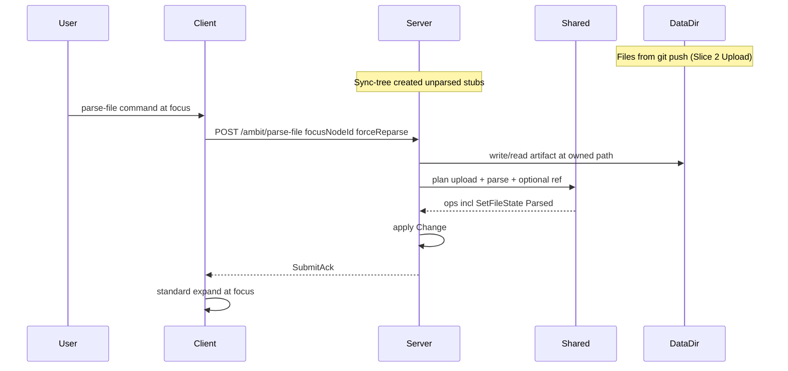

# Parse file (Slice 1 step 6) — revised spec

## Spec change (supersedes pre-git implementation)

Pre-spec code (wrong model):

- Expand triggered parse (`maybeRequestParseOnExpand`)
- Client ran `FileExpand.planParseFile` locally
- `GET /ambit/parse-file` returned raw text
- Desktop/local import ([`ImportText`](src/Shared/ImportText.fs), [`importLocalOp`](src/Client/UpdateImport.fs)) parsed paste into children at focus

**New model:**

- **Git push** (Slice 2 Upload workspace) lands files on server `DataDir` first; sync-tree creates **unparsed owned stubs** only.
- **`parse-file` is its own command** — not special expand behavior.
- **Server** reads file from **ownership-derived path** under `DataDir/{workspaceLabel}/` (already on disk from git sync), parses into the owned `Special File`, and **possibly** adds a **Ref** at the **current focus location** (same pattern as [`FileNodeOps.planCreateOwnedFileAtFocus`](src/Shared/FileNodeOps.fs)).
- After parse-file completes, **standard expand** runs automatically (normal fold/expand UX — no parse-on-expand hook).
- **Desktop is not involved** in parse-file — server `DataDir` is file authority for parse.

**Related:** [slice_2_sync_semantics plan](c:\Users\Windows\.cursor\plans\slice_2_sync_semantics_3c172a96.plan.md) — git Upload seeds/updates server disk; after Download (pull) client is **current to server** (not stale). Post-pull graph follow-up (refresh mtime, unparse changed files) is Slice 2, separate from this command.



## Layer responsibilities

| Layer | Role |
| --- | --- |
| **Shared** | Pure planner: resolve owned file path, read-from-disk descriptor, `planParseFile`, optional `planInsertFileRefAtFocus` when focus ≠ owner location |
| **Server** | Read `DataDir`, execute planner, apply authoritative graph change |
| **Client** | Invoke parse-file command; apply ack; trigger **standard** expand (existing `ViewModel.expandEntry`) |
| **Desktop** | Out of scope — files already on server via git upload |

## No special expand behavior

- **Remove** [`maybeRequestParseOnExpand`](src/Client/UpdateWorkspace.fs) from [`UpdateOps.fs`](src/Client/UpdateOps.fs) expand/arrow-right paths.
- Expand alone does **not** call parse-file.
- parse-file command is responsible for hydration; on success the client invokes normal expand so children appear.

(Reparse remains a variant of parse-file with `forceReparse = true`.)

## Server parse-file behavior

POST `/ambit/parse-file`:

```json
{ "focusNodeId": "...", "forceReparse": false }
```

**Server steps:**

1. Load authoritative graph.
2. Resolve **owned** `Special File` target from focus context (owned stub from sync-tree, or create owned file under nearest workspace/directory owner — mirror `planCreateOwnedFileAtFocus` ownership rules).
3. **Read disk:** load file bytes from ownership-derived path under `DataDir/{workspaceLabel}/...` (must already exist from git push + sync-tree; materialize/write only if a stub exists without on-disk file yet).
4. **Parse:** `FileExpand.planParseFile` on the owned file node; set `fileState = Parsed mtime`.
5. **Optional ref:** if `focusNodeId` is not the owned file node (or not under it as owner), emit `FileNodeOps.planInsertFileRefAtFocus` at focus.
6. Apply ops via agent; return change ack.

**Branches:**

- Unparsed → read + parse + optional ref.
- Parsed + disk mtime newer than stored + not forced → **parse drift warning** (Slice 1 step 7): warn, do not auto-reparse; user runs reparse (`forceReparse = true`).
- `forceReparse` → reparse with member cleanup.

**Stale terminology:** This is **local parse drift** (disk changed since last parse), not sync staleness. After a git pull the client is **current to server**; do not conflate with "stale after pull" (removed — see slice_2_sync_semantics plan).

## Client changes

- Wire **parse-file command** (existing [`ReparseFile`](src/Shared/CommandEntry.fs) may split or generalize) to POST server endpoint.
- **Delete** client-side `applyParseFileContent`, `forceApplyParseFileContent`, `ParseFileContentReceived` flow.
- On success: `SubmitResponse` + call standard expand on focus instance (not a custom parse-expand path).

## Shared planner extensions

New or extended module (e.g. `ParseFileCommand.fs` or extend [`FileExpand.fs`](src/Shared/FileExpand.fs)):

| Function | Purpose |
| --- | --- |
| `planParseFileCommand` | focus + graph → owned file id, disk read descriptor, parse ops, optional ref ops |
| `planParseFile` | keep — parse children + `SetFileState` (existing) |
| Member cleanup | on reparse — clear prior document members |

Reuse [`FileNodeOps.planInsertFileRefAtFocus`](src/Shared/FileNodeOps.fs) when focus location ≠ owned file parent.

## Tests

| Location | Case |
| --- | --- |
| Shared.Tests | parse at owned stub; parse at non-owner focus adds ref; reparse cleanup |
| Server.Tests | POST writes DataDir, applies ops, `fileState = Parsed`; ref present when focus differs |

## Files to touch

- [`src/Shared/FileExpand.fs`](src/Shared/FileExpand.fs) or new planner module
- [`src/Server/Api.fs`](src/Server/Api.fs), [`WorkspaceTreeSyncIo.fs`](src/Server/WorkspaceTreeSyncIo.fs), [`DocumentPersistence.fs`](src/Server/DocumentPersistence.fs)
- [`src/Server/RouteRegistration.fs`](src/Server/RouteRegistration.fs)
- [`src/Client/UpdateWorkspace.fs`](src/Client/UpdateWorkspace.fs), [`UpdateOps.fs`](src/Client/UpdateOps.fs), [`App.fs`](src/Client/App.fs), [`Commands.fs`](src/Client/Commands.fs)
- [`src/Shared/Serialization.fs`](src/Shared/Serialization.fs), [`ViewModel.fs`](src/Shared/ViewModel.fs)
- [`tests/Shared.Tests/FileExpandTests.fs`](tests/Shared.Tests/FileExpandTests.fs)
- New Server.Tests module

**Retire / out of scope for step 6:** expand-on-parse hook, client `planParseFile`, desktop raw fetch, [`ImportText`](src/Shared/ImportText.fs) local-parse path as replacement target (deprecate separately).

## Earlier steps audit (unchanged)

Steps 1–5 are not wrong on desktop/parse notions. Step 5 server-only `DataDir` sync is correct. Only step 6 pre-spec code and expand hook need replacement.

**Status note:** Slice 1 steps 1–5 and 7–8 are implemented in current code. Step 6 shipped the **pre-spec** expand-on-parse model (see below); this plan is the **revision** to replace it. Do not treat step 6 as done until this plan executes.

## Current code (pre-spec — to replace)

| Piece | Location | Problem |
| --- | --- | --- |
| Expand triggers parse | [`maybeRequestParseOnExpand`](src/Client/UpdateWorkspace.fs), [`UpdateOps.fs`](src/Client/UpdateOps.fs) | Wrong — expand should not hydrate |
| Client applies parse | [`applyParseFileContent`](src/Client/UpdateWorkspace.fs), [`Update.fs`](src/Client/Update.fs) | Wrong — server should apply ops |
| GET returns raw text | [`RouteRegistration.fs`](src/Server/RouteRegistration.fs) `GET /ambit/parse-file`, [`Api.fs`](src/Server/Api.fs) | Wrong — should be POST command applying change |
| Reparse only command | [`Commands.fs`](src/Client/Commands.fs) `ReparseFile` | Generalize to parse-file at focus |

## Doc touch

Update [`doc/roadmap/workspace-scale-import-slice1-plan.md`](doc/roadmap/workspace-scale-import-slice1-plan.md):

- §Expand to parse → **parse-file command** (not expand-triggered); server reads `DataDir`; optional ref at focus
- §Stale (step 7) → check at **parse-file / reparse** time, not on bare expand (expand no longer reads disk)
- git push prerequisite; remove `/_desktop/file` fetch wording
- Cross-link Slice 2 for file upstream (git Upload) and post-pull currentness

## Verification

1. Shared + Server tests (foreground).
2. Manual: git push repo → sync-tree stubs → **parse-file command** at focus → file on DataDir, graph parsed, ref if needed, standard expand shows children.
