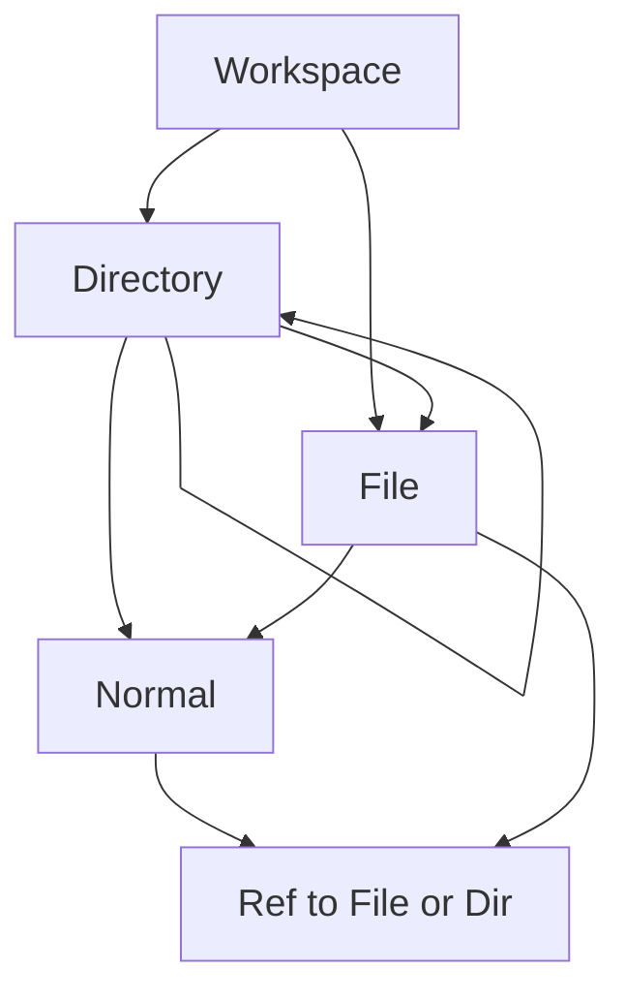

# Simplify Slice 1: ownership mirrors disk

## Design lock (corrected)

- **Owner of File/Directory:** only `Directory` or `Workspace` (including ROOT). Not `File`, not `Normal`.
- **Directory** may still own `Normal` nodes (notes under a folder).
- **File** may own normals / parsed content children as today for document membership; it does **not** own other File/Directory specials.
- **Refs:** cloning a File/Directory creates a non-owning reference; that ref may be relocated freely (including under normals or files).
- **Illegal owner move:** abort the op; surface why on the status line (extend existing `Graph.replace` placement errors in [`src/Shared/Model.fs`](src/Shared/Model.fs) ~474–485).
- **Disk path:** owner chain of directories/workspaces *is* the path — no nearest-directory-under-a-normal scan, no `WorkspacePathIndex`.

## Why Slice 1 gets simpler

Sync a directory = reconcile **immediate** disk children against that directory’s **owned** special children (by name). Missing → create stub; present → reuse; no “owned elsewhere → link” path-table dance. Refs elsewhere are ignored by sync.

## Doc changes (this work — no code yet)

1. **Rewrite** [`doc/roadmap/workspace-scale-import-slice1-plan.md`](doc/roadmap/workspace-scale-import-slice1-plan.md): remove path table, deep scan, “never move ownership / add link” rules. Lock ownership placement, shallow sync, metadata (`parsed`/`stale`/mtime), expand-to-parse, workspace git, tests.
2. **Update** [`doc/roadmap/revising-workspace-file-model.md`](doc/roadmap/revising-workspace-file-model.md): replace free-form “normal may own file/directory” with Directory/Workspace-only ownership of specials; refs unrestricted.
3. **Patch contradictions** in [`doc/roadmap/workspace-file-model.md`](doc/roadmap/workspace-file-model.md) and [`doc/current/workspace-graph.md`](doc/current/workspace-graph.md) placement tables (today: Directory/File “anywhere”) so roadmap/current agree on the new target; note current code still allows free-form until an implementation step.
4. **Light touch** [`doc/roadmap/workspace-scale-import.md`](doc/roadmap/workspace-scale-import.md) / umbrella / [`doc/index.md`](doc/index.md): point at simplified slice1 plan; drop path-table language.

## Slice 1 plan content after rewrite (summary)

| Area | New lock |
| --- | --- |
| Placement | Owner of File/Directory ∈ {Workspace, Directory}; Ref unrestricted |
| Sync | Per directory: match owned specials to immediate disk entries; create stubs; skip `.git` / simple ignore |
| Identity | Path = ownership path; no path index table |
| Expand / stale / git | Unchanged product goals from prior slice1 |

## Explicitly out of this doc pass

Implementing `Graph.replace` placement + status-line UX, sync command, or migrations of illegal existing graphs — those become later implementation steps after the docs are reviewed.
