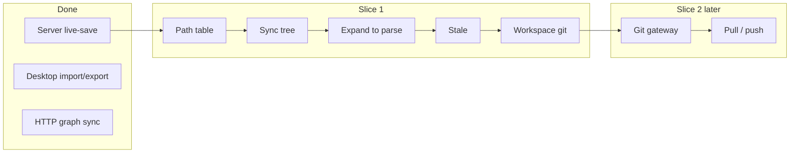
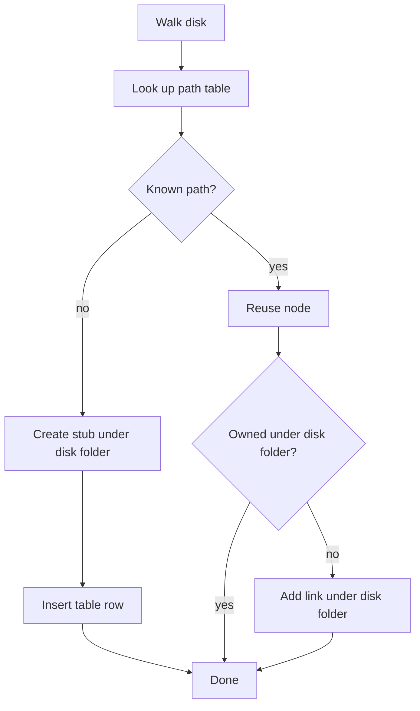

# Slice 1: Repo as outline on one machine

## Goal

Make browsing and editing a workspace’s files trustworthy on one machine. Desktop git pull/push against the server (Slice 2) comes after that.

Already done: server live-save under `DataDir/{label}/`, HTTP graph sync, desktop import/export with label mapping.

Still needed (this slice):

1. Show the repo as directory/file stubs in the outline (no parse yet).
2. Expand a file → read disk → parse into children.
3. Edits autosave to the source file.
4. If disk changed outside Gambol, mark stale and offer reparse.
5. Manual git commit for that workspace only (`DataDir/{label}/`).

Docs: [workspace-scale-import.md](doc/roadmap/workspace-scale-import.md), [revising-workspace-file-model.md](doc/roadmap/revising-workspace-file-model.md), [workspace-scale-file-and-db-management.md](doc/roadmap/workspace-scale-file-and-db-management.md). Slice 2 later: [git-sync-gateway.md](doc/roadmap/git-sync-gateway.md).
[[doc\roadmap\workspace-scale-import-slice1-plan.md



## Hard problem: one node per file

The outline is free-form. A file or directory node can sit under another file, under a note, anywhere — not only under the folder that matches disk. Disk location still comes from the nearest owning directory ancestor.

So “sync the repo tree” cannot mean “create a new child for every disk path.” That would invent a second node for a file that already exists elsewhere in the graph.

Rules:

- One Special File / Directory node per workspace-relative path.
- That node may appear in more than one place (owner in one place, links elsewhere).
- Sync must find the existing node by path, not by who currently owns it.

### Path table

Store path identity in a real table, not recompute it on every sync, and not as a loose column on the node.

```text
WorkspacePathIndex
  workspace_id    -- workspace root node
  relative_path   -- canonical path (forward slashes, case-folded key)
  node_id         -- the Special File or Directory
  UNIQUE (workspace_id, relative_path)
  UNIQUE (node_id)
```

When a row is written or updated, path is still computed the same way persistence does today:

```text
path = nearest owning directory/workspace path + "/" + node.name
```

Sync **reads** the table. It does not rebuild the table from the ownership tree each time.

Keep the table updated whenever graph ops change disk location (same moments as `DocumentPathMove`):

- create special → insert
- rename special → update path (and descendant paths)
- reparent that changes nearest directory → update this node and descendants
- trash / hard delete → remove row
- reparent that does **not** change nearest directory → leave the path row alone

Shared keeps an in-memory copy of the table (and reverse lookup). Server enforces uniqueness on accept. Existing graphs get a one-time backfill; conflicts show up then.

The table answers “which node is this path?” Ownership still answers “where does it live in the outline?” and document membership.

### How sync uses the table

Walk disk. For each path (folders before files):

1. **Path already in table** → reuse that node. Do not create another.
2. **Path not in table** → create a new stub, own it under the disk parent folder, insert the table row.
3. **Node exists but is owned somewhere else** → leave ownership alone; also **link** it under the disk folder if that link is missing. Do not move it back. Moving would undo the user’s rearrange and can change which document owns the node.
4. **Two nodes claim one path** → unique key rejects it; fix at backfill, not with sync heuristics.

If the table has a path that disk no longer has: do not auto-delete in this slice. Optionally mark missing later.



Empty workspace: every path is new → create stubs only. That is the simple case of the same algorithm.

## What is missing in code today

- No path table; paths are computed ad hoc (`NodeDesktopPath`, `DocumentPathMove`).
- Directory import builds wikilink normal nodes, not Special File/Directory stubs, and does not reconcile by path.
- Expanding a file does not read/parse on demand.
- No `parsed` / `stale` / `mtime` on file nodes.
- Git save commits the whole `DataDir`, not one `{label}/` workspace.

## Steps

### 0. Roadmap slice doc

Write [workspace-scale-import-slice1-plan.md](doc/roadmap/workspace-scale-import-slice1-plan.md): path table, sync rules (reuse / create / link, never move ownership), metadata, commands, tests. Link from [workspace-scale-import.md](doc/roadmap/workspace-scale-import.md). Review before code.
[Import Slice1 Plan](doc\roadmap\workspace-scale-import-slice1-plan.md).

### 1. Path table + sync planner (Shared)

- Schema + Shared map + backfill from nearest-directory paths.
- Update the table next to `DocumentPathMove` planning.
- Planner: walk disk → look up table → create+insert or add link; skip `.git` and simple gitignore.

Tests: backfill conflict; file owned under another file is reused and linked under the disk folder; renaming a folder updates child path rows.

### 2. Sync tree command

Command at workspace root posts the reconcile change. No parsing.

- Server: walk `DataDir/{label}/`.
- Optional same slice: desktop walks the mapped label root with the same planner.

Check: medium repo shows folders/files; `.git` hidden; relocated files reused; rename keeps the table honest; restart still coherent.

### 3. Expand to parse

Per file node (minimal):

```text
parsed: bool
stale: bool
sourceMtimeUtc: int64 option
sourceHash: string option   // optional if mtime is enough at first
```

On expand of an unparsed Special File: fetch content (server or `/_desktop/file`), run existing format read, attach children for that file only, set `parsed = true`. Do not parse every file at sync time.

### 4. Stale

On expand (or Reparse): if parsed and disk is newer than stored mtime → mark stale, show indicator, offer reparse. Do not auto-fix. Use existing desktop file-status where mapped; add a small server stat if needed.

### 5. Workspace git

`git init` inside `DataDir/{label}/` on first need. Commit that repo only (not whole `DataDir`). On desktop, if the mapped root is a git repo, same commit via LocalProxy.

Check: edit → autosave → manual commit → `git log` under `{label}/`.

## Out of scope

- Git gateway, JIT commit, pull/push (Slice 2)
- Client LRU, server lazy DB load, query model
- Full gitignore, branches, annotation migration
- XML format work

## After this slice

Git gateway, desktop remote setup, pull/push UI, stale-after-pull — [git-sync-gateway.md](doc/roadmap/git-sync-gateway.md) steps 3–7.
