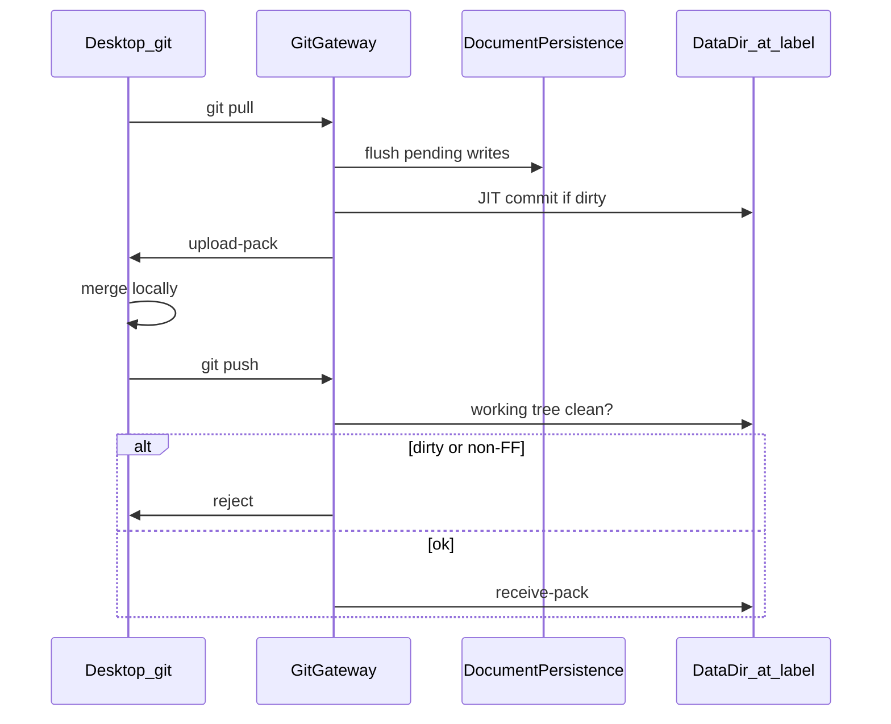
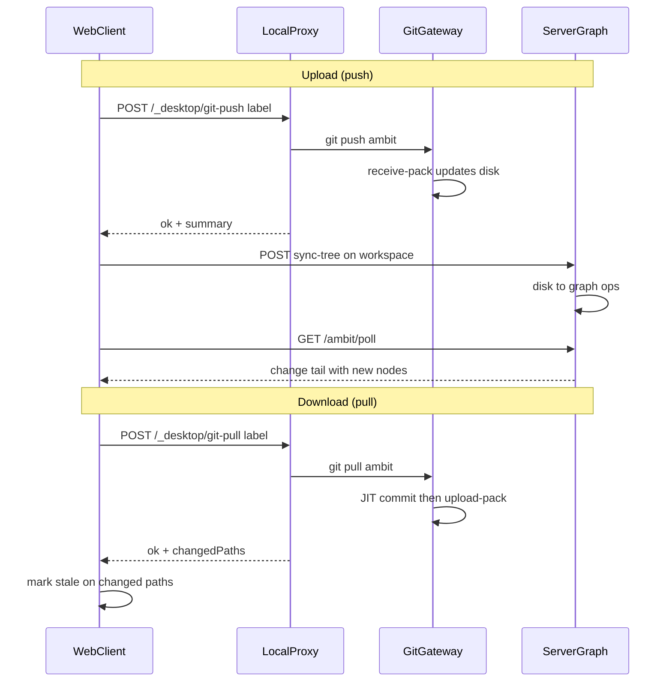
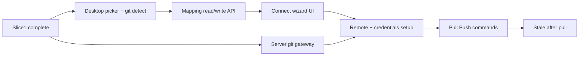

# Slice 2: Desktop folder open + git pull/push

## Recommendation: pull/push, not bulk transfer

| Approach | Server work | Client work | Long-term cleanliness |
| --- | --- | --- | --- |
| **Git pull/push** (recommended) | Git gateway + auth + two hooks | Folder picker, `ambit` remote setup, shell `git` | High — matches locked design in [git-sync-gateway.md](doc/roadmap/git-sync-gateway.md) |
| **Bulk transfer** (zip/rsync API) | Custom archive endpoints, no history | Extract/upload UI, custom conflict rules | Low — second sync paradigm alongside HTTP graph sync and git |

**Why pull/push wins:** Slice 1 already treats **workspace == git repo** at `{DataDir}/{label}/`. [WorkspaceGit.fs](src/Server/WorkspaceGit.fs) already runs `git init` / `status` / `commit` via subprocess. The folder-open dialog explicitly selects folders with `.git`. Bulk transfer would re-solve incremental sync, conflicts, and stale detection without git's answers.

**Upload/download naming:** In UI, map cleanly to git verbs:
- **Download workspace** → Pull (server → desktop)
- **Upload workspace** → Push (desktop → server)

No separate bulk-transfer API in Slice 2.

**Remote name:** Gambol uses remote `ambit` (not `origin`). The opened folder may already have `origin` pointing at GitHub or elsewhere; `ambit` is dedicated to the server gateway. Pull/Push commands and setup always target `git pull ambit` / `git push ambit`. Update [git-sync-gateway.md](doc/roadmap/git-sync-gateway.md) terminology when writing the slice 2 plan doc.

---

## What the server needs (difficulty: moderate, bounded)

The gateway is a **thin git wire layer** — not a custom sync engine. Per [git-sync-gateway.md](doc/roadmap/git-sync-gateway.md):

**New server pieces (~4 concerns):**

1. **Route** — smart HTTP per workspace, e.g. `GET/POST /ambit/git/home.git/info/refs` and `.../git-upload-pack` / `.../git-receive-pack` (exact path TBD). Subprocess to `git http-backend` or direct `upload-pack`/`receive-pack`.
2. **JIT commit** — before serving fetch: flush `DocumentPersistence`, then `git add -A && git commit -m "gambol: autosave before pull"` if porcelain non-empty. Reuses [WorkspaceGit.fs](src/Server/WorkspaceGit.fs).
3. **Push guards** — `receive.denyNonFastForwards = true`; pre-receive hook rejects if work tree dirty.
4. **Auth** — git-scoped token (HTTPS) or SSH key. Separate from browser session cookie; one-time desktop setup stores credentials via OS/git credential helper.

**Not needed on server:** merge, rebase, conflict resolution, branch UI, custom pack format.

**Prerequisite:** Slice 1 complete (tree sync, autosave to `{label}/`, per-workspace `.git` inside `{label}/`).

---

## Desktop: Folder Open → workspace definition

**Entry:** New command (e.g. **Open workspace folder…**) available only when desktop host is active.

**Flow:**

1. **Native folder picker** — WPF `OpenFolderDialog` in [Desktop.fs](src/Desktop/Desktop.fs) or [LocalProxy.fs](src/Desktop/LocalProxy.fs). New endpoint `POST /_desktop/pick-folder` (blocking, like existing sync import/export pattern in [UpdateExport.fs](src/Client/UpdateExport.fs)).
2. **Git detection** — resolve workspace root:
   - Selected path **is** `.git` → root = parent directory
   - Selected path **contains** `.git/` → root = selected path
   - Otherwise → error: "Select a git repository root"
3. **User definition dialog** (client overlay, not OS dialog):
   - **Label** — e.g. `home` → `home` graph identity
   - **Server action** — create new cloud workspace node, or link to existing label
   - **Initial sync** (first connect only):
     - *Download* — clone/pull server content into local folder (server empty or authoritative)
     - *Upload* — push local commits to fresh server repo (local authoritative)
   - **Remote URL** — derived from server base + label; user confirms once
   - **Credentials** — one-time token or SSH key setup (document one recommended path)
4. **Persist mapping** — write `{label, path}` to `%LocalAppData%/Gambol/config.json` via new `/_desktop/workspace-mappings` read/write endpoints (today: manual edit only per [workspace-local-mapping.md](doc/current/workspace-local-mapping.md)).
5. **Configure local git** — `git remote add/set-url ambit <gateway-url>` in mapped root (never `origin` — preserves any existing upstream the user already has). Run initial `git pull ambit` or `git push ambit` per user choice.
6. **Register on server** — implement deferred [workspace-stage-plan.md](doc/current/workspace-stage-plan.md) §4b: ensure cloud graph has workspace node for label.

---

## Two layers: git moves files, HTTP moves graph

Git sync and graph sync are **separate**. This is the main correction to the mental model.

| Layer | What moves | Mechanism |
| --- | --- | --- |
| **Files** | Disk trees under `{label}/` | `git pull ambit` / `git push ambit` via gateway |
| **Graph** | PostgreSQL nodes/ops | Existing `POST /ambit/changes` + `GET /ambit/poll` ([sync-mvp.md](doc/current/sync-mvp.md)) |

**Git push does not create graph nodes by itself.** It runs **`receive-pack`** on the server (not upload-pack — upload-pack is server→client during pull). After push, server **disk** matches the client commit; the **graph** may still be stale until **sync-tree** reconciles disk → owned File/Directory stubs.

**Git pull** runs **`upload-pack`** on the server (server sends pack to desktop). Local disk updates; graph tree on the server is unchanged. Client marks affected file nodes **stale** for reparse (local content drift).

---

## Async Upload / Download from client

Yes — async from the client's perspective. Flow:

**Client command** → async effect (spinner/status line) → desktop endpoint:

| Endpoint | Runs | Returns |
| --- | --- | --- |
| `POST /_desktop/git-push` | `git push ambit` in mapped root | `{ ok, stderr? }` |
| `POST /_desktop/git-pull` | `git pull ambit` in mapped root | `{ ok, changedPaths, stderr? }` |

Desktop shells out to stock `git`; the gateway handles wire protocol. No custom pack POST from Gambol.

**After Upload (push):** client (or server hook) triggers **sync-tree** on the workspace node → server posts graph ops → existing **poll** delivers new nodes to client and other clients. This is the "bunch of node updates" step — it is sync-tree + poll, not git directly.

**After Download (pull):** poll is optional for tree structure (server graph unchanged). Client uses `changedPaths` from desktop response to mark file nodes stale; reparse on expand.

**Async shape:** Slice 2 can start with a **blocking** desktop POST (like export today). Upgrade to job-id polling on `/_desktop/git-job/{id}` only if push/pull routinely exceeds HTTP timeout.

---

## Ongoing sync: Pull / Push commands

At workspace root in the outliner:

| Command | Desktop | Server git | Graph follow-up |
| --- | --- | --- | --- |
| **Pull** (Download) | `git pull ambit` | JIT commit + **upload-pack** | Mark stale on `changedPaths` |
| **Push** (Upload) | `git push ambit` | **receive-pack** (FF, clean tree) | **sync-tree** on workspace → poll |

**Status line** — `git status -sb` in mapped root: ahead/behind/dirty (extend [DesktopCapabilities.fs](src/Shared/DesktopCapabilities.fs) with `canGit`, `remoteConfigured`).

**After pull** — mark changed file nodes stale; offer reparse (Slice 1 stale machinery in [FileExpand.fs](src/Shared/FileExpand.fs)).

---

## Implementation order

1. **Desktop picker + git detect** — `/_desktop/pick-folder`, `/_desktop/detect-git?path=`
2. **Mapping CRUD** — `GET/PUT /_desktop/workspace-mappings`; reload in-memory map without proxy restart
3. **Connect wizard** — label, create/link, initial download vs upload, write mapping + configure `ambit` remote
4. **Server gateway v0** — one workspace, smart HTTP, JIT commit, FF + clean-tree hooks; integration tests
5. **Credentials** — git-scoped token issuance or SSH docs + desktop credential helper
6. **Pull / Push UI** — async desktop git endpoints; sync-tree after push; poll for graph updates
7. **Stale after pull** — `changedPaths` from pull response → mark owned file nodes stale
8. **§4b startup registration** — auto-create server workspace nodes for mapped labels on login

---

## Out of scope (Slice 2)

- Bulk zip/tar workspace transfer
- Server-side merge or conflict resolution
- Branch switching UI
- Browser-only git (requires desktop + local filesystem)
- Non-git folders via Folder Open (reject with clear message)

---

## New plan doc

Create [doc/roadmap/workspace-scale-import-slice2-plan.md](doc/roadmap/workspace-scale-import-slice2-plan.md) (mirrors slice 1 plan structure) and add a one-line link from [workspace-scale-import.md](doc/roadmap/workspace-scale-import.md) §Slice 2.

---

## Success criterion

1. Open desktop → **Open workspace folder…** → pick local git clone
2. Define label + initial download or upload → mapping saved, `ambit` remote configured
3. Browse/edit files via Slice 1 tree sync
4. **Pull** brings server changes; stale files offer reparse
5. Local commit → **Push** updates server (FF only, server tree clean)
6. Restart desktop → mapping persists; workspace node exists on server
