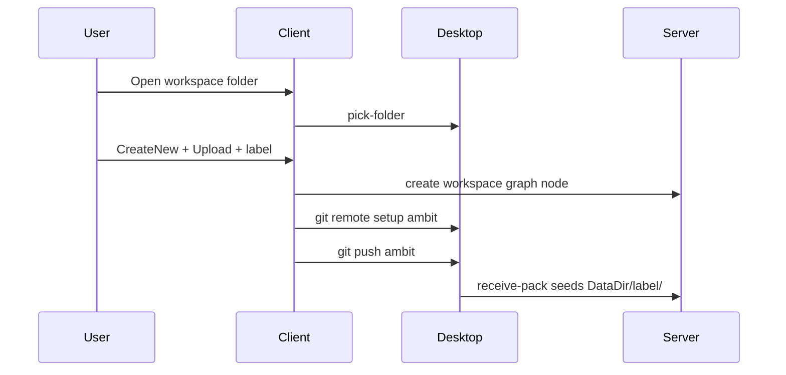
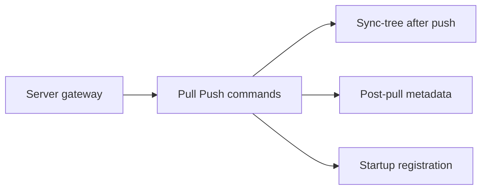

# Slice 2: Upload gating and doc alignment

## Context

Two distinct concepts — do not conflate **sync currentness** with **parse drift**:

| Concept | Scope | Meaning | Action |
| --- | --- | --- | --- |
| **Current to server** | Slice 2 (sync) | After Download (pull), local disk matches server commit; mtimes align | Client may Upload when also FF-eligible + server clean |
| **Local file stale** | Slice 1 (parse) | External edit changed disk **since last parse** (`diskMtimeUtc > sourceMtimeUtc`) | Indicator + reparse on expand; no auto-replace ([slice1-plan L148–150](doc/roadmap/workspace-scale-import-slice1-plan.md)) |
| **Upload gating** | Slice 2 (sync) | Push when client **not** current to server | Reject push (non-FF or server dirty); user must Download + merge first |

**Correction — "stale after pull" is wrong.** Pull downloads server files; afterward local and server are identical (including datestamps). The client is **current**, not stale. Do not mark file nodes stale after pull.

Post-pull follow-up for **parsed** files whose content changed:
- Refresh `sourceMtimeUtc` from disk for `changedPaths` → sync metadata matches current file.
- If the file was `Parsed`, **invalidate parse** (reset to `Unparsed`, clear parse children) so the next expand reads current content. This is parse invalidation, not a stale/sync flag.
- Slice 1 `isStale` applies only when disk changed **outside** a sync pull (external editor, local autosave before commit, etc.).

Line 170 in the Slice 1 plan stays **local mtime stale only**. Upload/currentness belongs in Slice 2 docs and [slice_2_git_sync plan](c:\Users\Windows\.cursor\plans\slice_2_git_sync_475f1bd7.plan.md).

**Slice status:** Slice 1 is fully implemented. Slice 2 is in progress.

---

## Locked semantic: initial connect vs ongoing sync

### Initial connect (creates server workspace)



- User picks a **local git repo** on desktop.
- Connect wizard **CreateNew** posts a **Special Workspace** node to the server graph.
- **Initial Upload** (`InitialSyncDirection.Upload`) runs `git push ambit` — this is the one case where desktop is authoritative and seeds the server repo under `{DataDir}/{label}/`.
- Alternative **Initial Download** seeds desktop from an existing server repo.

### Ongoing rule: upload forbidden unless client is current

After initial connect, **Upload** (`git push ambit`) is allowed only when the client is **current to the server** for that workspace:

1. **Client has incorporated all server commits** — push must be **fast-forward** from the server's `HEAD` (`receive.denyNonFastForwards`). If the server has commits the client lacks, push is rejected; user must Download first.
2. **Server working tree is clean** — no uncommitted autosaves on disk under `{DataDir}/{label}/` (pre-receive / clean-tree hook).
3. **Client has committed locally** — autosave is not commit; user runs manual `git commit` before Upload.

Gambol does **not** perform git merge on push. Merge/conflict resolution is **stock git outside Gambol** (terminal, IDE, etc.).

### Typical ongoing workflow

```text
1. Edit in Gambol → autosave to local mapped files
2. git commit (client-side, manual — outside or via Gambol git command)
3. Download workspace (git pull ambit) — server JIT-commits autosaves first, then upload-pack
4. If histories diverged: merge / resolve conflicts in stock git (not in Gambol)
5. Upload workspace (git push ambit) — only succeeds when FF + server clean
6. Client runs sync-tree + poll so server graph catches up to new disk files
7. After Download: client is current to server; refresh mtimes for changedPaths; unparse any parsed files whose content changed
```

This matches the user's described flow: commit → download → merge apart from the program → push upload with the program.

---

## Implementation status (codebase vs plan todos)

| Item | Plan todo | Actual |
| --- | --- | --- |
| Slice 2 plan doc | completed | [slice2-plan.md](doc/roadmap/workspace-scale-import-slice2-plan.md) exists |
| Desktop picker + detect-git | completed | [LocalProxy.fs](src/Desktop/LocalProxy.fs) `/_desktop/pick-folder`, `/_desktop/detect-git` |
| Mapping CRUD | **pending in plan** | **Implemented** — `GET/PUT /_desktop/workspace-mappings` in LocalProxy |
| Connect wizard | pending | **Implemented** — [UpdateWorkspaceConnect.fs](src/Client/UpdateWorkspaceConnect.fs), initial pull/push in [App.fs](src/Client/App.fs) |
| Server git gateway | pending | **Not implemented** — no smart HTTP `upload-pack`/`receive-pack` routes in [RouteRegistration.fs](src/Server/RouteRegistration.fs); only [WorkspaceGit.fs](src/Server/WorkspaceGit.fs) init/commit |
| Pull/Push UI (ongoing) | pending | **Not implemented** — pull/push only in connect wizard, no workspace-root Download/Upload commands |
| Post-push sync-tree | pending | Not wired |
| Post-pull metadata | pending | `changedPaths` returned from pull; no client wiring to refresh mtime / unparse |
| §4b startup registration | pending | Not implemented |

**Correction:** Update cursor plan todos — mark `mapping-api` and `connect-wizard` **completed**; keep `git-gateway` **pending** (despite slice1-plan status table saying Done).

---

## Doc changes (no code in this pass)

### 1. [workspace-scale-import-slice2-plan.md](doc/roadmap/workspace-scale-import-slice2-plan.md)

Add two sections after "What it gives you":

**Initial connect**
- CreateNew + Upload creates server graph node + seeds server repo via push
- LinkExisting + Download attaches to existing server workspace

**Upload gating and typical workflow**
- Bullet the three push preconditions (FF, server clean, client committed)
- Numbered typical loop (commit → download → merge outside Gambol → upload → sync-tree)
- Explicit: Gambol Download runs `git pull ambit`; merge/conflict work is stock git, not graph merge

**After Download (pull) — current, not stale**
- Pull makes local disk match server; mtimes align → client is **current to server**
- Remove "Stale after pull" from this doc's bullet list and async flow
- For `changedPaths`: refresh `sourceMtimeUtc`; unparse parsed files whose content changed (parse invalidation, not stale flag)

Add implementation step status table mirroring cursor plan (done: 1–3 desktop connect; pending: 4–8).

### 2. [git-sync-gateway.md](doc/roadmap/git-sync-gateway.md)

Expand **Push (client → server)** with:
- "Current to server" definition (FF-eligible + server clean; after pull, local matches server)
- Initial upload exception (empty/new server repo)
- Typical workflow cross-reference
- Fix any remaining `origin` → `ambit` terminology ([workspace-scale-import.md L176–177](doc/roadmap/workspace-scale-import.md) still says `origin`)

Revise **Pull** section and implementation step 7:
- Remove "mark stale after pull" / "stale/reparse on changed files"
- Replace with: after pull client is current; refresh file metadata for changed paths; unparse parsed files as needed

### 3. [workspace-scale-import-slice1-plan.md](doc/roadmap/workspace-scale-import-slice1-plan.md)

- Change header status: **Planned** → **Implemented**
- Remove or relocate the misleading **Step / Status** table (lines 173–183) — it tracks Slice 2 progress and confuses Slice 1 step 7 "Stale"
- Add one line under **After this slice**: Slice 1 local stale is done; upload gating and post-pull currentness are Slice 2

### 4. [slice_2_git_sync plan](c:\Users\Windows\.cursor\plans\slice_2_git_sync_475f1bd7.plan.md)

- Add **Upload gating and typical workflow** section (content above)
- Update todo statuses: `mapping-api`, `connect-wizard` → completed
- Add explicit note: server gateway is **not** done despite slice1-plan table

---

## Remaining Slice 2 implementation (after docs)

Priority order unchanged from existing plan:

1. **Server git gateway v0** — smart HTTP, JIT commit, FF + clean-tree hooks (blocks real pull/push)
2. **Ongoing Pull/Push commands** — workspace-root UI + upload gating (disable/warn when behind or diverged via `git status -sb`)
3. **Post-push sync-tree** + poll
4. **Post-pull metadata** — `changedPaths` → refresh `sourceMtimeUtc`; unparse parsed files with changed content (client current, not stale)
5. **§4b startup registration**



---

## Success criteria (documentation)

After doc pass, a reader can answer without ambiguity:

- What happens on **initial Upload** vs **ongoing Upload**
- Why push fails when not current to server
- Where merge happens (stock git, not Gambol)
- Why pull leaves the client **current** (not stale) and how that differs from Slice 1 stale (external disk change since parse)
