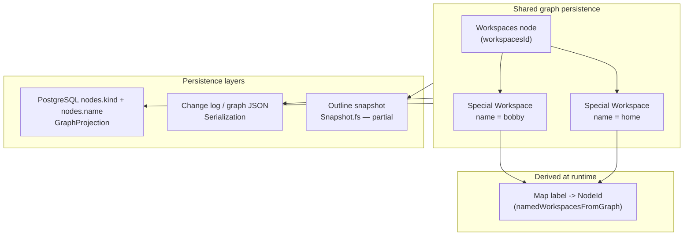

# Stage 3 partial implementation — code locations

**Stage 3 definition** ([doc/roadmap/workspace-file-model.md](doc/roadmap/workspace-file-model.md) line 39):

> Shared persistence stores canonical workspace-label → workspace-root mapping only.

**Design choice:** no separate `workspace_labels` table. The mapping is encoded as `Special Workspace` nodes owned by the canonical `Workspaces` node; label lives in `Node.name`, root identity in `NodeId`.

---

## What is implemented (the mapping itself)

### 1. Graph structure = the canonical mapping

| Location | Role |
|----------|------|
| [src/Shared/Model.fs](src/Shared/Model.fs) | `workspacesId`, `ensureWorkspacesNode`, root bootstrap; `setName` case-insensitive sibling uniqueness; `replace` rejects duplicate owner names and enforces `Special Workspace` only under `Workspaces` |
| [src/Shared/History.fs](src/Shared/History.fs) | `Op.NewSpecialNode(..., Workspace, name)` creates labeled workspace root; `Op.SetName` renames label |
| [doc/current/workspace-graph.md](doc/current/workspace-graph.md) | Documents create/rename via `NewSpecialNode` + `Replace` under `workspacesId` |

The mapping record is literally: **`Special Workspace` child of `Workspaces` with `name = label`**.

### 2. SQL / DB persistence (primary shared path)

| Location | Role |
|----------|------|
| [src/Shared/NodeKindPersistence.fs](src/Shared/NodeKindPersistence.fs) | `kind = "workspace"` / `"workspaces"` string encoding |
| [src/Shared/GraphProjection.fs](src/Shared/GraphProjection.fs) | `nodeRowsFromGraph` writes `name` + `kind`; `graphFromPersistence` rebuilds graph via `Graph.fromNodes` |
| [src/Server/Database.fs](src/Server/Database.fs) | `nodes.kind TEXT` column; backfill for canonical root/workspaces/trash ids (lines ~108–121) |
| [src/Server/Database.fs](src/Server/Database.fs) | `replaceGraphProjectionWithTx` persists full graph including workspace nodes |

Verified by: [tests/Shared.Tests/GraphProjectionTests.fs](tests/Shared.Tests/GraphProjectionTests.fs) — `graphRoundTrip preserves Special Workspace and Directory` (lines ~206–215).

### 3. Change-log / sync JSON persistence

| Location | Role |
|----------|------|
| [src/Shared/Serialization.fs](src/Shared/Serialization.fs) | `encodeNodeKind` / `decodeNodeKind` for all special kinds; `NewSpecialNode` op codec includes `kind` + `name` |

Workspace create/rename survives replay through the normal change pipeline.

### 4. Runtime label → NodeId lookup (derived, not stored separately)

| Location | Role |
|----------|------|
| [src/Shared/RefExpr.fs](src/Shared/RefExpr.fs) | `namedWorkspacesFromGraph` (lines ~318–337): scans `Workspaces` owner children, builds `Map<string, NodeId>`; `resolveBase` resolves label via `ctx.namedWorkspaces` |
| [src/Shared/FilePathResolve.fs](src/Shared/FilePathResolve.fs) | `findOwnerChild` + `resolveNamedWorkspaceChain` (lines ~72–124): same lookup for path resolution |
| [src/Shared/NodeDesktopPath.fs](src/Shared/NodeDesktopPath.fs) | Exposes label string from workspace node `name` for UI/desktop |

Tests: [tests/Shared.Tests/RefExprTests.fs](tests/Shared.Tests/RefExprTests.fs), [tests/Shared.Tests/WorkspaceOpsTests.fs](tests/Shared.Tests/WorkspaceOpsTests.fs), [tests/Shared.Tests/ModelTests.fs](tests/Shared.Tests/ModelTests.fs) (placement + bootstrap).

---

## What makes it only partial (`[~]`)

These are the gaps relative to Stage 3 and [.github/prompts/plan-workspace-stage-implementation.prompt.md](.github/prompts/plan-workspace-stage-implementation.prompt.md) Phase 3–4:

### A. Outline snapshot path does not round-trip user workspace nodes

[src/Shared/Snapshot.fs](src/Shared/Snapshot.fs):

- **Write:** canonical `#WORKSPACES` sid for `workspacesId` only (lines ~50–56, ~78–81).
- **Read:** `outlineTextNode` assigns `Special Workspace` / `Special Workspaces` only to canonical ids (`rootId`, `workspacesId`, `trashId`). User-created workspace nodes under `Workspaces` reload as **`Normal`** (lines ~161–177, ~222–246).

So file-mode outline persistence loses workspace **kind** (label text may survive in `text`, but mapping semantics depend on kind + placement). DB projection path is complete; snapshot path is not.

### B. No startup fail-fast validation for duplicate workspace labels

Planned in implementation prompt step 21; **not present** in:

- [src/Shared/Model.fs](src/Shared/Model.fs) `Graph.fromNodes`
- [src/Server/DatabaseSetup.fs](src/Server/DatabaseSetup.fs)
- [src/Server/Database.fs](src/Server/Database.fs) load path

Uniqueness is enforced only at **mutation time** (`Graph.replace` sibling-name check, `Graph.setName`), not when reconstructing from persisted rows.

### C. No dedicated persisted lookup index on `Graph`

Plan step 3 called for a graph-level `label -> NodeId` index. Current code recomputes it in `RefExpr.namedWorkspacesFromGraph` and `FilePathResolve.findOwnerChild` on each use. Functionally OK; not a separate persisted artifact.

### D. No dedicated create/rename workspace ops

Uses generic `NewSpecialNode` + `Replace` + `SetName` rather than dedicated `CreateWorkspace` / `RenameWorkspace` ops (still valid for persistence, but not the planned dedicated surface).

### E. Explicitly out of scope for Stage 3 (still `[ ]` elsewhere)

From [doc/roadmap/workspace-file-model.md](doc/roadmap/workspace-file-model.md) line 69:

> No directory/file path mapping is persisted in shared graph yet.

Directory/file nodes may exist in the graph and round-trip through SQL ([GraphProjectionTests.fs](tests/Shared.Tests/GraphProjectionTests.fs)), but **path mapping** and server `DataDir/{label}/...` are later stages (Stage 7).

### F. Doc mismatch to note

[doc/roadmap/workspace-stage-plan.md](doc/roadmap/workspace-stage-plan.md) §3 says "Done" and points at [doc/current/workspace-local-mapping.md](doc/current/workspace-local-mapping.md) — that is **Stage 4 desktop-local** mapping, not Stage 3 shared persistence.

---

## Quick “where to look” summary

| Concern | Primary files |
|---------|-----------------|
| Mapping stored as graph nodes | [src/Shared/Model.fs](src/Shared/Model.fs), [src/Shared/History.fs](src/Shared/History.fs) |
| Mapping persisted to PostgreSQL | [src/Shared/GraphProjection.fs](src/Shared/GraphProjection.fs), [src/Server/Database.fs](src/Server/Database.fs) |
| Mapping persisted in change log | [src/Shared/Serialization.fs](src/Shared/Serialization.fs) |
| Mapping looked up at runtime | [src/Shared/RefExpr.fs](src/Shared/RefExpr.fs), [src/Shared/FilePathResolve.fs](src/Shared/FilePathResolve.fs) |
| Mapping exposed as label | [src/Shared/NodeDesktopPath.fs](src/Shared/NodeDesktopPath.fs) |
| Tests | [tests/Shared.Tests/GraphProjectionTests.fs](tests/Shared.Tests/GraphProjectionTests.fs), [tests/Shared.Tests/WorkspaceOpsTests.fs](tests/Shared.Tests/WorkspaceOpsTests.fs), [tests/Shared.Tests/ModelTests.fs](tests/Shared.Tests/ModelTests.fs) |
| **Not** Stage 3 (local roots) | [src/Shared/WorkspaceLocalMapping.fs](src/Shared/WorkspaceLocalMapping.fs) — desktop-only, Stage 4 |
