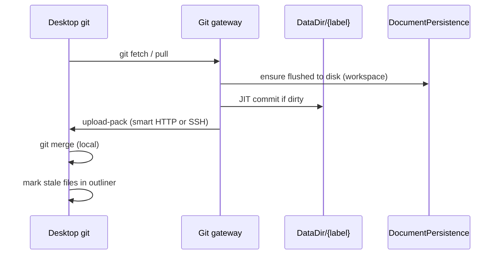
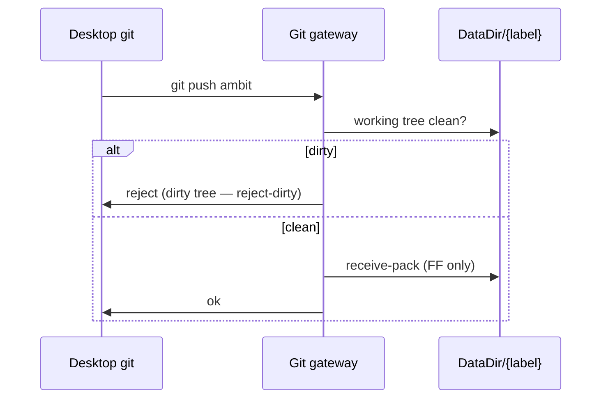

# Git sync gateway

Category: Sync
See also: [[workspace-scale-import-slice2-plan]], [[workspace-scale-import]], [[workspaces-checklist]], [[doc/roadmap/workspace-file-persistence.md]], [[doc/roadmap/workspace-file-model.md]], [[doc/current/desktop-local-files.md]], [[doc/current/workspace-local-mapping.md]], [[doc/current/persistence-model.md]], [[doc/roadmap/future-merge-sync.md]]

**Slice 2** of [[workspace-scale-import]] — follows slice 1 (outliner ↔ files on one machine). Ordered shippable slices: [[workspace-scale-import-slice2-plan]].

Target design for synchronizing a workspace repo between the server `DataDir` and a desktop local checkout. **Workspace == repo.** One workspace label maps to one git repository rooted at `DataDir/{label}/` (verbatim label; no `@` prefix on disk — [[workspace-name-verbatim]]).

This doc records decisions that upcoming persistence and workspace work should respect. It does not supersede [[doc/current/sync-mvp.md]] for live graph editing over HTTP; git sync is a coarse, explicit file-tree transport layered on top.

## What it gives you

- A desktop user maps a workspace label to a local directory that is a normal git clone with remote name **`ambit`** pointing at the server (not `origin` — preserves the user’s existing upstream).
- **Pull** brings server file state to the client (`git pull ambit`). Merge and conflict resolution happen **on the client** with standard git tooling.
- **Push** sends client commits to the server (`git push ambit`). The server accepts only **fast-forward** updates when its working tree is **clean** (**reject-dirty** — no JIT commit on push).
- A **standalone git gateway** on the server exposes native git wire protocol (smart HTTP or SSH). It does not read PostgreSQL or perform merge logic.
- After pull, the outliner marks affected files **stale** and offers reparse (see [[workspace-scale-import]]).

## What it avoids for now

- Server-side merge, rebase, or conflict resolution for git.
- Git integration inside the graph change log or `DbAgent`.
- Browser-only git (client-side merge requires desktop local filesystem + git binary).
- Branch switching UI, git object model in the outline, or repo-wide search.
- Replacing HTTP change batches for live editing; two layers coexist.

## Locked decisions

| Topic | Decision |
| --- | --- |
| Repo root | `DataDir/{workspaceLabel}/` — same tree as live-save / [[doc/roadmap/workspace-file-persistence.md]] (verbatim label) |
| `.git` location | **Inside** `{label}/` (e.g. `DataDir/home/.git`). Import and tree browse skip `.git` per [[workspace-scale-import]]. |
| Remote name | **`ambit`** (not `origin`) |
| Pull (server → client) | **JIT commit on server first**, then client runs `git pull ambit`. |
| Dirty push policy | **reject-dirty** — reject push when server working tree is dirty; do **not** JIT-commit on push. JIT commit is only before fetch/pull. Locked G0 ([[workspace-scale-import-slice2-plan]]). |
| Push (client → server) | **Reject unless server working tree is clean**; accept only **fast-forward** (`receive.denyNonFastForwards`). |
| Desktop transport | Prefer stock **`git pull` / `git push ambit`** against a real remote URL — not a bespoke pack POST API. |
| Git substrate | **Option A locked:** all git I/O (init, porcelain, JIT commit, gateway upload/receive) via **subprocess to stock `git`**, not LibGit2Sharp or a custom pack implementation. |
| Module shape | New `WorkspaceGit` (per `DataDir/{label}/`) reuses [[src/Server/GitSave.fs]] subprocess patterns; **no new `DataDir/.git`**; legacy `GitSave` stays ops-only until retired. |
| Commit message | Server commits use `{base} | client: {X-Gambol-Client hint}` (e.g. `rev 42 | client: Win32; Mozilla/5.0…`); omit client segment when hint absent. Locked G2. |
| Gateway | Thin ASP.NET routes that authenticate, flush persistence, optionally JIT-commit, then **delegate wire protocol to `git`** (`http-backend` or pack helpers) — not a REST-shaped git API. |
| Desktop + Shared | Desktop shells stock `git`; Shared holds only pure helpers (status parse, URL shape) — **no git subprocess in Shared**. |
| Module boundary | `DocumentPersistence` writes files; git gateway runs git. **Only coupling:** server JIT commit before serving fetch, and clean-tree check before receive. |
| Path moves | Filesystem moves under `{label}/` should be real renames where possible so git history stays coherent ([[doc/roadmap/workspace-file-persistence.md]] move handler). |

## On-disk layout

```text
{DataDir}/
  home/                  ← workspace == repo work tree (verbatim label)
    .git/                ← inside {label}/
    src/
      lib.fs
    docs/
      specs/
        .amb
```

Local desktop mapping ([[doc/current/workspace-local-mapping.md]]) points label `home` at a separate directory that is a **clone** of the server repo, not the server path itself.

## Protocol flows

### Pull (server → client)



1. User triggers Pull in Gambol (or runs `git pull ambit` in the mapped directory).
2. Gateway ensures graph edits for that workspace are **persisted to disk** (flush).
3. Gateway runs **JIT commit** on the server repo if the working tree has uncommitted changes (autosaved files).
4. Client fetches/merges with normal git. User resolves conflicts locally if any.
5. Client marks changed paths stale for reparse.

### Push (client → server)



1. User commits locally on desktop (manual `git commit` — not automatic on every edit).
2. `git push ambit`. Gateway refuses if server working tree is **dirty** (**reject-dirty**; uncommitted autosaves still on disk — no JIT commit on push).
3. Gateway refuses **non-fast-forward** pushes. Client must pull (merge locally) and push again.
4. No server merge: push only moves `HEAD` when it is a strict ancestor update and the tree was clean before receive.

**Client should be current:** non-FF push is rejected; user merges on desktop first.

## JIT commit (server)

The only intentional cross-layer action on the server before pull. Push never JIT-commits (**reject-dirty**).

When the gateway is about to serve `upload-pack` / respond to fetch for `{label}`:

1. Confirm `DocumentPersistence` has flushed pending graph writes for that workspace.
2. If `git status --porcelain` is non-empty under `DataDir/{label}/`, run a commit, e.g. `git add -A` and `git commit` with message from `ClientIdentity.formatCommitMessage` (base e.g. `gambol: autosave before pull`, plus `| client: …` when a hint is available).
3. Proceed with fetch.

Properties:

- Pull always sees **committed** server state plus whatever was just autosaved to disk.
- Commit message is machine-generated and includes the weak client hint when known; user-facing commit remains a separate manual action on desktop before push.
- `.git` and gitignored paths follow normal git rules; graph import still skips `.git` in the outline.

## Git gateway module

Standalone concern — subprocess to `git` or thin wrapper around **`git http-backend`** / **`git receive-pack`** / **`git upload-pack`**. No REST-shaped "git API" exists; native remotes speak smart HTTP or SSH.

### Responsibilities

| Responsibility | Owner |
| --- | --- |
| Resolve `DataDir/{label}/`, auth, rate limits | Gateway |
| `rev-parse`, `status --porcelain`, JIT commit, receive-pack, upload-pack | Gateway via `git -C …` |
| Graph ops, revision, PostgreSQL | Existing `/ambit` stack |
| Write `.amb` / source files from graph | `DocumentPersistence` |

### Fast-forward enforcement

Configure the repo:

```text
receive.denyNonFastForwards = true
```

Pre-receive hook may additionally verify `expectedBase` if the transport exposes it; stock git behavior is sufficient for FF-only.

### Clean-tree enforcement (push)

`pre-receive` or `update` hook: if `git status --porcelain` is non-empty in the work tree, exit non-zero with a clear message (`server working tree dirty; pull or wait for autosave flush`). Ensures push does not race uncommitted server autosaves.

### URL shape (illustrative)

Smart HTTP under the app (exact path TBD):

```text
https://collaborative-systems.org/ambit/git/home.git
```

or SSH:

```text
ssh://app@….azurewebsites.net/home/data/home
```

Desktop `git remote add ambit …` uses this URL. Gambol UI Pull/Push may shell out to the same commands in the mapped local root.

## Credentials (GitHub CLI analogy)

GitHub CLI (`gh auth login`) stores credentials so **`git push` / `git pull` work without re-prompting**. Aim for the same ergonomics on desktop:

| Mechanism | Notes |
| --- | --- |
| **HTTPS + token** | Short-lived or revocable PAT scoped to git endpoints; passed via `git credential` helper. |
| **SSH key** | Deploy key or user key in `~/.ssh`; `ambit` uses `git@…` URL. Fits Azure App Service SSH. |
| **Credential helper** | Desktop host or OS store holds token; `git` invokes helper — same pattern as Git Credential Manager / `gh`. |
| **Not sufficient** | Browser session cookie alone does not authenticate git smart HTTP; git needs its own credential path. |

Initial setup slice: document one recommended path (likely HTTPS token or SSH) and a one-time "connect workspace remote" action in desktop that writes remote `ambit` and stores credentials.

Reuse existing app auth where practical (e.g. issue a git-scoped token after `/ambit/login`), but do not conflate graph API session with git wire auth in implementation.

## Implications for upcoming implementation

### [[doc/roadmap/workspace-file-persistence.md]] / Stage 7–8

- Persist only under `DataDir/{label}/…`; never write into `.git`.
- Flush semantics must be well-defined so JIT commit sees a consistent tree.
- Path move handler: prefer rename syscalls so git tracks renames.

### [[workspace-scale-import]]

- Skip `.git` in outline tree; gitignored files not auto-imported (unchanged).
- Stale marking after client pull is required for correctness.

### [[doc/current/desktop-local-files.md]]

- Add capability flags for `git` / `remoteConfigured` when desktop can run git.
- Pull/Push UI shells out to local git in the mapped workspace root (or prompts setup).

### [[doc/roadmap/future-merge-sync.md]]

- Graph merge at the server remains a separate track. **File repos** use git on the client; do not add server-side file merge to `DbAgent`.

## Implementation steps

Ordered slices and checklist mapping: [[workspace-scale-import-slice2-plan]].

1. **Stage 7 live-save** — `DataDir/{label}/` on Azure `/home` — implemented; see [[doc/current/workspace-stage-plan.md]] §7.
2. **Init repo** — on workspace creation or first persist, `git init` inside `{label}/`; optional default `.gitignore` for local artifacts.
3. **Gateway v0** — smart HTTP or SSH endpoint per workspace; FF-only; **reject-dirty** on push; JIT commit before upload-pack only.
4. **Desktop remote setup** — map label → local clone; `ambit` URL; credential helper or SSH key docs.
5. **JIT commit + flush hook** — gateway calls flush then commit before fetch; integration test with dirty tree → pull sees commit.
6. **UI** — Pull / Push at workspace root; surface `behind` / `ahead` / `dirty` from `git status -sb`.
7. **Stale after pull** — wire file nodes to reparse prompt when disk hash/mtime changes.

## Tests

- **Shared / path**: canonical paths under `{label}/` exclude `.git` from import walk (when import exists).
- **Server integration** (later): push rejected when work tree dirty (reject-dirty); push rejected on non-FF; JIT commit creates commit when porcelain non-empty before fetch; FF push updates `HEAD` and files on disk match commit.

## Non-goals

- Server-side `git merge` or conflict markers in files.
- Automatic commit on every graph edit (only JIT commit before pull on server; manual commit on desktop before push).
- Hosting multiple branches in the UI (single default branch; `main` unless configured).
