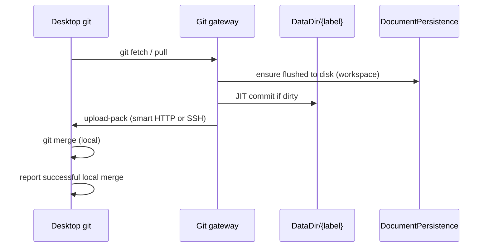

# Git sync gateway

Category: Sync
See also: [[workspace-scale-import-slice2-plan]], [[workspace-scale-import]], [[workspaces-checklist]], [[doc/roadmap/workspace-file-persistence.md]], [[doc/roadmap/workspace-file-model.md]], [[doc/current/desktop-local-files.md]], [[doc/current/workspace-local-mapping.md]], [[doc/current/persistence-model.md]], [[doc/roadmap/future-merge-sync.md]]

Git transport design for [[workspace-scale-import]]. Completed G0–G7 implementation record: [[workspace-scale-import-slice2-plan]]. Response after Git changes belongs to Lazy Load: [[lazy-load]].

Target design for synchronizing a workspace repo between the server `DataDir` and a desktop local checkout. **Workspace == repo.** One workspace label maps to one git repository rooted at `DataDir/{label}/` (verbatim label; no `@` prefix on disk — [[workspace-name-verbatim]]).

This doc records decisions that upcoming persistence and workspace work should respect. It does not supersede [[doc/current/sync-mvp.md]] for live graph editing over HTTP; git sync is a coarse, explicit file-tree transport layered on top.

## What it gives you

- A desktop user maps a workspace label to a local directory that is a git checkout with remote name **`ambit`** pointing at the server gateway (not `origin`).
- Gateway smart HTTP uses **stock** service paths **`git-upload-pack`** (fetch / workspace-pull) and **`git-receive-pack`** (push / workspace-push). Pack wire protocol and URL/service names are stock; **custom policy is server middleware**.
- **Stock `git pull`/`git push` can target gateway URLs** — no desktop path-mapping helper. Auth: HTTPS PAT via HTTP Basic (G4); cookie alone is not enough.
- **workspace-push** (prose) accepts only **fast-forward** updates when the server working tree is **clean** (**reject-dirty** — no JIT on push). **Exception:** unborn server repos (no commits yet) allow dirty trees so **Insert → Connect → Upload** can seed from the client.
- Desktop **Upload** (`DesktopGit.push`) pushes the client's attached branch (`HEAD:refs/heads/{local}`) — it does **not** probe remote HEAD via `ls-remote`. Pull still uses `ls-remote` + server JIT.
- Gateway does not read PostgreSQL, merge, or serve single-file GET — sync trees via pack protocol; file reads stay app/desktop APIs.
- Git transport stops after a successful receive or local merge. Disk-to-graph reconciliation and local freshness display respond afterward under [[lazy-load]]; they do not participate in the Git operation.

## What it avoids for now

- Server-side merge, rebase, or conflict resolution for git.
- Git integration inside the graph change log or `DbAgent`.
- Browser-only git (client-side merge requires desktop local filesystem + git binary).
- Branch switching UI, git object model in the outline, or repo-wide search.
- Replacing HTTP change batches for live editing; two layers coexist.

## Locked decisions

| Topic | Decision |
| --- | --- |
| Repo root | `DataDir/{workspaceLabel}/` — same tree as live-save / [[doc/roadmap/workspace-file-persistence.md]] (verbatim label) |
| `.git` location | **Inside** `{label}/` (e.g. `DataDir/home/.git`). Import and tree browse skip `.git` per [[workspace-scale-import]]. |
| Remote name | **`ambit`** (not `origin`) |
| Service path names | **Locked G3:** URL / `?service=` use stock **`git-upload-pack`** / **`git-receive-pack`**. Custom policy (JIT / reject-dirty) is middleware; subprocesses are stock `git upload-pack` / `git receive-pack`. |
| Stock git CLI | **Can target gateway URLs natively** for pull/push (auth still G4). No desktop path-mapping helper. |
| Pull (server → client) | On `git-upload-pack` (workspace-pull): **JIT commit on server first**, then serve upload-pack. |
| Dirty push policy | **reject-dirty** on `git-receive-pack` when server `HEAD` exists (born); **skip** clean check when unborn so Insert dirt does not block the seed push. No JIT on push. JIT only before upload-pack. Locked G0 + seed exception. |
| Missing server repo | Gateway `resolveWorkspaceRoot` calls `WorkspaceGit.ensureInit` (idempotent) so a wiped `DataDir/{label}` is recreated as an unborn repo for Connect→Upload; Insert still creates the graph node. |
| Push (client → server) | `git-receive-pack`: reject dirty when born; FF only (`receive.denyNonFastForwards`). Desktop push targets the **local** branch name (no upload-pack / `ls-remote` probe). After first seed into unborn, server symbolic HEAD is pointed at the pushed branch (init may have been `master` while client pushes `main`). |
| Desktop transport | Pack protocol over smart HTTP to stock service paths — **not** a bespoke JSON pack API. |
| Git substrate | **Option A locked:** subprocess to stock `git` for pack I/O. |
| Module shape | `WorkspaceGit` + `GitGateway`; legacy `GitSave` / `/ambit/save` stays ops-only until retired. |
| Commit message | `{base} | client: {X-Gambol-Client hint}`; omit client segment when hint absent. Locked G2. |
| Gateway URL | **`/ambit/git/{label}.git`** — `info/refs?service=git-upload-pack\|git-receive-pack`, POST `…/git-upload-pack`, `…/git-receive-pack`. **No** single-file GET. |
| Gateway | Thin ASP.NET: auth, flush, optional JIT, then delegate wire to `git upload-pack` / `git receive-pack`. |
| Auth (G3 vs G4) | **Locked G4:** HTTPS PAT via HTTP Basic (`username` + `deriveGitToken`). Issue at `GET /ambit/git-token` after cookie login. Cookie alone does **not** authenticate smart HTTP. When Auth empty, gateway open. SSH deferred. |
| Desktop + Shared | Desktop runs stock `git` against gateway; Shared = pure URL/service helpers only. |
| Module boundary | `DocumentPersistence` writes files; git gateway runs git. **Only coupling:** JIT before pull, clean-tree check before push. |
| Path moves | Filesystem moves under `{label}/` should be real renames where possible so git history stays coherent. |

## On-disk layout

```text
{DataDir}/
  home/                  ← workspace == repo work tree (verbatim label)
    .git/                ← inside {label}/
    src/
      lib.fs
    docs/
      specs/
        .amb
```

Local desktop mapping ([[doc/current/workspace-local-mapping.md]]) points label `home` at a separate directory that is a **clone** of the server repo, not the server path itself.

## Protocol flows

### workspace-pull via git-upload-pack (server → client)



1. User triggers pull in Gambol (desktop runs stock `git pull` / fetch against `ambit`).
2. Gateway ensures graph edits for that workspace are **persisted to disk** (flush).
3. Gateway runs **JIT commit** on the server repo if the working tree has uncommitted changes (autosaved files).
4. Client receives pack / merges locally. User resolves conflicts locally if any.
5. After Git completes, Lazy Load freshness behavior may compare changed local paths with server state. A successful pull means the client and server files are current, not stale.

### workspace-push via git-receive-pack (client → server)

```mermaid
%%{init: {'themeVariables': {'fontSize': '20px'}}}%%
sequenceDiagram
  participant Client as Desktop git
  participant GW as Git gateway
  participant FS as DataDir/{label}

  Client->>GW: git push ambit (local branch)
  GW->>FS: born and dirty?
  alt born and dirty
    GW->>Client: reject (dirty tree — reject-dirty)
  else unborn or clean
    GW->>FS: receive-pack (FF only; unborn seed OK)
    GW->>FS: if was unborn, point HEAD at pushed branch
    GW->>Client: ok
  end
```

1. User commits locally on desktop (manual `git commit` — not automatic on every edit).
2. Desktop POSTs pack to **`git-receive-pack`**, targeting the **client's attached branch** (not remote HEAD from `ls-remote`). Gateway refuses if the server already has history **and** the working tree is **dirty** (**reject-dirty**; no JIT commit on push). Unborn server trees (Insert artifacts, no commits yet) are allowed so the first Upload can seed.
3. Gateway refuses **non-fast-forward** pushes once the server has history. Client must pull (merge locally) and push again — Connect/Upload never force-push or auto-pull.
4. After a successful first push into an unborn repo, the gateway points server symbolic HEAD at the branch that was actually pushed (so init's `master` does not leave HEAD dangling when the client seeded `main`).

**Client should be current:** non-FF push is rejected; user merges on desktop first.

## JIT commit (server)

The only intentional cross-layer action on the server before pull. Push never JIT-commits (**reject-dirty**).

When the gateway is about to serve `upload-pack` / respond to fetch for `{label}`:

1. Confirm `DocumentPersistence` has flushed pending graph writes for that workspace.
2. If `git status --porcelain` is non-empty under `DataDir/{label}/`, run a commit, e.g. `git add -A` and `git commit` with message from `ClientIdentity.formatCommitMessage` (base e.g. `gambol: autosave before workspace-pull`, plus `| client: …` when a hint is available).
3. Proceed with fetch.

Properties:

- Pull always sees **committed** server state plus whatever was just autosaved to disk.
- Commit message is machine-generated and includes the weak client hint when known; user-facing commit remains a separate manual action on desktop before push.
- `.git` and gitignored paths follow normal git rules; graph import still skips `.git` in the outline.

## Git gateway module

Standalone concern — subprocess to `git` or thin wrapper around **`git http-backend`** / **`git receive-pack`** / **`git upload-pack`**. No REST-shaped "git API" exists; native remotes speak smart HTTP or SSH.

### Responsibilities

| Responsibility | Owner |
| --- | --- |
| Resolve `DataDir/{label}/`, auth, rate limits | Gateway |
| `rev-parse`, `status --porcelain`, JIT commit, receive-pack, upload-pack | Gateway via `git -C …` |
| Graph ops, revision, PostgreSQL | Existing `/ambit` stack |
| Write `.amb` / source files from graph | `DocumentPersistence` |

### Fast-forward enforcement

Configure the repo:

```text
receive.denyNonFastForwards = true
```

Pre-receive hook may additionally verify `expectedBase` if the transport exposes it; stock git behavior is sufficient for FF-only.

### Clean-tree enforcement (push)

Pre-check (or hook): when server `HEAD` already exists, if `git status --porcelain` is non-empty in the work tree, reject with a clear message (`server working tree dirty; workspace-pull or wait for autosave flush`). Ensures workspace-push does not race uncommitted server autosaves on a born repo. When `HEAD` is unborn (no commits), the clean check is skipped so **Insert → Connect → Upload** can seed the server from the client's branch.

### URL shape (locked G3)

```text
https://collaborative-systems.org/ambit/git/home.git/info/refs?service=git-upload-pack
https://collaborative-systems.org/ambit/git/home.git/info/refs?service=git-receive-pack
https://collaborative-systems.org/ambit/git/home.git/git-upload-pack
https://collaborative-systems.org/ambit/git/home.git/git-receive-pack
```

The `{label}.git` URL segment is **stock Smart HTTP naming**, not a bare repo path on disk. Gateway strips `.git` → label, then uses work tree `DataDir/{label}/` with `.git` **inside** that directory (`DataDir/home/.git`). It never looks for a directory named `home.git`.

Advertisement `# service=` lines and Content-Types use stock names (`application/x-git-upload-pack-advertisement`, etc.). Server subprocesses remain `git upload-pack` / `git receive-pack`.

**Compatibility:** stock `git pull`/`git push` against this URL layout work for wire paths. Auth: HTTP Basic with the git PAT from `/ambit/git-token` (not the browser cookie). No desktop helper is required for path mapping.

**Missing work tree:** `resolveWorkspaceRoot` calls `WorkspaceGit.ensureInit` on `DataDir/{label}/`, so a wiped label is recreated as an unborn repo and first Upload can seed without re-Insert.

## Credentials (HTTPS PAT — locked G4)

GitHub CLI (`gh auth login`) stores credentials so **`git push` / `git pull` work without re-prompting**. Gambol uses the same ergonomics with an HTTPS PAT:

| Mechanism | Notes |
| --- | --- |
| **HTTPS + PAT** | Deterministic git-scoped token from `Auth:Username` / `Auth:Password` via `AuthToken.deriveGitToken` (HMAC over `git:{username}` — **not** the browser cookie value). |
| **Issue** | After normal login (cookie session): `GET /ambit/git-token` → JSON `{ "username", "token" }`. When Auth is empty, response reports `disabled` and the gateway is open. |
| **Wire auth** | Smart HTTP expects `Authorization: Basic` with that username and PAT. Cookie alone → 401 + `WWW-Authenticate: Basic realm="Gambol Git"`. |
| **Credential helper** | Desktop-invoked git only: client issues PAT at `GET /ambit/git-token` after Ambit login, passes `{username,token}` on `/_desktop/git-pull|git-push|git-clone`; Desktop injects `Authorization: Basic` via `GIT_CONFIG_*` / `http.extraHeader` and clears `credential.helper` for that invocation (no GCM store). |
| **SSH** | Deferred. |
| **Not sufficient** | Browser session cookie alone does not authenticate git smart HTTP. |

Example store (manual; Connect/Clone also do this via desktop):

```text
printf "protocol=https\nhost=collaborative-systems.org\nusername=alice\npassword=<token-from-git-token>\n\n" | git credential approve
```

Reuse existing app auth to **issue** the PAT after `/ambit/login`, but do not conflate graph API session with git wire auth.

## Implications for upcoming implementation

### [[doc/roadmap/workspace-file-persistence.md]] / Stage 7–8

- Persist only under `DataDir/{label}/…`; never write into `.git`.
- Flush semantics must be well-defined so JIT commit sees a consistent tree.
- Path move handler: prefer rename syscalls so git tracks renames.

### [[lazy-load]]

- Skip `.git` in outline tree; gitignored files not auto-imported (unchanged).
- Create-only disk-to-graph stub reconciliation now responds after successful server receive through normal graph changes; the transport result is preserved if best-effort reconciliation fails.
- Expand-to-parse and freshness UI own local current / unparsed / older / newer display after pull.

### [[doc/current/desktop-local-files.md]]

- Add capability flags for `git` / `remoteConfigured` when desktop can run git.
- Pull/Push UI shells out to local git in the mapped workspace root (or prompts setup).

### [[doc/roadmap/future-merge-sync.md]]

- Multi-client graph merge is out of scope for workspace Git transport. **File repos** use fast-forward-only push; a non-current client is rejected and must pull/merge locally before retrying. Do not add server-side file merge to `DbAgent`.

## Implementation steps

Completed Git work items and checklist mapping: [[workspace-scale-import-slice2-plan]].

1. **Stage 7 live-save** — `DataDir/{label}/` on Azure `/home` — implemented; see [[doc/current/workspace-stage-plan.md]] §7.
2. **Init repo** — on workspace creation or first persist, `git init` inside `{label}/`; optional default `.gitignore` for local artifacts.
3. **Gateway v0** — smart HTTP or SSH endpoint per workspace; FF-only; **reject-dirty** on push; JIT commit before upload-pack only.
4. **Desktop remote setup** — map label → local clone; `ambit` URL; credential helper or SSH key docs.
5. **JIT commit + flush hook** — gateway calls flush then commit before fetch; integration test with dirty tree → pull sees commit.
6. **UI** — Pull / Push at workspace root via command palette (Download / Upload); surface `behind` / `ahead` / `dirty` from `git status -sb` (Git status). Gated on desktop `canGit`.
7. **Lazy Load handoff** — create-only reconciliation is implemented; remaining reconciliation and freshness capabilities are tracked in [[lazy-load]], outside Git transport.

## Tests

- **Shared / path**: canonical paths under `{label}/` exclude `.git` from import walk (when import exists).
- **Server integration** (later): push rejected when work tree dirty (reject-dirty); push rejected on non-FF; JIT commit creates commit when porcelain non-empty before fetch; FF push updates `HEAD` and files on disk match commit.

## Non-goals

- Server-side `git merge` or conflict markers in files.
- Automatic commit on every graph edit (only JIT commit before pull on server; manual commit on desktop before push).
- Hosting multiple branches in the UI (single default branch; `main` unless configured).
