# Parse / Upload for Current Files (Warm Reconcile)

Status: Draft plan (no implementation yet)

See also: [[doc/roadmap/workspace-file-model.md]], [[doc/reference/formats/code-shape.md]], [[doc/roadmap/workspace-text-outline-conversion.md]], [[src/Shared/CommandEntry.fs]], [[src/Client/UpdateImport.fs]], [[src/Server/DocumentPersistence.fs]], [[src/Shared/dotnet/LazyLoadReconciliationApply.fs]], [[src/Shared/dotnet/DocumentParseOps.fs]], [[src/Shared/dotnet/ImportDocument.fs]]

Split with [[doc/roadmap/parsefile-document-codec-import.md]]: that plan wires Parse / Upload through the **document reader**; this plan is the **Current** warm slice (live graph + `previousText`). Paste is separate: [[doc/roadmap/paste-document-codec-import.md]].

## What it gives you

- **Unparsed** owned `Special File` under a document root: unchanged — Parse / Upload (`Ctrl+Shift+>`) cold-imports disk text into the graph (parse).
- **Current** (parsed) owned file: same command and shortcut, but execution **warm-reconciles** disk text against existing nodes (stable `NodeId` where line/content matches), instead of being unavailable.
- One user-facing action: “sync this file from disk into the outline.”

## What it avoids for now

- A separate palette command or `ReconcileFile` `ContextualTarget` case.
- **Client-side** warm reconcile (raw disk text on client, `DocumentParseOps` on client with live graph).
- Changing workspace/directory reconcile (stub creation under DataDir).
- Markdown/XML format work beyond existing codec dispatch.

## Architecture: server-side reconcile

File and graph live on the **server**. Warm reconcile runs where both are available — same boundary as lazy-load dir-info apply.

```mermaid
%%{init: {'themeVariables': {'fontSize': '20px'}}}%%
flowchart LR
  Cmd["Parse / Upload"] --> Client["UpdateImport.parseFileOp"]
  Client --> HTTP["/_desktop/file or /ambit/file"]
  HTTP --> Read["Read disk text"]
  Read --> Graph["Load live graph + resolve fileId"]
  Graph --> Prev["previousArtifactText from graph export"]
  Prev --> Plan["DocumentParseOps.planApplyArtifact"]
  Plan --> Out["Return ops package or apply on server"]
  Out --> ClientApply["Client applyAndPost if package returned"]
```



**Client role:** trigger `ParseFile` for both Unparsed and Current files; same HTTP import path as today. No codec parsing, no warm planning, no raw-text fetch for reconcile on the client.

**Server/desktop role:** read artifact from disk; resolve document root on the **live graph**; project `previousText` via `LazyLoadReconciliationApply.previousArtifactText` (graph export through `DocumentFormat.writeArtifact`, not disk bytes); run `DocumentFormat.readArtifact` warm path through `DocumentParseOps.planApplyArtifact`; return a client-applicable package **or** apply ops server-side and sync.

Reference pattern — lazy-load dir-info reconcile ([[src/Shared/dotnet/LazyLoadReconciliationApply.fs]] `parseDirInfoIfPresent`):

1. Read new artifact text (from dir-info payload; Parse / Upload reads from disk instead).
2. `previousText = previousArtifactText graph nodeId relativePath`.
3. `DocumentParseOps.planApplyArtifact graph nodeId relativePath text previousText`.
4. Apply ops (lazy-load applies on server; Parse / Upload may return ops to client — pick one and keep consistent).

Cold import today ([[src/Server/DocumentPersistence.fs]] `importPackageForReference`) reads disk but builds package from a **stub** graph with `previousText = None`. Warm Current import must pass the **real** graph and `Some previousText`.

## Design decision: same command, branched execution

**Keep `ParseFile` + `ParseOrPush`.** Branch on `documentState` at the **server import boundary** (client may pass `fileId` / state hint on the request).

| | Unparsed | Current |
|---|----------|---------|
| `contextualTarget` | `Some (ParseFile rootId)` | `Some (ParseFile rootId)` *(extend)* |
| Disk read | `/_desktop/file` / `/ambit/file` | same |
| Graph context | stub graph (cold) | **live server graph** at `fileId` |
| Merge | cold — `ImportDocument.buildFilePackage` → client `buildImportChange` | warm — `planApplyArtifact` with `previousText = Some _` on live graph |
| `documentState` after | `Unparsed → Current` | stays `Current` |

**Why not `ReconcileFile`?** `ParseOrPush` already multiplexes workspace, directory, and file targets. Parsed files are the same user intent (pull disk into outline). A new `ContextualTarget` would duplicate palette filtering without clearer UX. Internal helpers may be named `buildReconcilePackage` / `reconcileFileForReference`.

## Current codebase (baseline)

### Availability — `CommandEntry.contextualTarget`

```99:105:src/Shared/CommandEntry.fs
        | _ when occurrence.ref = Ownership.Owner ->
            DocumentPartition.documentRootForNode graph occurrence.id
            |> Option.bind (fun rootId ->
                match Map.tryFind rootId graph.nodes with
                | Some { kind = Special File; documentState = Unparsed } ->
                    Some(ParseFile rootId)
                | _ -> None)
```

Parsed (`Current`) files return `None` → Parse / Upload hidden. Test locked in: `CommandEntryTests` “ignores ref occurrence” sets file to `Current` and expects `None`.

### Execution — client (trigger only)

- `Commands.parseOrPushOp` → `parseUnparsedFileOp` on `ParseFile`.
- `UpdateImport.parseUnparsedFileOp` guards `documentState = Unparsed`; otherwise no-op.
- HTTP GET → `decodeDesktopImportPackage` → `ImportText.buildImportChange` → `applyAndPost`.
- Success detail: `"parsed: " + path`.

Client changes for Current: extend availability guard removal on client **or** keep client guard until server warm path exists; HTTP request must carry enough context (`fileId`, and optionally `documentState`) for server to branch.

### Disk → package — server/desktop (codec path, cold only today)

- `LocalProxy.handleImport` (files): `ImportDocument.buildFilePackage path text`.
- `DocumentPersistence.importPackageForReference`: same — **no graph**, cold stub only.
- `ImportDocument.buildFilePackage`: stub graph, `DocumentParseOps.planApplyArtifact` with **`previousText = None`**.

### Warm reconcile already exists (server/dotnet)

- `DocumentFormat.readArtifact` — `Some previousText` → handler `readWarm`.
- `DocumentParseOps.planApplyArtifact` — turns warm/cold read into `Op list` on a graph.
- `LazyLoadReconciliationApply.previousArtifactText` — exports current graph outline via `DocumentFormat.writeArtifact` for warm input (not disk file contents).
- `LazyLoadReconciliationApply.parseDirInfoIfPresent` — end-to-end warm apply on server graph during lazy-load.

### `DocumentState`

```70:72:src/Shared/Model.fs
type DocumentState =
    | Current
    | Unparsed
```

`Current` = parsed / loaded document. `Unparsed` = stub awaiting first import.

## Gap

`importPackageForReference` builds cold packages **without** the live graph. Warm reconcile needs:

1. Raw file text from disk (server already reads this).
2. Existing graph at `fileId` (server holds authoritative graph).
3. `previousText` projected from graph export (`previousArtifactText`), matching lazy-load reconcile.

Today neither the server import endpoint nor the client runs warm `planApplyArtifact` for manual Parse / Upload on Current files.

## Implementation steps

Numbered slices; each should be reviewable alone.

### 1. Extend command availability (Shared)

**File:** `src/Shared/CommandEntry.fs`

- Match `Some { kind = Special File }` (drop `documentState = Unparsed` guard).
- Keep owner-occurrence and `DocumentPartition.documentRootForNode` rules.

**Verify:** `tests/Shared.Tests/CommandEntryTests.fs` — Current file at owned child returns `Some(ParseFile fileId)`; ref occurrence still `None`.

### 2. Server warm import planner (Server + Shared/dotnet)

**Files:** `src/Server/DocumentPersistence.fs`, `src/Shared/dotnet/ImportDocument.fs` (or dedicated helper)

Add something like:

```fsharp
let buildReconcilePackage
    (graph: Graph)
    (fileId: NodeId)
    (sourcePath: string)
    (text: string)
    : Result<DesktopImportPackage, string>
```

Behavior:

1. Resolve `relativePath` from `NodeDesktopPath.artifactRelativeForReference sourcePath` (or `DocumentPartition.artifactFileRelative graph fileId`).
2. Guard `graph.nodes.[fileId].documentState = Current`.
3. `previousText = LazyLoadReconciliationApply.previousArtifactText graph fileId relativePath`.
4. `DocumentParseOps.planApplyArtifact graph fileId relativePath text previousText`.
5. Package ops for client apply (peel/attach only if needed for transport shape) **or** apply via `LazyLoadReconciliationApply.applyOps` on server and return sync — mirror existing lazy-load apply semantics.

Extend `importPackageForReference` (or sibling endpoint) to accept `fileId` + live graph, branch Unparsed → `buildFilePackage` / Current → `buildReconcilePackage`.

**Verify:** `tests/Server.Tests/DocumentPersistenceTests.fs` — warm case: graph with one line node, edited disk text changes line body but **same** `NodeId` (pattern from `DocumentAssemblyTests` `readArtifact warm Plain keeps id on line text edit`).

### 3. Client execution branch (minimal)

**Files:** `src/Client/UpdateImport.fs`, `src/Client/Commands.fs`

- Rename or wrap `parseUnparsedFileOp` → `parseFileOp fileId model`:
  - `Unparsed` → existing `requestImportAtPath` + `commitParsedFile` (pass `fileId` on request if server needs it).
  - `Current` → same HTTP path with warm server branch; detail `"reconciled: " + path`.
- **No** client-side `buildReconcileChange`, **no** raw-text-only fetch, **no** `DocumentParseOps` on client graph.

**Verify:** manual — select owned child of parsed `.md`/`.txt` file, `Ctrl+Shift+>`, confirm nodes update with stable ids.

### 4. Unparsed path alignment with codec work (dependency)

Parallel **ParseFile→codec** work should ensure Unparsed imports use **codec** ops (`ImportDocument.buildFilePackage`), not paste flattening (`ImportText.buildPackage`). Current tree: desktop/server already use `ImportDocument`; client still accepts any valid package.

This slice does **not** require rewriting Unparsed flow if codec work lands first. If implementing reconcile first, avoid regressing Unparsed: keep cold `buildFilePackage` path until codec client path merges.

**Files likely touched by codec agent:** `UpdateImport.fs`, `LocalProxy.fs`, `DocumentPersistence.fs`, `ImportDocument.fs`, `Serialization.fs`.

**Merge rule:** reconcile planner uses same `DocumentParseOps` path as `buildFilePackage`; Unparsed cold = stub graph + `previousText = None`; Current warm = live graph + `Some previousText` from `previousArtifactText`.

## Tests

| Area | File | Cases |
|------|------|-------|
| Availability | `CommandEntryTests.fs` | Current file → `ParseFile`; ref → `None` |
| Warm planner | `DocumentPersistenceTests.fs` or `ImportDocumentTests.fs` | Id stability on edit; empty/invalid text errors |
| Regression | `ImportDocumentTests.fs` | Cold `buildFilePackage` unchanged |
| Optional | `HistoryTests.fs` | Current file reconcile does not flip `documentState` |

Run:

```bash
dotnet build tests/Shared.Tests -c Debug
dotnet test tests/Shared.Tests -c Debug --no-build --filter "FullyQualifiedName~CommandEntryTests|FullyQualifiedName~ImportDocumentTests"
dotnet build tests/Server.Tests -c Debug
dotnet test tests/Server.Tests -c Debug --no-build --filter "FullyQualifiedName~importPackage|FullyQualifiedName~reconcile"
```

Client/browser verification is manual: select owned child of parsed `.md`/`.txt` file, `Ctrl+Shift+>`, confirm nodes update with stable ids.

## Coordination checklist (with e1a2c144)

- [ ] Confirm server import endpoint shape for warm branch (`fileId` query/body, graph access).
- [ ] Confirm Unparsed client path switches to codec package before or with this work.
- [ ] Avoid duplicate cold/warm logic — both call `DocumentParseOps.planApplyArtifact`; only graph + `previousText` differ.
- [ ] Do not edit the same lines in `UpdateImport.fs` without syncing both agents.

## Files expected to change (implementation)

| File | Change |
|------|--------|
| `src/Shared/CommandEntry.fs` | Availability for `Current` files |
| `src/Server/DocumentPersistence.fs` | Warm branch in file import; graph + disk read |
| `src/Shared/dotnet/ImportDocument.fs` | `buildReconcilePackage` (or equivalent) |
| `src/Shared/dotnet/LazyLoadReconciliationApply.fs` | Expose `previousArtifactText` if still internal |
| `src/Client/UpdateImport.fs` | Branch Unparsed vs Current; pass `fileId` to server |
| `src/Client/Commands.fs` | Wire `parseFileOp` |
| `src/Server/Api.fs` | Endpoint params for warm import (if needed) |
| `tests/Shared.Tests/CommandEntryTests.fs` | Update Current-file expectation |
| `tests/Server.Tests/DocumentPersistenceTests.fs` | Warm reconcile import tests |

## Success criteria

1. Parse / Upload available on owned children of both Unparsed and Current file documents (with desktop path).
2. Unparsed: behavior unchanged (cold parse, state → Current).
3. Current: disk edit reconciles into graph with warm id retention where format allows; planning runs **server-side** with live graph.
4. No new command id; palette still filters via `contextualCommandAvailable` on `ParseFile`.
