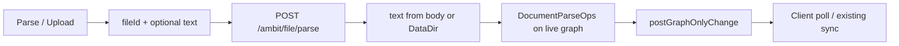

# Parse / Upload for Current Files (Warm Reconcile)

Status: Server-apply ParseFile landed (Shared/Client/Desktop verified); Server.Tests rebuild blocked while debugger locks Server bin.

See also: [[doc/roadmap/parsefile-document-codec-import.md]], [[doc/roadmap/paste-document-codec-import.md]], [[doc/roadmap/workspace-file-model.md]], [[doc/reference/formats/code-shape.md]], [[src/Shared/CommandEntry.fs]], [[src/Client/UpdateImport.fs]], [[src/Server/DocumentPersistence.fs]], [[src/Shared/dotnet/LazyLoadReconciliationApply.fs]], [[src/Shared/dotnet/DocumentParseOps.fs]], [[src/Shared/dotnet/ImportDocument.fs]], [[src/Server/LazyLoadReconciliationServer.fs]]

Split with [[doc/roadmap/parsefile-document-codec-import.md]]: that plan wires Parse / Upload through the **document reader**. This plan is the **Current** warm slice and the shared **server-apply** command path for Unparsed + Current. Paste is separate: [[doc/roadmap/paste-document-codec-import.md]].

## What it gives you

- **Unparsed** owned `Special File`: Parse / Upload (`Ctrl+Shift+>`) cold-imports disk text into the graph on the **server**.
- **Current** (parsed) owned file: same command, warm-reconciles disk text against existing nodes (stable `NodeId` where line/content matches).
- One user-facing action: “sync this file from disk into the outline.”
- Desktop may attach **file content** with the command; it never sends a subgraph or reconcile package for client apply.

## What it avoids for now

- A separate palette command or `ReconcileFile` `ContextualTarget` case.
- Client applying import/reconcile packages for ParseFile (no peel/attach for this command).
- GET `/ambit/file?fileId=` returning a package for client apply.
- Changing workspace/directory reconcile (stub creation under DataDir).
- Markdown/XML format work beyond existing codec dispatch.

## Architecture: command → server graph update

File content may come from the client (desktop upload) or from server DataDir. The **graph** always lives and mutates on the server — same boundary as directory reconcile (`postGraphOnlyChange`).

**Client role:** resolve contextual `ParseFile fileId`; optionally read **raw file text** from desktop; POST command `{ fileId, text? }`; show result; receive graph updates via existing sync. No codec planning, no package apply.

**Desktop role (optional):** supply file **bytes/text** only when the file lives on the desktop machine (`GET /_desktop/file?…&content=1`). Not a subgraph.

**Server role:** load live graph; resolve artifact path from `fileId`; take body text or read DataDir; run document reader (cold Unparsed / warm Current); apply ops via `postGraphOnlyChange`.

Reference pattern — [[src/Server/LazyLoadReconciliationServer.fs]] directory reconcile: plan ops on server graph → `postGraphOnlyChange` → client syncs.

## Design decision: same command, branched execution

**Keep `ParseFile` + `ParseOrPush`.** Branch on `documentState` inside the server planner.

| | Unparsed | Current |
|---|----------|---------|
| `contextualTarget` | `Some (ParseFile rootId)` | `Some (ParseFile rootId)` |
| Content | body text or DataDir | same |
| Graph context | live graph at `fileId` | live graph at `fileId` |
| Merge | cold `previousText = None` + `SetDocumentState` → Current | warm `previousText` from graph export |
| Apply | server `postGraphOnlyChange` | same |

**Why not return a package?** Client apply of peel/attach packages duplicates authority the server already has. Directory reconcile already proved server-apply + poll sync.

**Why optional text?** Desktop-local files may not exist under server DataDir yet; uploading content with the command keeps one parse path without a package round-trip.

## Current codebase (baseline / what to remove)

### Keep

- `CommandEntry.contextualTarget` — `ParseFile` for owned File (Unparsed and Current).
- `DocumentParseOps.planApplyArtifact` / warm + cold reader.
- `GET /ambit/file?path=` cold **package** only if still needed for non-ParseFile consumers (desktop directory listing stays on `/_desktop/file` package). Not used for Current ParseFile.

### Remove / stop using for ParseFile

- `Api.getImportFileWithGraph` and optional `fileId` on `GET /ambit/file`.
- `DocumentPersistence.importPackageForFile` package return for client apply.
- Client `commitParsedFile` / `commitReconciledFile` / `applyAndPost` of import packages for this command.

## Implementation steps

### 1. Shared planner (ops, not package)

**File:** [[src/Shared/dotnet/ImportDocument.fs]]

- `planParseFile graph fileId text : Result<Op list, string>`
- Unparsed: cold plan + leading `SetDocumentState(Unparsed, Current)`.
- Current: warm plan with `previousArtifactText`.
- Keep `buildFilePackage` for paste-compatible / desktop package consumers unrelated to this command path.

**Verify:** Shared.Tests — id stability on Current edit; Unparsed marks Current; blank reject.

### 2. Server plan + apply

**Files:** [[src/Server/DocumentPersistence.fs]], [[src/Server/Api.fs]], [[src/Server/RouteRegistration.fs]]

- `planParseFile dataDir graph fileId textOpt` — text from body or DataDir read.
- `POST /ambit/file/parse` body `{ fileId, text? }` → plan → `postGraphOnlyChange`.
- Strip `fileId` from `GET /ambit/file`; remove `getImportFileWithGraph`.

**Verify:** Server.Tests — warm id retention; POST parse updates state when seeded.

### 3. Client command (trigger + optional content)

**Files:** [[src/Client/UpdateImport.fs]], [[src/Desktop/LocalProxy.fs]], [[src/Client/UpdateCodec.fs]]

- Desktop: `GET /_desktop/file?path=&content=1` → `{ content }` (raw text).
- `parseFileOp`: optional desktop content → `POST /ambit/file/parse` → detail string; no package decode/apply.
- Missing desktop file → POST without text (server DataDir).

**Verify:** manual — Unparsed and Current Parse / Upload; desktop and web-only.

## Tests

| Area | File | Cases |
|------|------|-------|
| Planner | `ImportDocumentTests.fs` | `planParseFile` warm id keep; Unparsed → Current; blank |
| Persistence | `DocumentPersistenceTests.fs` | DataDir text + live graph ops; drop package-for-fileId cases |
| HTTP | `DocumentPersistenceTests.fs` | `POST /ambit/file/parse`; `GET /ambit/file` without fileId |
| Availability | `CommandEntryTests.fs` | unchanged Current → `ParseFile` |

## Success criteria

1. Parse / Upload available on owned children of Unparsed and Current files.
2. Client never applies an import/reconcile package for ParseFile.
3. Server mutates agent graph; client updates via existing sync.
4. Desktop may send file text only; server may read DataDir when text omitted.
5. No new command id.
