# ParseFile Document Codec Import

Status: In progress — core wiring landed; verification and doc follow-up remain.
See also: [[doc/roadmap/workspace-format-md.md]], [[doc/roadmap/workspace-scale-import.md]], [[doc/roadmap/workspace-text-outline-conversion.md]], [[doc/roadmap/parse-file-reconcile-current.md]], [[doc/roadmap/paste-document-codec-import.md]], [[src/Shared/documents/DocumentFormat.fs]], [[src/Shared/dotnet/DocumentParseOps.fs]], [[src/Shared/dotnet/ImportDocument.fs]], [[src/Client/UpdateImport.fs]]

## What it gives you

Parse / Upload on an **Unparsed** File (e.g. `AGENTS.md`) cold-parses disk text through the Md (or Plain / Amb) codec into a **nested outline**, not a flat tab-paste sibling list. The command works in web-only sessions (server read) and desktop sessions (desktop read with server fallback).

**Cold parse contract:** disk bytes → codec `readCold` → graph ops. No merge against existing outline content because the file is still an Unparsed stub.

## Cold parse only — no DiffPlex, no warm merge

This slice is **Unparsed ParseFile only**. It must never run warm reconcile.

| Step | Unparsed ParseFile (this plan) |
|------|--------------------------------|
| Graph context | **Stub** graph minted per import ([[src/Shared/dotnet/ImportDocument.fs]] `stubGraph`) |
| `previousText` | **`None`** — always |
| Read path | `DocumentFormat.readArtifact` → handler **`readCold`** ([[src/Shared/documents/DocumentFormat.fs]]) |
| Merge | **None** — no DiffPlex, no LCS line merge, no id-stable reconcile |
| Output | Fresh node ids from cold read → `Op list` via [[src/Shared/dotnet/DocumentParseOps.fs]] `planApplyArtifact` |
| After apply | `documentState` **Unparsed → Current** |

`DocumentParseOps.planApplyArtifact` accepts `previousText: string option`. When `None`, codecs use `readCold` only; DiffPlex and warm helpers are not invoked. **This plan always passes `None`.**

Warm reconcile (`previousText = Some _`, `readWarm`, DiffPlex, stable `NodeId` where content matches) is a **separate slice** for **Current** files on the server: [[doc/roadmap/parse-file-reconcile-current.md]]. Do not add warm branching to `buildFilePackage` or the Unparsed client path here.

## What it avoids for now

- **ParseFile on the Fable client** — Unparsed Parse / Upload reads disk at Server/Desktop and calls [[src/Shared/dotnet/ImportDocument.fs]] `buildFilePackage`. [[src/Shared/dotnet/DocumentParseOps.fs]] lives in DotNet because it sits on [[src/Shared/documents/DocumentFormat.fs]] `readArtifact`, which also exposes warm/DiffPlex reconcile — not a Fable Client dependency for this slice.
- **Warm reconcile on Parse / Upload** — no `previousText`, no DiffPlex, no LCS merge on this path (see cold-parse table above).
- **Current-file disk sync** — parsed files stay unavailable for Parse / Upload until [[doc/roadmap/parse-file-reconcile-current.md]] lands server-side warm import.
- Changing directory listing import (still tab paste via [[src/Shared/ImportText.fs]]).
- **Clipboard / text paste** — not this plan. Paste is a separate **cold client parse** (no merge, no DiffPlex, no `DocumentParseOps` / DotNet requirement); see [[doc/roadmap/paste-document-codec-import.md]]. Sharing cold codec semantics with Unparsed ParseFile is enough here — do not implement paste in this slice.

## Unparsed cold vs Current warm (reconcile)

Same user command (`ParseFile`), different execution — split across two plans:

| | Unparsed — **this plan** | Current — [[doc/roadmap/parse-file-reconcile-current.md]] |
|---|--------------------------|-------------------------------------------------------------|
| `documentState` | `Unparsed` | `Current` |
| Availability today | Parse / Upload shown | Hidden until reconcile slice |
| Graph | Stub (cold import) | Live server graph at `fileId` |
| `previousText` | `None` | `Some _` from `LazyLoadReconciliationApply.previousArtifactText` |
| Read | `readCold` | `readWarm` (DiffPlex / LCS where codec supports it) |
| Planner entry | `ImportDocument.buildFilePackage` | `buildReconcilePackage` (planned) |
| Id stability | New ids every cold parse | Retain ids where warm merge allows |

## Paste import (cross-ref — not this plan)

Clipboard paste is **not** ParseFile and **does not need DiffPlex**. ParseFile cold import (this plan, Server/Desktop) and paste cold parse (Client) share the **cold codec** (`readCold` / `previousText = None` → graph→ops) — not warm reconcile, not DiffPlex, not a merge against existing outline content.

| | Unparsed ParseFile (this plan) | Paste ([[doc/roadmap/paste-document-codec-import.md]]) |
|---|--------------------------------|------------------------------------------------------|
| Entry | Parse / Upload on Unparsed File | Ctrl+V / text import (planned) |
| Where it runs | Server / Desktop | **Client** — cold parse only |
| Merge | **None** | **None** — just cold parse |
| `previousText` | **`None`** | **`None`** |
| DiffPlex / warm | **No** | **No** — paste never needs DiffPlex |
| Planner today | `ImportDocument.buildFilePackage` → DotNet `planApplyArtifact` | Must **not** require DotNet `DocumentParseOps`; Fable-safe cold extract only |

**Architecture (why DotNet vs Fable):** `DocumentParseOps` is in DotNet because it calls `DocumentFormat.readArtifact`, and that Documents surface also carries warm/DiffPlex reconcile. Paste only needs the **cold-only** path (`readCold` / `previousText = None` + graph→ops), which can be Fable-safe. Warm reconcile stays server-side ([[doc/roadmap/parse-file-reconcile-current.md]]). Do not implement paste here — defer to [[doc/roadmap/paste-document-codec-import.md]].

## Current state (parallel agents)

### Done — UpdateImport desktop gate

[[src/Client/UpdateImport.fs]]:

- Removed early return from `parseUnparsedFileOp` when `canImportDesktop` is false.
- `requestImportAtPath`: try `/_desktop/file` when desktop import is available; on missing file fall back to `/ambit/file`; when no desktop skip straight to server.
- `importFromServer` extracted for the server path.

[[src/Client/Commands.fs]]:

- `contextualCommandAvailable` for `ParseFile` is always `true` (no desktop capability gate).

**Verify:** Parse / Upload appears and runs for Unparsed Files in web-only client; server import succeeds when file exists in DataDir.

### Done — ParseFile → document codec routing (core, cold only)

New [[src/Shared/dotnet/ImportDocument.fs]]:

- `buildFilePackage` creates a synthetic File stub graph, calls `DocumentParseOps.planApplyArtifact` with **`previousText = None`** (cold `readCold` path only), peels root-targeting ops into `topLevelIds` + nested ops, returns `DesktopImportPackage` compatible with `ImportText.buildImportChange`.

Wired at HTTP import boundaries:

| Layer | File | Change |
|-------|------|--------|
| Server | [[src/Server/DocumentPersistence.fs]] | `importPackageForReference` → `ImportDocument.buildFilePackage` (cold) |
| Server | [[src/Server/Api.fs]] | unchanged; delegates to DocumentPersistence |
| Desktop | [[src/Desktop/LocalProxy.fs]] | files → `ImportDocument.buildFilePackage`; directories → `ImportText.buildPackage` |

Client path unchanged and correct: `parseUnparsedFileOp` → HTTP package → `commitParsedFile` → `ImportText.buildImportChange`.

Project registration: [[src/Shared/dotnet/Gambol.Shared.DotNet.fsproj]] includes `ImportDocument.fs`.

### Done — tests (written, run pending)

[[tests/Shared.Tests/ImportDocumentTests.fs]] (registered in fsproj):

- Md heading snippet produces nested `Replace` ops (AGENTS.md-shaped).
- Document package has fewer top-level ids than paste for same text.
- `buildImportChange` + apply yields nested graph (`# section` → `- item`).
- Blank input rejected.

## Remaining work

### 1. Verify tests pass

Run targeted suite (foreground):

```bash
dotnet build tests/Shared.Tests -c Debug
dotnet test tests/Shared.Tests -c Debug --no-build --filter "FullyQualifiedName~ImportDocument|FullyQualifiedName~ImportText"
dotnet build tests/Server.Tests -c Debug
dotnet test tests/Server.Tests -c Debug --no-build --filter "FullyQualifiedName~importPackage"
```

Fix any failing assertions before merge. Prior run was interrupted mid-suite; two ImportDocument tests had assertion drift (fixed in working tree — confirm green).

### 2. Manual end-to-end check

1. Open workspace with Unparsed `AGENTS.md` stub.
2. Select file occurrence; run Parse / Upload.
3. Expect: one top-level `# Agent Instructions` (or equivalent), nested `##` sections indented in outline, not flat siblings.

Repeat with desktop host: file only on server (desktop missing) should still parse via server fallback.

### 3. Optional test hardening

- Server test [[tests/Server.Tests/DocumentPersistenceTests.fs]] `importPackageForReference builds package from DataDir file`: extend `goal.md` fixture to assert nested ops when content uses headings (currently only checks non-empty ops).
- Add AGENTS.md excerpt fixture test if regressions are a concern.
- Assert `buildFilePackage` never accepts or forwards `previousText` (cold-only regression guard).

### 4. Doc currency (low priority)

- [[doc/arch.md]] paste/import bullet: note `ImportDocument` for file codec import at Server/Desktop boundary.
- [[doc/roadmap/workspace-scale-import.md]] expand-to-parse section: reference this plan.

No source changes required for slice completion if tests and manual check pass.

## Architecture note

```mermaid
%%{init: {'themeVariables': {'fontSize': '20px'}}}%%
flowchart LR
  Cmd["Parse / Upload\n(Unparsed only)"] --> Client["UpdateImport.parseUnparsedFileOp"]
  Client --> Desktop["/_desktop/file"]
  Client --> Server["/ambit/file"]
  Desktop --> Build["ImportDocument.buildFilePackage"]
  Server --> Build
  Build --> Stub["stubGraph + previousText = None"]
  Stub --> Cold["DocumentFormat.readArtifact → readCold"]
  Cold --> Ops["DocumentParseOps.planApplyArtifact"]
  Ops --> Pkg["DesktopImportPackage"]
  Pkg --> Commit["ImportText.buildImportChange"]
  Commit --> Graph["nested outline in graph"]
```



Directory reconcile import stays on tab paste (`ImportText.buildPackage`) because listing text is `[[name]] ts` lines, not a document artifact.

**Paste (separate plan):** Ctrl+V is cold client parse only — same cold codec as Unparsed ParseFile (`previousText = None`, **no DiffPlex**, no merge). It does not need DotNet `DocumentParseOps`; a Fable-safe cold extract is enough — [[doc/roadmap/paste-document-codec-import.md]]. Not blocked by this plan’s Server/Desktop file routing; do not implement paste here.

**Warm reconcile (separate plan):** for **Current** files, graph and disk live on the server. Parse / Upload will warm-reconcile there ([[doc/roadmap/parse-file-reconcile-current.md]]): read disk, load live graph, project `previousText` via [[src/Shared/dotnet/LazyLoadReconciliationApply.fs]], run `DocumentFormat.readArtifact` → **`readWarm`** through `DocumentParseOps.planApplyArtifact` — server-side only, **not** on the Fable client, **not** for paste, and **not** in this plan’s `buildFilePackage` path.

## Implementation steps (for finishing agent)

1. Run targeted tests → all green.
2. Manual AGENTS.md parse check (web + desktop-missing fallback).
3. If tests fail: adjust assertions only unless codec bug found.
4. Confirm `buildFilePackage` and `importPackageForReference` still pass **`None`** for `previousText` — no warm/DiffPlex creep.
5. Optionally extend Server.Tests md nesting assertion.
6. Optionally update arch / workspace-scale-import cross-links.

**Out of scope here:** paste implementation ([[doc/roadmap/paste-document-codec-import.md]]), `buildReconcilePackage`, Current-file availability, server warm branch — track warm in [[doc/roadmap/parse-file-reconcile-current.md]].

## Risks / edge cases to watch

- **Synthetic root id:** Server generates fresh node ids per import (same as paste). Client attaches via `topLevelIds`; no id remap needed. Expected for cold parse — id stability is reconcile’s concern.
- **Peel root ops:** `peelDocumentRootOps` must stay in sync with `buildImportChange`'s attach `Replace` — duplicate root replaces would fail History validation.
- **Plain / Amb files:** `buildFilePackage` routes all non-directory files through `DocumentFormat.classifyCodec`; `.txt` uses Plain codec, `.amb` uses Amb. Tab-indented paste-shaped `.txt` will parse as Plain lines, not tab tree — intentional alignment with lazy-load cold assembly path.
- **Amb-in-plain detection:** `looksLikeAmbContent` applies on read; paste fallback is no longer used for file import.
- **Accidental warm path:** if `importPackageForReference` later gains graph access for Unparsed imports, keep branching Unparsed → cold `buildFilePackage` only; warm belongs in reconcile slice. Paste must stay on cold `previousText = None` — do not route Ctrl+V through DiffPlex or server warm import.

## Success criteria

- [ ] ImportDocument + ImportText Shared.Tests pass.
- [ ] Server `importPackageForReference` tests pass.
- [ ] AGENTS.md Parse / Upload shows heading-nested outline in UI.
- [ ] Parse / Upload works without desktop host when file exists on server.
- [ ] Unparsed import uses cold `readCold` only (`previousText = None`); no DiffPlex on this path.
