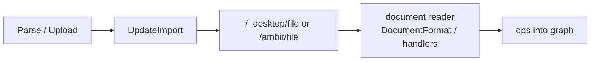

# ParseFile → Document Reader

Status: Core Unparsed wiring landed; verification and Current warm remain.

See also: [[doc/roadmap/parse-file-reconcile-current.md]], [[doc/roadmap/paste-document-codec-import.md]], [[doc/roadmap/workspace-format-md.md]], [[doc/reference/formats/code-shape.md]], [[src/Shared/documents/DocumentFormat.fs]], [[src/Shared/dotnet/ImportDocument.fs]], [[src/Client/UpdateImport.fs]]

## What it gives you

Parse / Upload reads a file on disk and updates the outline through the **document reader** ([[src/Shared/documents/DocumentFormat.fs]] / format handlers), not through tab-paste flattening.

- **Unparsed** File → first import: reader builds a nested outline (Md headings, Plain indent, Amb); `documentState` becomes `Current`.
- **Current** File → same command later: reader reconciles against existing nodes (warm path with `previousText`). Details live in [[doc/roadmap/parse-file-reconcile-current.md]].
- Works in web-only sessions (server read) and desktop sessions (desktop read with server fallback).

## What it avoids for now

- Changing directory listing import (still tab paste via [[src/Shared/ImportText.fs]]).
- Clipboard / text paste — separate plan: [[doc/roadmap/paste-document-codec-import.md]].
- Client-side file read or client-side warm planning — disk read and document apply planning stay at Server / Desktop.
- A second command for “reconcile”; keep `ParseFile` / Parse / Upload.

## Minimal flow



| Step | Behavior |
|------|----------|
| Client | Trigger only: resolve path, GET package, `ImportText.buildImportChange`, apply |
| Server / Desktop | Read file bytes; route files through [[src/Shared/dotnet/ImportDocument.fs]] |
| Document reader | Classify by path → handler read → ops. Unparsed uses stub graph (cold). Current uses live graph + `previousText` (warm) — [[doc/roadmap/parse-file-reconcile-current.md]] |
| Directories | Still `ImportText.buildPackage` (listing lines, not a document artifact) |

Unparsed today: `ImportDocument.buildFilePackage` → `DocumentColdParse.planApplyCold` → peel → `DesktopImportPackage`. Current warm is the same reader entry with previous text; do not re-litigate warm mechanics here.

## Implementation status

### Done

- [[src/Client/UpdateImport.fs]] — web-only Parse / Upload; desktop GET with server fallback when file missing locally.
- [[src/Client/Commands.fs]] — `ParseFile` available without desktop capability gate.
- [[src/Shared/dotnet/ImportDocument.fs]] `buildFilePackage` — document reader for file text (not paste).
- Wire-up: [[src/Server/DocumentPersistence.fs]] `importPackageForReference`; [[src/Desktop/LocalProxy.fs]] files → `buildFilePackage`, directories → paste package.
- [[tests/Shared.Tests/ImportDocumentTests.fs]] — Md nesting vs paste flattening; blank reject; apply yields nested graph.

### Remaining

1. **Verify tests** — ImportDocument / ImportText Shared.Tests; Server `importPackageForReference` if present.
2. **Manual check** — Unparsed `AGENTS.md`: nested headings in outline, not flat siblings; desktop-missing → server fallback.
3. **Current warm** — availability + server live-graph branch: [[doc/roadmap/parse-file-reconcile-current.md]] (not blocked on DiffPlex framing; reader already supports warm when `previousText` is supplied).
4. **Optional** — Server fixture assert Md nesting; arch / workspace-scale-import cross-links.

## Tests / verification

```bash
dotnet build tests/Shared.Tests -c Debug
dotnet test tests/Shared.Tests -c Debug --no-build --filter "FullyQualifiedName~ImportDocument|FullyQualifiedName~ImportText"
dotnet build tests/Server.Tests -c Debug
dotnet test tests/Server.Tests -c Debug --no-build --filter "FullyQualifiedName~importPackage"
```

Success:

- [ ] Shared ImportDocument tests green (nested Md ops).
- [ ] Server import package tests green.
- [ ] AGENTS.md Parse / Upload shows heading nesting in UI.
- [ ] Parse / Upload works without desktop when file exists on server.
- [ ] Current-file Parse / Upload tracked in [[doc/roadmap/parse-file-reconcile-current.md]], not reopened here.
