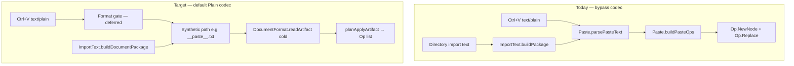

# Paste Document Codec Import

Status: Draft plan (no implementation yet)

See also: [[doc/roadmap/parsefile-document-codec-import.md]], [[doc/roadmap/parse-file-reconcile-current.md]], [[doc/roadmap/workspace-text-outline-conversion.md]], [[doc/roadmap/workspace-format-plain.md]], [[src/Shared/ImportText.fs]], [[src/Shared/Paste.fs]], [[src/Client/UpdatePaste.fs]], [[src/Shared/dotnet/ImportDocument.fs]], [[src/Shared/documents/DocumentFormat.fs]]

Third import slice in the codec trilogy: **ParseFile → codec** (file read at Server/Desktop), **ParseFile for Current → warm reconcile** (server-side disk sync on parsed files — [[doc/roadmap/parse-file-reconcile-current.md]]), **paste → codec** (clipboard and text import into the live outline). This plan covers the third item only.

## What it gives you

- External paste (Ctrl+V plain text into the outline) builds child nodes through the same **document read path** as file import — default **Plain** codec — instead of tab-only [[src/Shared/Paste.fs]] `parsePasteText` / `buildPasteOps`.
- Pasted outline structure aligns with lazy-load / Parse / Upload / autosave semantics for the same text shape (one line → one Plain node; indent rules from [[src/Shared/documents/PlainTextDocument.fs]], not ad-hoc tab depth only).
- `ImportText.buildPackage` can route **document-shaped** text through the codec while **directory listing** import stays on the paste parser.

## What it avoids for now

- **Format selection gate** — no UI, no content sniff beyond existing `looksLikeAmbContent` on read, no “paste as Markdown” toggle. Default path only: synthetic artifact name → `DocumentFormat.classifyCodec` → **Plain**.
- **Warm reconcile on paste** — paste is always cold (`previousText = None`); no id-stable merge against existing pasted subtree.
- **Directory listing import** — `[[name]] timestamp` lines from desktop directory read stay on `Paste.parsePasteText` ([[doc/roadmap/parsefile-document-codec-import.md]] § directory reconcile).
- **Internal clipboard deep-copy** — `buildPasteOpsFromClipboard` remaps graph nodes; not text parsing; unchanged.
- **Link-paste** — `tryPasteLinkIds` / `application/x-gambol-nodeids`; unchanged.
- **Replacing copy/cut serialization** — `serializeSubtree` stays tab-indented Gambol snapshot format.

## Paste paths today (codec bypass)

| Path | Entry | Parser today | Production use |
|------|-------|--------------|----------------|
| Clipboard paste (select) | [[src/Client/UpdatePaste.fs]] `pasteNodes` → `pasteNodesSelecting` | `parsePasteText` → `buildPasteOps` | Ctrl+V replaces selection |
| Clipboard paste (edit) | `pasteNodesEditing` | `parsePasteText`; first line spliced, rest → `buildPasteOps` | Ctrl+V in edit mode |
| Text → import package | [[src/Shared/ImportText.fs]] `buildPackage` | `parsePasteText` → `buildPasteOps` | Desktop **directory** import only ([[src/Desktop/LocalProxy.fs]]); tests for generic paste |
| Export validation | [[src/Shared/ExportText.fs]] `validateExportContent` | `parsePasteText` (non-empty check) | Export guard only |
| Parse / Upload file | [[src/Shared/dotnet/ImportDocument.fs]] `buildFilePackage` | **Codec** via `DocumentParseOps.planApplyArtifact` | Already done — not paste |
| Internal cut/copy paste | [[src/Shared/Paste.fs]] `buildPasteOpsFromClipboard` | Graph remap | Gambol subtree on clipboard |

**Bypass summary:** all **external plain-text** paste and `ImportText.buildPackage` (except directory listing, which is intentionally non-document) use tab-line parsing in [[src/Shared/Paste.fs]], not [[src/Shared/documents/DocumentFormat.fs]].



## How paste should route through DocumentFormat (default Plain)

### Synthetic artifact path

Paste has no file path. Use a **fixed synthetic relative path** whose extension maps to Plain under `classifyCodec`, e.g. `__paste__.txt` or `clipboard/paste.txt`. Same stub-graph + peel pattern as [[src/Shared/dotnet/ImportDocument.fs]] `buildFilePackage`:

1. Mint synthetic `documentRootId` (package/import) or use **focus document root** when pasting under an owned File child (see step 2).
2. `DocumentFormat.readArtifact syntheticPath text documentRootId graph None` — cold read.
3. Convert read graph diff to ops (today: [[src/Shared/dotnet/DocumentParseOps.fs]] `planApplyArtifact`; target: shared cold planner usable from Fable).
4. Peel root-targeting ops into `topLevelIds` + nested ops when producing `DesktopImportPackage`; attach under focus like `buildImportChange`.

**Default codec:** `classifyCodec "__paste__.txt"` → Plain. No Md/Amb unless a future gate overrides the synthetic path or supplies a different `relativePath`.

### Client paste (Ctrl+V)

Replace `parsePasteText` / `buildPasteOps` for **external** plain text when link-paste does not apply:

- **Select mode:** codec cold read → `topLevelIds` + ops → existing `Op.Replace` on selection (same shape as today).
- **Edit mode:** keep first-line splice UX; run Plain codec on the **remaining** lines (or full text with a defined split rule) so trailing structure matches Plain rules, not tab-only depth.

Link-paste and internal clipboard paths must not call the codec.

### ImportText split

Split responsibilities in [[src/Shared/ImportText.fs]]:

| Function | Parser | When |
|----------|--------|------|
| `buildDirectoryPackage` (rename or branch) | `Paste.parsePasteText` | `isDirectory = true`; `[[name]] ts` lines |
| `buildDocumentPackage` (new) | Codec via `ImportDocument`-style helper | Non-directory text import; tests; any future paste-package HTTP |

`buildImportChange` / `buildDirectoryMergeChange` stay unchanged — they already consume `DesktopImportPackage`.

### Fable constraint

[[doc/roadmap/parsefile-document-codec-import.md]] notes Fable cannot reference [[src/Shared/dotnet/DocumentParseOps.fs]]. Paste runs **entirely on the client** for Ctrl+V, so codec→ops planning must live in a **Fable-safe** project:

- Preferred: extract **cold-only** `planApplyArtifact` (or `readArtifactToOps`) into [[src/Shared/documents/]] or [[src/Shared/]], without DiffPlex / warm reconcile, and reference from Client.
- Alternative: add [[src/Shared/documents/Gambol.Shared.Documents.fsproj]] to Client if Fable compiles it (verify DiffPlex); likely heavier than a thin cold planner.

Server/Desktop file import keeps using dotnet `ImportDocument.buildFilePackage`; paste slice adds a parallel **text** entry that shares the same cold read semantics.

## Format gate (undefined — defer)

No implementation in this slice. Document where a gate **might** live later:

| Candidate location | Would decide |
|--------------------|--------------|
| [[src/Client/UpdatePaste.fs]] before codec call | Paste-as-Md vs Plain from clipboard or focus context |
| [[src/Shared/ImportText.fs]] `buildDocumentPackage` | HTTP/import text codec |
| User setting / command palette | Explicit “paste format” (out of scope) |
| `DocumentFormat.classifyCodecForRead`-style sniff | Content-based Amb/Md promotion (like `looksLikeAmbContent`) |

**This slice:** hard-code synthetic `.txt` path → Plain only. Gate hooks are a one-line `relativePath` parameter on the shared builder, not UI.

## Relation to ParseFile codec and reconcile work

### ParseFile → codec ([[doc/roadmap/parsefile-document-codec-import.md]])

- **Shared machinery:** both use `DocumentFormat.readArtifact` cold + op planning + peel root ops + `ImportText.buildImportChange` attach pattern.
- **Difference:** ParseFile reads disk at Server/Desktop (`buildFilePackage` with real path → Md/Plain/Amb from extension); paste uses **synthetic Plain path** and runs on the **client graph** without HTTP.
- **Do not regress:** file import stays on `ImportDocument.buildFilePackage`; directory import stays on paste parser.

### ParseFile for Current → warm reconcile ([[doc/roadmap/parse-file-reconcile-current.md]])

- **Orthogonal:** warm reconcile needs disk text + **server** graph + `previousText`; paste never has `previousText` and runs cold on the client.
- **Shared code:** both may call `DocumentParseOps.planApplyArtifact`; paste slice only needs the **cold** branch (Fable-safe). Warm reconcile stays **server-side** (`DocumentPersistence`, lazy-load reconcile pattern); paste must not pull DiffPlex or warm planning into Client.
- **Merge rule:** implement cold planner once; `buildFilePackage`, future `buildPastePackage`, and client paste all use it. Server warm import reuses the same `planApplyArtifact` with `Some previousText`, not a client `buildReconcileChange`.

## Implementation steps

Numbered slices; stop for review if Client + Shared.Documents + dotnet boundary move in one pass.

1. **Extract cold artifact → ops planner (Shared.Documents or Shared)** — factor cold path from `DocumentParseOps.planApplyArtifact` into Fable-safe module; dotnet re-exports or wraps for `ImportDocument`. **Verify:** existing [[tests/Shared.Tests/ImportDocumentTests.fs]] still pass unchanged.

2. **Add `ImportDocument.buildTextPackage` (or `ImportText.buildDocumentPackage`)** — `sourcePath` + `text` + optional `relativePath` defaulting to `__paste__.txt`; stub graph + cold planner + peel → `DesktopImportPackage`. **Verify:** new Shared.Tests — Plain multiline + indent produces same nesting as `PlainTextDocument` cold read, not flat tab siblings for markdown-shaped text unless Plain rules say so.

3. **Split `ImportText.buildPackage`** — directory branch keeps `Paste.parsePasteText`; document branch delegates to step 2. **Verify:** [[tests/Shared.Tests/ImportTextTests.fs]] directory cases unchanged; generic `note.txt` cases move to codec expectations or `buildDocumentPackage`.

4. **Client paste routing ([[src/Client/UpdatePaste.fs]])** — after link-paste check, call cold planner instead of `buildPasteOps`; preserve edit-mode first-line splice. Add Client project reference to Fable-safe documents planner. **Verify:** manual Ctrl+V under select and edit; tab-indented Gambol export still pastes reasonably under Plain rules (document behavior change — accept per Plain spec).

5. **Cross-link doc currency** — [[doc/arch.md]] paste bullet; link from [[doc/roadmap/parsefile-document-codec-import.md]] “Replacing ImportText for non-file import paths” deferral → this plan.

## Tests

| Area | File | Cases |
|------|------|-------|
| Cold planner extract | `ImportDocumentTests.fs` | Regression on `buildFilePackage`; new `buildTextPackage` Plain indent |
| Paste vs tab parser | `ImportDocumentTests.fs` or new `PasteCodecTests.fs` | Same md-shaped snippet: paste package top-level count vs old `ImportText.buildPackage` (documents intentional divergence) |
| Directory import | `ImportTextTests.fs` | `[[name]] ts` listing unchanged |
| Client paste ops | `PasteTests.fs` or Shared planner tests | Select-mode replace op shape; edit-mode splice + trailing subtree |
| Plain cold read | `PlainTextDocumentTests.fs` | Align paste input with existing cold-read fixtures |

Run:

```bash
dotnet build tests/Shared.Tests -c Debug
dotnet test tests/Shared.Tests -c Debug --no-build --filter "FullyQualifiedName~ImportDocument|FullyQualifiedName~ImportText|FullyQualifiedName~Paste|FullyQualifiedName~PlainTextDocument"
```

Browser: paste markdown-ish text into outline — expect Plain line-per-node under default gate; paste tab-indented plain text — expect Plain indent nesting, not legacy tab-only sibling flattening for md headings.

## Risks / edge cases

- **Behavior change:** users who relied on tab paste flattening md headings into siblings will get Plain line nodes until format gate adds Md paste.
- **Edit-mode split:** first-line splice + codec on remainder must be specified and tested; easy to get wrong vs select-mode.
- **Fable / DiffPlex:** warm reconcile stays dotnet-only; do not pull DiffPlex into Client.
- **Peel root ops:** same invariant as ParseFile — no duplicate root `Replace` when attaching under focus.

## Success criteria

1. Ctrl+V external plain text uses `DocumentFormat` cold read with default Plain synthetic path.
2. `ImportText` directory import still uses `Paste.parsePasteText`.
3. `ImportDocument.buildFilePackage` and Parse / Upload unchanged.
4. Shared.Tests green for ImportDocument, ImportText (directory + document split), and paste/Plain coverage.
5. Format gate documented as deferred; no partial UI.
