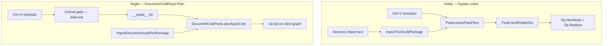

# Paste Document Codec Import

Status: Draft plan (no implementation yet)

See also: [[doc/roadmap/parsefile-document-codec-import.md]], [[doc/roadmap/parse-file-reconcile-current.md]], [[doc/roadmap/workspace-text-outline-conversion.md]], [[doc/roadmap/workspace-format-plain.md]], [[doc/reference/formats/code-shape.md]], [[src/Shared/ImportText.fs]], [[src/Shared/Paste.fs]], [[src/Client/UpdatePaste.fs]], [[src/Shared/dotnet/ImportDocument.fs]], [[src/Shared/documents/DocumentFormat.fs]], [[src/Shared/dotnet/DocumentParseOps.fs]]

Third import slice: **ParseFile → document reader** (file read at Server/Desktop — [[doc/roadmap/parsefile-document-codec-import.md]]), **ParseFile for Current → warm reconcile** (same reader, live graph — [[doc/roadmap/parse-file-reconcile-current.md]]), **paste → document reader** (clipboard and text import into the live outline). This plan covers the third item only.

## What it gives you

- External paste (Ctrl+V plain text into the outline) builds child nodes through the same **cold document read path** as file import — default **Plain** codec — instead of tab-only [[src/Shared/Paste.fs]] `parsePasteText` / `buildPasteOps`.
- Pasted outline structure aligns with lazy-load / Parse / Upload / autosave semantics for the same text shape (one line → one Plain node; indent rules from [[src/Shared/documents/PlainTextDocument.fs]], not ad-hoc tab depth only).
- `ImportText.buildPackage` can route **document-shaped** text through the codec while **directory listing** import stays on the paste parser.
- A **Shared, Fable-callable** cold planner so Client paste never touches DiffPlex, DotNet `DocumentParseOps`, or warm merge.

## What it avoids for now

- **Format selection gate** — no UI, no content sniff beyond existing `looksLikeAmbContent` on read, no “paste as Markdown” toggle. Default path only: synthetic artifact name → `DocumentFormat.classifyCodec` → **Plain**.
- **Warm reconcile on paste** — paste is always cold (`previousText = None`); no id-stable merge against existing pasted subtree; no DiffPlex on Client.
- **Directory listing import** — `[[name]] timestamp` lines from desktop directory read stay on `Paste.parsePasteText` (ParseFile plan keeps directories on paste: [[doc/roadmap/parsefile-document-codec-import.md]]).
- **Internal clipboard deep-copy** — `buildPasteOpsFromClipboard` remaps graph nodes; not text parsing; unchanged.
- **Link-paste** — `tryPasteLinkIds` / `application/x-gambol-nodeids`; unchanged.
- **Replacing copy/cut serialization** — `serializeSubtree` stays tab-indented Gambol snapshot format.

## DiffPlex / Fable — resolve first

Today [[src/Shared/dotnet/DocumentParseOps.fs]] lives in DotNet because it calls [[src/Shared/documents/DocumentFormat.fs]] `readArtifact`, and that Documents surface also wires warm/`readWarm` through DiffPlex (`OutlineLcs`). [[src/Shared/documents/Gambol.Shared.Documents.fsproj]] PackageReferences DiffPlex, so **Fable Client cannot reference Documents** as-is. Paste runs entirely on the client for Ctrl+V; it only needs cold parse.

**Chosen layout (committed — not optional):** make Documents the Fable-safe cold home; move DiffPlex/warm out of the Client dependency path; add a Shared documents module Client paste calls.

| Layer | Owns | DiffPlex? |
|-------|------|-----------|
| [[src/Shared/documents/]] (Fable-safe) | Cold codecs (`AmbDocument` / `PlainTextDocument` / `MdDocument`), `DocumentFormat.classifyCodec` / `mergeReadResult` / **`readArtifactCold`**, new **`DocumentColdParse`** | **No** — drop DiffPlex PackageReference from Documents |
| [[src/Shared/dotnet/]] | `OutlineLcs` + warm outline LCS / `readWarm` wiring, full `DocumentFormat.readArtifact` (or DotNet wrapper) with `previousText = Some _`, `DocumentParseOps.planApplyArtifact`, `ImportDocument.buildFilePackage` | **Yes** — DiffPlex stays DotNet-only |
| [[src/Client/]] | `UpdatePaste` calls `DocumentColdParse.planApplyCold` after link-paste check | No |

Op-planning graph→ops is already pure (overlay member ids → create/update → `Replace`); extract it into Documents as part of `DocumentColdParse`. Cold codecs are pure string/graph logic. Warm reconcile stays server-side ([[doc/roadmap/parse-file-reconcile-current.md]]).

## Public API (Shared documents)

New module [[src/Shared/documents/DocumentColdParse.fs]] (name fixed):

```fsharp
[<RequireQualifiedAccess>]
module DocumentColdParse =
    /// Default synthetic path for paste / document text import → Plain via classifyCodec.
    [<Literal>]
    let PasteRelativePath = "__paste__.txt"

    /// classifyCodecForRead → codec readCold → mergeReadResult. Never readWarm / DiffPlex.
    val readArtifactCold:
        relativePath: string -> text: string -> documentRootId: NodeId -> context: Graph
            -> Result<Graph, string>

    /// before/after graph → Op list (factor from DocumentParseOps; pure).
    val planOpsFromGraphs:
        before: Graph -> documentRootId: NodeId -> after: Graph -> Op list

    /// Cold read + plan ops. Client Paste / ImportText document branch call this.
    val planApplyCold:
        graph: Graph -> documentRootId: NodeId -> relativePath: string -> text: string
            -> Result<Op list, string>
```

`planApplyCold` is the paste entry: `readArtifactCold` then `planOpsFromGraphs`. No `previousText` parameter — cold only by construction.

DotNet [[src/Shared/dotnet/DocumentParseOps.fs]] `planApplyArtifact`:

- `previousText = None` → delegate to `DocumentColdParse.planApplyCold` (single cold implementation).
- `previousText = Some _` → warm `readArtifact` (DotNet/DiffPlex) + `DocumentColdParse.planOpsFromGraphs` on the result.

## Paste paths today (codec bypass)

| Path | Entry | Parser today | Production use |
|------|-------|--------------|----------------|
| Clipboard paste (select) | [[src/Client/UpdatePaste.fs]] `pasteNodes` → `pasteNodesSelecting` | `parsePasteText` → `buildPasteOps` | Ctrl+V replaces selection |
| Clipboard paste (edit) | `pasteNodesEditing` | `parsePasteText`; first line spliced, rest → `buildPasteOps` | Ctrl+V in edit mode |
| Text → import package | [[src/Shared/ImportText.fs]] `buildPackage` | `parsePasteText` → `buildPasteOps` | Desktop **directory** import only ([[src/Desktop/LocalProxy.fs]]); tests for generic paste |
| Export validation | [[src/Shared/ExportText.fs]] `validateExportContent` | `parsePasteText` (non-empty check) | Export guard only |
| Parse / Upload file | [[src/Shared/dotnet/ImportDocument.fs]] `buildFilePackage` | **Codec** via `DocumentParseOps.planApplyArtifact` | Already done — not paste |
| Internal cut/copy paste | [[src/Shared/Paste.fs]] `buildPasteOpsFromClipboard` | Graph remap | Gambol subtree on clipboard |

**Bypass summary:** all **external plain-text** paste and `ImportText.buildPackage` (except directory listing, which is intentionally non-document) use tab-line parsing in [[src/Shared/Paste.fs]], not cold `DocumentFormat` / `DocumentColdParse`.



## How paste routes through DocumentColdParse (default Plain)

### Synthetic artifact path

Paste has no file path. Use fixed `DocumentColdParse.PasteRelativePath` (`__paste__.txt`) so `classifyCodec` → Plain. Same stub-graph + peel pattern as [[src/Shared/dotnet/ImportDocument.fs]] `buildFilePackage` when building a package; Client paste uses the **focus / parent** as `documentRootId` on the live graph (no HTTP).

1. Mint synthetic `documentRootId` (package/import) or use focus parent when pasting under an owned outline node.
2. `DocumentColdParse.planApplyCold graph documentRootId PasteRelativePath text` — cold only.
3. Peel root-targeting ops into `topLevelIds` + nested ops when producing `DesktopImportPackage`; attach under focus like `buildImportChange`. Client select-mode applies ops + `Op.Replace` on selection directly.

**Default codec:** Plain only. No Md/Amb unless a future gate overrides `relativePath`.

### Client paste (Ctrl+V)

Replace `parsePasteText` / `buildPasteOps` for **external** plain text when link-paste does not apply:

- **Select mode:** `planApplyCold` → ops → existing `Op.Replace` on selection (same shape as today).
- **Edit mode:** keep first-line splice UX; run `planApplyCold` on the **remaining** lines (or full text with a defined split rule) so trailing structure matches Plain rules, not tab-only depth.

Link-paste and internal clipboard paths must not call the codec. Client gains a ProjectReference to Fable-safe Documents (after DiffPlex removal).

### ImportText split

| Function | Parser | When |
|----------|--------|------|
| `buildDirectoryPackage` (rename or branch) | `Paste.parsePasteText` | `isDirectory = true`; `[[name]] ts` lines |
| `buildTextPackage` on [[src/Shared/dotnet/ImportDocument.fs]] | `DocumentColdParse.planApplyCold` + peel | Non-directory text import; tests; any future paste-package HTTP |

`buildImportChange` / `buildDirectoryMergeChange` stay unchanged — they already consume `DesktopImportPackage`. `ImportText` stays in Gambol.Shared (no Documents reference — avoids Shared↔Documents cycle); document text packages are built in DotNet `ImportDocument` (or a thin Shared helper that only consumes already-planned ops if needed later).

### What stays in DotNet

- Warm `DocumentParseOps.planApplyArtifact` with `previousText = Some _` (DiffPlex).
- `ImportDocument.buildFilePackage` (real path classify → cold via `planApplyCold` / `None` branch).
- `ImportDocument.buildTextPackage` for non-directory text → `DesktopImportPackage` (stub + peel + `PasteRelativePath`).
- Server/Desktop file import and Current-file warm reconcile ([[doc/roadmap/parse-file-reconcile-current.md]]).

## Format gate (undefined — defer)

No implementation in this slice. Document where a gate **might** live later:

| Candidate location | Would decide |
|--------------------|--------------|
| [[src/Client/UpdatePaste.fs]] before `planApplyCold` | Paste-as-Md vs Plain from clipboard or focus context |
| `ImportDocument.buildTextPackage` | HTTP/import text codec |
| User setting / command palette | Explicit “paste format” (out of scope) |
| `DocumentFormat.classifyCodecForRead`-style sniff | Content-based Amb/Md promotion (like `looksLikeAmbContent`) |

**This slice:** hard-code `PasteRelativePath` → Plain only. Gate hooks are a one-line `relativePath` parameter on `planApplyCold`, not UI.

## Relation to ParseFile codec and reconcile work

### ParseFile → document reader ([[doc/roadmap/parsefile-document-codec-import.md]])

- **Shared machinery:** both use the document reader (cold read + op planning + peel root ops + `ImportText.buildImportChange` attach pattern).
- **Difference:** ParseFile reads disk at Server/Desktop (`buildFilePackage` with real path → Md/Plain/Amb from extension); paste uses **`PasteRelativePath`** and runs on the **client graph** without HTTP.
- **Do not regress:** file import stays on `ImportDocument.buildFilePackage`; directory import stays on paste parser.

### ParseFile for Current → warm reconcile ([[doc/roadmap/parse-file-reconcile-current.md]])

- **Orthogonal:** warm reconcile needs disk text + **server** graph + `previousText`; paste never has `previousText` and runs cold on the client.
- **Shared code:** cold branch is `DocumentColdParse`; warm reuses `planOpsFromGraphs` after DotNet warm read. Paste must not pull DiffPlex into Client.

## Implementation steps

Numbered slices; DiffPlex excision before Client wiring. Stop for review if Documents↔DotNet file moves sprawl beyond cold/warm split.

1. **Make Documents Fable-safe (DiffPlex first)** — move `OutlineLcs` and warm `readWarm` / outline LCS wiring into DotNet; Documents drops DiffPlex PackageReference; add `DocumentFormat.readArtifactCold` (or equivalent used only by cold parse). **Verify:** existing DocumentAssembly / Md / Plain / Amb / OutlineReconcile tests still pass via DotNet warm path; `dotnet fable` can compile a Client reference to Documents (smoke).

2. **Add `DocumentColdParse` (Shared documents)** — `readArtifactCold`, `planOpsFromGraphs` (extract from `DocumentParseOps`), `planApplyCold`. Point DotNet `planApplyArtifact` `None` branch at `planApplyCold`. **Verify:** [[tests/Shared.Tests/ImportDocumentTests.fs]] unchanged green; new `DocumentColdParseTests.fs` for Plain multiline indent.

3. **Add `ImportDocument.buildTextPackage`** — `sourcePath` + `text` + optional `relativePath` defaulting to `PasteRelativePath`; stub graph + `planApplyCold` + peel → `DesktopImportPackage`. **Verify:** Shared.Tests — Plain indent nesting matches `PlainTextDocument` cold read.

4. **Split `ImportText.buildPackage`** — directory branch keeps `Paste.parsePasteText`; document branch delegates to `ImportDocument.buildTextPackage` at Desktop/Server call sites (LocalProxy already branches directory vs file). **Verify:** [[tests/Shared.Tests/ImportTextTests.fs]] directory cases unchanged; generic `note.txt` cases move to codec expectations / `buildTextPackage`.

5. **Client paste wiring ([[src/Client/UpdatePaste.fs]])** — ProjectReference Documents; after link-paste check call `DocumentColdParse.planApplyCold` with `PasteRelativePath` instead of `buildPasteOps`; preserve edit-mode first-line splice. **Verify:** manual Ctrl+V select + edit; tab-indented Gambol export pastes under Plain rules (accepted behavior change).

6. **Cross-link doc currency** — [[doc/arch.md]] paste bullet; [[doc/reference/formats/code-shape.md]] Documents cold vs DotNet warm boundary.

## Tests

| Area | File | Cases |
|------|------|-------|
| Cold planner | `DocumentColdParseTests.fs` (new) | `planApplyCold` Plain indent; empty text error; `__paste__.txt` → Plain |
| DotNet cold delegate | `ImportDocumentTests.fs` | `buildFilePackage` still cold; `buildTextPackage` Plain indent |
| Paste vs tab parser | `ImportDocumentTests.fs` or `DocumentColdParseTests.fs` | Same md-shaped snippet: codec top-level count vs old `ImportText.buildPackage` (intentional divergence) |
| Directory import | `ImportTextTests.fs` | `[[name]] ts` listing unchanged |
| Client paste ops | Shared planner tests | Select-mode replace op shape; edit-mode splice + trailing subtree |
| Plain cold read | `PlainTextDocumentTests.fs` | Align paste input with existing cold-read fixtures |
| Warm still DotNet | `OutlineReconcileTests.fs` | Regression — DiffPlex path unchanged after move |

Run:

```bash
dotnet build tests/Shared.Tests -c Debug
dotnet test tests/Shared.Tests -c Debug --no-build --filter "FullyQualifiedName~DocumentColdParse|FullyQualifiedName~ImportDocument|FullyQualifiedName~ImportText|FullyQualifiedName~Paste|FullyQualifiedName~PlainTextDocument|FullyQualifiedName~OutlineReconcile"
```

Browser: paste markdown-ish text into outline — expect Plain line-per-node under default gate; paste tab-indented plain text — expect Plain indent nesting, not legacy tab-only sibling flattening for md headings.

## Risks / edge cases

- **Documents↔DotNet split churn:** moving warm LCS must not break `readArtifact` callers (`DocumentAssembly`, lazy-load reconcile). Do step 1 as its own reviewable diff.
- **Behavior change:** users who relied on tab paste flattening md headings into siblings will get Plain line nodes until format gate adds Md paste.
- **Edit-mode split:** first-line splice + codec on remainder must be specified and tested; easy to get wrong vs select-mode.
- **Peel root ops:** same invariant as ParseFile — no duplicate root `Replace` when attaching under focus.
- **Shared↔Documents cycle:** do not add Documents reference to Gambol.Shared; keep `buildTextPackage` in DotNet `ImportDocument`.

## Success criteria

1. Ctrl+V external plain text uses `DocumentColdParse.planApplyCold` with `PasteRelativePath` (Plain).
2. Client references Documents with **no DiffPlex** on the Fable path.
3. `ImportText` directory import still uses `Paste.parsePasteText`.
4. `ImportDocument.buildFilePackage` and Parse / Upload unchanged in behavior (cold via shared planner).
5. Shared.Tests green for DocumentColdParse, ImportDocument, ImportText (directory), OutlineReconcile (warm), and Plain coverage.
6. Format gate documented as deferred; no partial UI.
