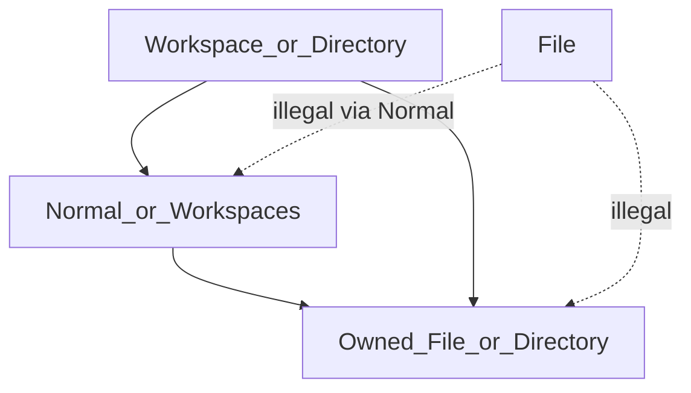

# File and Directory owner placement

Category: Workspace scale
Status: In progress (owner-chain placement + directory-scoped name uniqueness)
See also: [[doc/roadmap/workspaces-checklist]], [[doc/roadmap/workspaces]], [[doc/current/workspace-graph]], [[doc/roadmap/workspace-file-model]], [[doc/roadmap/revising-workspace-file-model]], [[doc/history/workspaces/plans/slice_1_simplified_c97b7f48.plan]], [[doc/history/workspaces/plans/simplify_slice1_ownership_ffc8a965.plan]], [[doc/history/workspaces/plans/special-placement-reconcile_0f939c00.plan]]

## What it gives you

Owned `Special File` and `Special Directory` nodes must have a `Special Workspace` (including nameless ROOT) or `Special Directory` somewhere on the owner chain above them. `Normal` and `Special Workspaces` may sit on that chain (skipped when walking). A `Special File` ancestor is illegal. Disk path still follows the owner chain (Normals skipped). Refs to files and directories remain free-form. Names that persist into the same system directory must be unique (case-insensitive) among owned File / Directory / named Workspace nodes that share that artifact directory.

## What it avoids for now

- Sync-tree, expand-to-parse, git, import pipelines, and FileState (other Slice 1 history).
- A standalone `SpecialPlacement.fs` module unless a later slice needs shared planners beyond `Graph.replace`.
- Reconciling existing illegal owners in saved graphs (Slice C cancelled — leave until a replace fails).
- Changing named-`Workspace` placement (still only under `Workspaces`) or Workspaces/TRASH permanence.
- Disk-name inventory / client fast precheck against on-disk siblings (graph-scoped uniqueness is the accept gate).
- Client-only enforcement; Shared `replace` + `validateOwnership` remain the authority.

## Goal

Checklist item: Files and Directories are only allowed to be in Directories or Workspaces. (Root is a workspace.) Free structure inside a directory `.amb` (Normals owning Files/Directories) is allowed; a File document must not own File/Directory specials, directly or via Normal/`Workspaces` intermediaries.

Enforcement: [[src/Shared/GraphQuery.fs]] helpers, [[src/Shared/GraphMutate.fs]] `Graph.replace` / `SetName`, and [[src/Shared/History.fs]] `validateOwnershipSemantics`. Slice B Duplicate-then-move create/move UX remains cancelled — create at Normal focus works via the owner-chain predicate. [[doc/roadmap/revising-workspace-file-model]] is exemplary — factual Current Truths / Target Concept only when placement wording drifts.

## Rules (precise)

Applies only when `child.ref = Owner` and child kind is `Special File` or `Special Directory` (TRASH excluded as today). `Ref` links are unrestricted.

Walk from the **owner parent** upward on `ownerParentByChild`:

| Encountered kind | Result |
| --- | --- |
| `Special Workspace` or `Special Directory` | valid (stop) |
| `Special File` | invalid (stop) |
| `Normal` or `Special Workspaces` | continue |
| missing / broken chain | invalid (existing ownership errors also apply) |

Also unchanged:

- ROOT is `Special Workspace` with empty name; it terminates the walk as valid.
- Named workspaces live only under `Workspaces`.
- File may own Normal / parsed content children; it must not own other File/Directory specials (directly or via Normal/`Workspaces`).
- Named `Workspace` under `Workspaces` placement unchanged.

### Name uniqueness (artifact directory)

For each owned `File` / `Directory` / named `Workspace`, the uniqueness set is all other owned File/Directory/(Workspace at ROOT∪Workspaces) nodes that share the same **artifact directory** — the nearest enclosing `Workspace` or `Directory` on the owner chain (Normals and `Workspaces` skipped). Case-insensitive. ROOT and Workspaces children share one ROOT artifact namespace; Normals under either that own specials join that same set. Sibling-only checks are insufficient once Normals can own specials. Reject before accept.

## Affected ops (today)

Enforcement belongs in Shared helpers + `Graph.replace` + `validateOwnershipSemantics` so every path that attaches an Owner child or moves a Normal that (indirectly) owns specials is covered:

- Create / Insert File or Directory ([[src/Shared/FileNodeOps.fs]] `planCreateOwnedFile` / `planCreateOwnedDirectory`) — `resolveOwnedFileDirectoryInsert` uses the owner-chain predicate; nested Normal under Directory is a valid focus.
- Move / reparent / paste / import that emit `Op.Replace` — placement + directory-scoped uniqueness on replace; full-graph uniqueness and placement on `History.validateOwnership` after Change (so Normal moves that place specials under a File fail).
- Soft delete (`MoveToTrash`) — TRASH is `Special Directory`, so reparent under TRASH stays legal.
- Document path moves ([[src/Shared/DocumentPathMove.fs]]) — no separate placement API; they observe graph changes after replace.

## Proposed slices

### Slice A — Graph invariant — done (superseded by owner-chain)

Original Slice A required a direct Workspace/Directory parent. That direct-parent rule is superseded by the owner-chain walk and directory-scoped uniqueness above. Tests and docs track the chain rule.

### Slice B — Create / move UX at invalid focus — cancelled

**Cancelled.** Create at Normal focus under a Directory/Workspace just works via the new predicate (Owner under focus). Duplicate-then-move UX for illegal targets is not built; File ancestors remain rejected by Shared replace / validateOwnership. History plans for nearest-valid + Ref remain reference only.

### Slice C — Legacy illegal owners — cancelled

**Cancelled (Q2).** No reconcile-on-load or one-shot command. `Graph.fromNodes` may still load illegal trees; they fail only when a later `replace` or ownership validation touches them. History [[doc/history/workspaces/plans/special-placement-reconcile_0f939c00.plan]] remains reference only.

## Tests

| Area | Cases |
| --- | --- |
| [[tests/Shared.Tests/ModelTests.fs]] | Accept owned File under Normal (under ROOT/Directory); accept File under Workspaces; reject under File; History.applyChange reject Normal-owning-File moved under File; reject two same-named Files under different Normals of one Directory |
| [[tests/Shared.Tests/GraphQueryTests.fs]] | Nested Normal under Directory → `resolveOwnedFileDirectoryInsert` Some(focus); under File content → None; uniqueness / `ownedNameTaken` across Normal branches |
| [[tests/Shared.Tests/FileNodeOpsTests.fs]] | Create under Normal-owned-by-Directory yields Owner ops; unused name skips names under sibling Normal branches |
| [[tests/Shared.Tests/ViewModelMoveOpsTests.fs]] | Indent Directory under Normal sibling → accept |
| Soft delete | MoveToTrash of File/Directory still Ok |

## Non-goals

- Allowing File to own File/Directory again ([[doc/history/workspaces/plans/file-owned-special-nodes_a2a18418.plan]] was a discarded direction).
- Path-index tables or “nearest directory under a normal” disk placement beyond the owner-chain walk.
- Client-only guards without Shared `Graph.replace` / `validateOwnership` enforcement.
- Disk-name inventory / client fast precheck (possible later complement for sync/import UX).
- Sync, git, or format work.

## Open questions

1. **Invalid create/move focus:** **Superseded** — Normal under Directory/Workspace is valid Owner parent via chain walk; File ancestors stay illegal. Slice B Duplicate-then-move cancelled.
2. **Existing saved graphs** with illegal owners: **Resolved — won’t worry.** Slice C cancelled; no reconcile work. Illegal trees may load; next touching `replace` or ownership validation fails.
3. **TRASH** as a legal Directory ancestor for owned File/Directory: **Resolved — yes.** Soft delete stays legal.
4. **`Workspaces` container** on the owner chain: **Resolved — continue** (like Normal); File/Directory under Workspaces is valid when ROOT (or another Workspace/Directory) terminates the walk. Named Workspace children still only under Workspaces.
5. Rewrite [[doc/roadmap/revising-workspace-file-model]] essay: **Resolved — no.** Factual Current Truths / Target Concept placement lines only when they drift.
6. **Mixed move selection** Duplicate-then-move: **Cancelled** with Slice B.
