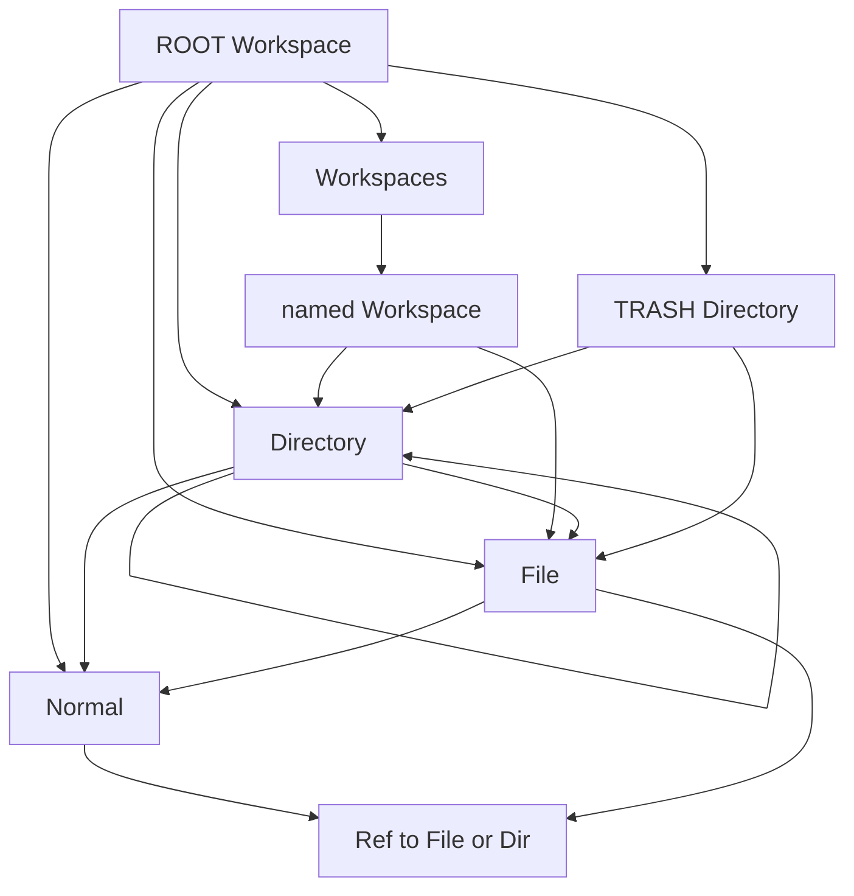

# File and Directory owner placement

Category: Workspace scale
Status: In progress (Slice A done)
See also: [[doc/roadmap/workspaces-checklist]], [[doc/roadmap/workspaces]], [[doc/current/workspace-graph]], [[doc/roadmap/workspace-file-model]], [[doc/roadmap/revising-workspace-file-model]], [[doc/history/workspaces/plans/slice_1_simplified_c97b7f48.plan]], [[doc/history/workspaces/plans/simplify_slice1_ownership_ffc8a965.plan]], [[doc/history/workspaces/plans/special-placement-reconcile_0f939c00.plan]]

## What it gives you

Owned `Special File` and `Special Directory` nodes may only sit under a `Special Workspace` (including nameless ROOT) or a `Special Directory`. Disk path stays the owner chain. Refs to files and directories remain free-form.

## What it avoids for now

- Sync-tree, expand-to-parse, git, import pipelines, and FileState (other Slice 1 history).
- A standalone `SpecialPlacement.fs` module unless a later slice needs shared planners beyond `Graph.replace`.
- Reconciling existing illegal owners in saved graphs (Slice C cancelled — leave until a replace fails).
- Changing named-`Workspace` placement (still only under `Workspaces`) or Workspaces/TRASH permanence.

## Goal

Checklist item: Files and Directories are only allowed to be in Directories or Workspaces. (Root is a workspace.)

Slice A shipped: [[doc/current/workspace-graph]] and [[src/Shared/Model.fs]] `Graph.replace` enforce owned File/Directory only under Workspace or Directory. This plan remains the checklist home for Slice B create/move UX. [[doc/roadmap/revising-workspace-file-model]] is exemplary — leave alone unless a factual error; do not rewrite its Target Concept as part of this plan.

## Rules (precise)

Applies only when `child.ref = Owner`. `Ref` links are unrestricted.

| Child kind (Owner) | Allowed owner parent kinds |
| --- | --- |
| `Special File` | `Special Workspace` (ROOT or named), `Special Directory` (including TRASH) |
| `Special Directory` | same |
| `Special Workspace` | `Special Workspaces` only (unchanged) |
| `Normal` | anywhere (unchanged) |

Not allowed as owner parent of File/Directory: `Normal`, `Special File`, `Special Workspaces` (the container under ROOT).

Also unchanged:

- ROOT is `Special Workspace` with empty name; it is a valid File/Directory owner.
- Named workspaces live only under `Workspaces`.
- File may own Normal / parsed content children; it does not own other File/Directory specials.
- Sibling owned-name uniqueness stays as today (case-insensitive).



## Affected ops (today)

Enforcement belongs in `Graph.replace` so every path that attaches an Owner child is covered:

- Create / Insert File or Directory ([[src/Shared/FileNodeOps.fs]] `planCreateOwnedFile` / `planCreateOwnedDirectory` and Insert… callers) — today attach under focus parent with no walk-up; Slice B adds nearest-valid Owner + Ref at invalid focus.
- Move / reparent / paste / import that emit `Op.Replace` with Owner children — Slice B: Move ≡ Duplicate-then-move-duplicates at invalid target; paste Owner uses Create placement.
- Soft delete (`MoveToTrash`) — TRASH is `Special Directory`, so reparent under TRASH stays legal.
- Document path moves ([[src/Shared/DocumentPathMove.fs]]) — no separate placement API; they observe graph changes after replace.

Existing tests that assert free-form ownership (e.g. ``Graph.replace accepts Special File under normal parent``, ``… under Special File`` in [[tests/Shared.Tests/ModelTests.fs]]) must flip to expect Error.

## Proposed slices

### Slice A — Graph invariant — done

1. Extend `placementError` in [[src/Shared/Model.fs]] `Graph.replace`: reject Owner child of kind File or Directory when parent kind is not Workspace or Directory; clear error string (mirror the Workspace placement message style).
2. Flip / add ModelTests for reject under Normal and File; keep accept under Workspace, Directory, ROOT, and TRASH.
3. After ship: update the placement table in [[doc/current/workspace-graph]]; note supersession in [[doc/roadmap/workspace-file-model]] only (owned File/Directory). Do **not** rewrite [[doc/roadmap/revising-workspace-file-model]] (exemplary — Q5).

Verify: focused `ModelTests` filter green; Shared suite if needed.

### Slice B — Create / move UX at invalid focus

Grounded on Slice A: `Graph.replace` already rejects owned File/Directory under invalid parents. Slice B stops Create/Move/Paste planners from emitting those illegal Owner inserts; they plan legal ops instead. Legacy illegal graphs (former Q2 / Slice C) are cancelled — out of scope.

#### Locked semantics

**Create** (history [[doc/history/workspaces/plans/slice_1_simplified_c97b7f48.plan]]): when the would-be owner parent is not a valid File/Directory owner, walk `ownerParentByChild` to the nearest `Special Workspace` or `Special Directory` (ROOT always terminates; `Workspaces` is not valid — walk past it to ROOT). Place the new **Owner** under that ancestor (`Graph.fileTreeInsertIndex`); place a **Ref** to the new node under the original focus parent. Valid focus → unchanged (Owner only under focus).

**Move** (authoritative equivalence): when a move would insert owned File/Directory under an invalid target parent, the graph result must **exactly match** running existing Duplicate (`duplicateSelectionOp` in [[src/Client/UpdateOps.fs]]), then moving the **duplicate Refs** (the post-Duplicate selection) to that target with the existing move op builder. Net effect: **Owner stays at source**; **Ref appears at the invalid target**. This is link-at-target, not Create-like reparent. Legal moves (valid target, or selection with no owned File/Directory) stay as today’s remove+insert. **Mixed selection:** when the target is invalid for any selected owned File/Directory, the **whole selection** uses Duplicate-then-move (not per-child rewrite).

**Paste** (owned File/Directory into invalid parent): if `childrenForPaste` would emit Owner (no existing owner in graph — e.g. after cut), use **Create** placement (Owner under nearest valid of paste parent + Ref at paste index). If it emits Ref (owner already elsewhere), leave as today (Refs unrestricted).

#### Current call sites (do not invent new commands)

| Path | Shared | Client |
| --- | --- | --- |
| Create file/folder | [[src/Shared/FileNodeOps.fs]] `planCreateOwnedFile` / `planCreateOwnedDirectory` → `planCreateOwnedSpecial` (Owner under `parentId` only; no Ref) | [[src/Client/UpdateFileSearch.fs]] `fileSearchCreateFile` / `fileSearchCreateFolder` pass `focusedNodeId` as `parentId` |
| Insert existing file ref | `FileNodeOps.planInsertFileRefAtFocus` | `fileSearchPickExisting` — already Ref-only; no Slice B change |
| Duplicate | (op shape only; no Shared planner today) | `duplicateSelectionOp`: map selection children to `Ownership.Ref`, `Op.Replace` at `range.endd` |
| Move / indent / outdent | [[src/Shared/ViewModelMoveOps.fs]] plans targets only | [[src/Client/UpdateMove.fs]] `replaceOpsForMove` + `moveNodeFromTo`; indent/outdent call `moveNodeFromTo` |
| Paste | [[src/Shared/Paste.fs]] `buildPasteOps*`; ownership choice in Client `childrenForPaste` | [[src/Client/UpdatePaste.fs]] inserts via `Op.Replace` |
| Soft delete | [[src/Shared/ViewModelDeleteOps.fs]] | TRASH is Directory — still legal after A; no Slice B change |
| Enforcement | [[src/Shared/Model.fs]] `Graph.replace` `placementError` (Slice A) | `applyAndPost` → `None` on Invalid (silent today) |

#### Implementation steps

1. **Shared helpers (keep in Graph / FileNodeOps — no `SpecialPlacement.fs`)** → verify: unit tests for walk
   - `Graph.isValidOwnedFileDirectoryParent graph parentId` — same predicate as Slice A (`Special Workspace` \| `Special Directory`).
   - `Graph.nearestValidOwnedFileDirectoryParent graph fromParentId` — walk `ownerParentByChild` until valid; ROOT terminates.
2. **Create path** → verify: FileNodeOpsTests below
   - Extend `planCreateOwnedSpecial` (or file/directory wrappers): if `parentId` invalid, owner parent = nearest valid; ops = `NewSpecialNode` + Owner append under nearest + Ref `Op.Replace` under original `parentId` (append / `fileTreeInsertIndex`).
   - Client `UpdateFileSearch` stays thin if Shared returns full op list.
3. **Lift move Replace planning to Shared** → verify: Shared tests can build move ops without Client
   - Extract today’s `replaceOpsForMove` shape into Shared (e.g. `ViewModelMoveOps` or `FileNodeOps`) so Duplicate-then-move equivalence is pure.
4. **Move path (Duplicate-then-move equivalence)** → verify: equivalence tests below
   - When insert target parent is invalid for any selected **Owner** File/Directory: plan ops whose final graph equals Duplicate-then-move-duplicates (Owner rows untouched at source; Refs inserted at target). Prefer one Shared planner used by Client `moveNodeFromTo` rather than Client-only branching.
   - Mixed selection (**locked**): whole selection uses Duplicate-then-move when any owned File/Directory would be illegal at target — exact Duplicate equivalence on the selection (not per-child rewrite).
   - Indent/outdent inherit behavior via `moveNodeFromTo`.
5. **Paste path** → verify: paste Owner File/Directory under Normal/File → nearest Owner + Ref at paste index
   - Adjust planning where Owner File/Directory would land under invalid parent (Shared helper reused from Create). Client-only if `childrenForPaste` stays in Client — prefer a Shared function that maps intended children + parent → placement-safe children/ops.
6. **Client Error/OK bar** — only if needed
   - After A, illegal moves fail silent (`applyAndPost` → `None`). If planners always emit legal ops, no status UX required for Slice B. Do not add status reporter here unless a planner still surfaces a hard error (e.g. empty selection / missing parent).
7. **Docs after ship**
   - Note Create/Move UX in [[doc/current/workspace-graph]] (invariant already from A).
   - Mark checklist Slice B done on [[doc/roadmap/workspaces-checklist]]. Do not rewrite [[doc/roadmap/revising-workspace-file-model]].

#### Tests

| Area | Cases |
| --- | --- |
| Helpers | Nearest from Normal under Directory → that Directory; from File under Workspace → Workspace; under nested Normal → walk to Directory/ROOT; `Workspaces` → ROOT |
| [[tests/Shared.Tests/FileNodeOpsTests.fs]] Create | Valid Directory focus → Owner only (existing). Invalid Normal/File focus → Owner under nearest + Ref under focus; name uniqueness under **owner** parent |
| Move equivalence | Fixture: owned File under Directory; target = Normal (or File). `graphAfter(planMove…)` equals `graphAfter(duplicateOps then moveOps on duplicate span)`. Same for owned Directory. Valid target → identical to today’s remove+insert (no extra Ref at source) |
| Move mixed / edge | Whole selection Duplicate-then-move when any owned File/Directory is illegal at target; empty selection no-op; same-parent reorder with valid parent unchanged; MoveToTrash still Ok (ModelTests / delete path) |
| Paste | Owner File into Normal parent → Owner under nearest + Ref at paste index; Ref paste under Normal unchanged |

**Equivalence harness (required):** do not only assert “Ref at target”. Build ops two ways in Shared tests: (1) Slice B planner; (2) compose Duplicate’s Replace (selection → Refs at `endd`) then existing Shared move Replace ops on the duplicate index span to `too`. Compare graphs (nodes + child lists). That locks “exactly match” and prevents Create-like reparent from sneaking into Move.

#### Verify

```bash
dotnet build tests/Shared.Tests -c Debug
dotnet test tests/Shared.Tests -c Debug --no-build --filter "FullyQualifiedName~FileNodeOpsTests|FullyQualifiedName~ModelTests"
```

Add a move-equivalence filter once the new test module/cases exist. Client compile only if UpdateMove / UpdatePaste / UpdateFileSearch change.

#### Deferred

- Status-line reporter from history Slice 1.
- Changing Duplicate command itself.

### Slice C — Legacy illegal owners — cancelled

**Cancelled (Q2).** No reconcile-on-load or one-shot command. `Graph.fromNodes` may still load illegal trees; they fail only when a later `replace` touches them. History [[doc/history/workspaces/plans/special-placement-reconcile_0f939c00.plan]] remains reference only.

## Tests

| Area | Cases |
| --- | --- |
| [[tests/Shared.Tests/ModelTests.fs]] | Slice A: reject owned File under Normal / File / `Workspaces`; accept under Workspace / Directory / ROOT / TRASH; Ref under Normal or File still Ok |
| Create / insert (Slice B) | See Slice B test table — invalid focus → Owner under nearest + Ref at focus |
| Move / paste (Slice B) | See Slice B — Duplicate-then-move graph equivalence; paste Owner → Create-like; legal reparent unchanged |
| Soft delete | MoveToTrash of File/Directory still Ok |

Update any fixtures in DocumentAssembly / DocumentPathMove / Paste that intentionally build File-under-File or File-under-Normal **owners** once Slice A lands.

## Non-goals

- Allowing File to own File/Directory again ([[doc/history/workspaces/plans/file-owned-special-nodes_a2a18418.plan]] was a discarded direction).
- Path-index tables or “nearest directory under a normal” disk placement.
- Client-only guards without Shared `Graph.replace` enforcement.
- Sync, git, or format work.

## Open questions

1. **Invalid create/move focus:** **Resolved** — Create: nearest valid + Ref at focus; Move: Duplicate then move duplicates (Owner stays, Ref at target). Locked; no Create-like reparent for Move.
2. **Existing saved graphs** with illegal owners: **Resolved — won’t worry.** Slice C cancelled; no reconcile work. Illegal trees may load; next touching `replace` fails.
3. **TRASH** as a legal Directory parent for owned File/Directory: **Resolved — yes.** Soft delete stays legal. No further code (Slice A already accepts TRASH).
4. **`Workspaces` container** never owns File/Directory: **Resolved — yes** (only named Workspace children). No further code (Slice A already rejects).
5. Rewrite [[doc/roadmap/revising-workspace-file-model]] “Target Concept” free-form bullets: **Resolved — no.** That document is **exemplary**; leave alone unless a factual error is found. (Supersession notes live in [[doc/roadmap/workspace-file-model]] / this plan / [[doc/current/workspace-graph]] instead.)
6. **Mixed move selection** when target is invalid for owned File/Directory: **Resolved — whole selection Duplicate-then-move** (locked for Slice B).
