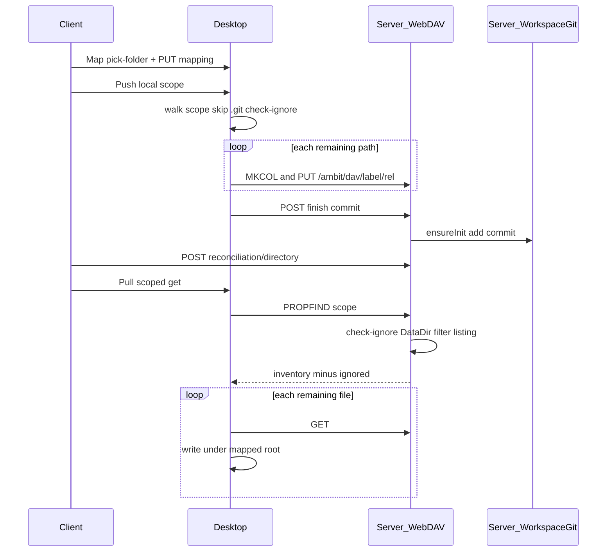

# Workspace file sync (WebDAV + server git)

Category: Sync
Status: Planned
See also: [[workspace-webdav]], [[doc/current/workspace-local-mapping]], [[doc/current/desktop-local-files]], [[workspace-scale-import]], [[workspaces-checklist]], [[lazy-load]], [[doc/roadmap/workspace-file-persistence]], [[src/Server/IgnoredDestination.fs]], [[src/Server/WorkspaceGit.fs]], [[src/Server/GitSave.fs]]

Committed direction for synchronizing a desktop mapped folder with server `DataDir/{label}/`. **Client Map / Push / Pull do not use git remotes or smart-HTTP pack transport.** Transport is WebDAV Class 1. The server still keeps a per-workspace git repo for ignore rules and post-push commits.

This does not supersede [[doc/current/sync-mvp]] for live graph editing over HTTP; file sync is coarse, explicit tree sync layered on top.

## What it gives you

1. **Map workspace** — bind a local folder to a workspace label (pick-folder + mapping Put). No `requireGit`, no `ambit` remote.
2. **Push (post)** — scoped local directory or file under the mapped workspace: walk/select that path, **apply `.gitignore`**, send via WebDAV (`PUT` / `MKCOL`), then server finish-commit and Lazy Load stub reconcile. (WebDAV server may still be in progress.)
3. **Pull (get)** — obtain **server-side inventory** for that scope (`PROPFIND`), **apply `.gitignore` to that inventory** to produce the file list, then `GET` those files into the mapped root (listings include **getlastmodified** / mtime — [[workspace-webdav]]).
4. Never transfer `.git/` or gitignored paths (for example `.venv`).

## Inventory (defined)

**Inventory** means the candidate path list for a scoped sync before transfer — not a vague “tree walk.” Ignore filtering always runs on that candidate list; the inventory **source** differs by direction:

| Direction | Inventory source | Then |
| --- | --- | --- |
| **Push** | Local walk/select under the mapped scope (workspace, subdirectory, or file) | Apply `.gitignore` → remaining paths are uploaded |
| **Pull** | Server `PROPFIND` under `/ambit/dav/{label}/…` for the same scope | Apply `.gitignore` to that listing → remaining paths are downloaded |

So ignore reduces candidates on **both** directions. For Pull, the inventory source is the **server**; gitignore then reduces it. Always skip `.git/` regardless of ignore rules.

## Desktop sync functions

The desktop layer’s two main sync functions:

1. **Post (Push)** — local scope → GitCheckIgnore → WebDAV `PUT` / `MKCOL` → finish-commit.
2. **Get (Pull)** — server `PROPFIND` inventory → GitCheckIgnore → `GET`.

## What it avoids for now

- Removing existing `GitGateway` / `/ambit/git/…` code in this slice (demote from UX only; not the Map/Push/Pull path).
- Full WebDAV Class 2, DeltaV, locks, Windows drive mapping.
- Zip / rsync / delta sync, conflict UI, mirror-delete (`DELETE` deferred).
- Writing a pure `.gitignore` parser (the `git` binary remains the ignore engine).
- Changing per-file Parse / Upload behavior for Unparsed File focus.
- Fast-forward / remote-tracking / client-side merge as the sync model.

## Decision

| Topic | Decision |
| --- | --- |
| Client transport | WebDAV Class 1 under `/ambit/dav/{label}/…` → `DataDir/{label}/` |
| Server git | Keep tracking; after a push batch, commit via [[src/Server/WorkspaceGit.fs]] / [[src/Server/GitSave.fs]] |
| `.gitignore` | Essential; both directions filter candidates with `git check-ignore` (reuse [[src/Server/IgnoredDestination.fs]] pattern) |
| Ignore SoT (Push) | **Local mapped tree** ignore rules (`GIT_WORK_TREE` = mapped root) |
| Ignore SoT (Pull) | **Server `DataDir/{label}/`** ignore rules — applied when building/filtering `PROPFIND` results |
| Mapping | Unchanged: label → absolute local path ([[doc/current/workspace-local-mapping]]) |
| Scope | Focus determines workspace whole tree, directory relative prefix, or single file |
| Overwrite | Last-write-wins in scope; no FF; no delete of extras on either side in v1 |
| Auth | Same as other `/ambit` routes (no separate git PAT for Map/Push/Pull) |

## How `.gitignore` is followed

Ignore filtering applies to the **candidate inventory** on both directions. Single source of truth:

- **Push inventory** — local mapped tree ignore rules.
- **Pull inventory** — server DataDir ignore rules (prefer server applying check-ignore when emitting `PROPFIND`; desktop may also filter if it has a mapped tree, but must not redefine Pull’s authoritative ignore set).

| Where | Mechanism |
| --- | --- |
| **Desktop Push** | Walk/select scoped local path; always skip `.git/`; filter with `git check-ignore --no-index` against the mapped work tree (same idea as IgnoredDestination: `GIT_WORK_TREE` + temp/shared `GIT_DIR` so the folder need not be a client clone). Fail Push if `git` is missing or check-ignore errors — do not silently upload ignored trees. Then `PUT` / `MKCOL`, then finish-commit. |
| **Server Pull inventory (`PROPFIND`)** | Build listing from `DataDir/{label}/` under scope; skip `.git/`; **apply check-ignore against the server work tree** so the multistatus is already the reduced file list. Prefer this as the only required Pull filter. |
| **Desktop Pull (optional)** | May re-filter the `PROPFIND` list with local mapped-tree check-ignore if a mapping exists; optional belt-and-suspenders, not the Pull SoT. |
| **Server `PUT`** | Reject PUT to an ignored destination (same DataDir rules). |
| **Server commit** | Normal `git add` honors workspace `.gitignore` / excludes. |
| **`.gitignore` files themselves** | Still transferable (not treated as ignored destinations for the ignore-file path) — same exception as IgnoredDestination. |

**Not required for Map/Push/Pull transport:** local folder is a git repo, `ambit` remote, or `git.git` capability.

**Required on desktop for Push:** `git` on PATH (ignore only). Map and Pull can work without desktop `git` when the server filters `PROPFIND`; Push must not.

## WebDAV subset (v1)

Server mount, Class 1 methods, and **PROPFIND properties** (including required `getlastmodified` / mtime): [[workspace-webdav]].

| Method | Use |
| --- | --- |
| `PROPFIND` | Server-side inventory for Pull (Depth 1 or infinity) under `/ambit/dav/{label}/…` — must expose path, collection vs file, and **datestamp**; omit ignored paths |
| `GET` | Download each remaining Pull candidate |
| `PUT` | Upload / overwrite file (create parent dirs as needed) |
| `MKCOL` | Create directory |
| `DELETE` | Deferred (no mirror-delete in v1) |
| `LOCK` / DeltaV | Out of scope |

## Libraries

Nothing WebDAV-related is in the repo today. Server library spike and fallback: [[workspace-webdav]]. Desktop uses HttpClient for PROPFIND / GET / PUT / MKCOL. Ignore stays `git check-ignore` (IgnoredDestination-style helper).

## Command surface

| Intent | Target |
| --- | --- |
| Map folder ↔ workspace | **Map workspace** — pick-folder + Put mapping only |
| Push scope | **Push** — local inventory → check-ignore → WebDAV up + server finish-commit + reconcile |
| Pull scope | **Pull** — server PROPFIND inventory → check-ignore (DataDir SoT) → GET |
| Clone / status / push-to-remote | Not required for map/push/pull; may deprecate later |

Focus determines scope: workspace → whole tree; directory → relative prefix; file → one path.

## Minimal API / ops



- **End-of-push commit:** explicit finish endpoint after the batch.
- **Capabilities:** Map / Push / Pull need `workspacePaths` plus file import/export, **not** `git.git` for transport. Push still needs the git binary for local ignore.
- **Lazy Load:** stub reconcile runs after WebDAV push + finish-commit (not after receive-pack). See [[lazy-load]].

## On-disk layout

```text
{DataDir}/
  home/                  ← workspace work tree (verbatim label)
    .git/                ← server-side tracking only; never transferred
    src/
      lib.fs
    docs/
      specs/
        .amb
```

Desktop mapping ([[doc/current/workspace-local-mapping]]) points label `home` at a separate absolute directory. That folder need not be a git clone.

## Implementation steps

1. Shared scope / path helpers + Shared.Tests.
2. Share check-ignore helper — extract / reuse IgnoredDestination-style API for desktop Push inventory and server WebDAV `PROPFIND` / `PUT`.
3. Server WebDAV — NWebDav spike or hand-roll; **PROPFIND applies DataDir check-ignore**; finish-commit; Server.Tests including ignore omission / rejection.
4. Desktop — Push: local walk + required check-ignore + HttpClient WebDAV; Pull: PROPFIND then GET (optional local re-filter).
5. Client commands — Map / Push / Pull; keep file Parse branch; ungated from git-pack transport.
6. Post-push reconcile wiring + current-doc refresh when behavior lands.

## Tests

- Push inventory excludes `.venv` / nested gitignore cases via check-ignore against the mapped tree.
- Server `PROPFIND` omits ignored entries (DataDir rules); ignored PUT rejected.
- Finish-commit moves HEAD; reconcile stubs.
- Push fails clearly if `git` is missing on desktop.

## Success criteria

- Push then Pull a subdirectory without git remotes or pack transport.
- Push: local scope → check-ignore → PUT/MKCOL → finish-commit; `.venv` never uploaded.
- Pull: server PROPFIND inventory → DataDir check-ignore → GET; listings never leak ignored trees.
- After Push + finish, server repo has a new commit.
- Map / Push / Pull do not call `/_desktop/git-push` or `/ambit/git/…`.
