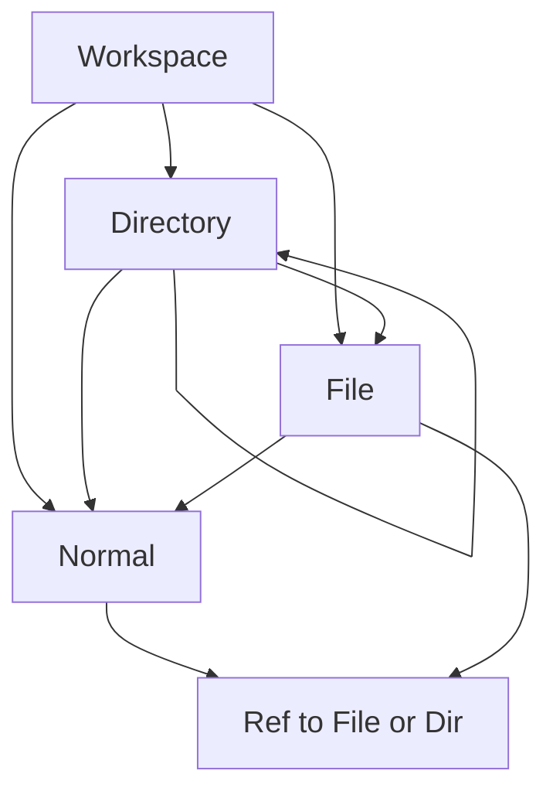
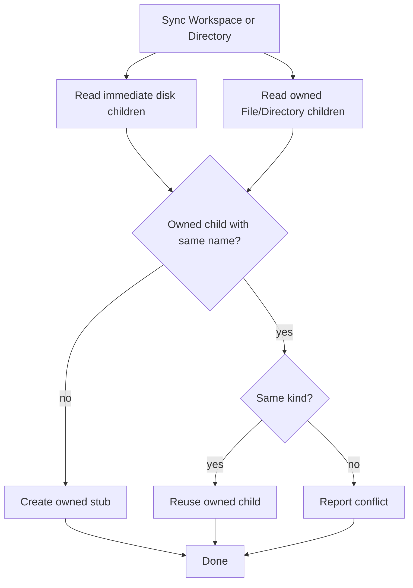

# Workspace Scale Import — Slice 1 Plan

Status: Planned (implementation not started)
Category: Workspace scale
See also: [[doc/roadmap/workspace-scale-import]], [[doc/roadmap/revising-workspace-file-model]], [[doc/roadmap/workspace-scale-file-and-db-management]], [[doc/roadmap/git-sync-gateway]], [[doc/current/workspace-stage-plan]]

This document locks Slice 1 of [[doc/roadmap/workspace-scale-import]]: owned directory/file placement, shallow sync-tree rules, file metadata, commands, and tests. Parent overview and product outcomes stay in that doc; Slice 2 stays in [[doc/roadmap/git-sync-gateway]].

## What it gives you

On one machine, browsing and editing a workspace’s files is trustworthy:

1. Sync tree shows the repo as Special Directory / Special File stubs in the outline (no parse yet).
2. Expand an unparsed file → read disk → parse into children for that file only.
3. Edits autosave to the source file (existing live-save / desktop write path).
4. If disk changed outside Gambol, mark stale and offer reparse (no auto-replace).
5. Manual git commit for that workspace only (`DataDir/@label/`, or the mapped desktop root when it is a git repo).

Already done and not redesigned here: server live-save under `DataDir/@label/`, HTTP graph sync, desktop import/export with `@label:` mapping ([[doc/current/workspace-stage-plan]] §7–8).

## What it avoids for now

- Git gateway, JIT commit, pull/push (Slice 2 — [[doc/roadmap/git-sync-gateway]])
- Client LRU, server lazy DB load, query model, annotation migration
- Full gitignore semantics, branches, git object model in the outline
- Auto-delete or archive when disk is missing a previously synced child
- Auto-reparse on stale; XML format work
- Migration tooling for existing illegal File / Directory ownership

## Ownership lock

Disk path is the owner chain. A Special File or Special Directory is owned only by a Special Workspace or Special Directory, including the root workspace path. There is no path table and no nearest-directory-under-a-normal scan.

Locked rules:

- Owner of Special File / Directory ∈ {Special Workspace, Special Directory}.
- Special Workspace may still own Normal nodes.
- Special Directory may still own Normal nodes.
- Special File may own Normal nodes and parsed content children as today for document membership.
- Special File does not own Special File or Special Directory nodes.
- Normal nodes do not own Special File or Special Directory nodes.
- Refs to Special File / Directory are unrestricted and may appear under Normal nodes, File nodes, or Directory nodes.
- Sync only reconciles owned Special File / Directory children. Refs elsewhere are ignored by sync.

Illegal owner moves abort the graph operation and surface a placement error through the existing `Graph.replace` error/status-line path. This implementation step should replace the current free-form target behavior for owning File / Directory specials; it does not restrict non-owning refs.



## Path identity

A node’s workspace-relative disk path is derived from its owner chain:

```text
path = owning workspace/directory path + "/" + node.name
```

Because only Workspaces and Directories can own File / Directory specials, this path is direct and deterministic. Rename or legal reparent changes the path for that node and its owned special descendants through the same persistence moments already used by `DocumentPathMove`.

Refs do not affect path identity. Moving a ref to a file under a note or another file changes only where that occurrence appears in the outline; it never changes the file’s disk path.

Duplicate owned special names under the same Workspace / Directory are invalid for this slice because they would claim the same immediate disk child path. Reject at graph-operation planning or accept-time validation rather than repairing during sync.

## Sync rules

Sync is shallow per directory. Given a Workspace or Directory node and its matching on-disk directory, reconcile immediate disk children against that node’s owned Special File / Directory children by name.

For each immediate disk child:

1. **Owned child with same name and kind exists** → reuse that node; update lightweight metadata if needed.
2. **No owned child with same name** → create a Special Directory or Special File stub owned by the current Workspace / Directory.
3. **Owned child with same name but different kind** → report a conflict; do not guess whether to replace a file with a directory or the reverse.
4. **Only refs elsewhere match the same node or name** → ignore them; refs are not sync ownership.

For each owned Special File / Directory child missing on disk: do not auto-delete in this slice. Optionally mark missing later.

Skip `.git` and apply a simple ignore rule set enough to hide obvious noise; full gitignore semantics are deferred.

Empty workspace: every immediate disk child is new → create stubs only. Descendant directories are reconciled by syncing each directory in turn, not by global path lookup.



## File metadata

Per Special File node (minimal for this slice):

```text
parsed: bool
stale: bool
sourceMtimeUtc: int64 option
sourceHash: string option   // optional if mtime is enough at first
```

Directories need owned-name identity and stubs only; no parse/stale cycle in this slice.

## Commands and behavior

### Sync tree

Command at workspace or directory root posts the shallow reconcile change set for that directory. No parsing.

- Server: read immediate children under `DataDir/@label/...`.
- Optional same slice: desktop reads immediate children under the mapped `@label:` root with the same Shared planner.

### Expand to parse

On expand of an unparsed Special File: fetch content (server or `/_desktop/file`), run existing format read, attach children for that file only, set `parsed = true`, clear `stale`, store mtime (and hash if used). Do not parse every file at sync time.

### Stale

On expand (or Reparse): if `parsed` and disk is newer than stored mtime → mark `stale`, show indicator, offer reparse. Do not auto-replace. Use existing desktop file-status where mapped; add a small server stat if needed.

### Delete owned File / Directory

Keep the graph invariant that every node has exactly one owner. Deleting an owned Special File or Special Directory must not promote another ref to owner, because that would silently move disk ownership to the ref’s outline location. For Slice 1, deleting the owned special removes that node and all refs to it, with destructive-delete confirmation where the command surface needs it. If the user wants the file or directory to remain available elsewhere, they should move the owner first or place refs without deleting the owner.

Future improvement: preserve dangling intent more gracefully, such as converting removed refs to explicit link/placeholder nodes or adding a user-facing “retarget / restore owner” flow. That is deferred until after Slice 1 so the first implementation keeps ownership and path identity simple.

### Workspace git

`git init` inside `DataDir/@label/` on first need. Commit that repo only (not whole `DataDir`). On desktop, if the mapped root is a git repo, same commit via LocalProxy.

## Implementation steps

1. **Placement validation (Shared)** — enforce that owned Special File / Directory children can only be placed under Special Workspace or Special Directory; keep refs unrestricted; return placement errors through `Graph.replace` and status-line UX.
2. **Owned-name uniqueness (Shared / Server accept)** — reject duplicate owned Special File / Directory names with the same kind/path parent; reject same-name kind collisions under one Workspace / Directory.
3. **Shallow sync planner (Shared)** — plan reconcile ops from one directory listing and that node’s owned special children; create missing stubs; reuse matching owned children; report kind conflicts; ignore refs.
4. **Delete semantics (Shared / Client)** — special-owned delete removes the owned File / Directory and all refs to it; do not promote refs to owners; surface confirmation/diagnostic as needed.
5. **Sync tree command** — workspace/directory command posts shallow reconcile ops; server reads `DataDir/@label/...`; optional desktop reads mapped roots with the same planner.
6. **Expand to parse** — metadata fields; on-demand read/parse for one file; set `parsed`.
7. **Stale** — mtime (or hash) compare on expand/reparse; indicator + reparse action; no auto-replace.
8. **Workspace git** — init under `@label/` when needed; commit that repo only; desktop LocalProxy when mapped root is a git repo.

## Tests

Prefer Shared.Tests for placement and planner logic; Server/Desktop only where I/O boundaries require it.

| Case | Proves |
| --- | --- |
| File owner under Workspace | Legal owned placement |
| Directory owner under Directory | Legal owned placement |
| File owner under File | Rejected placement error |
| Directory owner under Normal | Rejected placement error |
| File ref under Normal or File | Ref placement remains legal |
| Duplicate owned file name under one Directory | Rejected path/name collision |
| Same name file vs directory under one Directory | Rejected kind/path conflict |
| Sync create | Missing immediate disk child → owned stub |
| Sync reuse | Matching owned immediate child → no second node |
| Sync ignores refs | Ref to a file elsewhere does not satisfy or alter ownership |
| Sync kind conflict | Disk child kind differs from owned child kind → conflict |
| Sync skip | `.git` (and simple ignore) not imported |
| Delete owned file with refs | Removes owner and refs; no ref promotion |
| Delete normal node with refs | Existing ref-promotion behavior is preserved for non-special nodes |
| Expand unparsed | Children attached; `parsed = true` |
| Stale on newer mtime | `stale = true`; no auto-reparse |
| Workspace commit | Commit lands under `@label/` only, not whole `DataDir` |

Manual check after wiring: medium repo shows folders/files; refs elsewhere stay refs; illegal ownership moves explain why they failed; restart still derives paths from ownership; edit → autosave → manual commit → `git log` under `@label/`.

## Success criterion

Attach or open a medium repo, sync tree, open/edit/save a handful of files, commit, restart, reopen — path identity follows owned Workspace / Directory ancestry, refs can be organized freely, and nothing surprising happens.

## After this slice

Git gateway, desktop remote setup, pull/push UI, stale-after-pull — [[doc/roadmap/git-sync-gateway]] steps 3–7.
