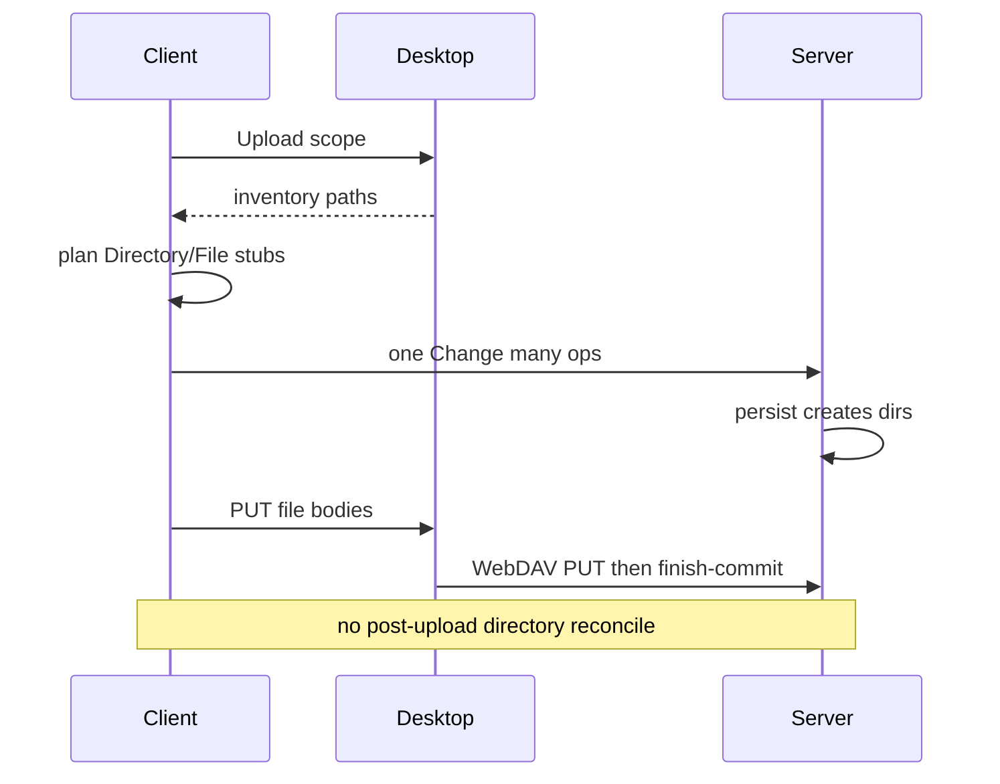

# Workspace Upload — client-first structure

Category: Sync
Status: Done
See also: [[workspace-file-sync]], [[lazy-load]], [[doc/current/desktop-local-files]], [[workspace-scale-import]]

Move **Desktop Upload** stub creation from post-push disk→graph reconcile onto the **client**. Desktop inventory drives Directory/File stubs in one Change; WebDAV then transfers file bodies only. Disk→graph reconcile remains for web / repair paths that never ran client structure.

## What it gives you

1. After Desktop Upload inventory, the outline shows Directory and File stubs **before** (or without waiting on) a server reconcile round-trip.
2. Browsable client-made structure appears before body transfer. New File stubs show `∅` (`no file on server`); successful PUT or mtime skip changes them to Unparsed (`…`), and Parse changes them to Current.
3. Faster client graph visibility for mapped Desktop Upload; Web Upload without Desktop stays reconcile/parse from DataDir.

## What it avoids for now

- Post-upload directory reconcile as a **safety net** after Desktop Upload (dropped — see Locked decisions).
- Always creating a full stub tree when eligible upload bodies exceed the bulk caps.
- Client parsing file content into outline child nodes on Upload.
- Changing Download, mirror-delete, or expand-to-parse.
- Replacing disk→graph reconcile for non-Desktop / repair cases.

## Locked decisions

| # | Topic | Decision |
| --- | --- | --- |
| 1 | Post-upload reconcile (Desktop Upload) | **Drop** directory reconcile after Desktop Upload. No safety-net reconcile on that path. |
| 2 | Bulk caps | Files `≤1 MiB` are eligible. Count only eligible files toward 1,500 and only eligible bytes toward 16 MiB. Within both caps, keep full structure and upload every eligible body; otherwise keep immediate-child structure and upload eligible top-level bodies regardless of aggregate cap. |
| 3 | File state timing | Newly generated File stubs start `NoServerFile` (`∅`). A successful PUT or already-present mtime skip changes that state to Unparsed (`…`) before direct-file Parse. Directories retain their existing state behavior. |
| 4 | TreeStructure / empty PUT placeholders | **No longer a concern.** Simply make Directory nodes and File nodes — no empty-PUT Unparsed placeholder shell for structure transfer. |
| 5 | Stub ↔ inventory projection | Every selected ordinary Directory/File path corresponds 1:1 with a stub: full structure within caps, immediate children after fallback. An exact `.amb` file is transferred as inventory but is consumed by its containing Directory/Workspace document root and never creates a File stub. |
| 6 | Body PUT vs stub-only | Bulk bodies are files `≤1 MiB`; selected oversized files remain truthful `NoServerFile` stubs. Direct single-file Upload retains the existing 4 MiB limit and always-transfer mtime behavior. Directories never get file bodies. |
| 7 | Datestamp postcondition | After upload: **client file, server file, and graph node have identical datestamp**. Same after download. |
| 8 | No delayed persist after parse | **Must not** time-delay persist after a file is parsed. |
| 9 | Transfer skip (directory scope) | **Upload directory:** skip PUT when server mtime is newer or same. **Download directory:** skip GET when desktop mtime is newer or same. |
| 10 | Transfer skip (single file) | **Upload single file:** **allow** PUT even if server is newer/same. **Download single file:** **allow** GET even if desktop is newer/same. |
| 11 | Reparse when skipped | Even when a file is not uploaded (skip), **reparse** that file. |

## Core flow

```text
Desktop inventory (scoped walk + check-ignore)
  → client builds Directory stubs and NoServerFile File stubs (full or immediate-child structure)
  → one Change with multiple ops (client → server)
  → server persist creates directories as needed
  → WebDAV PUT eligible file bodies smallest-first (no TreeStructure placeholders)
  → PUT and mtime-skipped paths become Unparsed
  → finish-commit
  → no post-upload directory reconcile on this Desktop path
```

- **Client makes nodes, not server** for Desktop Upload structure.
- **Client never parses file content** into outline nodes during Upload.
- **Web Upload without Desktop** stays reconcile/parse from DataDir ([[lazy-load]] disk→graph).



## Minimal state / API / ops

| Piece | Role |
| --- | --- |
| Desktop inventory | Scoped path list after `.git/` skip + `git check-ignore` ([[workspace-file-sync]]) |
| Client stub planner | Map selected inventory → Directory/File create ops under focused Workspace; reuse existing owned path when present; new File nodes start `NoServerFile` |
| One Change | Multiple structure ops in a single posted Change |
| Server persist | Creates directory nodes / DataDir dirs as today when graph ops require them |
| WebDAV | File body `PUT` only for transferred files; drop TreeStructure empty-PUT placeholder mode for this path |
| Finish-commit | Unchanged end-of-batch server git commit |
| Reconcile endpoint | **Not** called after Desktop Upload; retained for web / repair ([[lazy-load]]) |

Bulk Upload selection and transfer thresholds are defined in [[workspace-file-sync]]. TreeStructure-as-empty-PUT is retired for Desktop Upload; Download is unlimited after server-scope ignore filtering.

## Implementation steps

1. **Shared planner** — inventory paths → Directory/File stub ops under workspace scope; idempotent reuse; full/immediate-child cap; new Files start `NoServerFile`. → **Done.**
2. **Client Upload wiring** — structure Change before body PUTs; no post-upload directory reconcile on this path. → **Done.**
3. **Transfer simplification** — no TreeStructure empty PUT placeholders; bulk policy uses eligible bodies plus full/immediate-child structure. → **Done.**
4. **Web / repair unchanged** — disk→graph reconcile remains for Upload without Desktop and explicit repair. → **Done.**
5. **Docs / checklist** — [[workspace-file-sync]] and this baseline describe limited Upload and unlimited Download. → **Done.**

## Tests

Prefer Shared-first; keep Server/Client checks thin.

- Inventory → stub ops create Directory then File under workspace; reuse existing owned path; no content children.
- Exact `.amb` inventory paths create/reuse only their containing Directory/Workspace document root, never a child File, while the body remains eligible for PUT; named `*.amb` files remain ordinary File stubs.
- TopLevel cap: only immediate-child stubs when ladder caps; deeper paths deferred (same outcome intent as today’s TopLevel transfer cap).
- New File stubs are `NoServerFile`; directories retain existing behavior; body presence transitions files to Unparsed before Parse.
- Desktop Upload flow: structure Change then body PUTs; **no** post-upload directory reconcile.
- Web / DataDir path still reconciles stubs without client structure Change.
- Ignore filtering still excludes `.venv` / nested gitignore cases from inventory (and thus from stubs and PUTs).

## Success criteria

- Desktop Upload shows stubs from the client Change without waiting on reconcile.
- Same browsing outcomes as pre-change stub reconcile tests, different mechanism.
- No safety-net reconcile after Desktop Upload.
- Web Upload without Desktop still gets stubs via disk→graph reconcile.
- Stub set matches selected ordinary Directory/File inventory paths; an exact `.amb` body is transferred without a File stub because its containing Directory/Workspace consumes it. Bulk body PUTs include only eligible files and run smallest-first.
- After Upload or Download, client file, server file, and graph node datestamps match.
- Directory-scope skip-if-same-or-newer holds; single-file scope always transfers; skipped uploads still reparse.
