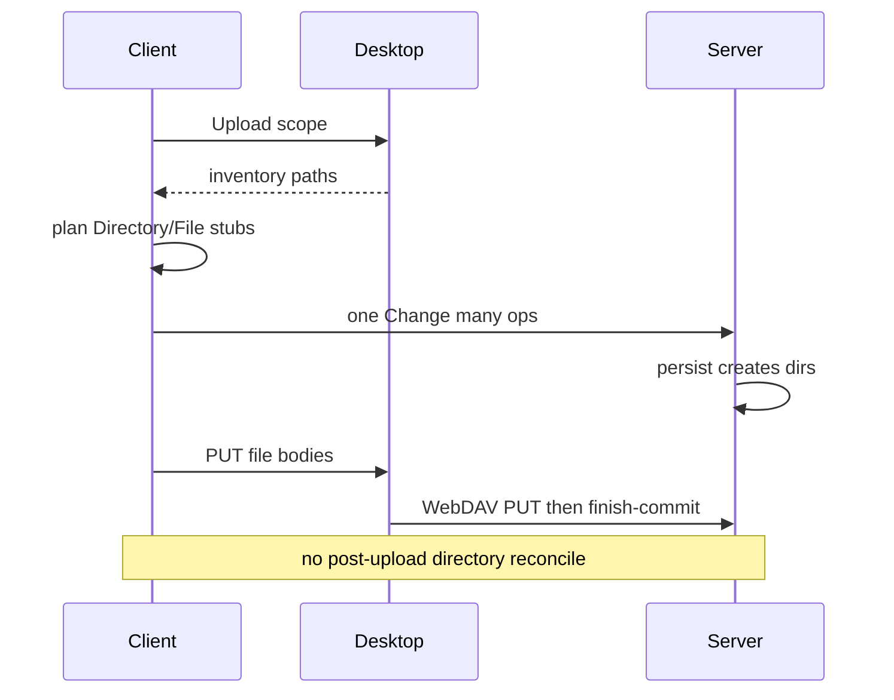

# Workspace Upload — client-first structure

Category: Sync
Status: Done
See also: [[workspace-file-sync]], [[lazy-load]], [[doc/current/desktop-local-files]], [[workspace-scale-import]]

Move **Desktop Upload** stub creation from post-push disk→graph reconcile onto the **client**. Desktop inventory drives Directory/File stubs in one Change; WebDAV then transfers file bodies only. Disk→graph reconcile remains for web / repair paths that never ran client structure.

## What it gives you

1. After Desktop Upload inventory, the outline shows Directory and File stubs **before** (or without waiting on) a server reconcile round-trip.
2. Same user-visible outcomes as today’s post-upload stub reconcile — browsable tree, no file-content parse — via a different mechanism: **client makes nodes**, server persist creates dirs, then PUT bodies.
3. Faster client graph visibility for mapped Desktop Upload; Web Upload without Desktop stays reconcile/parse from DataDir.

## What it avoids for now

- Post-upload directory reconcile as a **safety net** after Desktop Upload (dropped — see Locked decisions).
- Always creating a full stub tree under volume pressure (TopLevel cap remains).
- Client parsing file content into outline child nodes on Upload.
- Changing Download, mirror-delete, or expand-to-parse.
- Replacing disk→graph reconcile for non-Desktop / repair cases.

## Locked decisions

| # | Topic | Decision |
| --- | --- | --- |
| 1 | Post-upload reconcile (Desktop Upload) | **Drop** directory reconcile after Desktop Upload. No safety-net reconcile on that path. |
| 2 | Volume ladder | **Still TopLevel-cap** nodes. Do **not** always create a full stub tree when the ladder caps scope. |
| 3 | Unparsed timing | **Things start Unparsed.** Directories become Current/parsed if/when member nodes are generated under them. |
| 4 | TreeStructure / empty PUT placeholders | **No longer a concern.** Simply make Directory nodes and File nodes — no empty-PUT Unparsed placeholder shell for structure transfer. |
| 5 | Stub ↔ inventory 1:1 | Every Directory/File stub from the Desktop Upload planner corresponds **1:1** with a volume-capped inventory path. TopLevel-cap limits which paths get stubs + transfers. |
| 6 | Body PUT vs stub-only | A File stub gets a body PUT only when the transfer plan says **Body** (Full/TopLevel and ≤4 MiB / not oversized). Directories never get file bodies. TreeStructure / oversized Files are stubs without body upload. User framing: except files above the auto-upload size threshold, File nodes from this plan correspond 1:1 with uploaded files; Directory nodes are stubs without body. |
| 7 | Datestamp postcondition | After upload: **client file, server file, and graph node have identical datestamp**. Same after download. |
| 8 | No delayed persist after parse | **Must not** time-delay persist after a file is parsed. |
| 9 | Transfer skip (directory scope) | **Upload directory:** skip PUT when server mtime is newer or same. **Download directory:** skip GET when desktop mtime is newer or same. |
| 10 | Transfer skip (single file) | **Upload single file:** **allow** PUT even if server is newer/same. **Download single file:** **allow** GET even if desktop is newer/same. |
| 11 | Reparse when skipped | Even when a file is not uploaded (skip), **reparse** that file. |

## Core flow

```text
Desktop inventory (scoped walk + check-ignore)
  → client builds Directory / File stubs (Unparsed; TopLevel-capped when ladder says so)
  → one Change with multiple ops (client → server)
  → server persist creates directories as needed
  → WebDAV PUT file bodies only (no TreeStructure empty placeholders)
  → finish-commit
  → no post-upload directory reconcile on this Desktop path
```

- **Client makes nodes, not server** for Desktop Upload structure.
- **Client never parses file content** into outline nodes during Upload.
- **Web Upload without Desktop** stays reconcile/parse from DataDir ([[lazy-load]] disk→graph).



## Minimal state / API / ops

| Piece | Role |
| --- | --- |
| Desktop inventory | Scoped path list after `.git/` skip + `git check-ignore` ([[workspace-file-sync]]) |
| Client stub planner | Map inventory → Directory/File create ops under focused Workspace; reuse existing owned path when present; respect TopLevel cap |
| One Change | Multiple structure ops in a single posted Change |
| Server persist | Creates directory nodes / DataDir dirs as today when graph ops require them |
| WebDAV | File body `PUT` only for transferred files; drop TreeStructure empty-PUT placeholder mode for this path |
| Finish-commit | Unchanged end-of-batch server git commit |
| Reconcile endpoint | **Not** called after Desktop Upload; retained for web / repair ([[lazy-load]]) |

Volume thresholds for **which paths** enter inventory/transfer remain as in [[workspace-file-sync]] (Full vs TopLevel cap). TreeStructure-as-empty-PUT is retired for Desktop Upload structure; graph stubs replace that role.

## Implementation steps

1. **Shared planner** — inventory paths → Directory/File stub ops under workspace scope; idempotent reuse; TopLevel cap; all new stubs start Unparsed. → verify: Shared.Tests cover create/reuse/cap/Unparsed.
2. **Client Upload wiring** — after desktop inventory, post one structure Change, then drive body PUTs + finish-commit; **omit** `/ambit/workspace/reconciliation/directory` on this path. → verify: Desktop Upload no longer hits post-upload reconcile.
3. **Transfer simplification** — stop planning TreeStructure empty PUT placeholders for Desktop Upload; MKCOL/dirs come from persist + real directory needs only as required by body PUTs. → verify: no empty-PUT structure wave in Upload plan.
4. **Web / repair unchanged** — keep disk→graph reconcile for Upload without Desktop and explicit repair. → verify: reconcile tests still pass; Desktop path tests assert no reconcile call.
5. **Docs / checklist** — update [[workspace-file-sync]] Status/Decision and [[lazy-load]] boundaries to point here. → verify: wikilinks and locked table match code once shipped.

## Tests

Prefer Shared-first; keep Server/Client checks thin.

- Inventory → stub ops create Directory then File under workspace; reuse existing owned path; no content children.
- TopLevel cap: only immediate-child stubs when ladder caps; deeper paths deferred (same outcome intent as today’s TopLevel transfer cap).
- New stubs are Unparsed; directory becomes parsed only when member nodes are generated.
- Desktop Upload flow: structure Change then body PUTs; **no** post-upload directory reconcile.
- Web / DataDir path still reconciles stubs without client structure Change.
- Ignore filtering still excludes `.venv` / nested gitignore cases from inventory (and thus from stubs and PUTs).

## Success criteria

- Desktop Upload shows stubs from the client Change without waiting on reconcile.
- Same browsing outcomes as pre-change stub reconcile tests, different mechanism.
- No safety-net reconcile after Desktop Upload.
- Web Upload without Desktop still gets stubs via disk→graph reconcile.
- Stub set matches volume-capped inventory 1:1; body PUTs only for Body-planned Files (not dirs / TreeStructure / oversized).
- After Upload or Download, client file, server file, and graph node datestamps match.
- Directory-scope skip-if-same-or-newer holds; single-file scope always transfers; skipped uploads still reparse.
