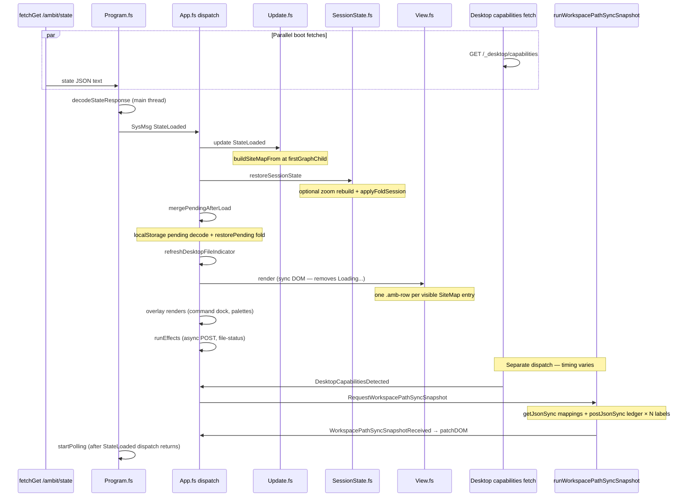

# Bucket 3 — client post-state work

Date: 2026-08-27  
Branch: `w/relaxed-concurrency`  
Parent: [[plan/client-start-time/research.md]], [[plan/client-start-time/reports/localhost-timing-after-optimizations.md]]  
Scope: synchronous main-thread work from `/ambit/state` response until first outline render (and what runs immediately after).

## Definition

**Bucket 3** is the Network tab **blue segment** after the last **critical** boot request (`GET /ambit/state`) until the outline replaces the HTML `"Loading..."` placeholder.

**Bucket 4** is post-first-render background work: ledger sync (when it runs after paint), `file-status`, pending POST replay, polling.

**Ledger sync is not on the `StateLoaded` path** — it is triggered by `DesktopCapabilitiesDetected` from the parallel `/_desktop/capabilities` fetch. It can still block first paint when that fetch completes before or during the `StateLoaded` dispatch (see below).

## Timeline: state response → first render → ledger

### Phase A — before `StateLoaded` dispatch ([[src/Client/Program.fs]]:73–83)

| Step | Location | Sync? | Before first paint? |
| --- | --- | --- | --- |
| Response text available | `fetchGet` callback | — | yes (still `"Loading..."`) |
| `decodeStateResponse` | [[src/Client/Program.fs]]:80, [[src/Client/UpdateCodec.fs]]:17, [[src/Shared/ApiResponseSerialization.fs]]:24 | **yes** | yes |
| `dispatch StateLoaded` | [[src/Client/Program.fs]]:82 | **yes** (entire dispatch) | yes |

Decode builds the full in-memory `Graph` from JSON. Cost scales with payload size (localhost ~400k decoded chars; production baseline ~3.7M).

### Phase B — `StateLoaded` dispatch ([[src/Client/App.fs]]:593–633)

All steps run **synchronously on the main thread** before `runEffects`.

| Order | Step | Location | Sync? | Deferrable? |
| --- | --- | --- | --- | --- |
| 1 | `update` → `buildSiteMapFrom` | [[src/Client/Update.fs]]:121–125 | yes | partial (minimal map first) |
| 2 | `restoreSessionState` | [[src/Client/SessionState.fs]]:84–120 | yes | **yes** — fold expansion |
| 2a | optional second `buildSiteMapFrom` (saved zoom) | [[src/Client/SessionState.fs]]:105–107 | yes | yes |
| 2b | `applyFoldSession` | [[src/Client/SessionState.fs]]:114–115, [[src/Shared/ViewModelSiteMap.fs]]:350–376 | yes | **yes** |
| 3 | `mergePendingAfterLoad` | [[src/Client/App.fs]]:112–139 | yes | partial (empty queue is free) |
| 3a | `loadPendingQueue` (localStorage JSON decode) | [[src/Client/UpdateHelpers.fs]]:96–103 | yes | no (correctness) |
| 3b | `SyncPlanner.restorePending` | [[src/Shared/SyncPlanner.fs]]:52–70 | yes | no when queue non-empty |
| 4 | `refreshDesktopFileIndicator` | [[src/Shared/ViewModelRowState.fs]]:147–158 | yes (model only) | indicator can wait |
| 5 | **`View.render`** | [[src/Client/View.fs]]:21–49 | **yes** | partial (fewer visible rows) |
| 6 | overlay renders | [[src/Client/App.fs]]:622–625 | yes | low priority |
| 7 | `renderSyncChrome` (again in `finally`) | [[src/Client/App.fs]]:632 | yes | duplicate call |

**First paint boundary:** `View.render` removes `"Loading..."` and inserts row DOM ([[src/Client/View.fs]]:24–45). Browser paint happens after the JS turn yields; anything still on the main thread in this dispatch (or a concurrent `DesktopCapabilities` dispatch) delays paint.

### Phase C — `runEffects` after `StateLoaded` ([[src/Client/App.fs]]:633)

| Effect | Handler | Blocks paint? |
| --- | --- | --- |
| `SubmitPendingBatch` | async `postJson` | no |
| `RequestDesktopFileStatus` / `RequestServerFileStatus` | async `postJson` | no |
| `RequestWorkspacePathSyncSnapshot` | **not** from `StateLoaded` | — |

`startPolling` runs in [[src/Client/Program.fs]]:83 **after** the `StateLoaded` dispatch returns — cheap (`setInterval` only, [[src/Client/App.fs]]:749).

### Phase D — ledger sync (parallel boot path, **not** bucket 3 by code path)

| Step | Location | Sync? | Typical timing |
| --- | --- | --- | --- |
| `GET /_desktop/capabilities` | [[src/Client/Program.fs]]:42–50 | async fetch | parallel with state |
| `DesktopCapabilitiesDetected` → effect | [[src/Client/Update.fs]]:183–186 | — | when capabilities return |
| `runWorkspacePathSyncSnapshot` | [[src/Client/App.fs]]:508–553 | **blocking sync XHR** | after capabilities |
| `getJsonSync` workspace-mappings | [[src/Client/App.fs]]:509 | **yes** | ~29 ms localhost |
| `postJsonSync` workspace-sync-ledger × labels | [[src/Client/App.fs]]:532–534 | **yes**, sequential fold | 95–567 ms each localhost (×7) |
| `WorkspacePathSyncSnapshotReceived` | [[src/Client/Update.fs]]:200–202 | yes + `patchDOM` | after ledger |

On localhost ([[plan/client-start-time/reports/localhost-timing-after-optimizations.md]]), network order is: **state → mappings → ledger ×7 → file-status**. That implies ledger work **starts after** the state response is processed, and on a typical run **after** `View.render` has mutated the DOM. Ledger still extends total waterfall span (~3 s) and uses **blocking** `postJsonSync`, so it can freeze the UI and delay the browser paint if the capabilities callback runs in the same turn before yield.

**Verdict: ledger sync is bucket 4 by intent** (not part of `StateLoaded`), but **can overlap bucket 3 perceptually** when capabilities return early or when sync XHR runs before the browser paints.

## What `buildSiteMapFrom` actually costs

[[src/Shared/ViewModelSiteMap.fs]]:128–147 builds only the **zoom root + immediate children** (children start collapsed, `childrenStale = true`). It does **not** walk the full graph. Cost is **O(fanout at zoom root)**, typically small.

`applyFoldSession` ([[src/Shared/ViewModelSiteMap.fs]]:350–376) is the expensive SiteMap path: BFS over the site map, calling `expandEntry` for each saved expanded node, which materializes children from the graph. Cost grows with **saved fold count × subtree size**.

## What `View.render` costs

[[src/Client/View.fs]]:36–45 loops `getVisibleInstanceIds` (preorder of expanded tree) and calls `makeRowElement` per entry ([[src/Client/RowView.fs]]:388–393) — full DOM subtree + event wiring per row. No virtualization ([[plan/large-node-cursor-perf/investigation.md]]). Cost is **O(visible rows)**. The loop calls `document.getElementById "hidden-input"` on every iteration ([[src/Client/View.fs]]:43).

## Likely cost drivers (ranked)

| Rank | Driver | Scales with | Evidence |
| --- | --- | --- | --- |
| 1 | **`decodeStateResponse`** | JSON / node count | Runs on full payload before any UI; dominant on large graphs |
| 2 | **`View.render`** | visible row count | Sync DOM create per row; no virtualization |
| 3 | **`applyFoldSession`** (session restore) | saved expanded nodes | Expands tree before first render; multiplies render cost |
| 4 | **Ledger sync XHR waterfall** | mapped workspace labels | Blocking `postJsonSync` × N; bucket 4 but blocks UI ([[src/Client/App.fs]]:508–553) |
| 5 | **`mergePendingAfterLoad`** | pending queue length | Usually empty; costly when offline edits queued |
| 6 | **`buildSiteMapFrom`** (1–2×) | zoom-root fanout | Usually cheap vs decode/render |
| 7 | Overlay + duplicate `renderSyncChrome` | fixed | Minor unless profiling shows otherwise |

Localhost (~400k JSON): state is 199 ms; remaining ~2.8 s span is likely **ledger sync + render/decode** combined. Production HITL on the same data is required to rank decode vs render at full graph size.

## Actionable fixes

### High leverage

1. **Defer session fold expansion** — First render with default collapsed SiteMap from `buildSiteMapFrom` only; run `applyFoldSession` in `requestAnimationFrame` or `setTimeout(0)` after paint. Files: [[src/Client/App.fs]]:593–597, [[src/Client/SessionState.fs]]:84–120. Preserves zoom-root restore; only defers `e` expanded ids.

2. **Make ledger sync async and post-paint** — Replace `getJsonSync` / `postJsonSync` in `runWorkspacePathSyncSnapshot` with async `fetch` + batch or parallel requests; schedule via `setTimeout(0)` after first render. Files: [[src/Client/App.fs]]:508–553. Related: [[tmp/load-performance-audit.md]].

3. **Boot instrumentation** — `performance.mark` at: state fetch start/response, decode end, `StateLoaded` dispatch start/end, `View.render` end, first `WorkspacePathSyncSnapshot` start. Files: [[src/Client/Program.fs]], [[src/Client/App.fs]], [[src/Client/View.fs]]. Validates fixes on production data.

### Medium leverage

4. **Two-phase first render** — Render ROOT + collapsed children first (current default map without `applyFoldSession`), then patchDOM after deferred fold restore. Reuses existing `patchDOM` path.

5. **Row virtualization or chunked render** — For large visible sets, render first screen in first frame, `requestIdleCallback` for remainder. Files: [[src/Client/View.fs]], ties to [[plan/large-node-cursor-perf/project.md]].

6. **Cache `hidden-input` sentinel in `render`** — Avoid per-row `getElementById` ([[src/Client/View.fs]]:43).

### Lower / correctness-sensitive

7. **Defer `mergePendingAfterLoad` graph replay** — Only safe when queue empty; non-empty queue must replay before interactive edit.

8. **Defer `refreshDesktopFileIndicator` / file-status** — Status chrome can update after outline; effect already async once fired.

## Production vs localhost notes

- Localhost validates mechanism with a **small test DB** (400k decoded JSON). Production baseline used **~3.7M characters** — decode and render may reorder the ranking.
- Scope-before-encode + gzip fixed state TTFB on localhost; bucket 3 + ledger now dominate perceived boot on loopback.
- **Production HITL** on the same workspace remains the apples-to-apples test ([[WORK.md]] Pending).

## Status

Investigation complete. No code changes in this report. Implementation candidates tracked on [[WORK.md]].
