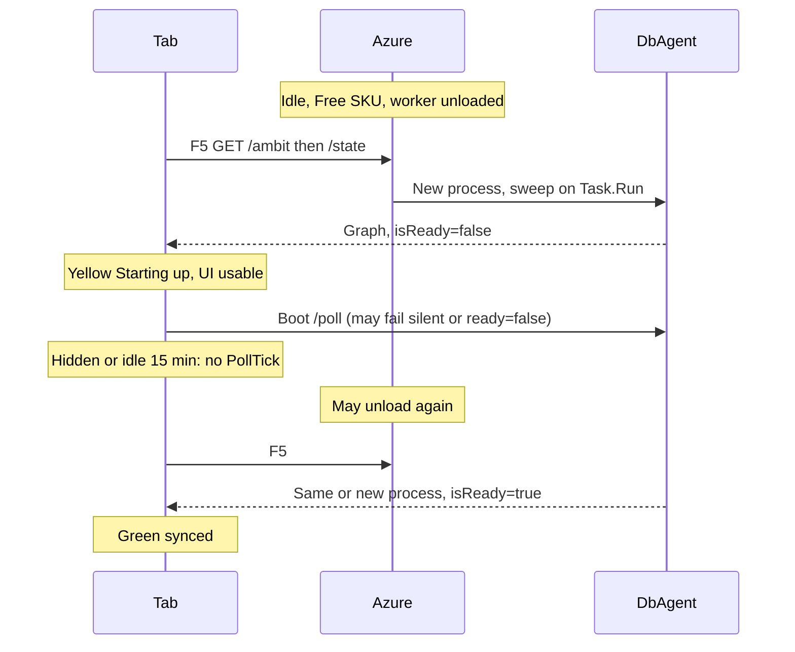

# Free-tier cold start and sync recovery

Date: 2026-08-28
Branch: `w/client-start-time` (cut from `selective-client-sync`)
Prior notes: [[stale-view-possibilities.md]]
Verdict: **mixed**

The Server half is confirmed in code and in a focused test: a new process serves the Graph with `isReady=false` until the sweep completes. The Azure Free unload is likely from the user SKU report and from the F5#1 yellow / F5#2 green pattern, but this repo does not record `WEBSITE_SKU` or Always On; unload is **not** proven here. Recovery via the 5 s Poll is **possible** (the Browser sometimes reaches ready/synced). Non-recovery for the whole session is also **observed HITL** (the view can stay on `"Starting up…"`). Hidden and idle gates are not the only way: silent boot-Poll fail, `PollDone` with `readyOpt = None`, `tryStartPoll` only from Idle, `CodeOutdated` stopping later Polls, and `/state` `isReady=false` with no later `ready: true` can leave `isServerReady` false on a **visible** tab until F5.

This agent did **not** reproduce Azure idle unload. No red-capable production loop exists here. Local confirmation: `dotnet test tests/Server.Tests/Gambol.Server.Tests.fsproj --filter "DisplayName~serves reads while sweep"` passed (1). `dotnet test tests/Shared.Tests/Gambol.Shared.Tests.fsproj --filter "DisplayName~getPollOutcome sends an existing page|DisplayName~SyncInfo readiness follows"` passed (2).

## User HITL

- Sometimes the Browser progresses from yellow `"Starting up…"` to ready/synced.
- Sometimes the Browser view **never** leaves `"Starting up…"` for the session. Treat that as observed HITL, not as a claim that was too strong.

### User HITL: existing tab after server reload

Observed: Server loaded, Browser green/synced, Server process restarted, **already-open** tab flipped to yellow `"Starting up…"` (not F5#1). This is an existing page + new process.

Confirmed in code:

1. New process serves a new `buildEpochSec` / Poll `b`. Client `getPollOutcome` returns `CodeOutdated` when Poll stamps differ from `window.__BUILD_TS__` / page stamps ([[src/Shared/SyncLogic.fs]] L35–42). Same Poll can still have `isReady=false` while the new `DbAgent` sweep runs ([[src/Server/Api.fs]] L124–128; [[src/Server/DbAgent.fs]] L63–66, L416–426).
2. `PollDone` applies `withServerReady` from `readyOpt` **first** ([[src/Client/Update.fs]] L211–218), then matches `stateOpt`. The `CodeOutdated` branch still uses that `readyModel` ([[src/Client/Update.fs]] L290–292). So a Poll with `ready: false` + `CodeOutdated` flips a green banner to `"Starting up…"` and sets `syncState = CodeOutdated`.
3. `tryStartPoll` only emits from `Idle` with an empty pending queue ([[src/Shared/SyncPlanner.fs]] L103–112). After `CodeOutdated`, later Polls stop. No later `ready: true` can arrive. StatusView shows `"Starting up…"` whenever `not isServerReady`, **before** it looks at `syncState` — including when that state is `CodeOutdated` ([[src/Client/StatusView.fs]] L11–13, L48–50). Overlay “New version available” is a separate root.
4. Why F5#2 goes green: new HTML carries matching `__BUILD_TS__`; `/state` after the sweep has `ready: true`. No stamp mismatch, so no `CodeOutdated` Idle trap.

This path matches both “never leaves Starting up” (ready false then CodeOutdated stops Polls) and “sometimes recovers” (if the first Poll after restart already has `ready: true`, yellow clears via `withServerReady true` even under `CodeOutdated`; or if stamps somehow match). For this HITL, watch Network `/poll` `ready` and `b` vs `window.__BUILD_TS__` after a `dotnet` restart **without** F5.

## What would refute

- Azure Log stream shows **no** process start on the first GET after idle (warm worker). Then F5#1 yellow is not a cold process.
- First `/state` JSON has `"ready": true` and the banner stays yellow. Then the banner bug is Browser-only.
- Network tab shows Poll `"ready": true` while `#sync-status` stays `"Starting up…"`. Then `PollDone` / `StatusView` is wrong.
- `window.__BUILD_TS__` (process start) is **unchanged** across idle F5#1, and remote Changes still never appear. Then unload/new process is not the cause; the Poll gate or `DataOutdated` is enough.

## Confirmed Server mechanism

A new `DbAgent` runs the projection sweep on `Task.Run` and serves `GetState` against the loaded Graph with `isReady = false` until `ready.TrySetResult` ([[src/Server/DbAgentStartup.fs]] L19–33, [[src/Server/DbAgent.fs]] L63–66, L416–426). [[doc/current/persistence-model.md]] L31–33 states the same. Test [[tests/Server.Tests/DbAgentTests.fs]] ``DbAgent serves reads while sweep buffers FIFO mutations then trims`` asserts `beforeState.isReady = false` with a servable Graph, then `afterState.isReady = true` after the sweep. Sweep duration is DB work, not a fixed timeout.

HTTP Poll uses `handle.isReady ()` the same way ([[src/Server/Api.fs]] L124–128). During the sweep, reads (`GetState`, `GetRevision`, `GetChangesSince`) are served; Posts wait in FIFO ([[src/Server/DbAgent.fs]] L350–368). Maintenance does not append `changes` or advance Revision ([[doc/current/persistence-model.md]] L31).

`DeployEpochSec` is `DateTime.UtcNow` at process start, injected as `window.__BUILD_TS__` ([[src/Server/RouteRegistration.fs]] L197–218, L425–428). A new process changes that stamp. Assembly mtime does not.

Production persistence is `db` ([[doc/reference/deploy-azure.md]]). Repo docs do **not** record Always On or Free SKU. User report: `WEBSITE_SKU = Free` (no Always On; idle unloads the worker). Postgres start/stop ([[doc/reference/postgres-environments.md]] §8) is a different cost control; a stopped DB would fail the sweep closed, and F5#2 would not come up green.

## Banner vs Graph apply (split)

`isReady` / `isServerReady` does **not** gate `applyServerTail`.

| Surface | Driven by | Independent of |
| --- | --- | --- |
| Yellow `"Starting up…"` | `not syncInfo.isServerReady` **before** `syncState` ([[src/Client/StatusView.fs]] L11–13) | Poll tail, Revision, BootCache origin |
| Graph merge | `PollDone` → `SyncLogic.applyServerTail` when `DataOutdated` and not blocked ([[src/Client/Update.fs]] L293–320, [[src/Shared/SyncLogic.fs]] L135–139) | `isReady` |

`SyncInfo.initial.isServerReady = false`. Only `withServerReady` flips it ([[src/Shared/ViewModelSync.fs]] L74–87; test ``SyncInfo readiness follows state and poll responses``). `StateLoaded` copies `response.isReady` ([[src/Client/Update.fs]] L143–145). `AckSyncRisk` sets `syncRiskAcknowledged` only ([[src/Client/Update.fs]] L148–149); it does not clear the yellow label.

A usable outline with a yellow banner is the specified Server behavior: mutations buffer during the sweep; the Browser still enables controls ([[doc/current/persistence-model.md]] L33).

## Client paths that fail to recover

1. **Boot Poll swallows failure.** `runBootPoll` uses empty `onPollFail` and ignores decode errors ([[src/Client/Program.fs]] L180–188). No `PollDone`. Banner stays at the `/state` value.
2. **`PollDone` with `readyOpt = None` leaves `isServerReady` unchanged** ([[src/Client/Update.fs]] L211–219). Periodic Poll failure dispatches exactly that ([[src/Client/App.fs]] L419–426).
3. **Periodic Poll is gated.** `pollForRemoteChanges` skips `PollTick` when `document.hidden` or idle > 15 min (`idleTimeoutMs`) ([[src/Client/App.fs]] L94–95, L676–686). Hidden also clears `isPollingActive` (L704–711). Interval is 5 s when allowed (L790–791).
4. **`tryStartPoll` only from `Idle` with empty pending** ([[src/Shared/SyncPlanner.fs]] L103–112). `CodeOutdated` and `DataOutdated` are not `Idle`; later Polls stop. Ack does not return to `Idle` ([[src/Client/Overlays.fs]] L168–205).
5. **Existing page + new process → `CodeOutdated`, tail not applied.** `getPollOutcome` treats a changed `buildEpochSec` as `CodeOutdated` ([[src/Shared/SyncLogic.fs]] L35–42). `CodeOutdated` wins over `DataOutdated` (L37–41; tests ``getPollOutcome sends an existing page through CodeOutdated after server restart`` and ``getPollOutcome returns CodeOutdated when both code and data are outdated``). `PollDone` then sets `CodeOutdated` and **does not** call `applyServerTail` ([[src/Client/Update.fs]] L290–292). F5 loads new HTML stamps **and** `/state`, so it bypasses this trap.

Boot Poll itself is **not** hidden-gated; it is one fetch after paint ([[src/Client/Program.fs]] L190–194). A visible tab **can** recover `isServerReady` on a later 5 s Poll with `ready: true`. That path does not always run. The session can stay yellow on a visible tab when Polls fail, stop, or never carry `ready: true` (next section).

The hidden/idle Poll gate also **enables** Free-tier unload: while Polls run every 5 s the last HTTP request stays recent; when they stop, App Service can unload the worker. Unload is not proven in this repo.

## Visible tab, session-long `"Starting up…"`

These already-cited Browser paths can keep `isServerReady` false for the **entire session** while the tab is visible. They do not need `document.hidden` or the 15 min idle gate ([[src/Client/App.fs]] L676–686).

- **Silent boot-Poll fail.** Empty `onPollFail` and ignored decode errors ([[src/Client/Program.fs]] L180–188). No `PollDone`. Banner stays at `/state` `isReady`. Periodic Poll can still recover; this path sticks for the session only when those Polls also fail or stop.
- **`PollDone` `readyOpt = None` leaves `isServerReady` unchanged** ([[src/Client/Update.fs]] L211–219). Periodic Poll network/decode failure dispatches that ([[src/Client/App.fs]] L419–426). If every Poll fails, the flag stays false on a visible tab.
- **`tryStartPoll` only from Idle** with empty pending ([[src/Shared/SyncPlanner.fs]] L103–112). `CodeOutdated` and `DataOutdated` are not Idle; later Polls stop. Ack does not return to Idle ([[src/Client/Overlays.fs]] L168–205). After `/state` `isReady=false`, that trap blocks all later `withServerReady true`.
- **`CodeOutdated` wins over later readiness.** `getPollOutcome` treats a changed `buildEpochSec` as `CodeOutdated` ([[src/Shared/SyncLogic.fs]] L35–42). `PollDone` then sets `CodeOutdated` and does not call `applyServerTail` ([[src/Client/Update.fs]] L290–292). `readyOpt` is applied **before** that match (L211–219): a Poll with `ready: true` would clear yellow even under `CodeOutdated`. Session-long yellow needs that Poll (or only `/state`) to have `ready: false`, then the Idle trap. Fresh F5 usually matches stamps; this is the existing-page recycle case more than F5#1.
- **`/state` `isReady=false` then Poll never delivers `ready: true`.** Sweep still running for the session (residual alternative 3), or the fail/stop paths above. The Server still serves the Graph with `isReady=false` ([[src/Server/DbAgent.fs]] L63–66, L416–426). That Server fact is unchanged.
- **StatusView order.** `not syncInfo.isServerReady` is checked **before** `syncState` ([[src/Client/StatusView.fs]] L11–13). While the flag is false, `#sync-status` stays `"Starting up…"` even if `syncState` is Idle, Polling, or `CodeOutdated` (the overlay is a separate root).

## Timeline

%%{init: {'themeVariables': {'fontSize': '20px'}}}%%

Numbered:

1. Worker idle on Free SKU; Azure unloads the process (user SKU; not in repo).
2. Next GET starts a **new** process. Sweep starts. HTML gets a new `__BUILD_TS__`.
3. `GET /state` returns the Graph with `isReady=false`. Banner yellow. Outline usable.
4. Boot `/poll`: still `ready=false`, or silent fail. Banner unchanged.
5. If the tab is visible and not idle: a 5 s Poll **can** flip the banner when the sweep completes (`ready: true`). User HITL: this sometimes happens, and sometimes the banner never leaves `"Starting up…"`. If hidden/idle: no Poll; Azure may unload again (not proven here).
6. F5#2 `GET /state` on a process that already finished the sweep → `isReady=true` → green, Graph matches Server.

Two symptoms, **split** Browser bugs (unload not proven):

1. **Banner stuck yellow (first session):** first `/state` `isReady=false` plus no later `withServerReady true` (silent/gated Poll, Idle trap after `ready: false`, or sweep still running). Not `applyServerTail`. Can happen on a visible tab.
2. **Idle tab never applies remote Changes:** Poll never runs, **or** Poll after restart hits `CodeOutdated` and skips the tail. F5 is the wake GET **and** a full `/state`.

## Residual alternatives (ranked)

1. **Poll gated while hidden/idle** — enough for missed Changes without unload. Congruent with “refresh then matches.” Does not by itself explain F5#1 yellow / F5#2 green on a **new** document load.
2. **`CodeOutdated` after process restart on an existing page** — confirmed test; blocks tail apply. Overlay is “New version available.” StatusView still shows `"Starting up…"` if `isServerReady` stayed false. Can co-occur with unload (not proven).
3. **Sweep never completes** (`ready.TrySetResult` never runs) — every state/Poll stays `isReady=false`. F5#2 would stay yellow. Active work [[plan/owner-edge-db-repair/spec.md]] lengthens the sweep and can amplify yellow time if deployed.
4. **`DataOutdated` trap** — empty tail, `isAutoSyncBlocked`, or apply error; `tryStartPoll` stuck. Ack hides overlay only. Banner would already be past yellow if a Poll returned `ready: true`.
5. **BootCache snapshot with stored `isReady=false`** — amplifier, not origin of the label (predates BootCache). F5#2 correct `/state` rules out cache-as-authority for the “refresh matches Server” fact.
6. **Structural Changes under Unloaded parents skipped** — weaker; F5 `/state` installs the resident subgraph. Collapsed SiteMap is a view omission, not this idle pattern.

Not primary: expression-language; model-updated-but-view-stale for **visible** rows.

## Smallest HITL experiments

Stay on Network + Azure Log stream. One change at a time.

1. **Log stream after ≥20 min idle, then F5.** Full ASP.NET / `DbAgent` startup ⇒ new process. Silence ⇒ warm worker (refutes unload).
2. **First `/state` body `ready`.** `false` confirms sweep race. `true` with yellow banner ⇒ Browser-only.
3. **`window.__BUILD_TS__` vs Poll JSON `b`.** Change across idle ⇒ new `DeployEpochSec`. Same value ⇒ same process.
4. **Stay visible 30 s after yellow.** Flip to synced confirms Poll recovery (also observed). Stay on `"Starting up…"` is also observed HITL; watch Poll `ready`, HTTP status, and whether the `CodeOutdated` overlay appears. Ask: was the never-ready tab in the foreground the whole time, or left in the background?
5. **Idle hidden tab, then focus (no F5).** Network: is there a `/poll`? `document.hidden`? Status `504`/`502` during cold start? Overlay “New version available” ⇒ `CodeOutdated` path, not banner path.
6. **F5#2 `ready` and banner.** Green + `ready: true` matches sweep-already-done.

## Client recoveries that work on Free

Always On / a paid SKU is a **platform** mitigation (keeps the worker). It is not required to fix the Browser.

1. **While `isServerReady` is false, do not gate Poll on hidden or idle.** Keep the readiness handshake until a response has `ready: true` (or a deadline + user-visible error).
2. **Retry boot Poll on network/decode failure.** Do not swallow `onPollFail`.
3. **After process recycle (`CodeOutdated`):** apply the data tail **or** auto-reload `/state` (product choice). Today Ack does neither.
4. **Optional keep-alive Poll** while the tab exists would also delay Free unload. That trades cost for freshness; (1)–(3) recover after unload without paying SKU.

Do not block first paint on sweep complete: the Graph is already servable. The yellow label should mean “writes not yet in the normal loop,” and it should clear without a second F5.

## Discussion: API version vs process stamps for CodeOutdated

Proposal (now implemented): gate `CodeOutdated` on an API/protocol version marker shared by Server and Client. Do **not** treat process restart, Azure Free unload, or `dotnet` reload as code-outdated when the API is unchanged.

### Cite current design

1. **Stamps today.** `DeployEpochSec` is `DateTime.UtcNow` at process start ([[src/Server/RouteRegistration.fs]] L197–218). Poll/load/changes send it as `buildEpochSec` / JSON `b` ([[src/Server/Api.fs]] L114–133; [[src/Server/RouteRegistration.fs]] L300–303). HTML injects `window.__BUILD_TS__` from the same ([[src/Server/RouteRegistration.fs]] L425–428). `PageBuildEpochSec` is wwwroot artifact mtime (re-read each request for Fable watch); Poll sends `pageBuildEpochSec` / `p`; HTML injects `window.__PAGE_BUILD_TS__`. Client reads both via [[src/Client/JsInterop.fs]] into `ClientPollContext` ([[src/Client/App.fs]], [[src/Client/Program.fs]]). `getPollOutcome` returns `CodeOutdated` when both client stamps are non-zero and either Poll stamp differs ([[src/Shared/SyncLogic.fs]] L35–42); else `DataOutdated` when `poll.revision > clientRev`. `PollDone` on `CodeOutdated` sets that sync state and does **not** call `applyServerTail` ([[src/Client/Update.fs]] L290–292).
2. **No Shared API/protocol version.** Grep finds none. Closest is BootCache `codecVersion` (local cache only, [[src/Shared/BootCache.fs]]).
3. **Revision after process restart.** Persists: DB singleton `graph.revision` ([[src/Server/Database.fs]] `loadPersistedState`); file mode `SYSTEM/gambol.meta` ([[src/Server/Bookkeeping.fs]]). Sweep does not advance Revision. Client at N and new process at N: Poll returns empty changes ([[src/Server/Api.fs]] L120–123); with matching stamps/API, `getPollOutcome` is `None`; Idle path applies nothing — stay synced. Without `CodeOutdated`, a later Poll with `ready: true` clears Starting up.
4. **WORK.md page-stamp watch item.** During Fable/esbuild watch, `p` drifts while `__BUILD_TS__` is fixed → false `CodeOutdated`. Ignoring page drift when deploy stamp matches is a narrower fix for that. API-version-only also stops that false positive, and also stops true process-restart `CodeOutdated`.
5. **Tradeoffs.** API-version-only: old JS after a UI-only deploy keeps running until F5; needs one Fable+.NET Shared constant; bump discipline on any wire/shape break. Process stamps force reload on every recycle (current stuck path).

### Parent discussion (8 lines)

1. **Yes** — API-version-only `CodeOutdated` would fix existing-tab-after-reload stuck `"Starting up…"`: restart alone would not stop Polls, so a later `ready: true` can clear the banner.
2. Why: today’s trap is new `DeployEpochSec` → `CodeOutdated` → not Idle → no further Polls while `isServerReady` stayed false.
3. Still must bump the Shared API version on any incompatible Poll/state/changes/load wire or semantics change.
4. Revision **persists** across process restart (DB/file); client N + server N is empty Poll, not a reset to 0.
5. If stamps/API match and rev equal, Poll/`applyServerTail` are no-ops; Graph stays at N.
6. Relates to WORK watch item: both avoid false `CodeOutdated` on page mtime drift; API-version also ignores process recycle.
7. Risk: UI-only deploy without API bump leaves old tabs on stale client JS (Ack still does not reload).
8. Counter-risk of keeping process stamps: Free unload / `dotnet` reload keeps forcing `CodeOutdated` on open tabs.

## Implemented: API-version-only CodeOutdated

Date: 2026-08-28. `getPollOutcome` returns `CodeOutdated` only when Poll `apiVersion` differs from [[src/Shared/ApiResponses.fs]] `ApiVersion.current` (value 1). Process restart, Azure Free unload, `dotnet` reload, and wwwroot page mtime do not set `CodeOutdated`. Poll/load/changes JSON field `v` carries that constant. Stamps `b`/`p` and HTML `__BUILD_TS__` / `__PAGE_BUILD_TS__` stay for logging. No UI-only reload hint. See [[api-version-code-outdated.md]].
