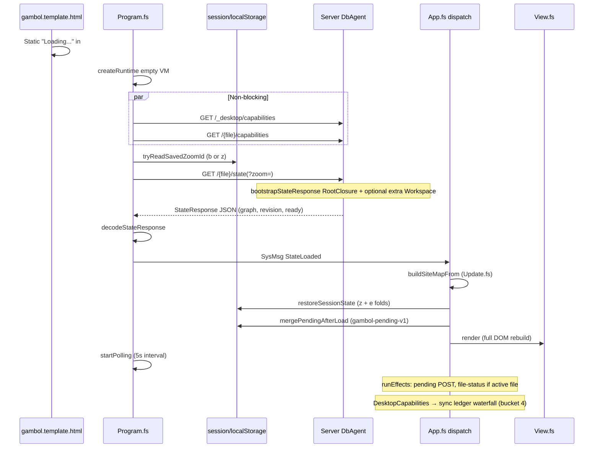

# Reload state reuse — investigation

Date: 2026-08-27
Branch: `w/relaxed-concurrency`
Parent: [[plan/client-start-time/project.md]], [[plan/client-start-time/reports/client-start-time-research.md]], [[plan/selective-client-loading/spec.md]]

## Executive answer

**Browser reload cannot reuse prior in-memory client state today.** F5 wipes the JS heap; Gambol persists only small session hints and an optional pending-change queue. The full resident graph, revision, SiteMap, selection, and monotonic Workspace residency from the prior session are gone. **`GET /{file}/state` is mandatory on every reload** and remains the dominant cost (server TTFB + client decode).

**Server-side in-memory state does survive reload** ([[src/Server/DbAgent.fs]] holds the full graph in a `ref`), but the client has no way to tell the server “I already have revision R with graph G” — there is no conditional bootstrap, revision cache, or IndexedDB graph store. The server still projects and JSON-encodes the scoped bootstrap on every request.

**Partial reuse is already happening** for zoom/fold hints (`?zoom=` widen + post-load session restore) and pending optimistic edits (localStorage merge). **Skipping or materially shrinking `/state` would require new persistence and API** (revision + graph snapshot client-side, or server revision-keyed encoded cache / incremental poll bootstrap). Product spec user story 11 explicitly treats refresh as a **new residency session** — any graph reuse must reconcile with that contract.

---

## Current boot flow (brief)

| Phase | Blocking first paint? | Typical cost (prod est.) |
| --- | --- | --- |
| Bundle eval | yes (before fetches) | ~150 ms |
| `/state` TTFB + download | yes | ~0.8–3.5 s (post scope-before-encode est. ~0.8–1.5 s) |
| `decodeStateResponse` | yes | ~200–1000 ms at ~3.7M chars |
| `StateLoaded` dispatch (SiteMap, session, render) | yes | ~8–118 ms when ~18 visible rows ([[plan/client-start-time/reports/boot-timing-instrumentation.md]]) |
| Ledger sync / file-status / poll | no (mostly) | extends total span; ledger can block UI via sync XHR |

Entry points: [[src/Client/Program.fs]], [[src/Client/App.fs]], [[src/Client/Update.fs]] (`StateLoaded`), [[src/Client/SessionState.fs]], [[src/Shared/ResidentProjection.fs]] (`bootstrapStateResponse`).

---

## What survives reload and where

### Client — survives F5

| Store | Key | Written | Read | Contents |
| --- | --- | --- | --- | --- |
| `sessionStorage` | `gambol-session-v1` | `saveSessionState` on `visibilitychange` (hidden) and `pagehide` ([[src/Client/App.fs]]:685–693) | Before `/state` and after load | JSON: `z` UI zoom, `b` bootstrap widen, `e` expanded NodeId list |
| `localStorage` | `gambol-session-v1` | Same write (fallback for iOS tab discard) | sessionStorage first, then localStorage | Same as above |
| `localStorage` | `gambol-pending-v1` | On pending queue change ([[src/Client/UpdateHelpers.fs]]:86–94) | `mergePendingAfterLoad` after `StateLoaded` | Optimistic `PendingChange` batch JSON |

Session write/read: [[src/Client/SessionState.fs]]. Pending queue: [[src/Client/UpdateHelpers.fs]]:83–103.

### Client — does NOT survive F5

| State | Notes |
| --- | --- |
| Full `Graph` / `VM` | Fresh empty model until `/state` returns ([[src/Client/Program.fs]]:16–35) |
| `siteMap`, `selectedNodes`, `mode`, `clipboard` | Rebuilt or reset on `StateLoaded` ([[src/Client/Update.fs]]:121–146) |
| `revision` | Only from server response; never persisted client-side |
| Workspaces loaded via explicit Load in prior session | **Intentionally dropped** — user story 11 ([[plan/selective-client-loading/spec.md]]:34) |
| In-memory search caches | `SearchCache`, `FileSearchCache` — module-level `mutable`, cleared on graph change |
| DOM `elementCache` | `mutable` in App runtime ([[src/Client/App.fs]]:99) |
| Client History (undo/redo) | Cleared on `StateLoaded` (`ClientHistory.clear ()`) |

### Client — not used at all

| Mechanism | Status |
| --- | --- |
| IndexedDB | Not implemented; deferred in [[doc/roadmap/on-demand-graph-residency.md]] and [[plan/selective-client-loading/spec.md]] |
| Service workers / HTTP cache for state | All boot fetches use `cache: 'no-store'` ([[src/Client/JsInterop.fs]]:373–392) |
| bfcache / `pageshow` restore | No handler; reload is always cold JS start |
| BFCache in-memory VM | Not applicable — no persistence hook |

### Server — survives client reload

| State | Location | Notes |
| --- | --- | --- |
| Full canonical graph | `DbAgent` / `FileAgent` in-memory `ref` ([[src/Server/DbAgent.fs]]:31–66) | Loaded once at process start from DB/files |
| Revision, isReady | Same agent state | Returned on every `getState` |
| PostgreSQL / disk | Durable source | Unchanged by client reload |

Server still **re-projects and re-encodes** scoped JSON per request ([[src/Server/Api.fs]]:204–219, [[src/Shared/ResidentProjection.fs]]:309–315). In-memory graph reuse on the server does not skip client-facing work unless a **revision-keyed encoded cache** is added (discussed in [[plan/client-start-time/reports/state-further-optimization.md]]).

---

## Server queries on reload (what / why)

### Parallel at boot (non-blocking for `/state`, but same page load)

| Request | Initiator | Purpose |
| --- | --- | --- |
| `GET /_desktop/capabilities` | [[src/Client/Program.fs]]:42–50 | Desktop bridge features (workspace sync, file-status) |
| `GET /{file}/capabilities` | [[src/Client/Program.fs]]:53–61 | Server features (`canGitSave`, `canFileStatus`) |

`{file}` derived from URL path ([[src/Client/UpdateHelpers.fs]]:16–18), e.g. `ambit`.

### Critical path — blocks first UI

| Request | Query params | Purpose | Why not skippable today |
| --- | --- | --- | --- |
| **`GET /{file}/state`** | `?zoom={guid}` when session has `b` or legacy `z` outside ROOT ([[src/Client/Program.fs]]:67–71, [[src/Client/SessionState.fs]]:37–52) | Scoped `StateResponse`: ROOT closure + at most one extra complete Workspace; `revision`; `isReady` | Client has no persisted graph or revision to validate against; spec requires fresh residency session |

Server handler: [[src/Server/RouteRegistration.fs]] `MapGet("/ambit/state")` → [[src/Server/Api.fs]] `getState` → `ResidentProjection.bootstrapStateResponse`.

Default scope: **complete ROOT Workspace** + nested Workspace headers (Unloaded) + reachable Ref headers; optional extra Workspace when saved zoom targets outside ROOT ([[plan/selective-client-loading/spec.md]]:76–77).

### After first render (bucket 4 — not on `StateLoaded` path, but same reload)

| Request | Trigger | Purpose |
| --- | --- | --- |
| `GET /_desktop/workspace-mappings` | `DesktopCapabilitiesDetected` when desktop sync enabled ([[src/Client/Update.fs]]:183–186) | Mapped workspace labels → desktop paths |
| `POST /_desktop/workspace-sync-ledger` × N labels | `runWorkspacePathSyncSnapshot` ([[src/Client/App.fs]]:508–553) | Per-label sync status rows (blocking sync XHR) |
| `POST /{file}/file-status` or `/_desktop/file-status` | `refreshDesktopFileIndicator` effect when active file reference ([[src/Shared/ViewModelRowState.fs]]:147–158) | File sync indicator for focused row |
| `POST /{file}/changes` | `mergePendingAfterLoad` when localStorage pending non-empty | Replay optimistic edits |
| `GET /{file}/poll?rev={n}` | `startPolling` → first `PollTick` within 5s ([[src/Client/App.fs]]:401–427, 771–772) | Detect server-ahead revision, deploy stamp drift, external changes |

Poll uses client revision from **`/state` response only** — there is no stored prior revision on reload ([[src/Shared/SyncLogic.fs]] `getPollOutcome` compares `poll.revision` to client).

### Instrumentation

Boot logs (always on, `[Gambol boot]` prefix): decode ms/chars/nodes, restoreSessionState ms, View.render ms/rows, StateLoaded dispatch total ([[plan/client-start-time/reports/boot-timing-instrumentation.md]]). Network tab remains authoritative for TTFB.

---

## Gap analysis — can we skip? what's missing?

### Clarifying “in memory from before”

| Interpretation | Reality on F5 |
| --- | --- |
| **Browser JS heap** | **Gone.** Only `sessionStorage` / `localStorage` survive. |
| **Server process memory** | **Retained.** Full graph already loaded; cost is projection + JSON encode + network + client decode — not DB reload. |
| **HTTP cache** | **Bypassed.** `cache: 'no-store'` on state fetch. |

There is no hidden in-browser graph cache. The user’s intuition applies mainly to the **server side** (graph already warm) or to **small persisted hints** (zoom/folds/pending).

### What persisted state provides vs `/state`

| Data | Persisted? | From `/state`? | Gap |
| --- | --- | --- | --- |
| Scoped resident graph | **No** | **Yes** (primary payload) | **Cannot skip fetch** without new client graph store |
| Global `revision` | **No** | **Yes** | Required for poll/submit conflict detection |
| `isReady` | **No** | **Yes** | Server parse/upload readiness |
| UI `zoomRoot` | **Yes** (`z`) | No (client applies after load) | Already reused; does not reduce payload |
| Bootstrap widen | **Yes** (`b`) | Affects `?zoom=` only | Widens scope (extra Workspace), never shrinks |
| Expanded folds | **Yes** (`e`) | No | Restored client-side only; spec forbids widening `/state` for folds |
| Optimistic pending edits | **Yes** (`gambol-pending-v1`) | No | Merged after fetch via `SyncPlanner.restorePending` |
| Extra Workspaces loaded in prior session | **No** (by design) | Only ROOT + optional zoom Workspace | **Lost on refresh** — user story 11 |
| SiteMap / selection / mode | **No** | Rebuilt from graph | Selection always `None` after load |
| Workspace sync ledger facts | **No** | Separate desktop endpoints | Independent query waterfall |
| Capabilities | **No** | Separate endpoints | Cheap; parallel |

### Could poll replace `/state` on reload?

**Not with current API.** Poll returns a **Change tail** at a revision, not a scoped bootstrap graph ([[src/Shared/ApiResponses.fs]]). `/state` installs graph with no Change list ([[plan/selective-client-loading/spec.md]]:77). Incremental bootstrap is explicitly deferred ([[doc/roadmap/on-demand-graph-residency.md]]:24, [[plan/client-start-time/reports/state-further-optimization.md]]:108–110).

A future path: persist `(revision, scopedGraphJson)` in IndexedDB + `GET /state?rev=N` returning 304 or `{ "changes": [...] }` when unchanged — **not implemented**.

### Could server skip work if revision unchanged?

**Yes, in principle — server-side only.** Revision-keyed cache of **already-encoded** scoped JSON for `(revision, scope, zoom)` would turn warm F5 into ~0.1–0.4 s TTFB ([[plan/client-start-time/reports/state-further-optimization.md]]:136–137). Client still downloads and decodes JSON unless paired with client-side graph cache.

### Staleness / correctness risks if reusing local graph

| Risk | Mitigation needed |
| --- | --- |
| Server revision advanced while tab open | Must poll or conditional fetch before trusting cache |
| Server process restart | `buildEpochSec` / stale page UX ([[plan/selective-client-loading/spec.md]]:92) |
| Pending queue vs server | Already handled by `restorePending` filtering `change.id >= serverRevision` ([[src/Shared/SyncPlanner.fs]]:52–70) |
| Scoped graph vs full session residency | Reload must not resurrect Workspaces loaded only via Load in prior session unless spec changes |
| Fold restore on partial graph | `applyFoldSession` only expands where nodes exist in resident projection ([[plan/selective-client-loading/spec.md]]:29) |

---

## Feasibility assessment

| Approach | Skip `/state`? | Effort | Fits current spec? |
| --- | --- | --- | --- |
| **Status quo** (hints + full `/state`) | No | — | Yes |
| **Server revision-keyed encode cache** | No (smaller/faster TTFB) | Low | Yes |
| **Client IndexedDB graph + revision + conditional bootstrap API** | Partial / full skip when revision matches | High | Conflicts with user story 11 unless residency rules updated |
| **Two-phase visible-closure fetch** | Shrinks payload, not eliminate | High | Exploratory ([[plan/selective-client-loading/reports/two-phase-state-loading-exploration.md]]) |
| **Defer fold restore / ledger / file-status** | No | Low–medium | Yes — perceived boot only ([[plan/client-start-time/reports/bucket-3-post-state-work.md]]) |
| **Reuse server memory without client cache** | No | N/A | Server already holds graph; bottleneck is encode + wire + decode |

**Bottom line:** Skipping server state queries on reload is **not feasible without new client persistence and API**. Reducing them is feasible via server encode cache (warm F5), architectural on-demand residency (smaller bootstrap), or eventual IndexedDB + revision-conditional fetch (roadmap). Existing session/localStorage reuse is **already maximized** for its scope (zoom widen, folds, pending queue).

---

## Concrete recommendations

### 1. Set expectations — no silent full-graph reuse on F5

Document that reload is a **new residency session** per [[plan/selective-client-loading/spec.md]] user story 11. Prior-session Workspaces beyond ROOT + saved-zoom Workspace are **not** retained and **should not** be rehydrated from browser memory without an explicit persistence design.

### 2. Server: revision-keyed bootstrap encode cache (best near-term win)

When `DbAgent` revision unchanged, return cached scoped JSON bytes for `(revision, scope, zoom)` instead of re-projecting + re-encoding ([[plan/client-start-time/reports/state-further-optimization.md]]). Files: [[src/Server/Api.fs]], [[src/Shared/ResidentProjection.fs]]. Helps **repeat F5** within same revision; first load after edit unchanged.

### 3. Client: defer non-critical post-boot work (perceived boot)

Already tracked on [[WORK.md]]: defer `applyFoldSession` to after first paint ([[plan/client-start-time/reports/bucket-3-post-state-work.md]]); async ledger waterfall ([[tmp/load-performance-audit.md]]). Files: [[src/Client/App.fs]], [[src/Client/SessionState.fs]].

### 4. Longer term: IndexedDB graph snapshot + conditional `/state` or poll-bootstrap

Align with [[doc/roadmap/on-demand-graph-residency.md]] incremental bootstrap and [[plan/selective-client-loading/reports/two-phase-state-loading-exploration.md]]. Persist `{ revision, scopedGraph }` on `pagehide`; on boot send `If-None-Match` / `?sinceRev=`; apply Change tail or full refetch on mismatch. **Requires spec decision** on whether refresh may restore monotonic Workspace residency from disk.

### 5. Do not rely on HTTP cache or in-memory JS reuse

Boot fetches intentionally bypass cache ([[src/Client/JsInterop.fs]]). No code path reads a prior VM from memory on reload.

### 6. Validate with existing instrumentation

After deploy, compare `[Gambol boot] decodeStateResponse` and Network `/state` TTFB on production HITL ([[plan/client-start-time/reports/production-hitl-after-deploy.md]]). Separates server vs client remaining cost.

---

## Key file references

| Concern | Path |
| --- | --- |
| Boot fetch + decode | [[src/Client/Program.fs]] |
| StateLoaded pipeline | [[src/Client/App.fs]], [[src/Client/Update.fs]] |
| Session persistence | [[src/Client/SessionState.fs]] |
| Pending queue persistence | [[src/Client/UpdateHelpers.fs]] |
| Fetch cache policy | [[src/Client/JsInterop.fs]] |
| First render | [[src/Client/View.fs]] |
| SiteMap / VM | [[src/Shared/ViewModel.fs]], [[src/Shared/ViewModelSiteMap.fs]] |
| State JSON codec | [[src/Shared/Serialization.fs]], [[src/Shared/ApiResponseSerialization.fs]] |
| Bootstrap scope | [[src/Shared/ResidentProjection.fs]] |
| Server state handler | [[src/Server/Api.fs]], [[src/Server/DbAgent.fs]] |
| Residency contract | [[plan/selective-client-loading/spec.md]] |
| Prior boot timing research | [[plan/client-start-time/reports/state-further-optimization.md]], [[plan/client-start-time/reports/bucket-3-post-state-work.md]] |

## Status

Investigation complete. No `src/` changes.
