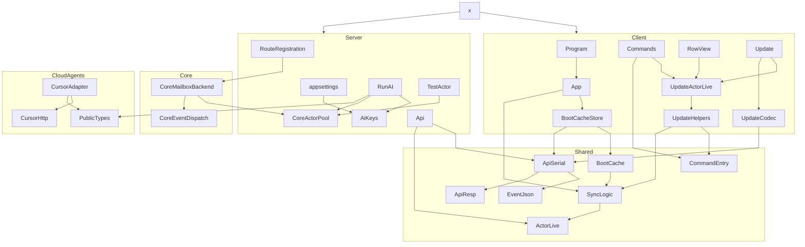

# Changed-file directional links

Uses among the working-tree files from the live-Actor chrome change. Arrow `A --> B` means A uses B (named module or type). If `A --> B`, `B --> C`, and `A --> C`, `A --> C` is omitted.

## 1. Omitted arrows

These files appear too many times, so their arrows are omitted: [History.fs](src/Shared/History.fs), [ViewModel.fs](src/Shared/ViewModel.fs), [ViewModelSync.fs](src/Shared/ViewModelSync.fs). Duplicate [Program.fs](src/Client/Program.fs) / [App.fs](src/Client/App.fs) / [Update.fs](src/Client/Update.fs) fan-out onto the same helpers is also omitted; [Program.fs](src/Client/Program.fs) keeps only `Program --> App`.

Shortcuts removed: `UpdateActorLive --> SyncLogic` (via [UpdateHelpers.fs](src/Client/UpdateHelpers.fs)), `UpdateActorLive --> ActorLive` (via [SyncLogic.fs](src/Shared/SyncLogic.fs)), `RowView --> ActorLive` (via [UpdateActorLive.fs](src/Client/UpdateActorLive.fs)), `App --> ApiSerial` (via [BootCacheStore.fs](src/Client/BootCacheStore.fs)), `BootCache --> ActorLive` (via [SyncLogic.fs](src/Shared/SyncLogic.fs)), `UpdateCodec --> EventJson` (via [ApiResponseSerialization.fs](src/Shared/ApiResponseSerialization.fs)), `Api --> ApiResp` (via [ApiResponseSerialization.fs](src/Shared/ApiResponseSerialization.fs)), `Routes --> AiKeys` (via [RunAgentActor.fs](src/Server/RunAgentActor.fs)).

[ViewModelDomPlan.fs](src/Shared/ViewModelDomPlan.fs) has no named use in this file set. [style.css](src/Server/wwwroot/style.css) and the `.fsproj` files are compile or class-name links, not named-module uses.

## 2. Diagram

