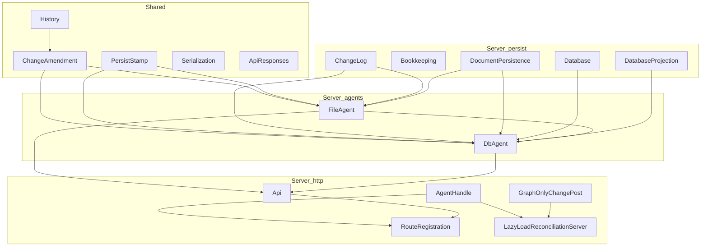

# Core Changes placement facts

Date: 2026-09-05

Purpose: Fact inventory for grilling [[plan/core-creation/issues/05-place-core-changes-in-existing-projects]]. Records compile order, dependencies, mailbox ownership, duplication, persistence-mode delegation, mechanical placement constraints, and movable surface. No placement choice.

Related: [[plan/core-creation/issues/03-define-typed-core-changes-contract]], [[plan/core-creation/issues/04-separate-http-adapter-from-core-changes]], [[plan/core-creation/reports/current-change-contract-facts]].

## 1. Dependency graph and compile-order constraints

### Project references

- [[src/Server/Gambol.Server.fsproj]] references [[src/Shared/Gambol.Shared.fsproj]] and [[src/Shared/dotnet/Gambol.Shared.DotNet.fsproj]].
- [[src/Shared/Gambol.Shared.fsproj]] has no Server reference.

### Shared compile order (relevant slice)

| Order | File | Depends on (within Shared) for change apply |
|------:|------|---------------------------------------------|
| 16–19 | GraphBuild, GraphQuery, GraphMutate, GraphOps | Model, earlier graph modules |
| 42–43 | DocumentArtifactPath, DocumentPartition | Graph modules |
| 44 | History.fs | Graph, DocumentPartition, CssClass, Filename, NodeUpdateTime |
| 46–47 | ChildListWire, ChildListMerge | Graph, earlier modules |
| 48 | ChangeAmendment.fs | History, ChildListWire, ChildListMerge, CssClass |
| 49 | ClientHistory.fs | History |
| 50 | DocumentOpImpact.fs | DocumentPartition, History types |
| 51 | ApiResponses.fs | Model, Revision |
| 87 | Serialization.fs | History, ChangeBatch wire types |
| 88 | ApiResponseSerialization.fs | ApiResponses, Serialization |

`PersistStamp` lives at the bottom of [[src/Shared/History.fs]] and depends on Graph and Op only.

Shared apply chain compile order is fixed: History (44) before ChangeAmendment (48). ChangeAmendment before any Server consumer. No Shared module in the change-apply chain references Server.

### Server compile order (full listed modules)

| Order | File | Primary upstream Server deps | Shared / external |
|------:|------|------------------------------|-------------------|
| 21 | ChangeLog.fs | — | Gambol.Shared, Thoth.Json.Newtonsoft |
| 31 | DocumentPersistence.fs | DataDir, IgnoredDestination | Gambol.Shared, WorkspaceGit, DocumentWarm (dotnet) |
| 32 | Bookkeeping.fs | — | Gambol.Shared |
| 34 | DocumentLoader.fs | DocumentPersistence, Bookkeeping | History |
| 35 | FileAgent.fs | ChangeLog, Bookkeeping, DocumentLoader, DocumentPersistence, HttpResponseLog | ChangeAmendment, PersistStamp, Serialization |
| 36 | Database.fs | — | Gambol.Shared, Npgsql, Dapper |
| 37 | DatabaseProjection.fs | Database | Gambol.Shared, GraphProjection |
| 38 | DbAgentStartup.fs | — | FileAgentMsg (from FileAgent.fs) |
| 39 | DbAgent.fs | FileAgent (runBounded, ChangeProcessingTimeoutMs), ChangeLog, Database, DatabaseProjection, DbAgentStartup, DocumentPersistence, HttpResponseLog | ChangeAmendment, PersistStamp, Serialization |
| 40 | DatabaseSetup.fs | DbAgent, Database, DocumentLoader | Gambol.Shared |
| 42 | Api.fs | FileAgent, DbAgent | AgentHandle, ApiResponseSerialization |
| 43 | GraphOnlyChangePost.fs | — | Gambol.Shared, Serialization |
| 44 | LazyLoadReconciliationServer.fs | GraphOnlyChangePost, DocumentPersistence | AgentHandle (Api.fs), LazyLoadReconciliation (dotnet) |
| 46 | RouteRegistration.fs | Api, DatabaseSetup, FileAgent, LazyLoadReconciliationServer, SavePrep, … | AgentHandle |

**Critical ordering fact:** FileAgent (35) compiles before Database (36). FileAgent does not reference Database. DbAgent (39) references both FileAgent and Database.

**Critical ordering fact:** DbAgentStartup (38) references `FileAgentMsg` defined in FileAgent.fs (35). DbAgentStartup does not reference the `FileAgent` record type.

**Critical ordering fact:** Api.fs (42) defines `AgentHandle` and compiles before LazyLoadReconciliationServer (44) and RouteRegistration (46). Both import `AgentHandle` from the Api compilation unit.

**Critical ordering fact:** GraphOnlyChangePost (43) compiles after Api.fs but does not reference Api or AgentHandle. It only encodes batches via Shared Serialization.

### Dependency direction (runtime, not compile)

### Cross-module call edges on the change path

| From | To | Purpose |
|------|-----|---------|
| RouteRegistration | AgentHandle / Api | HTTP routes call `GetHandle()`, `Api.postChange`, `Api.postParseFile` |
| Api.postChange | AgentHandle.postChange | Still passes JSON string body today |
| AgentHandle.ofFile / ofDb / ofFileWithDbMirror | FileAgent / DbAgent | Mailbox PostAndAsyncReply |
| FileAgent.handlePostChange | ChangeAmendment.applyChange, ChangeLog, DocumentPersistence, Bookkeeping | Apply, dedup, validate, disk persist, log |
| DbAgent.handlePostChange | ChangeAmendment.applyChange, Database, DatabaseProjection, ChangeLog.encodeChange, DocumentPersistence, FileAgent.runBounded | Apply, dedup, validate, live save, DB tx, snapshot |
| LazyLoadReconciliationServer | AgentHandle.postGraphOnlyChange, GraphOnlyChangePost.postChunks | Server-originated graph-only batches |
| Api.postParseFile | DocumentPersistence.planParseFile, AgentHandle.postGraphOnlyChange | Parse plans ops then graph-only post |
| DatabaseSetup | FileAgent.create, DbAgent.createWithDataDir, DocumentLoader, Database | Startup, mirror bootstrap, agent cache |

## 2. State and mailbox ownership and publication points

### Mailbox types and ownership

- `FileAgentMsg` is defined in [[src/Server/FileAgent.fs]] (lines 11–18). Both `FileAgent` and `DbAgent` use `MailboxProcessor<FileAgentMsg>`.
- `FileAgent` record holds `mailbox`, `logStream`, and `initialState` (checkpoint at startup).
- `DbAgent` record holds `mailbox` and `isReady`.

### FileAgent internal state (single mailbox serializes all messages)

| Ref / field | Role |
|-------------|------|
| `state: State ref` | Authoritative in-memory graph + revision for file mode |
| `offsetIndex: int64 ResizeArray` | Change log byte offsets |
| `logStream: FileStream` | Append-only [[src/Server/Bookkeeping.fs]] `gambol.log` |
| `persistClean: bool ref` | False after soft file-write failure; blocks meta checkpoint |
| `capturedInitialState` | Exposed as `FileAgent.initialState` for DB bootstrap |

Publication: `state.Value` is written only after a successful log append in `handlePostChange` (FileAgent.fs ~263). `GetState`, `GetRevision`, and `GetChangesSince` read `state` and/or `logStream` inside the same mailbox loop.

### DbAgent internal state (single mailbox serializes writes; reads can run during startup sweep)

| Ref / field | Role |
|-------------|------|
| `state: State ref` | Authoritative in-memory graph + revision for DB mode |
| `persistedGraph: Graph ref` | Last graph written to DB projection and/or snapshot baseline |
| `snapshotInProgress`, `snapshotNeeded` | Coalesce async document snapshots |
| `ready: TaskCompletionSource<unit>` | Startup projection sweep gate for `isReady` |

Publication: `state.Value` is written after successful `persistBatch` in `handlePostChange` (~292). `persistedGraph` updates on graph-only posts and after non-empty normal batches (~300–304). Async `startSnapshot` may post `SnapshotDone` to update `persistedGraph` when snapshot graph equals live state (~387–392).

Reads: `GetChangesSince` queries PostgreSQL via `Database.getChangesAfterCheckpointRevision`, not the in-memory log. During startup, `DbAgentStartup.run` allows read messages through `tryHandleRead` while the projection sweep Task runs.

### Authoritative Server Graph publication by persistence mode

Selection is in [[src/Server/RouteRegistration.fs]] `createPersistenceContext` `getHandle()` (~135–148):

| PersistenceMode | DbStatus | AgentHandle constructor | Authoritative reads | Write path |
|-----------------|----------|-------------------------|---------------------|------------|
| Db | Ok | `AgentHandle.ofDb` | DbAgent mailbox | DbAgent only |
| File | Ok | `AgentHandle.ofFileWithDbMirror` | FileAgent mailbox | FileAgent first; DbAgent mirror second (best-effort, stderr on DB failure) |
| Db | not Ok | `AgentHandle.ofFile` + `readOnly` | FileAgent mailbox | Writes rejected |
| File | not Ok | `AgentHandle.ofFile` | FileAgent mailbox | FileAgent only |

Mirror facts ([[src/Server/Api.fs]] `ofFileWithDbMirror`): `getState`, `getRevision`, and `getChangesSince` come from FileAgent only. Response JSON always reflects FileAgent ack. DbAgent receives the same JSON body on post; DB failure does not change the HTTP response.

Sequencing: mirror mode uses two independent mailboxes. No shared lock between FileAgent and DbAgent beyond call order in `ofFileWithDbMirror` (file await then db await).

## 3. Duplication versus behavioral differences in applyBatch / handlePostChange

### Shared between FileAgent and DbAgent (same logic today)

- `ChangeAmendment.applyChange` for each non-deduped Change.
- Reject on `ApplyResult.Unchanged` with `"Unchanged submission is rejected."`
- Revision increment: `nextRev = s.revision.Value + 1` per applied Change.
- `overlayFresh` function body is identical (PersistStamp.appendToLast + map confirmations by changeId).
- `encodeChangeAckJson` structure is identical except `isReady`: FileAgent always `true`; DbAgent uses `ready.Task.IsCompletedSuccessfully`.
- JSON batch decode: `Decode.fromString Serialization.decodeChangeBatch body`.
- Graph-only flag skips document validation on FileAgent; DbAgent also skips when `graphOnly = true`.
- Stamp pipeline: `PersistStamp.opsBetween` on live-save result graph when present; `overlayFresh` before persistence of log/DB entries.

### applyBatch differences

| Aspect | FileAgent | DbAgent |
|--------|-----------|---------|
| Dedup lookup | `ChangeLog.tryFindByChangeId logStream offsetIndex` | `Database.tryGetPersistedPayload connectionString` + decode |
| Dedup hit return | Returns stored Change in confirmations; no log entry | Same; no log entry added |
| Accumulator on new apply | `fresh: Change list` (applied changes) | `logEntries: (int * Change) list` (rev × change) |
| Extra return | `changed: bool` (any apply in batch) | No `changed` flag |
| Exception handling | None around fold | Outer `try/with` → `"Database error: …"` |
| Timeout | None inside applyBatch | `handlePostChange` wraps applyBatch in `FileAgent.runBounded` |

### handlePostChange differences

| Step | FileAgent | DbAgent |
|------|-----------|---------|
| Pre-apply timeout | None | `runBounded` on applyBatch |
| Path / disk validation | Skipped when `graphOnly`; else always `validatePathMoves` + `validateGraphDiskEffects` | Skipped when `graphOnly` **or** `liveSaveDataDir = None`; else same validators |
| Document persist trigger | `changed && not graphOnly` → `syncPersistChange` | `not graphOnly && Some dataDir && logEntries non-empty` → `persistGraphOps` inside `runBounded` |
| Document persist function | Injected `persistGraphOps` (default DocumentPersistence.persistGraphOps) + optional `Bookkeeping.writeRevision` when persist clean | Injected `persistGraphOps`; no meta revision write |
| Persist ordering | Memory apply → validate → disk docs → stamp overlay → append file log → update state | Memory apply → validate → disk docs (live) → stamp overlay → DB tx (changes + projection) → update state → optional async snapshot |
| Log persistence | `ChangeLog.appendEntries` to file; rollback stream length on failure | `Database.appendChangeWithTx` + `DatabaseProjection.persistWithTx` in one SQL transaction |
| Post-success side effects | Update offset index | Update `persistedGraph`; `startSnapshot` when not graph-only and batch non-empty |
| Reply channel | No inbox parameter | Receives `inbox` for snapshot completion messages |

### syncPersistChange (FileAgent only)

- Wraps `persistGraphOps` in `runBounded`.
- Sets `persistClean` false when `PersistGraphOk.message` is Some.
- Calls `Bookkeeping.writeRevision` only when message is None and `persistClean` still true.

### startSnapshot (DbAgent only)

- Background Task calls `DocumentPersistence.persistGraphChange` when `liveSaveDataDir` is Some; otherwise passes graph through.
- Posts `SnapshotDone` to mailbox; may chain if `snapshotNeeded` during in-progress snapshot.

## 4. Current file / DB / mirror selection and delegation

### Configuration inputs

- `Persistence:Mode` config → `DatabaseSetup.PersistenceMode` (`Db` default empty/db, or `File`) ([[src/Server/DatabaseSetup.fs]]).
- `DB_CONNECTION_STRING` config env → connection string; empty → `DbStatus.Absent`.

### Startup delegation ([[src/Server/DatabaseSetup.fs]])

- `resolveDbConnection`: init schema when conn string present; File mode may bootstrap empty DB from `DocumentLoader.loadState`; File+DB may run `validateAmbNetworkAgainstDb` and rebuild DB from file state.
- `getOrCreateDbAgent`: singleton cache keyed by dataDir; always `DbAgent.createWithDataDir connStr dataDir` (live save enabled with dataDir).

### Route-level delegation ([[src/Server/RouteRegistration.fs]])

- All change POSTs use `persistence.GetHandle()` (not raw agents), except git save / flush paths that also touch `GetOrCreateFileAgent()` for revision and no-op `flushSnapshot`.
- `/ambit/changes` → `Api.postChange handle … body` (JSON decode in Api today).
- `/ambit/file/parse` → `Api.postParseFile handle dataDir body` → graph-only post on handle.
- Lazy-load and git-push reconciliation → `LazyLoadReconciliationServer` with `persistence.GetHandle`.
- File-status and import routes call `DocumentPersistence` directly (no agent).

### AgentHandle delegation summary

| Operation | File-only | DB-only | File+DB mirror |
|-----------|-----------|---------|----------------|
| getState / getRevision / getChangesSince | FileAgent | DbAgent | FileAgent |
| postChange / postGraphOnlyChange | FileAgent mailbox | DbAgent mailbox | FileAgent then DbAgent (same body) |
| isReady | always true | DbAgent startup gate | always true (mirror uses FileAgent surface) |

## 5. Mechanical source moves and new-file insertion (no new fsproj)

F# project compile order is the include order in the existing fsproj. A module may reference only modules compiled earlier in the same project.

### Shared ([[src/Shared/Gambol.Shared.fsproj]])

| Insert after | New content can reference | Cannot reference | Consumers unlocked |
|--------------|---------------------------|------------------|-------------------|
| History.fs (44) | Graph, DocumentPartition, Op | ChangeAmendment, ChildListMerge | Nothing on amend path yet |
| ChangeAmendment.fs (48) | Full Shared apply + PersistStamp | Server | All Server modules |
| DocumentOpImpact.fs (50) | History, DocumentPartition | Server | DocumentPersistence already at 31 Server-side |

Moving Shared apply code out of History.fs / ChangeAmendment.fs into a new Shared file after ChangeAmendment: no cycle. Moving it before History: cycle (History types undefined).

### Server ([[src/Server/Gambol.Server.fsproj]])

| Insert after | New content can reference | Blocked from referencing (later in list) | Cycle if it references |
|--------------|---------------------------|------------------------------------------|------------------------|
| ChangeLog.fs (21) | Shared, ChangeLog | DocumentPersistence, FileAgent, Database | — |
| DocumentPersistence.fs (31) | DataDir, IgnoredDestination, Shared | FileAgent, Database | — |
| DocumentLoader.fs (34) | DocumentPersistence, Bookkeeping | FileAgent | — |
| FileAgent.fs (35) | ChangeLog, DocumentPersistence, Bookkeeping, HttpResponseLog | Database, DbAgent, Api | Database (36), DbAgent (39) |
| Database.fs (36) | Shared, Npgsql | FileAgent type if FileAgent stayed at 35 — **FileAgent already compiled** | FileAgent module (backward ref) |
| DatabaseProjection.fs (37) | Database | FileAgent, DbAgent | — |
| DbAgentStartup.fs (38) | FileAgentMsg only (from 35) | DbAgent | — |
| Before FileAgent (35) | Everything through DocumentLoader (34) | Database, DatabaseProjection, DbAgent | Database dedup in shared Server apply helper |
| After DatabaseProjection (37), before DbAgent (39) | ChangeLog, DocumentPersistence, Database, DatabaseProjection, FileAgent module | DbAgent, Api | DbAgent if DbAgent also needed in same module |
| After Api.fs (42) | All agents, AgentHandle | — | FileAgent / DbAgent **cannot call into it** (compiled earlier) |

### Reorder without new fsproj

Swapping `Database.fs` before `FileAgent.fs` is mechanically allowed: Database.fs has no reference to FileAgent or DbAgent today. After swap, a new module at index 36 (between DatabaseProjection and DbAgentStartup) could reference ChangeLog, DocumentPersistence, Database, and DatabaseProjection, and both FileAgent and DbAgent could reference it if placed at 36 and agents moved after it.

Any reorder that places DbAgent before FileAgent would break: DbAgent calls `FileAgent.runBounded` and `FileAgent.ChangeProcessingTimeoutMs`.

Extracting `FileAgentMsg` / `FileAgentDependencies` to a file before FileAgent.fs (e.g. after DocumentLoader.fs): no cycle. DbAgentStartup would then depend on that file instead of FileAgent.fs for messages only.

### Insertion that causes cycles

| Placement attempt | Cycle / compile error |
|-------------------|----------------------|
| Server Core module after Api.fs that FileAgent must call | FileAgent (35) precedes Api (42) |
| Server Core module before FileAgent that calls Database | Database (36) follows FileAgent today |
| Server Core module before FileAgent that calls DbAgent | DbAgent (39) follows FileAgent |
| Move FileAgentMsg to DbAgent.fs | DbAgentStartup (38) precedes DbAgent (39) but needs msg types |
| Shared module before History that defines Op.apply | History defines Op |

## 6. Functions and types movable behind one Core Changes interface (behavior preserved)

Facts only: the following are the current cohesive units. Whether they belong behind one interface is not decided here.

### Already Shared and backend-agnostic (typed Change / State / Graph)

- `Op.apply`, `Op.undo`, `Change.apply`, `Change.undo` ([[src/Shared/History.fs]])
- `History.applyChange`, `History.applyChangeTrusted`, `History.validateOwnershipForChange` ([[src/Shared/History.fs]])
- `ChangeAmendment.applyChange` → `ApplyResult * bool * Change` ([[src/Shared/ChangeAmendment.fs]])
- `PersistStamp.opsBetween`, `PersistStamp.appendToLast`, `PersistStamp.appendToChange` ([[src/Shared/History.fs]])

These satisfy the typed apply portion of [[plan/core-creation/issues/03-define-typed-core-changes-contract]] without project moves.

### Duplicated Server pure helpers (identical today)

- `overlayFresh` in FileAgent.fs and DbAgent.fs (same algorithm).
- Batch fold step pattern: dedup → `ChangeAmendment.applyChange` → revision bump → accumulate confirmations ( differs only in dedup source and fresh/log accumulator shape).

A single Shared or early-Server function could host `overlayFresh` without behavior change.

### Server validation gate (conditional, no mailbox)

- `DocumentPersistence.validatePathMoves`
- `DocumentPersistence.validateGraphDiskEffects`
- Call conditions differ: FileAgent uses `not graphOnly`; DbAgent uses `not graphOnly && liveSaveDataDir = Some`.

### Server persist hooks (behavior tied to backend; injectable today)

- `FileAgentDependencies.persistGraphOps` (default `DocumentPersistence.persistGraphOps`)
- DbAgent `createLoaded` `persistGraphOps` parameter (same default)
- FileAgent-only: `Bookkeeping.writeRevision`, `ChangeLog.appendEntries`, `syncPersistChange` policy
- DbAgent-only: `persistBatch`, `Database.appendChangeWithTx`, `DatabaseProjection.plan` / `persistWithTx`, `startSnapshot`

These can remain injected callbacks behind an interface without changing behavior if call order and conditions in section 3 are preserved.

### Dedup adapters (different storage, same contract shape)

- File: `(changeId: Guid) -> Change option` via ChangeLog stream scan
- DB: `(changeId: Guid) -> Change option` via Database UUID lookup

Both return stored Change on hit and skip revision advance for that item.

### Ack assembly (typed facts, HTTP fields separate per issue 04)

- Fields inside `encodeChangeAckJson`: `revision`, `externalChanges`, `changes`, `message`, `isReady` — map to [[src/Shared/ApiResponses.fs]] `ChangeSuccessResponse` minus build/protocol fields added in Api.
- `FileAgent.runBounded` / `ChangeProcessingTimeoutMs`: shared utility already called from DbAgent; not part of apply semantics.

### Currently outside Core Changes boundary (facts)

- JSON decode of batch: still in FileAgent.fs and DbAgent.fs `handlePostChange` (and Api.postChange for HTTP).
- `AgentHandle.postChange` / `postGraphOnlyChange` still typed as `string -> Async<Result<string, string>>` in [[src/Server/Api.fs]].
- `GraphOnlyChangePost.encodeChange` / `Api.encodeGraphOnlyChange`: wire encoding for single-change batches.
- Poll (`Api.getPoll`) and Load remain separate AgentHandle read paths; not part of post-change mailbox handler.

### Mailbox-bound (not movable without moving sequencing owner)

- Entire `MailboxProcessor` loops in FileAgent and DbAgent.
- `state` / `persistedGraph` refs and mutation points.
- `PostChange` / `PostGraphOnlyChange` message dispatch.
- DbAgent startup sweep scheduling (`DbAgentStartup.run`).
- Mirror dual-post orchestration in `AgentHandle.ofFileWithDbMirror`.

Preserving current behavior requires whichever component owns the mailbox to keep serial apply → validate → persist → publish ordering documented in section 3.

## 7. Callers outside FileAgent / DbAgent that use the change path

| Caller | Entry | Graph-only? |
|--------|-------|-------------|
| RouteRegistration `/ambit/changes` | Api.postChange → handle.postChange | no |
| RouteRegistration `/ambit/file/parse` | Api.postParseFile → handle.postGraphOnlyChange | yes |
| LazyLoadReconciliationServer | handle.postGraphOnlyChange via GraphOnlyChangePost.postChunks | yes |
| GitGateway reconcile callback | LazyLoadReconciliationServer.reconcileChangedPaths | yes |
| AgentHandle mirror | FileAgent post then DbAgent post | same as underlying msg |

None of these call `ChangeAmendment` or `History.applyChange` directly today; all go through agent mailboxes (or mirror wrapper).
