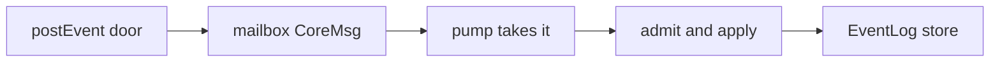

# Event abstraction

Date: 2026-09-15

Locked destination interface for Stories **Event, EventLog, and ClientHistory** and **Caller, persist, and Poll** on [[../arch.md|Core creation architecture]]. Lesson: [[cancel-poll-eventhistory-undo.md]]. Current-type inventory: [[history-typenames.md]]. Those stories sequence expand-migrate-contract. This report is the destination type and function set.

Field shapes for Event, EventLog, ClientHistory, and the `postEvent` door live here. [[../arch.md|Core creation architecture]] Module map names modules, doors, and Uses and points here. ClientHistory is the Emacs Action view; EventLog is the sequence. There is no destination module named History.

## 1. Intake then store

Mailbox is intake. EventLog is the store after the mailbox has taken it. The same Event is the payload in, the value processed, and the record appended.



Poll is not a second processing step. It reads the store: `since` copies Events already taken. Core does not pull Events off EventLog to run them.

## 2. Locked types

One record, one body DU. `Change.id` / `History.nextId` / `Revision` collapse to **event id**. `changeId` stays as submission dedup (`Guid`).

```fsharp
type EventId = EventId of int   // retired Revision

/// Start request and Event body (zoom, focus, command, graphIds, basis event id).
type ActorStart =
  { zoomId: NodeId
    focusId: NodeId
    commandId: NodeId
    graphIds: NodeId list
    revision: EventId }

type EventBody =
  | Change of ops: Op list
  | Undo of target: EventId * ops: Op list
  | Redo of target: EventId * ops: Op list
  | ActorStart of ActorStart
  | ActorStop of focusId: NodeId * result: ActorResult

type Event =
  { id: EventId
    submissionId: Guid
    authority: Authority
    body: EventBody }
```

1. **ActorStart** is the start request and the Event body (zoom, focus, command, graphIds, basis EventId). There is no `StartActorRequest` name.
2. **Pool `startActor`** returns `Result<Credential, string>`. The live-row result type `{ secret; focusId }` is already deleted ([[drop-pool-actorstart.md]]).
3. **ActorStop** body is `focusId` plus `ActorResult` (`ActorSucceeded` / `ActorFailed`).
4. **authority** is on every Event. Type is `Authority`. Core stamps it from the admitted `Caller.authority`. The wire does not supply it.
5. **Change** is the command-builder product (Ops). Event is the stored record.
6. **commandName** lives on the Event that EventLog stores (so the server log knows which command precipitated the Action).

`Authority`, `ActorStart`, and `ActorResult` live in Shared with Event.

## 3. Locked functions

### 3.1 Event

1. `id`
2. `authority`
3. `ops` — none for Actor bodies
4. `target` — none except Undo/Redo
5. `apply` — Graph apply via those Ops; Actor bodies do not touch the Graph
6. `inverseOps` — used when building Undo/Redo from a target Event

### 3.2 EventLog

Append-only, oldest-head. This is the sequence. Persistence is this same EventLog on file/DB. Today’s [[src/Server/ChangeLog.fs]] is the lagging persist name.

1. `empty`
2. `append`
3. `nextId`
4. `since eventId` — Poll/Load tail (self-contained Events)
5. `tryFind` — Core name-only Undo/Redo
6. `restore` — merge persisted Events; dedupe by `submissionId` (today’s `History.restoreChanges`)
7. encode and read Event JSON
8. persist ActorStart / ActorStop

### 3.3 ClientHistory

Emacs view of Actions only (Change/Undo/Redo). Newest-head `past`/`future`. `commandName` lives on Event; `record` still takes it for peek. Not persisted. Not sent on Poll. Uses Event. Path stays [[src/Shared/ClientHistory.fs]].

1. `record commandName event` — fold `future` into `past`
2. `undo` / `redo` — move the local stack and produce the Undo/Redo Event (target + inverse Ops) for optimistic apply
3. `tryPeekUndoName` / `tryPeekRedoName`

## 4. Doors

1. **`postEvent`** — Core Changes door. Payload is Event (Change, Undo, Redo). Name-only Undo/Redo may arrive with only `target`; dispatch fills inverse Ops, then that completed Event is what EventLog stores (same `submissionId`). Browser uses `ClientHistory.undo` locally; ack/reconcile stays the pending path.
2. **`postGraphOnlyChange`** — Graph-only Change: same Event flow as `postChange`, skips file persistence only (not EventLog).
3. **`startActor` / `actorStop`** — pool doors. Dispatch stores ActorStart / ActorStop Events with `authority` = the admitted Caller. Callers do not post those bodies through `postEvent`.

Not every CoreMsg carries an Event: Login, GetState, SnapshotDone stay intake-only.

## 5. What is not the type

1. **PendingChange / ChangeBatch** — transport wrappers around the same Event that `postEvent` takes.
2. **State** — Graph only; poll cursor is an EventId the caller holds, not a History field (today’s `State.revision`).
3. **Mailbox store** — `EventLog ref`. `GetEventHistory` returns the log or `since`, not a two-stack.

## 6. Type inventory this replaces

Full current shapes: [[history-typenames.md]]. Replacement:

1. **EventId** replaces `Revision` and `Change.id` / `History.nextId` as the log position.
2. **Event** replaces `HistoryEvent` (`ChangeEvent` / `ActorEvent`).
3. **EventBody.Change / Undo / Redo** replace Action-as-`Change` plus `PendingKind`.
4. **EventBody.ActorStart / ActorStop** replace `ActorLifecycleEvent` (`ActorStarted` / `ActorFinished`).
5. **ActorStart** replaces the name `StartActorRequest` (same fields; `revision` is EventId).
6. **EventLog** replaces mailbox `History` as the append-only store (`empty` / `append` / `nextId` / `since` / `tryFind` / `restore` replace `History.empty` / `restoreChanges` / `fromChanges` plus mailbox `recordActorStarted` / `recordActorFinished`). Today’s `type History` / `module History` in [[src/Shared/History.fs]] is that lagging mailbox-log name.
7. **Change.changeId** stays as `Event.submissionId` (Guid dedup).
8. **Change** is the command-builder product. Event is the stored record.
9. Today’s `ChangeLog` name is EventLog persist. Payload is Event. There is no second log.

ClientHistory stays ClientHistory. It is not replaced by a History module.

## 7. Expand-migrate-contract

Sequencing lives on the stories in [[../arch.md|Core creation architecture]], not on the Module map.

1. Story **Event, EventLog, and ClientHistory** — expand Shared types and functions; `ClientHistory` and `HistoryEvent` still compile; no production caller move; no delete of old types. Do not add a new Shared History type.
2. Story **Caller, persist, and Poll** — expand `postEvent`, EventLog store, and Event JSON; migrate callers, Poll, persist, and names; contract deletes `HistoryEvent`, `ActorLifecycleEvent`, mailbox `type History` / History name (replaced by EventLog), and the `StartActorRequest` name, and drops the ChangeLog name. ClientHistory remains.

## 8. Tests

New Shared.Tests covering: append/since/tryFind; restore dedupe; `ClientHistory.record` fold; undo produces `Undo(target, inverseOps)` and redo names the Undo Event; Actor bodies do not apply; `Event.apply` of Undo/Redo uses carried Ops (no lookup); every Event carries `Authority`; `ActorStart` body equals the start request; `ActorStop` carries `ActorResult`.
