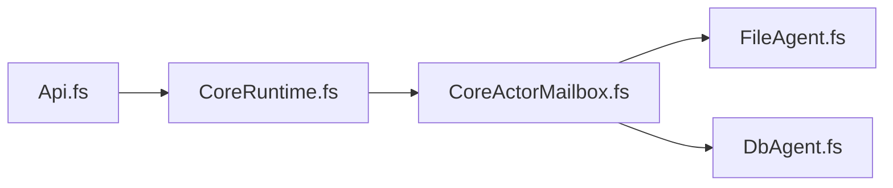

# FileAgent and DbAgent mailbox twins

Date: 2026-09-12

Links: [[plan/core-creation/project.md]], [[plan/core-creation/reports/kernel-fsproj.md]], [[src/Server/Gambol.Server.fsproj]]

This report records the planned Core structure. It is a file to edit. It is not a tree snapshot and it is not an implementation ticket.

## Corrective mailbox interface

The implemented shared mailbox module is [[src/Server/Core/CoreMailbox.fs]]. It owns both the six-case `CoreMsg` contract and the qualified callable interface over `MailboxProcessor<CoreMsg>`: `tryGetState`, `getState`, `getRevision`, `getChangesSince`, `postChange`, `postGraphOnlyChange`, and `coreChanges`. `coreChanges` owns the `Revision.Value` conversion and constructs the six-field `CoreChanges` record from a separate readiness callback and mailbox.

[[src/Server/FileAgent.fs]] and [[src/Server/DbAgent.fs]] still create and run their private mailboxes. Their public read helpers delegate to `CoreMailbox`, and each exported `coreChanges` is a thin call to `CoreMailbox.coreChanges` with its existing readiness behavior. FileAgent and DbAgent still own all persistence, dispatch-loop, startup, snapshot, shutdown, and agent-specific lifecycle behavior. No Actor or TestActor feature from the older plan below is implemented by this correction.

## Placement

The new item is a **module** in Gambol.Server. It is not a new fsproj. That lock is in [[kernel-fsproj.md]].

Put [[src/Server/Core/CoreActorMailbox.fs]] after [[src/Server/Core/CoreActorPool.fs]] and before [[src/Server/FileAgent.fs]] in compile order.

[[src/Server/FileAgent.fs]] and [[src/Server/DbAgent.fs]] each still Start their own `MailboxProcessor<FileAgentMsg>`. They share the type, Actor dispatch, and posters. Persist stays in each agent.

The HTTP Adapter is [[src/Server/Api.fs]] in the same project. Route registration is [[src/Server/RouteRegistration.fs]]. There is no Adapter project.

```text
src/Server/
  Core/
    CoreChanges.fs
    CoreCredentials.fs
    CoreActorPool.fs          ← leave; do not wrap
    CoreActorMailbox.fs      ← NEW module
    CoreRuntime.fs
  FileAgent.fs                ← twin: file persist
  DbAgent.fs                  ← twin: SQL persist
  Api.fs
  RouteRegistration.fs
```

[[src/Server/Core/CoreRuntime.fs]] stays after the agents in the fsproj. The tree above is disk layout, not compile order.

## Diagram

The flowchart is Adapter → Core object → shared mailbox module → persist twins. It is not a literal call graph. See Direct uses.



## Direct uses

Names below are HEAD / working-tree identifiers, except the NEW module (planned). “Not used this cut” means the identifier exists and this extraction does not call it.

### [[src/Server/Api.fs]]

Does not call [[src/Server/Core/CoreActorMailbox.fs]], [[src/Server/FileAgent.fs]], [[src/Server/DbAgent.fs]], or `CoreRuntime` members. HTTP takes a `CoreChanges` handle from [[src/Server/RouteRegistration.fs]].

Uses on this slice’s path: `CoreChanges.getState`, `getRevision`, `getChangesSince`, `isReady`, `postChange`, `postGraphOnlyChange`. Also `CoreAuth.isAuthRefuse` and `CoreAuth.post` (Parse File wraps `postGraphOnlyChange`).

Not used this cut: `Api.getCapabilities`, `postFileStatus`, `getImportFile`, `gitSave` (no mailbox extraction). No TestActor / hello.

[[src/Server/RouteRegistration.fs]] (not a diagram box) is the HTTP registrar. It calls `CoreRuntime.create`, then `changes`, `browserChanges`, `credentials`, `parseCredential`, `flushFileSnapshot`, `getFileRevision`. It does not call `bindChanges` or `command`. It does not call the NEW module.

### [[src/Server/Core/CoreRuntime.fs]]

Uses File: `FileAgent.create`, `FileAgent.coreChanges`, `FileAgent.flushSnapshot`, `FileAgent.getRevision`.

Db path: `DatabaseSetup.getOrCreateDbAgent`, which calls `DbAgent.createWithDataDir` then `DbAgent.coreChanges`.

Uses Core-already: `CoreRuntime.readOnly`, `ofFileWithDbMirror` (those close over `CoreChanges.postChange` / `postGraphOnlyChange`); `CoreCredentials.create`; `credentials.add` (Browser and Parse lifetime); `CoreAuth.bindHandle`; `CoreActorPool.create`; `pool.withLocks`.

Mailbox posters are centralized in [[src/Server/Core/CoreMailbox.fs]]. Each agent passes its private `MailboxProcessor<CoreMsg>` to `CoreMailbox.coreChanges`; [[src/Server/Core/CoreRuntime.fs]] still does not take the mailbox directly.

Not used this cut: `FileAgent.tryGetState`, `getState`, `getChangesSince`, `createWithDependencies`, `initialState`, `dispose`, `runBounded`; `DbAgent.create`, `createForTest`, `isReady`, `tryGetState`, `getState`; `CoreRuntime.command`; `CoreActorPool.register`, `launch`, `query` (HTTP does not call `core.command`). `lockedIds` is only inside `withLocks`.

### [[src/Server/Core/CoreActorMailbox.fs]] (new)

Owns (planned extraction; none of this exists on HEAD):

- `FileAgentMsg` (moved off [[src/Server/FileAgent.fs]]). Keep today’s cases: `GetState`, `GetRevision`, `GetChangesSince`, `PostChange`, `PostGraphOnlyChange`, `SnapshotDone`. Add `| Actor of ActorMsg`.
- `ActorMsg` cases this extraction names: `Register`, `Seed`, `Launch`, `Post`, `Succeeded`, `Poll`.
- `ActorModel` (defs, live registry, secrets, in-mailbox events) and `empty`.
- `dispatch`, `operationContext`, `replyFailure` for `ActorMsg`.
- Posters on `MailboxProcessor<FileAgentMsg>`, not `FileAgent`: `Register`, `Seed`, `Launch`, `Post`, `Succeeded`, `Poll`.
- `apply: Change list -> Result<CoreChangesAccepted, string>` callback into Actor `dispatch`. Persist stays in each agent.

Does not own: ChangeLog, SQL persist, snapshot, startup sweep, `tryHandleRead`, `failedLoop`, `handlePostChange`, `FileAgent.runBounded`. Does not wrap-patch [[src/Server/Core/CoreActorPool.fs]].

### [[src/Server/FileAgent.fs]]

Uses today (stay, except the moved type): `FileAgentMsg` (defined here today; moves to the NEW module); `FileAgent`; `FileAgentDependencies`; `runBounded`; `ChangeProcessingTimeoutMs`; `handlePostChange`; inner `dispatch` / `operationContext` / `replyFailure` for the non-Actor cases; `applyBatch`; `ChangeAmendment.applyChange`; `syncPersistChange`; `persistLogEntries`; `overlayFresh`; `CoreChanges.accepted`; `coreChanges` members `getState`, `getRevision`, `getChangesSince`, `isReady`, `postChange`, `postGraphOnlyChange`. In the implemented correction, its public read helpers and `coreChanges` delegate to `CoreMailbox`; mailbox posting no longer has a FileAgent-specific implementation.

File-only persist (stay here): `ChangeLog.buildIndex`, `tryFindByChangeId`, `appendEntries`, `encodeChange`, `readEntryAt`, `decodeChange`; `Bookkeeping.openLogStream`, `writeRevision`; `DocumentLoader.tryLoadState`; `DocumentPersistence.persistGraphOps`, `validatePathMoves`, `validateGraphDiskEffects`; `PersistStamp.appendToLast`, `opsBetween`; `persistClean`; `SnapshotDone` no-op; `flushSnapshot`; `initialState`; `dispose`.

Calls on the NEW module: `FileAgentMsg` constructors; `let actorModel = ref CoreActorMailbox.empty`; `| Actor msg ->` on `operationContext`, `replyFailure`, and write `dispatch` (call `CoreActorMailbox.dispatch` / `operationContext` / `replyFailure`); pass this agent’s persist as `apply`. Keep reply on the existing `PostChange` / `PostGraphOnlyChange` arms. Command posters post to the processor this agent Starts; the File loop does not call those posters.

### [[src/Server/DbAgent.fs]]

Uses today: same `FileAgentMsg`; `DbAgent`; `FileAgent.runBounded`; `FileAgent.ChangeProcessingTimeoutMs`; `handlePostChange` (takes `inbox`); `applyBatch`; `ChangeAmendment.applyChange`; `persistBatch`; `overlayFresh`; `CoreChanges.accepted`; `coreChanges` members `getState`, `getRevision`, `getChangesSince`, `isReady`, `postChange`, `postGraphOnlyChange`. In the implemented correction, its public read helpers and `coreChanges` delegate to `CoreMailbox`; mailbox posting no longer has a DbAgent-specific implementation. No `FileAgent` record.

Db-only (stay here): `loadInitialState`; `startSnapshot`; `inbox.Post(SnapshotDone)`; `tryHandleRead`; `failedLoop`; `DbAgentStartup.run`; `logUnhandledException`; `create`, `createWithDataDir`, `createForTest`, `createForTestWithDependencies`; `Database.*` / `DatabaseProjection.*` persist and startup sweep.

Calls on the NEW module: the same list as File. Also `| Actor msg ->` on `failedLoop` (do not leave `| _ -> ()` for Actor). Pass this agent’s persist as `apply`. Keep reply on the existing Post arms.

### Core-already, not a flowchart box

[[src/Server/Core/CoreChanges.fs]] — used this cut: `CoreChanges`, `CoreChangesAccepted`, `CoreChanges.accepted`, and all six handle fields. This slice does not add or drop members.

[[src/Server/Core/CoreCredentials.fs]] — used this cut: `Credential`, `CoreCredentials.create`, `add`, `contains` (via `CoreAuth.bindHandle` / `post`). Not used this cut: `remove`; `CoreAdmissionError.UnknownJob`, `UnknownActor`, `Overlap` (those strings are `CoreActorPool.unknownJob` / `unknownActor` / `overlap`).

[[src/Server/Core/CoreActorPool.fs]] — leave it; do not wrap-patch. Used this cut: `CoreActorPool.create`, `withLocks` (HTTP `getState` overlay). Not used this cut: `register`, `launch`, `query`, and the pool mailbox cases `Register`, `TryLaunch`, `Query`, `GetLocked`. That pool is the discarded second mailbox.

## Legend

- **New:** `FileAgentMsg` plus `Actor` cases; `ActorModel` (defs, live registry, secrets, in-mailbox events); Actor `dispatch` / `operationContext` / `replyFailure`; posters on `MailboxProcessor<_>`, not FileAgent; `apply: Change list -> Result<CoreChangesAccepted, string>` callback (no back-edge on the flowchart). Twin edits: `actorModel` ref, `| Actor msg ->` (Db also `failedLoop`), persist passed as `apply`, same mailbox accessor or none if posters take the processor.
- **File-only:** ChangeLog, file persist, `persistClean`, `SnapshotDone` no-op.
- **Db-only:** SQL persist, snapshot, startup sweep, `tryHandleRead`, `failedLoop`, `isReady`.
- **Core-already:** [[src/Server/Core/CoreChanges.fs]], [[src/Server/Core/CoreCredentials.fs]], [[src/Server/Core/CoreActorPool.fs]] (leave it), [[src/Server/Core/CoreRuntime.fs]]; Api HTTP Adapter.

## Not this cut

TestActor, `?test hello`, hello tests, cancel, live query, host-stop.

## Constraints

- Do not wrap-patch [[src/Server/Core/CoreActorPool.fs]].
- Do not convert only FileAgent `handlePostChange`. Both twins share the type, Actor dispatch, and posters.
