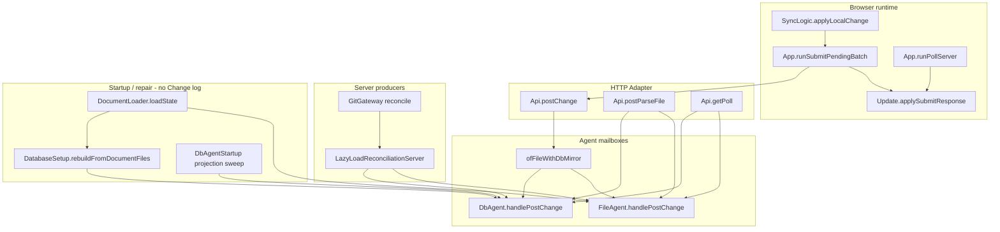

# Initial Core Changes runtime facts

Date: 2026-09-05

Purpose: Fact inventory for grilling [[plan/core-creation/issues/06-ready-the-initial-core-changes-increment.md]]. Records current Change create, apply, persist, acknowledge, timeout, and mirror paths. It does not choose product or design. It respects settled prerequisites in [[plan/core-creation/issues/03-define-typed-core-changes-contract.md]], [[plan/core-creation/issues/04-separate-http-adapter-from-core-changes.md]], and [[plan/core-creation/issues/05-place-core-changes-in-existing-projects.md]].

Related: [[plan/core-creation/reports/current-change-contract-facts.md]], [[plan/core-creation/reports/core-changes-placement-facts.md]], [[plan/core-creation/issues/01-generalized-server-actor-produce-path.md]].

## Settled prerequisites (facts only)

- Core Changes accepts a typed `Change list`. Empty list and no-effect Change are Rejects. Dedup by `changeId` returns the stored Change on the normal success path.
- Normal and Graph-only posts share the typed contract. Parse stays outside Core and calls typed Graph-only Post Change after it plans ops.
- `/ambit/changes` stays on `Api.postChange`. Auth and body read stay in [[src/Server/RouteRegistration.fs]]. Typed boundary starts below `Api.postChange`. Poll stays separate.
- Round one extracts the Graph-agent package into [[src/Server/Core/]] as `GraphAgentHandle`. FileAgent and DbAgent keep their mailboxes; agents are selected inside Core. Legacy file-authority and mirror branches stay until ACID re-examination.

## 1. Path inventory

### Browser-originated Change path

| Step | Module / function | Role |
|------|-------------------|------|
| Local edit | [[src/Shared/SyncLogic.fs]] `applyLocalChange` | Applies through `ResidentProjection.applyChange`, records ClientHistory, enqueues PendingChange |
| Submit gate | [[src/Shared/SyncPlanner.fs]] `enqueuePending`, `tryStartSubmit` | Emits `SubmitPendingBatch (baseRevision, pendingChanges)` when idle |
| Wire batch | [[src/Shared/SyncBatch.fs]] `toWireBatch` | Rewrites Change `id` to contiguous chain from base revision; strips transition metadata |
| HTTP POST | [[src/Client/App.fs]] `runSubmitPendingBatch` | POST `/{currentFile}/changes` (typically `/ambit/changes` when pathname is `/ambit`) |
| Decode ack | [[src/Client/App.fs]] `SubmitChangeCallbacks.onPostOk` | Dispatches `SubmitResponse` with confirmed Changes, revision, `externalChanges`, message |
| ACK reconcile | [[src/Client/Update.fs]] `applySubmitResponse` → [[src/Shared/SyncLogic.fs]] `reconcileAck` or `reconcileExternalAck` | Echo path requires matching changeIds and op prefix; external path when `externalChanges` or non-echo |
| Retry | [[src/Client/App.fs]], [[src/Shared/SyncPlanner.fs]] `retryWaiting` | Same pending batch retried on network failure or client timeout; duplicate `changeId` retry is intentional |
| Poll delivery | [[src/Client/App.fs]] `runPollServer` → GET `/ambit/poll?rev=` | [[src/Shared/SyncLogic.fs]] `getPollOutcome`, `applySyncResponse`, external-changes rewind/replay |
| Boot poll | [[src/Client/Program.fs]] `runBootPoll`, [[src/Shared/BootCache.fs]] | Confirms server revision after initial state fetch |

Upload structure also POSTs Changes before workspace push ([[src/Client/App.fs]] `ContinuePostUploadStructure`, [[src/Client/UpdateWorkspaceSync.fs]]).

### Server HTTP Adapter and routes

| Route | Registration | Adapter | Agent call |
|-------|--------------|---------|------------|
| POST `/ambit/changes` | [[src/Server/RouteRegistration.fs]] `registerStateRoutes` | [[src/Server/Api.fs]] `postChange` | `AgentHandle.postChange` (JSON string today) |
| GET `/ambit/poll` | same | [[src/Server/Api.fs]] `getPoll` | `getRevision`, `getChangesSince` |
| POST `/ambit/file/parse` | [[src/Server/RouteRegistration.fs]] `registerSaveRoutes` | [[src/Server/Api.fs]] `postParseFile` | `getState`, `DocumentPersistence.planParseFile`, `postGraphOnlyChange` |
| POST `/ambit/load` | `registerStateRoutes` | [[src/Server/Api.fs]] `postLoad` | Read-only: `getState`, optional `getChangesSince` (not a Change writer) |

Auth: `registerStateRoutes` and `registerSaveRoutes` require `auth.IsAuthenticated`. Client hint via `bindClientHint` on POST `/ambit/changes` only.

### Server-producer Graph-only paths (runtime Change writers)

| Producer | Entry | Planning | Post |
|----------|-------|----------|------|
| Parse | `Api.postParseFile` | [[src/Shared/dotnet/ImportDocument.fs]] via `DocumentPersistence.planParseFile` | `encodeGraphOnlyChange` → `handle.postGraphOnlyChange` |
| Lazy-load / git reconciliation | [[src/Server/LazyLoadReconciliationServer.fs]] `reconcileChangedPathsWithDiscovery` | [[src/Shared/dotnet/LazyLoadReconciliationReport.fs]] `planChangedPathsWithArtifacts` | [[src/Server/GraphOnlyChangePost.fs]] `postChunks` → `handle.postGraphOnlyChange` |
| Git push callback | [[src/Server/RouteRegistration.fs]] `reconcileGitPush` → [[src/Server/GitGateway.fs]] | Same as lazy-load | Same |

Graph-only posts use mailbox message `PostGraphOnlyChange`, which shares `handlePostChange` with `graphOnly = true` in both agents.

### File-authority agent path (FileAgent)

| Phase | Function | Notes |
|-------|----------|-------|
| Decode | `handlePostChange` | `Serialization.decodeChangeBatch` inside mailbox |
| Dedup | `applyBatch` → [[src/Server/ChangeLog.fs]] `tryFindByChangeId` | Scan `gambol.log` offset index |
| Apply | `ChangeAmendment.applyChange` | Shared amend + apply |
| Validate | `DocumentPersistence.validatePathMoves`, `validateGraphDiskEffects` | Skipped when `graphOnly` |
| Disk persist | `syncPersistChange` → injected `persistGraphOps` (default [[src/Server/DocumentPersistence.fs]] `persistGraphOps`) | Only when `changed && not graphOnly`; wrapped in `runBounded` 8000 ms |
| Meta checkpoint | [[src/Server/Bookkeeping.fs]] `writeRevision` | Only when persist clean and no soft-fail message |
| Stamp | [[src/Shared/History.fs]] `PersistStamp.opsBetween`, `overlayFresh` | SetUpdateTime suffix on last Change in batch |
| Log persist | [[src/Server/ChangeLog.fs]] `appendEntries` | Roll back stream length on failure |
| Publish | `state.Value <- finalState` | After successful log append |
| Ack | `encodeChangeAckJson` | `isReady = true` always |

Reads: `GetState`, `GetRevision`, `GetChangesSince` read in-memory `state` and/or scan `gambol.log`.

### Database agent path (DbAgent)

| Phase | Function | Notes |
|-------|----------|-------|
| Decode / apply | `handlePostChange` → `applyBatch` | Wrapped in `FileAgent.runBounded` 8000 ms |
| Dedup | `tryPersistedChange` → [[src/Server/Database.fs]] `tryGetPersistedPayload` | UUID unique index |
| Validate | Same DocumentPersistence validators | Skipped when `graphOnly` or `liveSaveDataDir = None` |
| Live document persist | `persistGraphOps` inside `runBounded` | When normal post and `liveSaveDataDir = Some` |
| DB tx | `persistBatch` | `Database.appendChangeWithTx` + `DatabaseProjection.persistWithTx` in one transaction |
| Publish | `state.Value <- stateToStore` | After tx commit |
| Async snapshot | `startSnapshot` → `SnapshotDone` message | Background document materialization; updates `persistedGraph` when graph matches |
| Ack | `encodeChangeAckJson` | `isReady` from startup `TaskCompletionSource` |

Reads during startup sweep: `tryHandleRead` allows `GetState`, `GetRevision`, `GetChangesSince` while projection sweep runs. `GetChangesSince` queries PostgreSQL `Database.getChangesAfterCheckpointRevision`, not the file log.

### Mirror path (File + DB)

Selection: [[src/Server/RouteRegistration.fs]] `createPersistenceContext` when `PersistenceMode.File` and `DbStatus.Ok` → [[src/Server/Api.fs]] `AgentHandle.ofFileWithDbMirror`.

| Operation | Authority for HTTP response | Secondary |
|-----------|----------------------------|-----------|
| getState / getRevision / getChangesSince | FileAgent only | DbAgent not consulted |
| postChange / postGraphOnlyChange | FileAgent ack JSON returned | Same JSON body posted to DbAgent; DB failure logged to stderr, does not change HTTP response |
| isReady | always `true` | DbAgent startup gate not exposed |

Two independent mailboxes; sequencing is file await then db await only.

### Persistence mode matrix

| Mode | DbStatus | Handle | Authoritative writes | Authoritative reads (Poll, state) |
|------|----------|--------|---------------------|-----------------------------------|
| Db | Ok | `ofDb` | DbAgent | DbAgent |
| File | Ok | `ofFileWithDbMirror` | FileAgent (+ mirror DbAgent) | FileAgent |
| Db | not Ok | `ofFile` + `readOnly` | Rejected | FileAgent |
| File | not Ok | `ofFile` | FileAgent | FileAgent |

Config: `Persistence:Mode` ([[src/Server/DatabaseSetup.fs]]), `DB_CONNECTION_STRING` env.

## 2. Writer classification

### Runtime Change writers (mutate authoritative Graph through agent mailboxes)

All runtime Graph mutation that produces logged, Poll-visible Changes goes through `PostChange` or `PostGraphOnlyChange` on the selected agent mailbox (directly or via `AgentHandle`):

- Browser POST `/ambit/changes`
- Parse POST `/ambit/file/parse`
- Lazy-load reconciliation (HTTP routes and git-push callback)
- Mirror secondary DbAgent post (same body as FileAgent; separate mailbox)

Shared apply entry on the server: `ChangeAmendment.applyChange` only (not `History.applyChange` or `ResidentProjection.applyChange`).

### Startup and repair writers (before or outside normal runtime Change path)

These mutate Graph or projection without going through the Post Change mailbox sequence:

| Writer | When | Mechanism | Creates Change log entries? |
|--------|------|-----------|----------------------------|
| [[src/Server/DocumentLoader.fs]] `loadState` / `tryLoadState` | FileAgent create, DB bootstrap input | Read documents from disk → `State` with `Bookkeeping.readRevision` | No |
| [[src/Server/DatabaseSetup.fs]] `bootstrapFromFileIfEmpty` | File mode, empty DB at startup | `DocumentLoader.loadState` → [[src/Server/Database.fs]] `rebuildFromDocumentFiles` (truncate SQL, replace projection) | No; `changes` table cleared |
| [[src/Server/DatabaseSetup.fs]] `validateAmbNetworkAgainstDb` | File mode, non-empty DB mismatch | Same rebuild when outline/revision mismatch | No |
| [[src/Server/DbAgent.fs]] startup via [[src/Server/DbAgentStartup.fs]] | DbAgent mailbox start | [[src/Server/DatabaseProjection.fs]] `startupSweepPatch` maintenance; may trim or reload graph in memory | No |
| [[src/Server/DbAgent.fs]] `loadInitialState` | DbAgent create | `Database.loadPersistedState` from projection + checkpoint revision | No |
| [[src/Server/FileAgent.fs]] `flushSnapshot` | Git save prep (file mode) | No-op `Ok ()` today | No |

**FileAgent does not replay `gambol.log` on startup.** Startup state is disk documents + meta revision. ChangeLog is append-only for Poll and dedup during runtime. Comment in FileAgent mentions replay intent for soft-fail recovery, but [[tests/Server.Tests/FileAgentFailureTests.fs]] `soft-fail log is not replayed into FileAgent state after restart` confirms log entries are not applied into state after restart. Test name `New server uses snapshot + log replay` in [[tests/Server.Tests/StateEndpointTests.fs]] reflects persisted document snapshot across process restart, not ChangeLog replay.

**DbAgent does not rebuild graph from the Change log on startup.** [[tests/Server.Tests/StateEndpointTests.fs]] `DB restart does not replay log when projection is cleared` confirms projection wipe yields revision 0 even when `changes` rows remain.

### Non-Change graph readers (not writers)

- GET `/ambit/state` → `ResidentProjection.bootstrapStateResponse` scopes graph for Browser boot
- POST `/ambit/load` → packages only; may attach Changes since client revision
- `DocumentPersistence` file-status, import, WebDAV routes → no agent mailbox

## 3. Behavior invariants (current code)

1. **Dedup:** `changeId` lookup before apply; hit returns stored Change, no revision advance for that item; no double graph effect.
2. **Reject unchanged:** `ApplyResult.Unchanged` → Error `"Unchanged submission is rejected."`
3. **Batch atomicity:** Any failure in batch fold, validation, persist, or log append rejects whole POST; no partial state or log update ([[tests/Server.Tests/StateEndpointTests.fs]] batch bad-second-change test).
4. **Revision:** Each newly applied Change increments server revision by 1; client `id` is not validated as stale base.
5. **Amendment success:** Recoverable CAS collision → single amended Change; `externalChanges = true` when any batch item amended.
6. **Ack shape:** Confirmed ops = submitted ops as prefix; suffix SetUpdateTime only on echo path ([[tests/Server.Tests/FileAgentFailureTests.fs]] stamp tests).
7. **Graph-only:** Skips document validation (FileAgent always; DbAgent when graphOnly or no liveSaveDataDir); skips FileAgent sync persist when graphOnly; still logs Changes and increments revision.
8. **Poll:** Returns `getChangesSince clientRev`; sets `externalChanges = not changes.IsEmpty`; separate from POST ack path per issue 04.
9. **Timeout:** `FileAgent.runBounded` 8000 ms on FileAgent disk persist, DbAgent applyBatch, live persist, and DB commit; timeout → Error `"change processing timed out"`; abandoned background Task may still complete (FileAgent comment).
10. **Soft-fail persist:** FileAgent sets `persistClean = false`, skips meta checkpoint, may return ack with `message`; graph and log still commit in memory.
11. **Mirror:** HTTP response always reflects FileAgent; DbAgent failure is stderr only.
12. **DbAgent readiness:** Mutations rejected until startup sweep completes; reads allowed during sweep ([[tests/Server.Tests/DbAgentTests.fs]]).

## 4. Candidate focused acceptance evidence

Tests name observable behavior to preserve through Core extraction. Grouped by concern:

| Concern | Test module | Representative tests |
|---------|-------------|---------------------|
| POST / Poll / batch / amendment / idempotency | [[tests/Server.Tests/StateEndpointTests.fs]] | same changeId twice; batch revision bump; stale base revision; concurrent stale text; undo/redo batch then Poll |
| Stamp suffix / log equality | [[tests/Server.Tests/FileAgentFailureTests.fs]] | ACK stamped Change equals ChangeLog; trailing duplicate keeps stamps |
| File timeout / soft-fail / restart | [[tests/Server.Tests/FileAgentFailureTests.fs]] | persist hang rejected within timeout; soft-fail ack with message; log not replayed on restart |
| Db dedup / unchanged reject / restart | [[tests/Server.Tests/DatabaseProjectionContractTests.fs]] | duplicate idempotent; unchanged rejected |
| Db startup / timeout / failure closed | [[tests/Server.Tests/DbAgentTests.fs]] | startup sweep before ready; sweep failure closes mutations; commit hang timeout |
| Graph-only chunk posting | [[tests/Server.Tests/GraphOnlyChangePostTests.fs]], [[tests/Shared.Tests/GraphOnlyChangeChunksTests.fs]] | chunks at or under maxOps; revision increments per chunk |
| Lazy-load reconciliation | [[tests/Server.Tests/LazyLoadReconciliationServerTests.fs]] | git receive triggers reconcile; directory/added routes |
| Parse resilience | [[tests/Server.Tests/ChangeEndpointResilienceTests.fs]] | malformed batch handling |
| Client ACK paths | [[tests/Shared.Tests/AckReconcileTests.fs]], [[tests/Shared.Tests/SyncLogicTests.fs]] | amended → external ACK; Poll outcome |
| Amendment semantics | [[tests/Shared.Tests/ChangeAmendmentTests.fs]] | CAS collision → amb-conflict child |
| Serde contract | [[tests/Shared.Tests/SerializationTests.fs]] | Change batch wire shape |
| DB bootstrap / mode | [[tests/Server.Tests/DatabaseSetupTests.fs]] | persistence mode resolution; documentStatesMatch |
| DB projection wipe | [[tests/Server.Tests/StateEndpointTests.fs]] | restart without projection replay from log |

For issue [[plan/core-creation/issues/01-generalized-server-actor-produce-path.md]], the closest existing proof that a non-Browser producer enters the same amend/log/Poll sequence is Graph-only post coverage: Parse and LazyLoadReconciliationServer tests plus `StateEndpointTests` Poll after POST. There is no test that calls a typed non-HTTP Core entry yet.

## 5. Unresolved factual gaps

1. **Log replay vs disk snapshot:** FileAgent comments refer to startup log replay for soft-fail recovery, but code and tests show no log replay on create. Whether any deployment path replays `gambol.log` into state is not evidenced in current startup code.
2. **Mirror divergence:** No automated test asserts FileAgent and DbAgent stay consistent when mirror DB post fails after file success, or under concurrent load on two mailboxes.
3. **Abandoned timeout tasks:** FileAgent documents that timed-out persist Tasks may still write to disk later; no test proves interaction with subsequent Changes.
4. **DbAgent snapshot race:** `startSnapshot` is async; exact Poll vs snapshot ordering under load is not fully specified in tests.
5. **Client POST URL:** Browser uses `/{pathname}/changes`; server registers `/ambit/changes` only. This works when pathname is `ambit`; behavior for other pathname values is not covered here.
6. **Graph-only multi-chunk partial failure:** `GraphOnlyChangePost.postChunks` stops on first Error; prior chunks remain applied. Rollback semantics across chunks are not tested as a single atomic unit.
7. **Startup sweep vs authoritative Graph:** DbAgent may trim or reload graph from projection during sweep before `isReady`; relationship to subsequent Change apply baseline is tested only at sweep-ready boundary, not mid-reconciliation with in-flight reads.
8. **Issue 01 blocked dependencies:** [[plan/event-sourced-ops/issues/03-server-amends-recoverable-field-collisions.md]] and [[plan/event-sourced-ops/issues/04-client-consumes-merge-success-without-reload.md]] are listed as blockers for generalized produce path; their delivery status is outside this runtime inventory.

## 6. Modules compile touchpoints (migration surface)

Per [[plan/core-creation/issues/05-place-core-changes-in-existing-projects.md]], round one moves Graph-agent package to [[src/Server/Core/]] as `GraphAgentHandle` while keeping [[src/Shared/History.fs]], [[src/Shared/ChangeAmendment.fs]], and agent files at current paths. Duplicated Server logic today: `overlayFresh`, `applyBatch` fold, JSON decode inside agents, `encodeChangeAckJson` ([[plan/core-creation/reports/core-changes-placement-facts.md]] sections 3 and 6). HTTP JSON decode remains in agents today; issue 04 target is decode in `Api.postChange` only.
