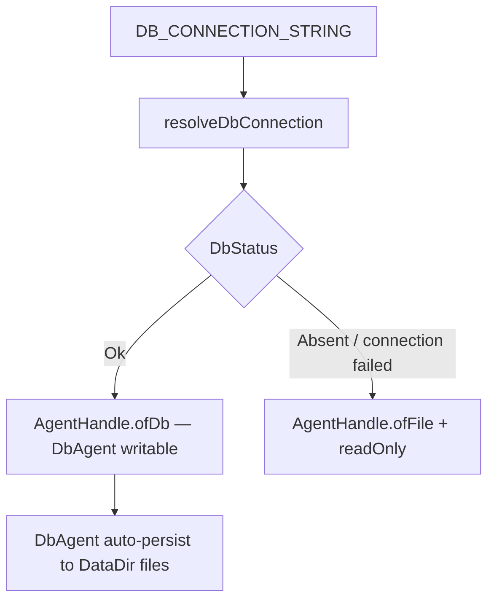

# File persistence mode removal — fact inventory

Purpose: Support grilling [[plan/core-creation/issues/06-ready-the-initial-core-changes-increment.md]] after the user decision that **`PersistenceMode.File` is unsupported and should be deleted**. The only supported writable mode is database persistence; correlated on-disk files remain secondary projections. When the database is unavailable, retain the existing read-only FileAgent fallback. This report records facts only and separates findings from open decisions.

Related: [[plan/core-creation/reports/initial-core-changes-runtime-facts.md]], [[plan/core-creation/reports/core-changes-placement-facts.md]], [[plan/core-creation/reports/current-edit-core-reconciliation.md]], [[doc/current/persistence-model.md]], [[doc/reference/postgres-environments.md]].

## User decision (grilling input)

- **`PersistenceMode.File` is unsupported** — delete the config option, startup branches, writable FileAgent authority path, runtime mirror, and file-mode DB bootstrap/validation/rebuild.
- **Supported writable mode:** database (`PersistenceMode.Db` / default).
- **Secondary files:** DbAgent commits first; correlated document artifacts under `DataDir` are written after successful DB commits ([[doc/current/persistence-model.md]]).
- **DB unavailable:** retain read-only fallback — `AgentHandle.ofFile` + `AgentHandle.readOnly` when `DbStatus` is not `Ok` ([[src/Server/RouteRegistration.fs]], [[src/Server/Api.fs]]).

This aligns with documented target direction: [[doc/reference/postgres-environments.md]] §Current direction ("Always database-backed — no persistence mode switch"; legacy cleanup pending) and [[doc/current/persistence-model.md]] §Not implemented (removal of legacy file-authority path).

## Target runtime (after removal)

| Concern | Retained | Deleted |
|---------|----------|---------|
| Writable Changes | DbAgent mailbox only | FileAgent writable authority; `ofFileWithDbMirror` |
| Reads when DB up | DbAgent | FileAgent as primary writer |
| Reads when DB down | FileAgent via read-only handle | Silent acceptance of writes |
| On-disk files | Secondary projection after DB commit | File snapshot + `.log` as authority; startup import from disk into DB |
| Config | `DB_CONNECTION_STRING` required for normal operation | `Persistence:Mode` = `file`; optional DB in file mode |

## Complete removal surface

### 1. Configuration parsing and defaults

| Location | Current behavior | Removal action |
|----------|------------------|----------------|
| [[src/Server/DatabaseSetup.fs]] `PersistenceMode.File` variant | Distinct mode enum case | Delete variant (or entire enum if only Db remains) |
| [[src/Server/DatabaseSetup.fs]] `resolvePersistenceMode` | Accepts `""`, `db`, `file` (case-insensitive) | Remove `file` arm; treat `file` as error (open decision: error message text) |
| [[src/Server/RouteRegistration.fs]] `registerPersistenceAndRoutes` | Reads `config.["Persistence:Mode"]`, fails startup on unknown mode | Stop reading mode or accept only `db`/empty (open decision) |
| [[src/Server/appsettings.Development.json]] | `"Persistence": { "Mode": "db" }` | May drop `Persistence` section entirely once parsing removed |
| [[doc/reference/deploy-azure.md]] | Documents `Persistence__Mode` = `db`; `file` for rollback/testing | Remove file-mode deploy/seed section |
| [[README.md]], [[doc/api.md]], [[doc/arch.md]] | Document `db` and `file` modes | Remove file as writable option |

### 2. RouteRegistration selection

[[src/Server/RouteRegistration.fs]] `createPersistenceContext` — current 4-way matrix:

| PersistenceMode | DbStatus | Current handle |
|-----------------|----------|----------------|
| Db | Ok | `ofDb` |
| Db | not Ok | `ofFile` + `readOnly` |
| File | Ok | `ofFileWithDbMirror` |
| File | not Ok | `ofFile` (writable) |

**After removal:** 2-way matrix on `DbStatus` only:

| DbStatus | Handle |
|----------|--------|
| Ok | `ofDb (getOrCreateDbAgent …)` |
| not Ok | `ofFile (getOrCreateFileAgent ())` + `readOnly` |

**Delete:** both `PersistenceMode.File` match arms; `AgentHandle.ofFileWithDbMirror` call.

**Retained in `PersistenceContext`:** `GetOrCreateFileAgent`, `DataDir`, `DbStatus`, `GetHandle`. **`Mode` field** becomes redundant if only Db exists (open decision: remove field and simplify callers).

**Retained elsewhere in RouteRegistration:** `prepareGitSave` / `flushForGit` still call `FileAgent.flushSnapshot` through SavePrep fallback path when DB not Ok; `dbStatusText` / `window.__DB_PRESENT__` injection.

### 3. Api AgentHandle constructors

| Constructor | Role today | After removal |
|-------------|------------|---------------|
| `ofDb` | DbAgent — sole production writer when DB Ok | **Retain** |
| `ofFile` | FileAgent — writable in file mode; readable in fallback | **Retain** for read-only fallback only (wrapped with `readOnly`) |
| `readOnly` | Rejects `postChange` / `postGraphOnlyChange` | **Retain** |
| `ofFileWithDbMirror` | File write then best-effort Db mirror | **Delete** (~41 lines, [[src/Server/Api.fs]] 45–86) |

**Fact:** Production writable `postChange` through `ofFile` without `readOnly` exists only on `PersistenceMode.File` branches today. After removal, production writes go only through `ofDb`.

**Fact:** Unit and integration tests call `AgentHandle.ofFile` directly without `readOnly` ([[tests/Server.Tests/LazyLoadReconciliationServerTests.fs]], [[tests/Server.Tests/GraphOnlyChangePostTests.fs]], [[tests/Server.Tests/IgnoredDestinationValidationTests.fs]]). These exercise FileAgent mailbox logic, not production config. Open decision: migrate to DbAgent test harness or keep as FileAgent unit tests.

### 4. DatabaseSetup file-mode branches

All gated on `persistenceMode = PersistenceMode.File` inside `resolveDbConnection`:

| Symbol | Purpose | Removal |
|--------|---------|---------|
| `bootstrapFromFileIfEmpty` | Seed empty DB from `DocumentLoader.loadState` | **Delete** |
| `validateAmbNetworkAgainstDb` | Compare file vs DB outline+revision; rebuild on mismatch | **Delete** |
| `documentStatesMatch` | Outline+revision parity helper | **Delete** (only used by validate + tests) |
| `statusFromMatches` | Maps before/after rebuild to `DbStatus` | **Delete** (only used by validate + tests) |

**Retained in `resolveDbConnection` for Db-only path:**

- Empty conn string → `DbStatus.Absent`
- Schema init + `getOrCreateDbAgent` when conn succeeds → `DbStatus.Ok`
- Connection failure catch → `DbStatus.Absent` (existing fallback message)

**Fact:** In current Db mode, `Mismatch1` and `Mismatch2` are **never set** — only file-mode validation produces them.

### 5. DbStatus and client UI

| DbStatus | Set today | After file-mode removal |
|----------|-----------|-------------------------|
| Ok | Db conn succeeds; file-mode parity match | Db conn succeeds |
| Absent | No conn string or conn failure | Same |
| Mismatch1 | File-mode rebuild fixed drift | **Unreachable** unless code kept |
| Mismatch2 | File-mode rebuild failed | **Unreachable** unless code kept |

**Delete candidate:** `Mismatch1`/`Mismatch2` cases in [[src/Server/RouteRegistration.fs]] `dbStatusText`, [[src/Client/StatusView.fs]] `renderDatabaseStatus` mismatch titles.

### 6. SavePrep

[[src/Server/SavePrep.fs]] branches on `(persistenceMode, dbStatus)`:

- `Db + Ok` → revision from DbAgent state (no file flush)
- `_` → `FileAgent.flushSnapshot` + file revision

**After removal:** simplifies to `dbStatus`-only — `Ok` uses Db path; `Absent` uses file flush path for git save prep on read-only fallback. `PersistenceMode` parameter can be removed (open decision).

### 7. FileAgent module — partial retention

**Not deleted entirely.** Still required for:

- Read-only fallback when DB unavailable ([[src/Server/RouteRegistration.fs]] creates via `getOrCreateFileAgent`)
- Git save prep flush when DB down ([[src/Server/SavePrep.fs]] fallback)
- Direct unit tests ([[tests/Server.Tests/FileAgentFailureTests.fs]], reconciliation tests)

**Deleted from production path:** writable file-authority Change persistence (snapshot, `.log`, revision checkpoint as authority). FileAgent `postChange` / persist pipeline becomes dead code on production routes unless tests keep calling `ofFile` unwrapped.

**Comment cleanup:** `FileAgent.initialState` note "used by DB setup" ([[src/Server/FileAgent.fs]] line 33) becomes stale after bootstrap removal.

### 8. Database.rebuildFromDocumentFiles

[[src/Server/Database.fs]] — truncates projection + `changes`, re-seeds from file-derived `State`.

| Caller today | After removal |
|--------------|---------------|
| `bootstrapFromFileIfEmpty` / `validateAmbNetworkAgainstDb` | **Remove** |
| [[tests/Server.Tests/DbAgentTests.fs]] | **Retain** (open decision: keep as test utility) |
| [[tests/Server.Tests/DocumentLoaderTests.fs]] setup for file-mode resolve tests | **Remove** with those tests |

Not part of normal Db-mode startup ([[tests/Server.Tests/StateEndpointTests.fs]] ``DB authority does not import files when database is empty`` documents current Db behavior).

### 9. Tests — file-mode config and writable file backend

#### Config / DatabaseSetup tests to remove or rewrite

| Test | File |
|------|------|
| `resolvePersistenceMode accepts file rollback mode` | [[tests/Server.Tests/DatabaseSetupTests.fs]] |
| `resolvePersistenceMode accepts file mode casing` | [[tests/Server.Tests/DatabaseSetupTests.fs]] |
| `statusFromMatches returns Mismatch1…` / `Mismatch2…` | [[tests/Server.Tests/DatabaseSetupTests.fs]] |
| `documentStatesMatch treats two outline reads…` | [[tests/Server.Tests/DatabaseSetupTests.fs]] |
| `resolveDbConnection file mode matching amb network returns Ok` | [[tests/Server.Tests/DocumentLoaderTests.fs]] |
| `resolveDbConnection file mode divergent amb rebuild returns Mismatch1` | [[tests/Server.Tests/DocumentLoaderTests.fs]] |
| `file mode startup imports files when database is empty` | [[tests/Server.Tests/StateEndpointTests.fs]] |

#### TestBackend helpers to remove or repurpose

| Helper | Config today | Action |
|--------|--------------|--------|
| `createClientForDir` | `Persistence:Mode` `file`, no DB | **Repurpose** to `createDbClientForDir` pattern or delete |
| `createClientForDirWithAuth` | file, no DB | Same |
| `createFileClient` | file, no DB | Same |
| `createFileModeWithDbClientForDir` | file + DB | **Delete** |
| `createDbClientForDir` / `createDbClient` | db + DB | **Retain** — primary integration harness |
| `createDbModeWithoutConnectionClientForDir` | db, no conn | **Retain** — read-only fallback harness ([[tests/Server.Tests/StateEndpointTests.fs]]) |

#### Integration tests using `createClientForDir` (writable file backend — must migrate)

[[tests/Server.Tests/StateEndpointTests.fs]] (multiple), [[tests/Server.Tests/GitGatewayTests.fs]], [[tests/Server.Tests/GitSaveEndpointTests.fs]], [[tests/Server.Tests/ChangeEndpointResilienceTests.fs]], [[tests/Server.Tests/DocumentPersistenceTests.fs]], [[tests/Server.Tests/LazyLoadReconciliationServerTests.fs]] (3 HTTP integration cases), [[tests/Server.Tests/WorkspaceWebDavTests.fs]], [[tests/Server.Tests/HttpResponseLogTests.fs]], [[tests/Server.Tests/ResponseCompressionTests.fs]].

**Fact:** These rely on writable file mode without PostgreSQL. Removal requires migrating to `createDbClientForDir` (or equivalent) with `resetTestDatabase`, or accepting DB-less tests only where read-only behavior is the subject.

#### Tests retained unchanged (Db path)

DbAgent suite, most StateEndpointTests db cases, SavePrepTests (already Db-only), read-only fallback test via `createDbModeWithoutConnectionClientForDir`.

### 10. Documentation and plans

| Location | Stale content |
|----------|---------------|
| [[README.md]] | `file` mode as authority; optional DB mirror |
| [[doc/api.md]] | `file` rollback mode |
| [[doc/arch.md]] | Legacy rollback hooks pending removal |
| [[doc/reference/deploy-azure.md]] | `file` mode seed instructions; `Persistence__Mode` file option |
| [[doc/history/database-migration-notes.md]] | File mode seed + mirror |
| [[doc/unsorted/plan.md]] | Completed `Persistence:Mode` file rollback checkbox |
| [[doc/roadmap/postgres-roadmap.md]] | Change log parity with `gambol.log` in file mode |
| [[.cursor/plans/persistence-relational-dual-authority.plan.md]] | Historical dual-authority design |
| [[plan/roadmap/reports/changes-post-timeout.md]], [[plan/roadmap/reports/browser-workspace-load-timeout.md]] | Mirror / file-mode timeout notes |
| [[plan/event-sourced-ops/details/as-implemented-facts.md]] | File-mode bootstrap truncates `changes` |
| [[plan/core-creation/reports/]] | Multiple reports describe file/mirror matrix as current (informational drift after removal) |
| [[.github/prompts/plan-workspace-stage-implementation.prompt.md]] | File mode parity test note |

**Already aligned with user decision:** [[doc/current/persistence-model.md]], [[doc/reference/postgres-environments.md]] §Current direction.

### 11. Startup behavior summary

| Scenario | Current | After removal |
|----------|---------|---------------|
| Db conn Ok | Db mode: load DB, DbAgent writable, auto-persist files | Same (only path) |
| Db conn fail / absent | Db mode: read-only FileAgent; File mode: writable FileAgent | Read-only FileAgent only |
| Db empty + files on disk | Db mode: empty graph; File mode + DB: import files into DB | Empty graph (no silent import) — **retained Db behavior** |
| Disk/DB drift at startup | File mode + DB: rebuild DB from files, set Mismatch1/2 | **Removed** — no file-authority reconciliation |

## Contradictions with issues 03–06

| Issue | Current text | Contradiction with user decision |
|-------|--------------|----------------------------------|
| [[plan/core-creation/issues/03-define-typed-core-changes-contract.md]] | Resolved: preserve "persistence-mode behavior" alongside timeout and acknowledgement | File mode is a persistence-mode behavior path being deleted; contract answer assumes it remains |
| [[plan/core-creation/issues/04-separate-http-adapter-from-core-changes.md]] | Preserve mirror, timeout, **persistence-mode**, Parse | File mode and mirror delegation no longer exist to preserve |
| [[plan/core-creation/issues/05-place-core-changes-in-existing-projects.md]] | Delegate current **file, database, and mirror** modes; preserve file-authority and mirror branches | Placement question assumes three writable/delegation modes; drops to one writer (DbAgent) + read-only fallback |
| [[plan/core-creation/issues/06-ready-the-initial-core-changes-increment.md]] | Migrate **file-authority, database, and mirror** paths; acceptance **without changing** mirror behavior | File-authority and mirror paths are removed, not migrated; "preserve mirror" constraint obsolete |
| [[plan/core-creation/map.md]] | Preserve file-authority and mirror during extraction | Opposite of deletion decision |

**Alignment note:** User decision matches [[doc/current/persistence-model.md]] and [[plan/roadmap/epics/chapters/acid-apply.md]] direction (db authority; file mode view-only was planned for ACID apply — deletion skips intermediate file-write-authority state entirely). Resolves tension noted in [[plan/core-creation/reports/current-edit-core-reconciliation.md]] §Initial versus later file mode.

**Issue 07** ([[plan/core-creation/issues/07-define-core-files-contract.md]]) references "current file-authority behavior and the later view-only file mode" — open decision whether Files contract grilling assumes post-removal code only.

## Smallest clean prerequisite ticket boundary

### In scope (one coherent prerequisite)

1. **Config:** reject or remove `Persistence:Mode` = `file`; default to database-only startup.
2. **RouteRegistration:** 2-way `DbStatus` selection; delete File arms and `ofFileWithDbMirror`.
3. **Api.fs:** delete `ofFileWithDbMirror`.
4. **DatabaseSetup.fs:** delete `PersistenceMode.File`, file branches, bootstrap/validate/match helpers, Mismatch1/2 if unused.
5. **SavePrep.fs:** drop `PersistenceMode` parameter if enum removed; branch on `DbStatus` only.
6. **Client StatusView / RouteRegistration:** remove Mismatch1/2 UI if statuses removed.
7. **TestBackend.fs:** delete file-mode helpers; migrate `createClientForDir` call sites to Db client helpers.
8. **Tests:** remove file-mode DatabaseSetup/DocumentLoader/StateEndpoint tests listed above.
9. **Docs:** README, api, deploy-azure, arch — minimum set stating DB-only writable mode.

**Estimated touch:** ~8–12 implementation files, ~10+ test files, several doc files.

### Explicitly out of scope (retained; separate work)

| Item | Reason |
|------|--------|
| DbAgent writable path, projection, startup repair | Supported mode — unchanged |
| DbAgent auto-persist to correlated files | Secondary files — retained |
| `AgentHandle.ofFile` + `readOnly` | DB-unavailable read-only fallback — retained |
| `FileAgent` module | Still serves fallback reads and test harness |
| `DocumentLoader`, `DocumentPersistence` | Disk read/write algorithms; Db mode auto-persist still uses them |
| Core Changes extraction (issues 05–06) | Depends on prerequisite completing first or revising preservation constraints |
| Full `FileAgent` module deletion | Docs list as legacy cleanup but fallback still needs it |
| ACID apply chapter work ([[plan/roadmap/epics/chapters/acid-apply.md]]) | View-only file mode, transaction boundary, timeout-abandon — still later |

### Why separate from issue 06

Issue 06 defines **initial Core Changes increment scope and acceptance** under "preserve mirror / file-authority" constraints. File-mode deletion is a **behavior-changing cleanup** that:

- Reduces issue 05 delegation surface (one writer, not three modes).
- Makes issue 06's "which file-authority paths migrate" question moot (none — removed).
- Should land **before** issue 05 implementation or concurrently with explicit issue text updates.

Absorbing into issue 06 would mix increment scoping with persistence deletion. A named prerequisite (e.g. "Remove unsupported File persistence mode") is the cleaner boundary.

## Factual findings

1. Production already defaults to `db` ([[src/Server/appsettings.Development.json]], Azure docs).
2. Writable file mode is config-selected only — no runtime auto-detection.
3. Read-only fallback already exists for `Db + not Ok` and is the model for all DB-unavailable operation after removal.
4. `Mismatch1`/`Mismatch2` and file-mode DB bootstrap exist only to support file authority + mirror era; they are dead in pure Db mode.
5. Many Server tests use writable file backend via `createClientForDir` — migration to Db harness is the largest test cost.
6. No production test asserts `ofFileWithDbMirror` dual-write behavior.
7. Documented target architecture ([[doc/current/persistence-model.md]]) already describes DB authority; code lags docs.
8. Issues 03–06 and [[plan/core-creation/map.md]] still assume file/mirror preservation — stale relative to user decision.

## Open decisions (user / grilling)

1. **`Persistence:Mode` config key:** remove entirely versus keep accepting only `db`/empty with startup error on `file`.
2. **`PersistenceMode` type and `PersistenceContext.Mode`:** delete enum and field versus keep single-case stub for future extensibility.
3. **`DbStatus.Mismatch1`/`Mismatch2`:** delete cases and UI versus keep for potential future diagnostics.
4. **`documentStatesMatch` / `rebuildFromDocumentFiles`:** delete helpers versus keep `rebuildFromDocumentFiles` as test-only utility.
5. **FileAgent writable code:** leave for unit tests versus migrate all tests to DbAgent and narrow FileAgent to read/load only.
6. **Test migration strategy:** require `TEST_DB_CONNECTION_STRING` for all former file-mode integration tests versus subset/skip policy.
7. **Issue text updates:** which of 03–06 and [[plan/core-creation/map.md]] get revised constraints in a separate doc pass (this report does not edit them).
8. **Prerequisite timing:** before issue 05 placement implementation versus parallel with issue 06 grilling resolution.
9. **Issue 07 Files contract:** grill against post-removal behavior only or document transitional delta.

## Verification checklist

- [ ] `rg 'PersistenceMode\.File|ofFileWithDbMirror|"Persistence:Mode", "file"'` — zero hits in `src/` (tests may retain until migrated)
- [ ] Startup with `Persistence:Mode=file` fails fast or is ignored per open decision 1
- [ ] Db conn Ok → writes succeed via DbAgent; files auto-persist
- [ ] Db conn absent → `postChange` rejected with read-only message; Poll/state reads work via FileAgent
- [ ] All Server integration tests pass on Db harness
- [ ] Client status shows `ok` or `absent` only (if Mismatch removed)
- [ ] Issues 04–06 preservation language updated before Core extraction claims parity with code
