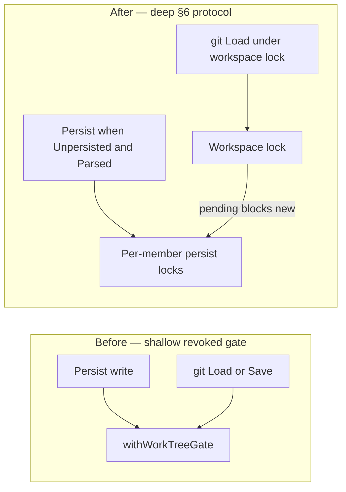
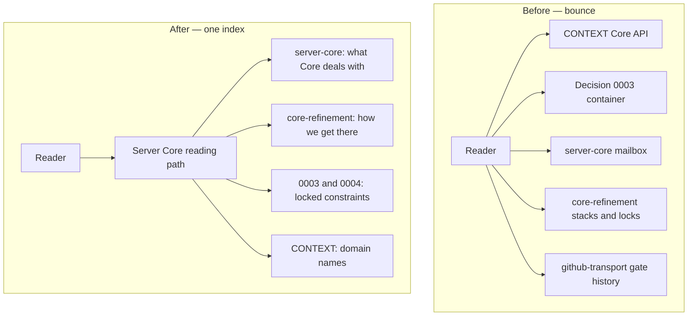
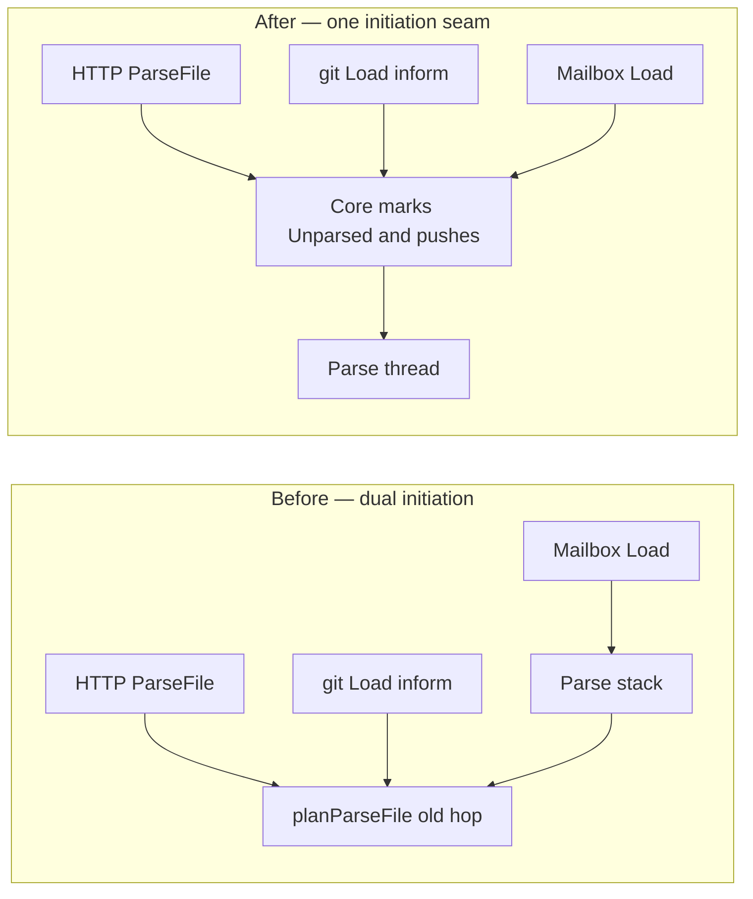

# Architecture deepening — Core and Server architecture files

Updated: 2026-09-30
Project: [[plan/core-refinement/project.md]]
Scope: [[plan/core-refinement/arch.md]], [[plan/architecture/server-core.md]] and siblings, [[plan/github-transport/arch.md]] as the same Core handoff story, plus the code modules those pages name. Vocabulary: [[CONTEXT.md]] for domain terms; [[.agents/skills/codebase-design/SKILL.md]] for module, interface, seam, depth, locality, leverage, deletion test. Committed Decisions [[doc/Decisions/0003-core-is-a-container-of-subobjects.md]] and [[doc/Decisions/0004-core-mailbox-messages-clear-fast.md]] are not re-litigated. No interfaces proposed.

## 1. Already charted — not new candidates

These frictions are real in code today, but [[arch.md]] §3 already sequences them. Restating them as deepening cards would not improve the architecture story.

1. **Parse setup into Core** — [[src/Server/RouteRegistration.fs]] `createPersistenceContext` still builds `ParseStack` and starts `ParseThread`; arch §3 step 2 says that setup must live inside [[src/Server/Core]].
2. **Persist collectors and loop** — Sync live-save still calls [[src/Server/DocumentPersistChange.fs]] from [[src/Server/Core/FileAgent.fs]] / [[src/Server/Core/DbAgent.fs]]; arch §3 step 3 charts collectors → loop → existing write body.
3. **Path control / DataDir residency** — Absolute DataDir still passes through Server; arch §3 step 4 and [DataDir caller inventory](datadir-caller-inventory.md) already own the migrate.
4. **Mailbox owns git work** — Peer Actor still performs pull/commit/push; arch §3 step 5 charts enable → call → stop old.
5. **Axis dual-write then contract DocumentState** — Expand shipped; migrate/contract remain on arch §3 step 1 and §5.
6. **github-transport thin remainder** — Lock workspace, receive files, inform Core; Core works through changes on this Project.

Deletion test on those items: deleting the named modules (Parse stack, DocumentPersistChange write body, DataDir helpers, Peer Actor as outside Actor definition) would not concentrate Core policy by itself. The expand-contract path already aims the locality move. They are out of the candidate list below.

## 2. Candidate A — Sequence §6 locks; contract the exclusive gate

**Status:** Approved 2026-09-30 (Alan). Written into [[plan/core-refinement/arch.md]] §3 step 3 **§6 locks catch-up**.

**Recommendation strength:** Strong

### 2.1 Files

1. [[plan/core-refinement/arch.md]] §3 Expand-contract sequence and §6 Core locking model
2. [[plan/core-refinement/map.md]] decision 1 and decision 13
3. [01 — Persist/git work-tree gate](../issues/01-persist-git-work-tree-gate.md)
4. [[src/Server/WorkspaceGit.fs]] (`withWorkTreeGate`)
5. [[src/Server/DocumentPersistWrite.fs]], [[src/Server/DocumentPersistPath.fs]], [[src/Server/DocumentPersistChange.fs]]
6. [[src/Server/GithubTransportActor.fs]]

### 2.2 Problem

§6 locks the workspace lock and per-member persist locks as current truth. Issue 01 marks the exclusive Persist/git work-tree gate revoked. Code still runs that gate on Persist writes and on git Load/Save. Arch §3 steps 2–3 *assume* §6 locks during migrate, but no Expand beat stands the locks up and no Contract beat removes `withWorkTreeGate`. The seam between Persist and git is still a shallow mutex that the plan has already rejected. Callers and tests must learn two locking stories. Locality of the locking protocol is split: deep policy in §6 prose, live implementation in a revoked module shape.

Deletion test: deleting `withWorkTreeGate` *now* would not concentrate complexity — §6 locks are absent, so coordination would vanish or reappear ad hoc. Deleting it *after* workspace and persist locks exist would remove a superseded shallow module and leave one deep locking protocol behind the Core seam.

### 2.3 Solution

Add an expand-contract beat (or fold clear Expand/Contract lines into the steps that already depend on locks) that:

1. **Expand** — Stand up workspace lock and per-member persist locks beside the exclusive gate, matching §6.
2. **Migrate** — Persist, Parse file use, and git Load drain/pending rules use the new locks; gate remains only where dual-running is required.
3. **Contract** — Remove `withWorkTreeGate` from Persist and Peer Actor paths once §6 is the only protocol.

Do not invent a new write body or a new git process home in that beat. Keep DocumentPersistChange as the write body and mailbox/Actor placement as already charted.

### 2.4 Benefits

1. **Locality** — One locking protocol for Core-revision workers; plan and code tell the same story.
2. **Leverage** — §6 pending/drain rules become testable through one Core-owned locking seam instead of a WorkspaceGit mutex wrapped at every Persist and git call site.
3. **Tests** — Tests can assert workspace-lock pending blocks new persist locks, drain then pull marks Unparsed, and Persist waits for Parsed — without asserting on a revoked exclusive gate.

### 2.5 Before / After

## 3. Candidate B — One home for the Core seam story

**Status:** Rejected 2026-09-30 (Alan). He wants one sole authority for the Core seam, not a reading path or index that points between several homes. Chosen plan: [[plan/core-refinement/project.md]] ([[arch.md]] Target — Server Core, expand-contract §3, locking model §6). Do not add an index on [[plan/architecture/server-core.md]]; that path is a pointer only.

**Recommendation strength:** Worth exploring (superseded by rejection)

### 3.1 Files

1. [[CONTEXT.md]] — Core and Core API
2. [[doc/Decisions/0003-core-is-a-container-of-subobjects.md]]
3. [[plan/architecture/server-core.md]]
4. [[plan/core-refinement/arch.md]]
5. [[plan/github-transport/arch.md]] (pointers and superseded gate checklists)
6. Code shape today: [[src/Server/Core/CoreRuntime.fs]], [[src/Server/Core/CoreChanges.fs]], [[src/Server/Core/CoreMailbox.fs]]

### 3.2 Problem

Understanding “what Core owns and how you call it” requires bouncing across at least four homes: glossary Core API (Files, Changes, Query, Command), Committed Decision 0003 (container of subobjects, no Middle Man forwarders), server-core (mailbox controls Graph, Events, files, git, Actors), and core-refinement (axes, stacks, locks, path control). Those framings are compatible enough not to reopen 0003 or 0004, but the interface story is shallow as documentation: the reader learns three surfaces to use one seam. Code today looks most like mailbox plus CoreChanges plus pool composition (`CoreRuntime`), not the four-call glossary list alone. github-transport still carries long `[x]` exclusive-gate lines marked superseded, which adds bounce without depth.

Deletion test: deleting any one plan home relocates the same facts; it does not concentrate the Core story. A single navigable home (with pointers, not copies) would raise locality for humans and agents.

### 3.3 Solution

Deepen the *architecture documentation module* for Server Core:

1. Keep [[plan/architecture/server-core.md]] as the locked target of what Core deals with and what stays outside.
2. Keep [[plan/core-refinement/arch.md]] as the only expand-contract and locking-policy home.
3. Add a short “how these pages relate” index on server-core (or architecture map) that names which framing answers which question: glossary terms, container call shape, mailbox responsibilities, revision path.
4. On github-transport arch, quarantine or collapse revoked exclusive-gate checklists so current required architecture is not mixed with shipped-then-superseded `[x]` lines.

Do not reopen Committed Decision 0003 or 0004. Do not invent a new Core API surface in this candidate — only improve locality of the story that already exists.

### 3.4 Benefits

1. **Locality** — One concept (the Core seam) has one reading path; fewer false conflicts between glossary, decision, and arch.
2. **Leverage** — Future expand-contract tickets and reviews cite one index instead of rediscovering which page owns which fact.
3. **Tests** — No direct test change; agents and reviewers spend less time mistaking superseded gate seams for current test surface.

### 3.5 Before / After

## 4. Candidate C — Chart the remaining old Parse doors onto migrate

**Recommendation strength:** Worth exploring

### 4.1 Files

1. [[plan/core-refinement/arch.md]] §3 step 2
2. [06 — Explicit parse command on a File (Load)](../issues/06-explicit-parse-command-load-file.md)
3. [[src/Server/Api.fs]] (`postParseFile` → old hop)
4. [[src/Server/GithubTransportActor.fs]] (`parseFocusFile` / continue after pull)
5. [[src/Server/Core/CoreMailbox.fs]] mailbox Load → Parse stack (expand coded)
6. [[src/Server/RouteRegistration.fs]]

### 4.2 Problem

Step 2 Expand stands the Parse stack and the first mailbox Load use case (ticket 06, Status `coded`). Production doors still start Parse on the old hop: HTTP `postParseFile` and git Load’s inform path via reconcile plus `planParseFile`. The migrate prose names workspace lock → Unparsed → parse thread, but does not name the HTTP ParseFile door as a caller that must move. Understanding “how Parse runs” still requires bouncing old hop, new stack, and arch notes. The stack module alone is mild-shallow (interface nearly the concurrency body); depth belongs to Core owning when to push. That ownership move is already charted; the underspecified part is which remaining doors count as migrate callers.

Deletion test: deleting either path while both live removes only one caller family. Contracting the old hop after every door uses the stack concentrates Parse initiation behind the Core seam.

### 4.3 Solution

On arch §3 step 2 Migrate, name the remaining old doors explicitly (at least HTTP ParseFile and git/desk Load inform-after-land) as caller shifts onto Unparsed → Core push → parse thread. Keep Parse algorithm bodies outside Core per CONTEXT. Do not treat ticket 06 alone as “Parse migrate done.”

### 4.4 Benefits

1. **Locality** — One list of Parse initiation doors; less dual-path confusion during expand-contract.
2. **Leverage** — Mailbox Load tests already cross the new seam; migrating named doors reuses that test surface.
3. **Tests** — Replace door-specific old-hop tests with behavior through Core push once each door moves; delete shallow path-only coverage when the old hop contracts.

### 4.5 Before / After

## 5. Out of scope for this review

1. **Re-litigate Committed Decision 0003** — Container of subobjects stays. `CoreRuntime` as composition root is mild story friction only; not a mandate to redesign Core as a facade.
2. **Re-litigate Committed Decision 0004** — Mailbox messages clear fast; Parse/Persist are not Actors. Mailbox Load push already fits.
3. **Deepen PathPick or WorkspaceGit git-facts** — Transport mechanics are largely done; open job is Core handoff.
4. **Replace DocumentPersistChange write body** — Arch keeps it; collectors call it.
5. **Move Parse algorithm into Core** — CONTEXT keeps advanced Parse logic outside; only setup/push ownership moves.
6. **Architecture wiki home / GitLab browsable issues** under [[plan/architecture/]] — meta-wiki, not Core runtime deepening.
7. **browser-and-app-auth** — Separate coherent page; not a Core friction candidate.

## 6. Top recommendation

Tackle **Candidate A — Sequence §6 locks; contract the exclusive gate** first.

Why: it is the largest live mismatch between locked architecture and code. §6 is current truth; the exclusive gate is revoked on the map and still couples Persist and git in [[src/Server/WorkspaceGit.fs]]. Without an Expand/Contract beat, implementers will either keep the shallow gate or invent locks beside it. **Candidate B is rejected** (sole authority is [[plan/core-refinement/project.md]], not a reading path). Candidate C improves Parse migrate clarity; it matters, but it does not leave a revoked protocol running in production.
