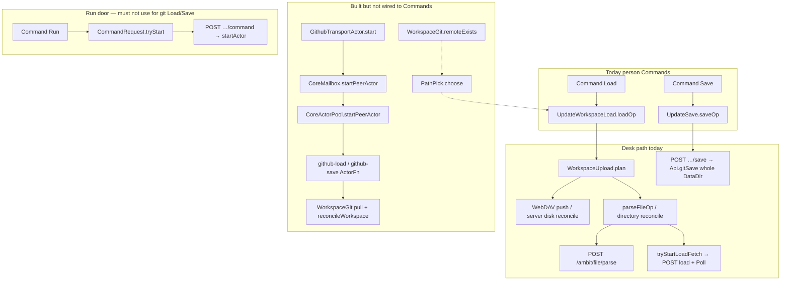

# Ticket trace — [14 — Route Load and Save by path pre-pick](../issues/14-route-load-save-by-pre-pick.md)

Date: 2026-09-27
Project: [github-transport](../project.md)
Purpose: Trace today’s person Command Load/Save paths, map dependencies from [11 — Pick git or desk for plain Load and Save](../issues/11-pick-git-or-desk-for-plain-load-save.md), [12 — Run the Workspace git tracked-branch round-trip](../issues/12-workspace-git-tracked-branch-round-trip.md), and [13 — Run git Load and Save through the Server Peer Actor](../issues/13-peer-actor-runs-git-load-save.md), and name the smallest seams and closest tests for [14 — Route Load and Save by path pre-pick](../issues/14-route-load-save-by-pre-pick.md). This report does not change product locks.

## 1. Summary

Person Command **Load** and **Save** still run only the legacy desk-oriented Client updaters. They do not send a load/save command request through the mailbox, do not call [PathPick](../issues/11-pick-git-or-desk-for-plain-load-save.md), and do not start the Server Peer Actor. [13 — Run git Load and Save through the Server Peer Actor](../issues/13-peer-actor-runs-git-load-save.md) already built the peer door (`StartPeerActor`, `peerDefs`, [GithubTransportActor.fs](../../../src/Server/GithubTransportActor.fs), registration in [RouteRegistration.fs](../../../src/Server/RouteRegistration.fs)) and proves git Load/Save from `CoreMailbox.startPeerActor` in [GithubTransportActorTests.fs](../../../tests/Server.Tests/GithubTransportActorTests.fs). [14 — Route Load and Save by path pre-pick](../issues/14-route-load-save-by-pre-pick.md) owns wiring person Commands to PathPick, `WorkspaceGit.remoteExists`, the peer door, desk fallbacks, and preserving Parse / graph-push on the Command surface.



## 2. [14 — Route Load and Save by path pre-pick](../issues/14-route-load-save-by-pre-pick.md) checklist vs codebase

| Ticket item | Today | Gap |
| --- | --- | --- |
| 1.1.2 Path pre-pick Plain \| Git \| Desk on the request | No Shared type or wire field; [arch.md](../arch.md) marks encoding unsettled | Add field on a new load/save command request (not new primary `CommandId`) |
| 1.2.2 Plain → `remoteExists` → PathPick | [PathPick.fs](../../../src/Shared/PathPick.fs) exists; nothing calls it outside tests | Server must read `WorkspaceGit.remoteExists` on the Workspace work tree; Client cannot run git |
| 1.2.3 Explicit Git or Desk skips PathPick | No UI or request encoding for git* / desk* | Same request field; router must branch before PathPick |
| 1.2.4 No schedule / post-Persist / post-Download git | No `pullTracked` / `StartPeerActor` from Persist or Download paths | Verify only; no code change unless a stray call appears |
| 1.2.5 Load/Save → mailbox → pool, not Run / `?git` | Peer door exists; Commands do not use it | New HTTP + Client effect; must call `startPeerActor`, not [Api.postCommand](../../../src/Server/Api.fs) + `startActor` |
| 1.2.6 / 1.3.4 Preserve Load Parse / graph-push | Desk: full Client chain; git actor: server `reconcileWorkspace` only | Client likely must continue desk-style hops after git `ActorStop` (see §7) |
| 1.3.1 PathPick tests for plain vs explicit | [PathPickTests.fs](../../../tests/Shared.Tests/PathPickTests.fs) (2 tests) | Add routing tests with stubbed `remoteExists` and explicit pre-picks |
| 1.3.2 Git → Peer Actor + Focus | [GithubTransportActorTests.fs](../../../tests/Server.Tests/GithubTransportActorTests.fs) | Extend with routing layer or integration test from HTTP |
| 1.3.3 Desk path unchanged | `loadOp` / `saveOp` behavior intact | Extract desk body behind router; do not replace WebDAV |
| 1.3.4 Parse hops after either transport | Partial overlap with [13](../issues/13-peer-actor-runs-git-load-save.md) server reconcile | Prove Client `parseFileOp` / Fetch+Poll or document v1 boundary |

## 3. Person Command Load — current end-to-end trace

### 3.1 Entry

1. [Commands.fs](../../../src/Client/Commands.fs) registers `cmd Load (keyAlways loadOp)` — primary name stays **Load** ([02 — Actor command surface](../issues/02-actor-command-surface.md)).
2. [UpdateWorkspaceLoad.fs](../../../src/Client/UpdateWorkspaceLoad.fs) `loadOp` runs synchronously in the Client MVU loop. It does not emit `SubmitCommand`, `StartPeerActor`, or any Server git call.

### 3.2 Guards and planning

1. `selectedLoadTargetIds` + `ResidentProjection.selectionSpansMultipleWorkspaces` — multi-Workspace selection errors with `CmdLastResult.Error`.
2. `contextualTargetForModel` → [CommandEntry.contextualTarget](../../../src/Shared/CommandEntry.fs) maps Focus to `ParseFile`, `ReconcileWorkspace`, or `ReconcileDirectory`.
3. [WorkspaceUpload.plan](../../../src/Shared/WorkspaceUpload.fs) chooses the desk/web action from desktop caps, local mapping, Workspaces focus, and contextual target:
   - `CreateWorkspaceFromFolder` — desktop pick-folder flow ([UpdateWorkspaceDesktop.fs](../../../src/Client/UpdateWorkspaceDesktop.fs)).
   - `DesktopPush` — WebDAV upload pipeline ([UpdateWorkspaceSync.fs](../../../src/Client/UpdateWorkspaceSync.fs)).
   - `ReconcileServerDisk` — web-only directory reconcile.
   - `ParseServerDisk` — web-only file parse from DataDir.
4. Sync queue: `QueuedLoad` / `QueuedWorkspacePush` when [SyncInfo](../../../src/Shared/ViewModelSync.fs) is busy; [App.fs](../../../src/Client/App.fs) `RunQueuedRequest` re-dispatches `loadOp` or `startWorkspacePush`.

### 3.3 Desk / WebDAV execution (when plan chooses desktop push)

1. `startWorkspacePush` → effects `ContinueWorkspaceStubsThenPush` / `ContinuePostUploadStructure` / `ContinueWorkspacePush`.
2. [App.fs](../../../src/Client/App.fs) POSTs `/_desktop/workspace-inventory`, `/{currentFile}/changes`, `/_desktop/workspace-push` (async `postJson`).
3. Completion handlers in [UpdateWorkspaceSync.fs](../../../src/Client/UpdateWorkspaceSync.fs) may call `parseFileOp` and `tryStartLoadFetch`.

### 3.4 Parse / graph-push hops (desk and web)

| Hop | Trigger | Client | Server |
| --- | --- | --- | --- |
| File parse | `WorkspaceUploadAction.ParseServerDisk` or post-push parse | [parseFileOp](../../../src/Client/UpdateImport.fs) → `Effect.ContinueParseFile` | [App.fs](../../../src/Client/App.fs) optional `/_desktop/file` read, then `POST /ambit/file/parse` → [Api.postParseFile](../../../src/Server/Api.fs) → [DocumentPersistWrite.planParseFile](../../../src/Server/DocumentPersistWrite.fs) → graph-only mint `"Parse"` |
| Directory reconcile | `ReconcileServerDisk` | `Effect.ContinueDirectoryReconcile` | `POST /ambit/workspace/reconciliation/directory` → [LazyLoadReconciliationServer.reconcileDirectory](../../../src/Server/LazyLoadReconciliationServer.fs) |
| Fetch + Poll | After parse success or upload success | [tryStartLoadFetch](../../../src/Client/UpdateHelpers.fs) → `SyncPlanner.tryStartLoad` → `Effect.LoadServer` | [App.fs](../../../src/Client/App.fs) `POST /{currentFile}/load` → [Api.postLoad](../../../src/Server/Api.fs) (resident Fetch+Poll — **not** git pull) |

**Naming clash:** `POST /ambit/load` and `POST /{currentFile}/load` are **Fetch+Poll** for selective client loading, not GitHub git Load ([peer-actor-code-map-2026-09-27.md](peer-actor-code-map-2026-09-27.md) ambiguity **POST `/ambit/load` name clash**).

### 3.5 What Load does not touch today

- [CoreMailbox.startPeerActor](../../../src/Server/Core/CoreMailbox.fs), [CoreMsg.StartPeerActor](../../../src/Server/Core/CoreMsg.fs), [GithubTransportActor.start](../../../src/Server/GithubTransportActor.fs).
- [PathPick.choose](../../../src/Shared/PathPick.fs), [WorkspaceGit.remoteExists](../../../src/Server/WorkspaceGit.fs).
- [CommandRequest.tryStart](../../../src/Shared/CommandRequest.fs) (Run scan for `?` commands).

## 4. Person Command Save — current end-to-end trace

### 4.1 Entry

1. [Commands.fs](../../../src/Client/Commands.fs) `cmd Save (keyAlways saveOp)`.
2. [UpdateSave.fs](../../../src/Client/UpdateSave.fs) `saveOp`:
   - Gated by `serverCapabilities.canGitSave` ([ServerCapabilities.fs](../../../src/Shared/ServerCapabilities.fs) from [Api.getCapabilities](../../../src/Server/Api.fs) — `GitSave.isRepo dataDir` on **whole DataDir**).
   - `POST /{currentFile}/save` with empty body (legacy path segment; Server registers [`POST /ambit/save`](../../../src/Server/RouteRegistration.fs) → [Api.gitSave](../../../src/Server/Api.fs) `GitSave.commitAll` on **DataDir root**, not Workspace-scoped [WorkspaceGit.saveTracked](../../../src/Server/WorkspaceGit.fs)).

### 4.2 Desk Save vs git Save (product lock)

[arch.md](../arch.md) module **Desk Load/Save** locks desk Save as existing desk / local `GitSave` commit (**not** GitHub push). [10 — git Save is commit then push](../issues/10-git-save-commit-then-push.md) locks **git Save** to Workspace-scoped commit + push via Peer Actor. Today’s `saveOp` is only the legacy whole-DataDir daily save; [14 — Route Load and Save by path pre-pick](../issues/14-route-load-save-by-pre-pick.md) must route plain/git/desk Save without merging Persist into git Save.

### 4.3 What Save does not touch today

- Peer Actor `github-save`, `WorkspaceGit.saveTracked`, mailbox door.
- PathPick or per-Workspace `remoteExists`.

## 5. Run Command — contrast (forbidden door for git)

| Step | File | Behavior |
| --- | --- | --- |
| Palette / key Run | [Commands.fs](../../../src/Client/Commands.fs) `execRunOp` | `CommandRequest.tryStart` requires a `?` command node on owner path |
| Effect | [ViewModelSync.fs](../../../src/Shared/ViewModelSync.fs) `SubmitCommand` | |
| HTTP | [App.fs](../../../src/Client/App.fs) `POST /{currentFile}/command` | Body: [EventJson.encodeStartRequest](../../../src/Shared/EventJson.fs) |
| Server | [RouteRegistration.fs](../../../src/Server/RouteRegistration.fs) `/ambit/command` | [Api.postCommand](../../../src/Server/Api.fs) → **`CoreMailbox.startActor`** only |
| Pool | [CoreActorPool.startActor](../../../src/Server/Core/CoreActorPool.fs) | Resolves actor name from command node text / `actor-*` class — not peer registry |

[GithubTransportActorTests.fs](../../../tests/Server.Tests/GithubTransportActorTests.fs) `Peer Actor is not available through the Run actor table` proves `startActor` cannot start the peer. [14 — Route Load and Save by path pre-pick](../issues/14-route-load-save-by-pre-pick.md) must add a **parallel** HTTP path that calls `CoreMailbox.startPeerActor` with `PeerActorName "github-load"` or `"github-save"` ([07 — Actor start door](../issues/07-actor-start-door.md)).

## 6. Mailbox → actor pool → Peer Actor (from [13](../issues/13-peer-actor-runs-git-load-save.md))

### 6.1 Message and dispatch

1. **Public API:** [CoreMailbox.startPeerActor](../../../src/Server/Core/CoreMailbox.fs) posts `CoreMsg.StartPeerActor(caller, peerName, request, reply)`.
2. **Backend:** [CoreMailboxBackend.dispatchStartPeerActor](../../../src/Server/Core/CoreMailboxBackend.fs) shares `dispatchActorStart` with Run: admit Browser caller → `pool.startPeerActor peerName` → [CoreEventDispatch.actorStart](../../../src/Server/Core/CoreEventDispatch.fs) (`EventBody.ActorStart`) → `pool.schedule` → `ActorFn` async.
3. **Pool:** [CoreActorPool.runStartPeerActor](../../../src/Server/Core/CoreActorPool.fs) looks up **`peerDefs`** only (separate from Run `defs`). Same `admitStart` rules: non-empty `graphIds`, Focus not live, `commandId` not live.
4. **Payload:** Reuses [ActorStart](../../../src/Shared/History.fs) `{ zoomId; focusId; commandId; graphIds; eventId }`. Tests mint synthetic command nodes named `"load"` / `"save"` for `commandId`; production Load/Save has no `?` node — [14](../issues/14-route-load-save-by-pre-pick.md) must pick stable `commandId` strategy (e.g. `focusId` as `commandId` via [CommandRequest.oneNodeStart](../../../src/Shared/CommandRequest.fs) pattern, or dedicated ids).

### 6.2 GithubTransportActor behavior

File: [GithubTransportActor.fs](../../../src/Server/GithubTransportActor.fs).

| Operation | Peer name | Work tree | Git | After success |
| --- | --- | --- | --- | --- |
| Load | `github-load` | [workspaceFromFocus](../../../src/Server/GithubTransportActor.fs) uses [DocumentPersistPath.workspaceRootFor](../../../src/Server/DocumentPersistPath.fs) + enclosing Workspace label; subnode Focus still maps to **whole Workspace root** ([05 — Git Load/Save are Workspace-scoped](../issues/05-git-load-save-workspace-scoped.md)) | `withWorkTreeGate` → `trackedBranch` → **`pullTrackedBranch`** (not `pullTracked`, avoids double gate) | `continueLoad` → [LazyLoadReconciliationServer.reconcileWorkspace](../../../src/Server/LazyLoadReconciliationServer.fs) (discover disk → graph-only `"Parse"` chunks) |
| Save | `github-save` | Same Focus → root | `withWorkTreeGate` → `commitTracked` → `pushTrackedBranch` | `actorStop` only |

Registration: [RouteRegistration.createPersistenceContext](../../../src/Server/RouteRegistration.fs) `registerPeer` for Load and Save with [productionDependencies](../../../src/Server/GithubTransportActor.fs) closing real `WorkspaceGit` fns.

### 6.3 Focus and work tree (ticket [13](../issues/13-peer-actor-runs-git-load-save.md))

- **Focus:** [ActorInput.focusId](../../../src/Server/Core/CoreActorPool.fs) only; git scope is not narrowed by subnode pathspec.
- **ROOT / unnamed Workspace:** `workspaceFromFocus` errors — behavior for SYSTEM/TRASH not locked ([peer-actor-code-map-2026-09-27.md](peer-actor-code-map-2026-09-27.md) ambiguity **ROOT, SYSTEM, TRASH Focus**).
- **Gate:** Actor uses `WorkspaceGit.withWorkTreeGate` once around pull/commit; inner ops use `pullTrackedBranch` / `commitTracked` / push outside commit gate ([12](../issues/12-workspace-git-tracked-branch-round-trip.md), [16](../issues/16-persist-git-work-tree-gate.md)).

## 7. PathPick and WorkspaceGit.remoteExists (tickets [11](../issues/11-pick-git-or-desk-for-plain-load-save.md), [12](../issues/12-workspace-git-tracked-branch-round-trip.md))

### 7.1 PathPick ([11](../issues/11-pick-git-or-desk-for-plain-load-save.md) done)

- File: [PathPick.fs](../../../src/Shared/PathPick.fs).
- `LoadSavePath = Git | Desk`; `choose remoteExists:bool` → Git if true, else Desk.
- Pure; no I/O. Tests: [PathPickTests.fs](../../../tests/Shared.Tests/PathPickTests.fs).

### 7.2 remoteExists ([12](../issues/12-workspace-git-tracked-branch-round-trip.md) done)

- File: [WorkspaceGit.fs](../../../src/Server/WorkspaceGit.fs) `remoteExists workspaceRoot` → `git remote` via `runGitCondensed`; **any** non-empty remote output ⇒ true.
- Tests: [WorkspaceGitTests.fs](../../../tests/Server.Tests/WorkspaceGitTests.fs) ``remoteExists reports any configured remote``.
- **Must run on Server** against `DocumentPersistPath.workspaceRootFor dataDir graph focusId` — not available in Shared/Client.

### 7.3 Plain Load/Save routing (not implemented)

Intended logic ([map.md](../map.md) Decisions so far [02 — Actor command surface](../issues/02-actor-command-surface.md) and [03 — When pull and push fire](../issues/03-when-pull-and-push-fire.md), [spec.md](../spec.md) user stories **Plain Load prefers git** and **Plain Save prefers git**):

1. If pre-pick **Git** → peer git path (skip PathPick).
2. If pre-pick **Desk** → today’s `loadOp` / desk `saveOp` (skip PathPick).
3. If pre-pick **Plain** → `remoteExists` on Workspace root → `PathPick.choose` → (2) or (3).

Smallest **pure** seam (optional Shared helper):

```fsharp
let resolvePath prePick remoteExists =
    match prePick with
    | Plain -> PathPick.choose remoteExists
    | Git -> LoadSavePath.Git
    | Desk -> LoadSavePath.Desk
```

I/O stays Server-side before `choose`.

## 8. Parse / graph-push — desk vs git today and ticket [14](../issues/14-route-load-save-by-pre-pick.md) tension

| Aspect | Desk Load (`loadOp`) | Git Load (Peer Actor today) |
| --- | --- | --- |
| File transfer | WebDAV push or read DataDir | `git pull` whole tracked branch |
| Graph update after files land | Selection-aware: `parseFileOp`, `ContinueDirectoryReconcile`, then `tryStartLoadFetch` | Whole-workspace: `reconcileWorkspace` (discover all artifacts under label, graph-only Parse ops) |
| Client Fetch+Poll | Yes, via `LoadServer` effect | **No** — actor completes before Client polls |
| Selection-scoped nuance | Today’s behavior | [06 — Selection-scoped Parse after whole-tree git Load](../issues/06-selection-scoped-parse-after-whole-tree-git-load.md) deferred |

[github-transport architecture](../arch.md) and [14 — Route Load and Save by path pre-pick](../issues/14-route-load-save-by-pre-pick.md) checklist **1.2.6 Preserve Load completion** and **1.3.4 Preserve existing Parse hops** require **Command Load** to keep desk-style Parse / graph-push coupling after git files land. [13 — Run git Load and Save through the Server Peer Actor](../issues/13-peer-actor-runs-git-load-save.md) implemented server `reconcileWorkspace` inside the actor (**4.3.4 Preserve Load completion** on that ticket). [peer-actor-code-map-2026-09-27.md](peer-actor-code-map-2026-09-27.md) recommended minimum **Parse continuation (v1 boundary)** option (a): after `ActorStop` success, **Client** runs the same branches as `loadOp` (`parseFileOp` / directory reconcile / Fetch+Poll) without re-pulling; option (b): rely on server reconcile only. [14 — Route Load and Save by path pre-pick](../issues/14-route-load-save-by-pre-pick.md) should pick (a) or (b) explicitly when wiring Commands; architecture text favors preserving today’s **Client** hops for git/plain-git Load where selection context matters, without expanding [06 — Selection-scoped Parse after whole-tree git Load](../issues/06-selection-scoped-parse-after-whole-tree-git-load.md).

Recommended v1 wiring sketch (implementation hint only):

1. Git path: HTTP `startPeerActor` Load → poll/command response includes `ActorStop` → Client `applyCommandEvents` → dispatch **desk parse continuation** function extracted from `loadOp` (not full WebDAV) → existing `ContinueParseFile` / `ContinueDirectoryReconcile` / `tryStartLoadFetch`.
2. Avoid second `reconcileWorkspace` if actor already ran it — may require actor flag or split `continueLoad` dependency for production vs ticket-14 composition (smallest change: production actor keeps reconcile; Client only runs selection-scoped parse + Fetch+Poll).

## 9. No automatic pull/push ([14 — Route Load and Save by path pre-pick](../issues/14-route-load-save-by-pre-pick.md) **1.2.4 Start only from a person Command**)

Searched production paths: **no** `StartPeerActor`, `pullTracked`, or `github-load` from Client, [UpdateWorkspaceDownload.fs](../../../src/Client/UpdateWorkspaceDownload.fs), or Persist except [WorkspaceGit.withWorkTreeGate](../../../src/Server/WorkspaceGit.fs) / `ensureInit` in [DocumentPersistWrite.fs](../../../src/Server/DocumentPersistWrite.fs) (gate and repo init only). Satisfying **1.2.4 Start only from a person Command** is mostly **regression guard** in new routing tests.

## 10. Smallest files / seams to change (ordered)

### 10.1 Shared (types + pure routing)

| Priority | File | Change |
| --- | --- | --- |
| 1 | New small module e.g. [PathPick.fs](../../../src/Shared/PathPick.fs) sibling or extend it | `LoadSavePrePick = Plain \| Git \| Desk` + pure `resolvePath` (optional) |
| 2 | [EventJson.fs](../../../src/Shared/EventJson.fs) or new `LoadSaveCommandJson.fs` | Encode/decode load/save command request: `prePick`, `operation` Load\|Save, `ActorStart` fields (architecture: unsettled wire — extend `ActorStart` vs wrapper record) |
| 3 | [ViewModelSync.fs](../../../src/Shared/ViewModelSync.fs) | New `Effect` e.g. `SubmitLoadSaveCommand of …` (do not overload `SubmitCommand` / Run) |
| 4 | [CommandEntry.fs](../../../src/Client/Commands.fs) | Only if pre-pick UI adds palette entries; spoken names stay Load/Save per [02](../issues/02-actor-command-surface.md) |

### 10.2 Client (person Command surface)

| Priority | File | Change |
| --- | --- | --- |
| 1 | [UpdateWorkspaceLoad.fs](../../../src/Client/UpdateWorkspaceLoad.fs) | Top-level router: prePick → git HTTP / desk `loadOpDesk` (extract current body) |
| 2 | [UpdateSave.fs](../../../src/Client/UpdateSave.fs) | Same for Save: git → peer Save HTTP; desk → existing POST save |
| 3 | [App.fs](../../../src/Client/App.fs) | Handle new effect: POST peer start, reuse `CommandDone` / `applyCommandEvents` for lifecycle events; on Load success optionally run parse continuation |
| 4 | [UpdateActorLive.fs](../../../src/Client/UpdateActorLive.fs) | Map `ActorFailed` git strings to `CmdLastResult` for Load/Save (today Run-only labeling) |

### 10.3 Server (PathPick + door)

| Priority | File | Change |
| --- | --- | --- |
| 1 | New thin module e.g. `LoadSaveRouting.fs` in Server or Shared | Given prePick + focus: resolve workspace root, `remoteExists`, `PathPick`, return Git desk or error |
| 2 | [Api.fs](../../../src/Server/Api.fs) | `postLoadSaveCommand`: decode body → route → either `startPeerActor` (Git) or JSON `{ desk: true }` (Client continues desk) or synchronous desk-only errors |
| 3 | [RouteRegistration.fs](../../../src/Server/RouteRegistration.fs) | `MapPost` new route (e.g. `/ambit/load-save/start` — name not locked); wire `CoreMailbox.startPeerActor` + `GithubTransportActor.peerName` |
| 4 | [GithubTransportActor.fs](../../../src/Server/GithubTransportActor.fs) | **Optional** only if ticket-14 Parse split requires different `continueLoad` for person Commands vs tests |

**Do not** extend [Api.postCommand](../../../src/Server/Api.fs) or `/ambit/command` for Load/Save — that is the Run door.

### 10.4 What to avoid touching

- [CoreActorPool.fs](../../../src/Server/Core/CoreActorPool.fs) / [CoreMsg.fs](../../../src/Server/Core/CoreMsg.fs) — door already done in [13](../issues/13-peer-actor-runs-git-load-save.md).
- [WorkspaceGit.fs](../../../src/Server/WorkspaceGit.fs) — facts done in [12](../issues/12-workspace-git-tracked-branch-round-trip.md) unless routing needs a thin `remoteExistsForFocus dataDir graph focusId` helper (could live next to `workspaceFromFocus`).

## 11. Closest tests to extend

| Test file | Use for [14](../issues/14-route-load-save-by-pre-pick.md) |
| --- | --- |
| [PathPickTests.fs](../../../tests/Shared.Tests/PathPickTests.fs) | Extend with `resolvePath` Plain/Git/Desk matrix (no git process) |
| [WorkspaceGitTests.fs](../../../tests/Server.Tests/WorkspaceGitTests.fs) | Reuse `graphWithWorkspace` + temp dir patterns for `remoteExists` integration in routing module |
| [GithubTransportActorTests.fs](../../../tests/Server.Tests/GithubTransportActorTests.fs) | Copy `withActor`, `seedOperation`, `waitForStop`; add cases: routing calls `startPeerActor` with correct `PeerActorName`; Plain+remote stub starts Load peer |
| [ApiPostCommandTests.fs](../../../tests/Server.Tests/ApiPostCommandTests.fs) | Template for new HTTP decode test — assert **`startPeerActor`**, not `startActor` |
| [CoreMailboxDoorTests.fs](../../../tests/Server.Tests/CoreMailboxDoorTests.fs) | If routing calls mailbox directly in tests without HTTP |
| **New** `LoadSaveRoutingTests.fs` (Server.Tests) | End-to-end: stub `remoteExists`, stub peer registry, prove PathPick only on Plain; explicit Git/Desk skip chooser |
| **New** Shared test file (optional) | Pure prePick + PathPick composition only |

No existing Client test covers `loadOp`; first Client routing test would be new (Fable test harness if available) or covered via Server HTTP + manual QA per [15 — Keep the App outside Peer Actor hosting](../issues/15-keep-app-outside-peer-actor-hosting.md).

## 12. Open decisions (carry into implement)

1. **Wire shape:** Wrapper `{ prePick; operation; start: ActorStart }` vs extra fields on `ActorStart` ([arch.md](../arch.md) §2.1.2 encoding unsettled).
2. **Pre-pick UX:** How person selects git* / desk* without new primary Command names ([15](../issues/15-keep-app-outside-peer-actor-hosting.md) 6.3.1 — Command surface stays Load/Save).
3. **`commandId` for Load/Save:** Synthetic graph node vs `focusId`/`zoomId` duplication; must satisfy `admitStart` and avoid collision with Run commands.
4. **Parse after git Load on Command surface:** Client continuation vs server-only `reconcileWorkspace` (§8).
5. **Plain Save → desk:** Confirm desk Save remains `POST /ambit/save` whole-DataDir vs future Workspace-scoped desk save (architecture locks desk as existing behavior).
6. **HTTP route name and Client URL:** Align `/ambit/...` with [RouteRegistration.fs](../../../src/Server/RouteRegistration.fs) vs Client `/{currentFile}/...` proxy convention.

## 13. Suggested implement sequence (technical, not calendar)

1. Shared: `LoadSavePrePick` + JSON + pure routing tests.
2. Server: `remoteExistsForFocus` + `LoadSaveRouting` + `Api.postLoadSaveStart` + route registration; unit tests with stub peer fns.
3. Client: refactor desk bodies; router in `loadOp`/`saveOp`; new effect + App POST handler; ActorStop → parse continuation for Load.
4. Integration: extend [GithubTransportActorTests.fs](../../../tests/Server.Tests/GithubTransportActorTests.fs) patterns through HTTP; manual browser Load/Save plain/git/desk on mapped Workspace with and without `git remote`.

## 14. Related reports

- [peer-actor-code-map-2026-09-27.md](peer-actor-code-map-2026-09-27.md) — pre-[13 — Run git Load and Save through the Server Peer Actor](../issues/13-peer-actor-runs-git-load-save.md) map; finding **Person Load and Save do not reach the mailbox** (What exists today) is **still true for person Commands** until [14 — Route Load and Save by path pre-pick](../issues/14-route-load-save-by-pre-pick.md) lands.
- [13-independent-code-review-2026-09-27.md](13-independent-code-review-2026-09-27.md) — confirms routing belongs to [14](../issues/14-route-load-save-by-pre-pick.md).

## 15. References

- [14 — Route Load and Save by path pre-pick](../issues/14-route-load-save-by-pre-pick.md)
- [github-transport architecture](../arch.md) modules **Command Load/Save**, **PathPick**, **WorkspaceGit**, **Peer Actor**, **Desk Load/Save**
- [07 — Actor start door](../issues/07-actor-start-door.md)
- [doc/current/workspace-file-sync.md](../../../doc/current/workspace-file-sync.md) — WebDAV desk transit
