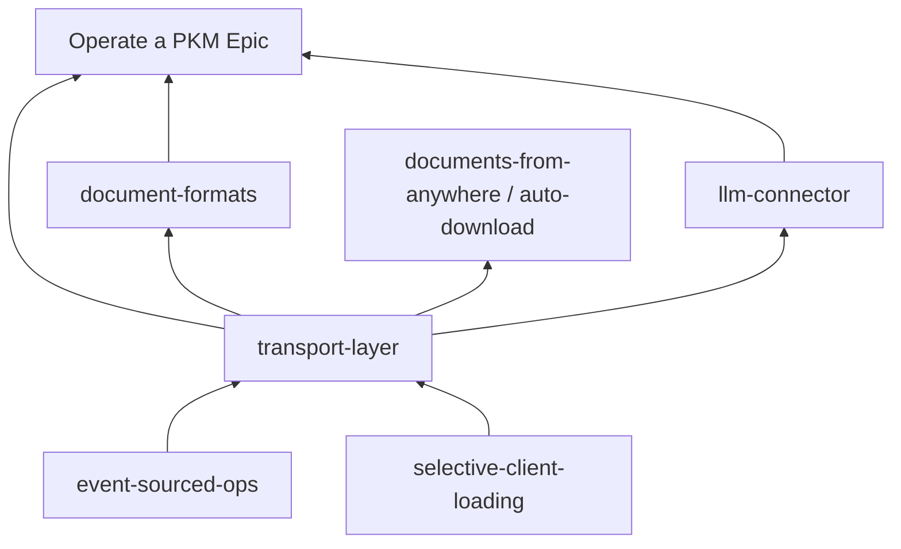

# Hub / connector vision — Epic framing report

For product discussion. Sources: [[plan/roadmap/map.md]], sample Epics, [[plan/event-sourced-ops/overview.md]], [[doc/agents/scope-vs-commitment.md]], [[doc/agents/domain.md]], [[CONTEXT.md]], connector/import/export/Actor grep in `plan` and `doc/`.

## 1. How existing Epics are framed

**User Epics** open with one sentence: *A person [verb phrase]* — a marketable end-goal, not a mechanism. They have `Stage: charting`, a **current Chapter** (named beat), further Chapters in order, and **Required for done** (cross-cutting Projects not tied to one beat). Each Chapter is a file under [[plan/roadmap/epics/chapters/]] with Context, Goal, and Required for done; charting advances by pointing at feature-set Projects, not by coding on the Epic file.

Examples:

- *Operate a PKM* — "imports external data without a seam"; Chapter *Find what I wrote*; homes graph-view, expression-language, document-formats remainder, eso remainder.
- *Work with my documents from anywhere* — connected-device document work; Chapters on auto upload/download, auto Parse, styling, images, tables.
- *Agent chat with managed context* — Chapters from `?` through Graph/file query to CLI/MCP Actors.

**Developer Epics** (*Organize Huge Outlines*, *Robust outliner*) state a scaling concern, have **no Chapters**, and only **Required for done** that homes Projects other Epics reference. Sessions do not offer Developer Epic Chapters as takeable work.

**Roadmap** itself is the only `steering` Project — it sequences Epics; it is not a product vision document.

## 2. What event-sourced-ops already commits (supports "arbitrary modules")

ESO is **active** and defines a **semantic standard**, not a connector catalog:

- **One mutation path:** an **Actor** (person, Parse File job, future shell/agent) produces **Changes** (sets of **Ops**); **Server** sequences and amends; **Clients** rewind/replay. No second writer.
- **Async = same kind:** long-running work concludes as Changes on the same path; Browsers **Poll**, not completion push.
- **Parse File** is the first non-Browser Server Actor; **generalized produce path** (issue 07) and **job identity + soft-lock** (issue 09) are the spine for more Actors.
- **Load** stays **Graph transfer** (residency), not Change replay — relevant for inbound materialization vs ongoing Sync.

**Out of scope for ESO** ([[plan/event-sourced-ops/overview.md]] — not Gambol-wide; see [[doc/agents/scope-vs-commitment.md]]): a plug-in bus, a job-framework product, or an offline editor. ESO is a small framework for how a Change merges into a Local Graph. ESO enables modules that **emit Changes**; it does not specify inbound/outbound UX, source catalogs, or export-transform-import workflows.

**What `doc/` says today (as-is only):** per [[doc/agents/domain.md]] and [[.cursor/rules/planning-docs.mdc]], [[doc/]] describes the current program — implemented baselines, reference, and leftover roadmap text. Grep shows `import`/`export` there mostly means **document codecs** (Parse/reconcile round-trip on File Nodes) and workspace file sync, not a general information hub. `connector` appears only for **llm-connector** and graph-view visual edges. **Actor** is centralized in ESO charting docs. The inbound/outbound/round-trip hub pattern is **not** in `doc/` yet; it stays in `plan` until promoted.

## 3. Epic definition fit

| Framing | Verdict |
| --- | --- |
| **Single User Epic** | Risky as stated — "hub for all kinds of information" is a **program thesis**, not one beat a person can finish and market. |
| **Steering Roadmap note** | Wrong layer — Roadmap sequences Epics; it does not hold product vision prose. |
| **New Epic kind** | Out of scope per [[plan/roadmap/map.md]] (User Epic + Developer Epic only). |
| **Umbrella Developer Epic** | Plausible for **homing connector Projects** (like Organize Huge Outlines homes scale work) if the user-facing story stays thin. |
| **Cross-cutting `plan` Project** | **Best home for the pattern** (inbound / outbound / round-trip, Graph authority, Actor boundary). Epics **cite** it; they do not restate it. Promote to `doc/` only after human promotion per [[.cursor/skills/maintain-doc-currency/SKILL.md]] — not there yet. |

**Recommendation:** Treat the full vision as **`plan` architecture + Roadmap sequencing**, not one Epic. Ship **User Epics per channel** (files, chat, publish, future APIs). Optionally add a **Developer Epic** only if many connector Projects need a single Required-for-done home without a narrative Chapter arc.

**Partial overlap:** [[plan/roadmap/epics/operate-a-pkm.md]] claims "imports external data without a seam" — that line names a **dependency**, not PKM's whole mandate. PKM's job is **find and operate on knowledge already in the Graph**; the transport layer owns how outside material arrives. See §8.

## 4. Candidate Epic titles (2–3 each)

### User Epic framings

| Title | Pros | Cons |
| --- | --- | --- |
| **Connect my tools to my Graph** | Marketable; matches inbound/outbound mental model; distinct from "find what I wrote". | Broad; every connector becomes a Chapter or Required item; fights PKM import line if boundaries stay fuzzy. |
| **Bring outside information in** (inbound-only Epic) | Clear first job; aligns with Parse, paste, scale-import docs. | Leaves outbound/round-trip orphaned or split across Epics. |
| **Keep outside copies in sync with my Graph** (round-trip Epic) | Names export-transform-import; Graph stays authority. | Sounds technical; overlaps *documents from anywhere* and document-formats. |

### Vision / platform framings

| Title | Pros | Cons |
| --- | --- | --- |
| **Information hub** (Developer Epic) | Homes many connector Projects; no false Chapter narrative. | Not marketable as a user end-goal; same class as Organize Huge Outlines. |
| **Information hub** (`plan` Project, not Epic) | Holds inbound/outbound/round-trip pattern once; all Epics reference it. | Not on Roadmap Epics list; does not answer "what to work on next" by itself. |
| **Operate a PKM** (expand existing) | Already on Roadmap; "without a seam" is close. | PKM Epic already heavy (graph view, expression-language, formats); blurs PKM vs integration; round-trip and generate-from-data are out of PKM scope. |

## 5. Relation to existing Epics (avoid duplication)

| Epic / area | Hub vision relationship |
| --- | --- |
| **Operate a PKM** | **Consume and navigate** knowledge in the Graph (Find, graph view, expression). Hub **feeds** PKM; PKM **depends on** the transport layer for seamless inbound materialization. PKM does **not** own round-trip editing of external sources or generating content from data. |
| **Work with my documents from anywhere** | **File Node channel**: Upload/Download/Load, workspace mapping, auto sync. Hub pattern's **disk leg**; not arbitrary SaaS/API sources. |
| **Agent chat with managed context** | **One Actor family** (LLM, later CLI/MCP). Hub pattern's **agent leg**; ESO issues 07/09 are shared infrastructure, not this Epic's Chapters. |
| **Document formats** | **Codec round-trip** on File bodies (Parse/reconcile). One **leg** of hub round-trip for text files; not the general module pattern or source catalog. |
| **Create and publish web pages / Build wiki** | **Outbound publish** to readers (public URL). Hub outbound to *editable* external systems is adjacent but different audience. |
| **Manage a project** | Work-item semantics on Nodes; not an integration Epic. |

### PKM vs transport layer (three jobs)

| Job | Owner | PKM Epic? |
| --- | --- | --- |
| **Import** — external material → Graph (Parse, paste, connector Actors, examine-before-commit) | Import layer / connector Projects | Names the dependency ("without a seam"); not PKM's build mandate |
| **Round-trip external edit** — export → edit elsewhere → re-import → Update as Changes | Import layer + document-formats codec leg + workspace sync | **No** — PKM navigates the Graph; it does not own sync with editable external systems |
| **Generate from data** — produce new content or views from Graph data (reports, derived outlines, LLM output) | Expression-language, llm-connector, future publish | **No** — consumption and navigation, not generation |

**Division rule:** Epic = **User Epic** on a channel or outcome; feature-set Project = **one source, codec, or Actor**; ESO = **how Changes land**; transport-layer Project = **inbound / outbound / round-trip template** (`plan` until promoted).

## 6. Suggested Chapter beats (if User Epic: *Connect my tools to my Graph*)

1. **See what is connected** — catalog of sources/destinations, connection health, Graph authority stated in UI (no duplicate truth).
2. **Pull information in** — inbound: external → tailored Graph view for examination/editing (Parse, paste, import jobs as Actors).
3. **Push information out** — outbound: Graph → external destination (export, publish hooks); Graph remains canonical.
4. **Round-trip without a second truth** — export-transform-import or extract → edit elsewhere → import → **Update** as Changes (document-formats + workspace sync patterns).
5. **Automate the loop** — scheduled/triggered Actors (depends on ESO job identity; defers to agent-chat for LLM/CLI/MCP).

Chart each beat onto existing Projects where possible (auto-download, document-formats, llm-connector, lazy-load/scale-import) before inventing new slugs.

## 7. event-sourced-ops vs new work

| Stay on **event-sourced-ops** | New **feature-set Project(s)** / `plan` architecture |
| --- | --- |
| Actor produce path, merge, Poll/Post, job identity, soft-lock, permanent history, completing-ops | Per-source **connector modules** (API client, OAuth, mapping Graph ↔ external model) |
| Parse File as reference Actor | Hub **catalog UX**, connection config Nodes, "examine before commit" staging |
| Vocabulary: Actor, Change, Op, Load vs Sync | **Inbound/outbound/round-trip** pattern in [[plan/transport-layer/project.md]] (module contract: plan from Local Graph, emit Changes, optional long-running Actor) |
| Issues 01–15 implementation spine | Export-transform-import **orchestration** above codecs (may compose document-formats + workspace file model) |

**Do not expand ESO** into connector product design; **do require** every hub module to post Changes through the Actor path ESO defines.

## 8. Project fit, foundation layering, and dependencies

### Does this fit an existing Project?

| Project | Fit | Verdict |
| --- | --- | --- |
| **event-sourced-ops** | Actor spine, merge, job identity — **foundation below** the transport layer | Keep ESO; do not absorb connector catalog or hub UX |
| **document-formats** | Codec Parse/reconcile on File bodies | **Codec leg** of round-trip; not inbound catalog, OAuth, or multi-source hub |
| **llm-connector** | One long-running Actor family | **Agent leg** of the hub; not the general pattern |
| **selective-client-loading** | Load/residency, partial Graph boundaries | **Infrastructure** for inbound materialization; not connection config or export orchestration |
| **operate-a-pkm** (Epic) | Consumer of transported Graph material | **Downstream** — depends on transport layer; does not replace it |
| **auto-download / documents-from-anywhere** | Disk channel, workspace mapping | **One channel** under the hub pattern |

**Conclusion:** No existing Project fully owns the hub/import-layer vision. Extend siblings where they touch one leg; chart a **new** `plan` Project for the cross-cutting pattern and connector homing.

### Is this a foundation we implement first?

**Yes — partially layered.** Build order:

1. **ESO** (active) — any module that mutates the Graph posts Changes through the Actor path.
2. **Transport layer** (`transport-layer`, charting) — pattern doc, module contract, per-source connector Projects as they appear.
3. **Channel Projects** — document-formats (codec), llm-connector (agent), selective-client-loading (residency), workspace file sync (disk).
4. **PKM Epic** — find, navigate, expression; assumes inbound materialization already works.

The transport layer does not block ESO. PKM's "without a seam" line assumes the transport layer exists; PKM can chart navigation work in parallel but cannot claim import is done until connector Projects deliver.

### PKM depends on the transport layer

Direction is **ESO → transport layer → PKM**, not the reverse. PKM Required-for-done may list document-formats and ESO remainder because those are shared spines; the **transport/connect story** should home under `transport-layer` (or per-channel connector Projects it parents). When PKM Epic text says "imports external data without a seam", read it as: *the person experiences seamless import because the transport layer Project(s) are done* — not because PKM implements connectors.

## 9. Recommendation: new Project `transport-layer`

**Extend existing Projects for their legs; do not fold the whole hub into ESO or PKM.**

Create [[plan/transport-layer/project.md]] at `charting` to hold:

- Inbound / outbound / round-trip pattern (`plan` only until promoted)
- Module contract (plan from Local Graph, emit Changes, optional Actor)
- Homing pointer for future per-source connector Projects
- Explicit out-of-scope: PKM navigation, expression, generate-from-data, ESO merge semantics

Optional later: a **Developer Epic** (*Information hub*) if many connector Projects need one Required-for-done row on the Roadmap — same class as Organize Huge Outlines.

Do **not** add a `doc/arch` hub section yet; `doc/` stays as-is until promotion.

## Summary for coordinator

The hub vision is **comprehensive product architecture in `plan`**, not a single marketable Epic and **not** yet committed in `doc/`. Existing Roadmap **distributes legs** across PKM, documents-from-anywhere, agent-chat, and document-formats. Best path: **new `transport-layer` Project** for the three-flow pattern + **User Epic or Developer Epic per channel** as needed. **PKM depends on the transport layer** for seamless inbound materialization; PKM does not own round-trip external edit or generate-from-data. **ESO stays the mutation foundation**; connector catalog and hub UX stay out of ESO scope per [[plan/event-sourced-ops/overview.md]].
