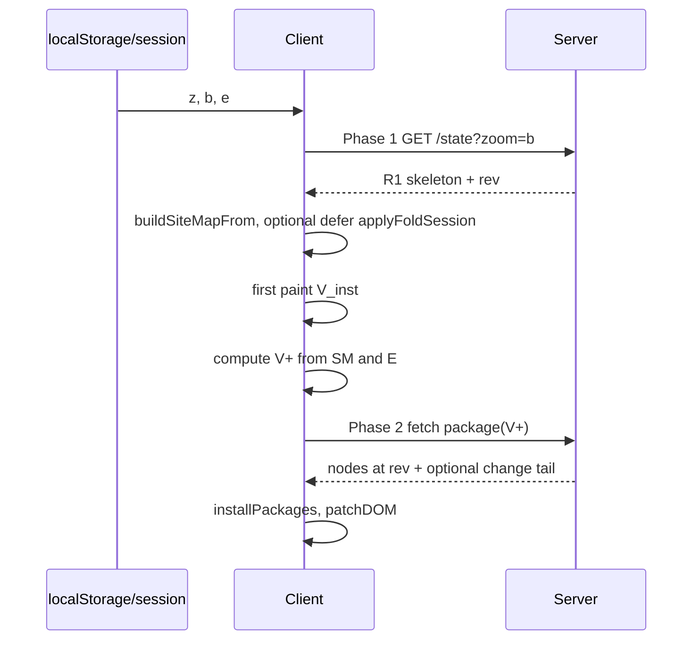

# Two-phase state loading — conceptual exploration

Status: charting (conceptual only; no implementation)
Parent: [[plan/selective-client-loading/spec.md]], [[plan/selective-client-loading/project.md]]
Related: [[plan/event-sourced-ops/overview.md]], [[plan/client-start-time/reports/bucket-3-post-state-work.md]]

## Problem framing

### Why two-phase loading

Gambol boot today is one synchronous pipeline: fetch `/state`, decode the scoped graph, build `SiteMap`, restore session folds, merge pending localStorage queue, render. Cost scales with **Workspace closure size** (ROOT + optional saved-zoom Workspace), not with what the user actually sees. On a forced reload (F5, iOS tab recovery), the browser still pays decode and SiteMap work for every resident node even when the first paint needs only a thin visible slice.

The hypothesis: split boot into **Phase 1** (enough to paint and navigate the shell) and **Phase 2** (hydrate node **content** for the **visible closure** only). Phase 1 may reuse persisted client hints so the server knows what to send in Phase 2.

### What survives reload today

| Store | Key / path | Survives F5 | Survives iOS cold tab | Contents |
| --- | --- | --- | --- | --- |
| `sessionStorage` | `gambol-session-v1` | yes | often no (new Session) | `z` zoom restore, `b` bootstrap widen, `e` expanded NodeIds |
| `localStorage` | `gambol-session-v1` | yes | yes (unless ITP purge) | same snapshot as session |
| `localStorage` | pending queue key | yes | yes | optimistic `PendingChange` batch JSON |

**Not** persisted: full `graph`, `siteMap`, `selectedNodes`, `mode`, `revision` (revision comes from server `/state`).

Session write path: [[src/Client/SessionState.fs]] (`saveSessionState` on visibility hide and `pagehide`). Read path: `tryReadSavedZoomId` **before** `/state` fetch (widens bootstrap via `?zoom=`); `restoreSessionState` **after** `StateLoaded` (UI zoom + folds).

Boot timing ([[plan/client-start-time/reports/boot-timing-instrumentation.md]]): decode dominates on large graphs; `restoreSessionState` + first `View.render` are small when visible rows ≈ 18. Client-only defer of `applyFoldSession` ([[plan/client-start-time/reports/bucket-3-post-state-work.md]]) is ruled out as critical path — see **Resolved positions**.

### Current vs proposed granularity

**As implemented** ([[plan/selective-client-loading/spec.md]]): residency is **Workspace-monotonic**. `/state` returns ROOT closure (nested Workspace headers Unloaded) ± one extra complete Workspace when `?zoom=` identifies a non-ROOT target. Explicit Load adds whole Workspaces.

**This exploration**: residency query keyed to the **visible node closure** **V⁺** derived from `zoomRoot` + saved `expanded` — finer than Workspace, coarser than per-field lazy fields. **Resolved positions** below fix Phase 2 at **V⁺** and a minimal Phase 1 hypothesis; promotion beyond charting waits on validation and measurement in **Open questions**.

---

## Visible set definition

### Graph and view state

Let canonical graph be **G** = ( **N**, **C**, **κ** ) where:

- **N** ⊆ NodeId — node identities present in the resident projection
- **content** : NodeId → Node header fields (text, name, kind, …)
- **C** : NodeId → ordered child-id list (empty when `childrenStatus = Unloaded`)
- **κ** : NodeId → {Loaded, Unloaded}

Client view state (from [[src/Shared/ViewModel.fs]] `VM`):

- **r** ∈ NodeId — `zoomRoot`
- **SM** — `siteMap` rooted at an **instance** of **r** ([[src/Shared/ViewModelSiteMap.fs]] `buildSiteMapFrom`)
- **E** ⊆ NodeId — expanded node ids (saved in session `e`; root occurrence always expanded in SM)

### Site-map visibility (instances)

For site-map instance id **s** with entry **e(s)**:

```
visible_instance(s) ⇔
  s = SM.rootId
  ∨ (parent(s) = p ∧ visible_instance(p) ∧ e(p).expanded ∧ s ∈ e(p).children)
```

This matches `VisibleSite.siteEntryIsVisible` and `getVisibleInstanceIds` / `visiblePreorder` ([[src/Shared/ViewModelSiteMap.fs]]:386–427, [[src/Shared/ViewModel.fs]]:124–139).

**Visible instances:** **V_inst** = { s | visible_instance(s) }.

### Visible nodes (NodeId closure for loading)

Map instances to node ids (DAG: same NodeId may appear multiple times; expansion is per-occurrence, but loading is per NodeId):

```
visible_nodes(SM, G) =
  { e(s).nodeId | s ∈ V_inst }
```

**Structural children needed for render** (headers + child-list edges for expanded paths):

```
need_children(n) =
  ∃ s ∈ V_inst . e(s).nodeId = n ∧ e(s).expanded
```

**Visible structural closure** (minimal graph slice for current tree UI):

```
V⁺ = visible_nodes(SM, G)
     ∪ ⋃ { C(n) | n ∈ V⁺ ∧ need_children(n) ∧ κ(n) = Loaded }
```

For **Unloaded** **n** with `need_children(n)`, the UI shows a hollow circle ([[src/Shared/ViewModelRowState.fs]]); **C(n)** is empty in the projection — Phase 2 must not treat that as “no children exist.”

### Session-predicted visible set (pre-fetch)

Before graph arrives, approximate from persisted session:

```
r₀ = decode(z) or default
E₀ = decode(e)
```

After Phase 1 installs a skeleton graph **G₁**, rebuild **SM₁** = `buildSiteMapFrom G₁ r₀` then `applyFoldSession E₀` to get **SM\*`. Visible closure **V⁺(\*)** is computed as above on **(SM\*, G₁)**. That set is the candidate **Phase 2 query target**.

**Important:** Saved folds never widen `/state` today ([[plan/selective-client-loading/spec.md]] user story 6). A visible-closure Phase 2 would **break** that rule unless Phase 1 already carries enough structure to expand without network. Whether that break is sound is an **Open question**; fallback narrows bootstrap rather than widening arbitrarily — see **Resolved positions**.

---

## Resident state model

### Definition

**Resident state** **R** is a partial graph projection of canonical server state **F**:

```
R = ( N_R, content_R, C_R, κ_R, rev )
```

| Component | Meaning |
| --- | --- |
| **N_R** | Node ids with at least a header in the client |
| **content_R** | Header fields for ids in **N_R** |
| **C_R** | Authoritative child lists only where κ = Loaded; must be [] when Unloaded |
| **κ_R** | Loaded vs Unloaded ([[src/Shared/Model.fs]] `ChildrenStatus`) |
| **rev** | Last applied server revision |

**Remote / pending:** ids in **V⁺** \ **N_R**, or headers present but κ = Unloaded when `need_children` holds.

### Invariants for clean partial operation

These are largely implemented in [[src/Shared/ResidentProjection.fs]] and [[plan/selective-client-loading/spec.md]]:

1. **Unloaded ≠ empty leaf:** `κ(n) = Unloaded ⇒ C_R(n) = []`; UI must not infer leaf-ness from an empty list alone.
2. **Monotonic Loaded promotion:** only a complete authoritative child list (including `[]`) at revision **rev** sets κ(n) = Loaded.
3. **Structural ops locality:** `Op.Replace` applies only when parent κ = Loaded; otherwise `Unchanged` ([[src/Shared/ResidentProjection.fs]]:20–25).
4. **Header ops on resident ids:** SetText, SetName, … apply when `n ∈ N_R` even if κ(n) = Unloaded.
5. **Owner identity:** canonical `Node.owner` preserved on resident headers; derived indexes built only from Loaded edges ([[plan/selective-client-loading/spec.md]]).
6. **SiteMap vs graph:** `expanded` lives on **SM**, not on `Node`; fold state does not imply Loaded κ.
7. **Single-flight sync:** one revision stream; partial graph still merges Changes + packages through [[src/Shared/SyncLogic.fs]].

**Resident-only navigation:** Find and keyboard traversal use **R** only ([[plan/selective-client-loading/issues/24-keep-navigation-and-find-resident-only.md]]).

---

## Two-phase loading sketch

### Phase 1 — shell / residency metadata

**Goal:** first paint with correct tree **shape** at **r**, revision, sync chrome, hollow markers at Unloaded boundaries.

| Source | Today | Visible-closure variant (proposed) |
| --- | --- | --- |
| HTTP | `GET /{file}/state?zoom=` → ROOT closure ± extra Workspace | Narrower **skeleton**: headers on path **r** + ancestor chain + immediate children of **r**; optional `?visible=` encoding **V⁺(\*)** from session |
| Client | `StateLoaded` → `buildSiteMapFrom` → `restoreSessionState` | Same, or defer `applyFoldSession` to after first paint ([[plan/client-start-time/reports/bucket-3-post-state-work.md]]) |
| Render | `View.render` over `getVisibleInstanceIds` | Unchanged contract: only **V_inst** rows |

Phase 1 payload might include: `revision`, `isReady`, minimal **N_R** with text/name/kind, **κ** flags, child **ids** without full descendant headers (stubs).

### Phase 2 — content for visible closure

**Goal:** upgrade **R** so **V⁺** has Loaded headers and child lists sufficient for editing and non-hollow expansion.

| Trigger | Candidate request |
| --- | --- |
| After first paint | `POST /load` or new `GET /state/visible` with `{ revision, nodeIds: V⁺ }` |
| User expands Unloaded node | explicit Load (current spec) — no automatic Phase 2 |

Server authoritative graph **F** is complete; Phase 2 is a **projection query** returning Node packages at one **rev** (same atomic capture as LoadResponse in [[src/Shared/ResidentProjection.fs]] `captureLoadResponse`).

Client applies via `ResidentProjection.installPackages` + Change tail if needed.

### Sequence (conceptual)



---

## Relation to the ops model

Event-sourced ops ([[plan/event-sourced-ops/overview.md]]): canonical state evolves as **F' = apply(F, Δ)** for ordered Changes **Δ** composed of Ops.

**Local Graph / Local Subgraph** vocabulary ([[plan/event-sourced-ops/details/vocabulary.md]]): the browser holds a **Local Subgraph** **R** ⊂ **F**, not a second type.

### Composition

For resident projection:

```
R' = fold ResidentProjection.applyChange R Δ
```

Not full `Op.apply` on incomplete parents — structural fragments are skipped, not guessed ([[src/Shared/ResidentProjection.fs]]).

**Merge invariant (client catch-up):** when Phase 2 returns packages at revision **R** plus Changes (base, R], install order is: apply Change tail (clearing local History if non-empty tail per spec), then merge packages — same as Load ([[src/Shared/SyncLogic.fs]]).

**Rewind baseline:** optimistic pending queue in localStorage replays against Phase 1 graph after `mergePendingAfterLoad` ([[src/Client/App.fs]]:112–139). Phase 2 must not invalidate pending ops targeting resident headers; structural pending ops against still-Unloaded parents remain no-ops until Loaded.

### Invariants linking visibility and ops

| Invariant | Why it matters for two-phase |
| --- | --- |
| Common prior for local edits is **R**, not **F** | Phase 1 skeleton must contain every node the user can edit before Phase 2 completes, or edits must block (spec rejects edit blocking — so headers must be resident) |
| Non-structural ops on visible Unloaded headers OK | Phase 1 can show text for **n ∈ V⁺** with κ(n)=Unloaded |
| Structural ops need Loaded boundary | Phase 2 must complete **C(n)** before Add Child / Paste under **n** |
| Poll tail interleaves | Phase 2 must not bypass single-flight planner ([[src/Client/App.fs]] SyncPlanner) |

---

## Concrete hooks in current codebase

| Concern | Location |
| --- | --- |
| Client state shape (`zoomRoot`, `zoomIngress`, `siteMap`, `expanded`) | [[src/Shared/ViewModel.fs]]:24–32, 298–322 |
| Visibility predicate | [[src/Shared/ViewModel.fs]]:119–172 `VisibleSite`; [[src/Shared/ViewModelSiteMap.fs]]:386–427 |
| SiteMap build + fold restore | [[src/Shared/ViewModelSiteMap.fs]]:128–147, 350–376 |
| Session persist / restore | [[src/Client/SessionState.fs]]:15–121 |
| Bootstrap widen before fetch | [[src/Client/Program.fs]]:67–71 |
| StateLoaded pipeline | [[src/Client/Update.fs]]:121–146; [[src/Client/App.fs]]:598–639 |
| Full render vs patch | [[src/Client/View.fs]]:21–49, 58–74 |
| Server bootstrap scope | [[src/Server/Api.fs]]:190–225; [[src/Shared/ResidentProjection.fs]]:234–315 |
| Workspace-scoped projection | [[src/Shared/ResidentProjection.fs]]:70–148, 296–307 |
| Partial Change application | [[src/Shared/ResidentProjection.fs]]:7–51 |
| Pending queue persistence | [[src/Client/UpdateHelpers.fs]]:83–103 |
| Boot timing | [[plan/client-start-time/reports/boot-timing-instrumentation.md]] |

**Boot nuance:** `StateLoaded` sets `zoomRoot = firstGraphChild graph` ([[src/Client/Update.fs]]:18–19, 123–124) — first child of graph root, not `graph.root`. Session restore may then replace zoom via `z` ([[src/Client/SessionState.fs]]:97–103).

---

## Resolved positions

Captured from design review (2026-08-27). These are direction, not implementation.

### Phase 2 granularity

Target granularity is the **visible structural closure** **V⁺**, not Workspace-only Phase 2. The design bets on \|V⁺\| ≪ \|Workspace\| in production; measurement remains open.

### Phase 1 shape

Phase 1 can be as thin as the list of unfolded (expanded) node ids from session — a **minimal Phase 1 payload** hypothesis. Exact wire shape and server-side recomputation from `(r, E)` remain to design.

### Spec break — folds widen bootstrap

The Workspace-monotonic rule break (saved expansion widening fetch) **must be validated**. If no clean semantic is found, **amend the proposal** so bootstrap narrows to requested nodes ⊂ (ROOT + active Workspaces). Do not break Workspace-monotonic rules without a sound definition; fallback **narrows** rather than letting folds widen bootstrap arbitrarily.

### DAG occurrences (former Q4)

The question is not which occurrence wins in the abstract. The goal is **the same view tree as the previous render** — preserve occurrence and path semantics that reproduce pre-reload SiteMap visibility.

### Revision and Poll between phases (former Q7)

Timing of Poll between Phase 1 and Phase 2 is **immaterial**. Loaded state is captured at the current revision; Poll delivers updates to the next revision. Same model as selective-client loading today — works regardless of when Poll interleaves.

### First-paint fold UX (former Q2)

Ideally there is no collapsed-then-expanded snap on reload. This has **not been an issue so far** — a preference, not a blocker.

### Ruled out (preserved)

Client-only defer of `applyFoldSession` is **not** on the critical path. [[plan/client-start-time/reports/bucket-3-post-state-work.md]] stays a lower-priority boot tweak, not a substitute for two-phase fetch.

---

## Open questions

1. **Spec-break validation:** Can saved expansion (`e`) widen Phase 2 fetch with a sound semantic, or must the proposal narrow bootstrap to requested nodes ⊂ (ROOT + active Workspaces)?
2. **Phase 1 thin-id-list feasibility:** Can session expanded ids alone drive minimal Phase 1 and a correct Phase 2 **V⁺** query without omitting structure needed for fold restore?
3. **Production \|V⁺\| measurement:** When does \|V⁺\| ≪ \|Workspace\| in real sessions — is visible-closure fetch worth server and query complexity?
4. **Cache-first vs two-phase orthogonality:** How does [[plan/client-start-time/reports/cache-first-boot-via-poll.md]] relate to two-phase fetch — complementary, competing, or one subsumes the other?

---

## Non-goals (explicit scope boundary)

- Partial **server** residency or SQL scoped loaders
- IndexedDB / offline graph cache
- Automatic load on expand, zoom, find, or fold restore (spec forbids)
- Client eviction or re-unloading
- Solving merge, Undo, or permanent Change log ([[plan/event-sourced-ops/]])
- Wire format or endpoint design
- Replacing Workspace-monotonic Load without a spec revision
- Per-field lazy loading (text bodies, file contents)

---

## Suggested reading order

1. This report
2. [[plan/selective-client-loading/spec.md]] — delivered Workspace baseline
3. [[plan/client-start-time/reports/bucket-3-post-state-work.md]] — boot bottleneck map
4. [[plan/event-sourced-ops/details/vocabulary.md]] — Local Subgraph language
