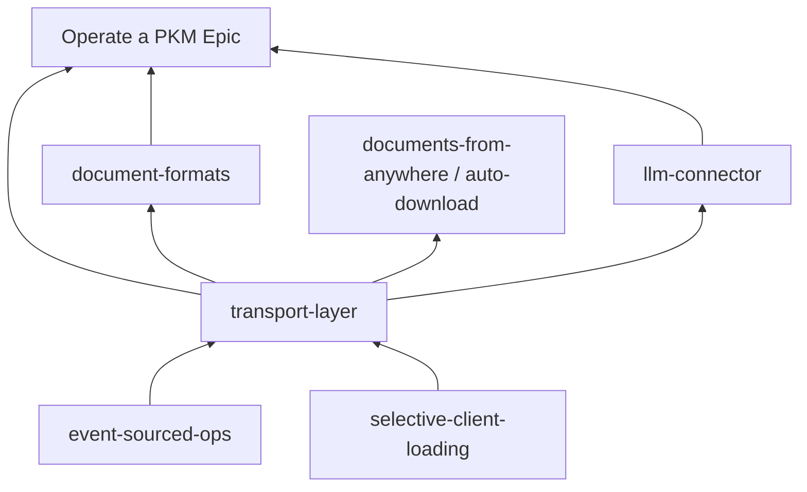

# Transport layer — map

Labels: wayfinder:map

## Destination

Chart how existing Projects and Epics implement transport instances or dependencies, and hold a pointer checklist for future connector Projects.

## Transport instances and dependencies

| Leg | Role | Pointer |
| --- | --- | --- |
| **Parse/Persist primitive** | Shared text in ↔ Graph **Changes** / slice out | [[details/parse-persist.md]]; ESO [[plan/event-sourced-ops/details/actors-and-jobs.md]] |
| **File channel (disk)** | Upload/Download, workspace mapping, auto sync | [[plan/roadmap/epics/work-with-text-files-from-anywhere.md]]; [[plan/auto-download-persisted-files/project.md]] |
| **Document codecs** | Round-trip Parse/reconcile on File Node bodies | [[plan/document-formats/map.md]]; [[plan/roadmap/epics/build-or-explore-a-wiki.md]] (`.md` leg) |
| **Web publish (outbound)** | Generate HTML and send attachments and CSS (Graph / HTML File content → visitor-facing site; not HTML File body only) | [[plan/roadmap/epics/create-and-publish-web-pages.md]] |
| **Wiki publish (outbound)** | Public URL: Graph / `.md` File content → HTML for visitors; not HTML File pages | [[plan/roadmap/epics/build-or-explore-a-wiki.md]] (Public URL chapter) |
| **Agent Actor** | Long-running inbound (LLM reply as Owned children) | [[plan/llm-connector/project.md]]; [[plan/roadmap/epics/agent-chat-managed-context.md]] |
| **Load / residency** | Fetch subgraph, Unloaded/Loaded boundaries for inbound materialization | [[plan/selective-client-loading/project.md]] |
| **ESO spine** | Actor produce path, merge, job identity, soft-lock | [[plan/event-sourced-ops/project.md]] |
| **PKM consumer** | Find and navigate material already in the Graph | [[plan/roadmap/epics/operate-a-pkm.md]] — depends on transport-layer, does not implement it |

## Decisions so far

- Transport-layer replaces the prior **information-hub** slug as the home for inbound/outbound/round-trip pattern (same concept, clearer name).
- File Parse/Persist is one transport instance, not the definition of the layer.
- Person-job Epics per channel (files, chat, publish) ship legs; transport-layer holds the cross-cutting contract.

## Future connector Projects (pointer checklist)

Chart a new feature-set Project per source or protocol when work appears. Each should state:

- [ ] Channel — inbound, outbound, or round-trip (which flows).
- [ ] Wire — how bytes or text arrive (file path, HTTP, paste buffer, MCP, etc.).
- [ ] Parse/Persist — which text-processing unit applies; what is shared vs channel-specific.
- [ ] Actor — person-only, Server job, or long-running Actor; job identity if long-running.
- [ ] Staging — examine-before-commit Graph view, if any.
- [ ] Authority — Graph canonical; what the outside copy is allowed to own.
- [ ] Epic home — which person-job Epic Required-for-done lists this Project.

Candidates not yet filed as Projects:

- [ ] Google Drive/Docs (example) — inbound, likely later round-trip; Epic home [[plan/roadmap/epics/work-with-text-files-from-anywhere.md]].
- [ ] API / OAuth connector (generic SaaS inbound).
- [ ] Paste / clipboard inbound (Browser channel).
- [ ] CLI / MCP Actor (agent-chat Epic remainder).
- [ ] Publish-to-editable-external (distinct from read-only web publish).

## Not yet specified

- Hub catalog UX and connection config Nodes.
- Export-transform-import orchestration above codecs.
- Home Epic for connector Projects (same class as Organize Huge Outlines).
- Promotion of transport-layer pattern to [[doc/]].

## Out of scope

- ESO merge semantics and wire migration.
- PKM navigation, expression-language, graph view.
- Implementing connectors on this map (those belong on sibling Projects).
